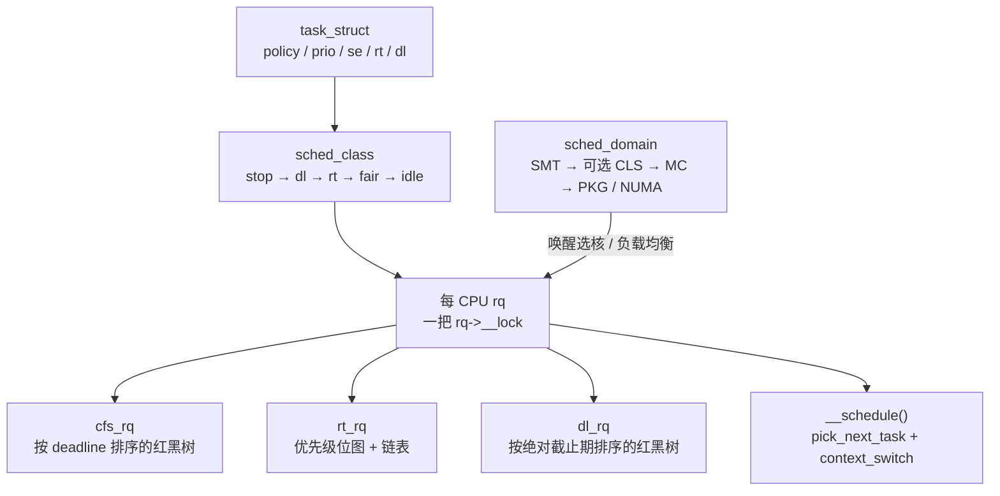
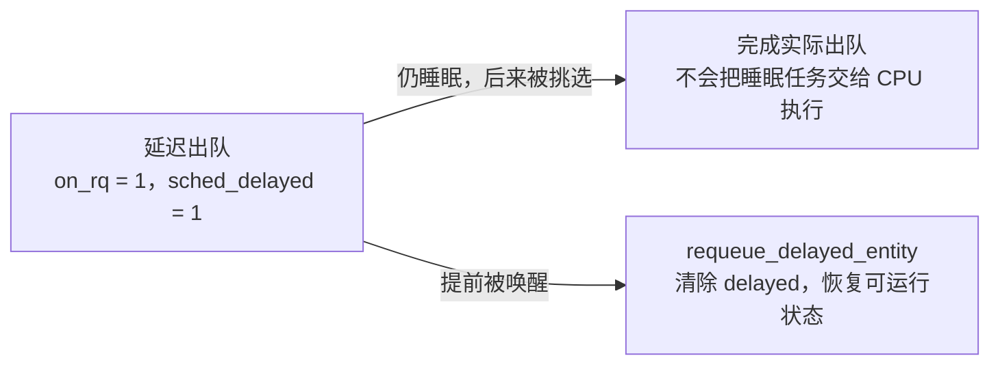

# Linux 调度器子系统：面试复习

> 源码基准：本项目 [Linux 6.18.52](../../linux/Makefile#L2)。所有源码链接均相对于本文。
>
> 学习主线：**每颗 CPU 一条运行队列；任务挂在某个调度类上；公平类用 EEVDF 在本队列里挑人；唤醒和负载均衡决定任务去哪颗 CPU；真正换人只发生在 `__schedule()`。**
>
> 下文以 x86-64、SMP、非 `PREEMPT_RT` 为范围，主要讨论同构数据中心 CPU，假定未启用 sched_ext 接管、core scheduling 和 proxy execution。[x86_64_defconfig](../../linux/arch/x86/configs/x86_64_defconfig#L5) 仅作为配置示例，不能代表所有云主机的实际配置：它选择 `NO_HZ`、`PREEMPT_VOLUNTARY`、`CGROUP_SCHED`、`SMP`、`NUMA` 和 `HZ_1000`。
>
> [`FAIR_GROUP_SCHED`](../../linux/init/Kconfig#L1111) 默认跟随 `CGROUP_SCHED`；`CFS_BANDWIDTH` 和 `RT_GROUP_SCHED` 默认关闭，后文分别说明启用后的行为。[拓扑调度选项](../../linux/arch/Kconfig#L53) `SCHED_SMT` / `SCHED_CLUSTER` / `SCHED_MC` 在架构支持时默认开启。[`PREEMPT_DYNAMIC`](../../linux/kernel/Kconfig.preempt#L126) 允许启动时更改抢占模型；上述 defconfig 选择的默认模型是自愿抢占。

## 核心数据结构
```
task_struct.sched_class ──► 全局只读操作表（六份里的一份）
                                    │
                                    │ enqueue / pick / tick
                                    ▼
每 CPU rq
  ├── stop   rq->stop          迁移、hotplug 用的 stop 线程
  ├── dl     rq->dl            按绝对截止期的红黑树
  ├── rt     rq->rt            优先级位图 + 每优先级一条链表
  ├── fair   rq->cfs           按虚拟截止期的红黑树
  ├── ext    rq->scx           仅 CONFIG_SCHED_CLASS_EXT
  └── idle   rq->idle          本 CPU idle 线程
```
### struct rq
```
struct rq {
	/*
	 * 这条 rq 上已入队的任务数。公平类延迟出队的任务还没真正摘下，
	 * 所以仍然算在里面。fair_server 和每 CPU 的 idle 线程不计入。
	 * 从不足 2 个变成不少于 2 个时，把所属 root domain 标成 overloaded。
	 */
	unsigned int		nr_running;

	/* 公平类子队列。根组直接用它，EEVDF 红黑树在 tasks_timeline。 */
	struct cfs_rq		cfs;
	/* 实时子队列。一张优先级位图，每个优先级一条链表。 */
	struct rt_rq		rt;
	/*
	 * deadline 子队列。红黑树按绝对截止期排序。
	 * fair_server 需要以 DL 身份运行时也挂在这里，并且不增加 nr_running。
	 */
	struct dl_rq		dl;
#ifdef CONFIG_SCHED_CLASS_EXT
	/* sched_ext 的每 CPU 状态。本文假定没有 BPF 调度器接管。 */
	struct scx_rq		scx;
#endif

	/* 本 CPU 的 idle 线程，属于 idle 调度类，不是 SCHED_IDLE。没有其它类可选时由它占用 CPU。 */
	struct task_struct	*idle;
	/*
	 * 本 CPU 的 stop 线程，属于最高的 stop 调度类。
	 * 迁移钉死任务、主动均衡等 stopper 工作由它执行，只有入队时才参与挑选。
	 */
	struct task_struct	*stop;
	/*
	 * 下一次周期负载均衡的 jiffies。tick 里到达这个时刻就抬 SCHED_SOFTIRQ。
	 * 队列上只剩下 SCHED_IDLE 任务时会被拉到当前 jiffies，让均衡马上发生。
	 */
	unsigned long		next_balance;

	/*
	 * 这颗 CPU 所属的 root domain。默认同机 CPU 共用一个，独占 cpuset 会拆出自己的域。
	 * DL 准入带宽、RT/DL 的 push/pull 索引都放在这里。
	 */
	struct root_domain		*rd;
	/*
	 * 这颗 CPU 的最底层调度域，RCU 保护。顺着 parent 往上是
	 * SMT、可选的 CLS、MC，再到 PKG 或 NUMA。为 NULL 时不做周期均衡。
	 */
	struct sched_domain __rcu	*sd;
};
```

### struct task_struct
```
struct task_struct {
#ifdef CONFIG_THREAD_INFO_IN_TASK
	/*
	 * 低层线程信息，x86 通过 THREAD_INFO_IN_TASK 把它嵌在这里，
	 * 而且必须是第一个成员：current_thread_info() 直接把 current
	 * 转成 thread_info *。x86-64 上装的是入口路径要用的低层标志
	 * （含 TIF_NEED_RESCHED）、syscall_work、status，以及当前 CPU 号。
	 * task_cpu() 读的就是 thread_info.cpu。
	 */
	struct thread_info		thread_info;
#endif
	/*
	 * 可运行性状态，不是“在不在 CPU 上”。TASK_RUNNING = 0 同时表示
	 * 正在执行和就绪；可中断/不可中断睡眠、停止、正在唤醒等用其它位。
	 * 退出状态另放在 exit_state，两套位不会互相踩。
	 */
	unsigned int			__state;

	/*
	 * 是否仍占用 CPU。prepare_task() 在切入前写 1，finish_task() 在
	 * 切出收尾后用 release 语义清 0。非 0 表示正在执行，或上一次切换
	 * 还没结束；唤醒方要等它变 0，才能把任务迁走。交接窗口里，同一颗
	 * CPU 上的 prev 和 next 可以同时为 1。
	 */
	int				on_cpu;
	/*
	 * 运行队列归属：
	 *   0                      不在任何 rq 上
	 *   TASK_ON_RQ_QUEUED(1)   已入队；公平类延迟出队时仍是 1，但不可运行
	 *   TASK_ON_RQ_MIGRATING(2) 正在跨队列迁移，此时 task_cpu() 不稳定
	 */
	int				on_rq;

	/* 公平实体：权重、vruntime、虚拟截止期、lag 和 PELT。RT/DL 也用它记执行时间。 */
	struct sched_entity		se;
	/* 实时实体：挂在 rt_rq 的优先级链表上，RR 的剩余时间片在 time_slice。 */
	struct sched_rt_entity		rt;
	/* 本任务自己的 deadline 实体：runtime、绝对 deadline、period。SCHED_DEADLINE 用它排队。 */
	struct sched_dl_entity		dl;
	/*
	 * DL 类挑到 fair_server 时，把被选中的公平任务和这台服务器绑在一起：
	 * 切入时写入，离开 CPU 时清成 NULL。普通 fair/rt/dl 运行保持 NULL。
	 */
	struct sched_dl_entity		*dl_server;
#ifdef CONFIG_SCHED_CLASS_EXT
	/* sched_ext 的每任务状态。本文假定没有 BPF 调度器接管，公平策略不走这里。 */
	struct sched_ext_entity		scx;
#endif
	/* 当前调度类的操作表：入队、出队、挑选、选核、tick 都从这里分发。 */
	const struct sched_class	*sched_class;

#ifdef CONFIG_CGROUP_SCHED
	/* 所属 cgroup 任务组。入队和迁移时用它找到该组在目标 CPU 上的 cfs_rq 与父实体。 */
	struct task_group		*sched_task_group;
#ifdef CONFIG_CFS_BANDWIDTH
	/* 带宽耗尽后挂上的 task work。返回用户态时执行，把任务从公平队列摘进 limbo。 */
	struct callback_head		sched_throttle_work;
	/* 已摘下的任务挂在 cfs_rq->throttled_limbo_list 上，配额补回后再入队。 */
	struct list_head		throttle_node;
	/* 已经因带宽限制离开公平队列、挂在 limbo 上。重新入队时清掉。 */
	bool				throttled;
#endif
#endif
} __attribute__ ((aligned (64)));

```

### struct sched_class
.rodata 里的 SCHED_DATA，地址从低到高
```
#define SCHED_DATA				\
	STRUCT_ALIGN();				\
	__sched_class_highest = .;		\
	*(__stop_sched_class)			\
	*(__dl_sched_class)			\
	*(__rt_sched_class)			\
	*(__fair_sched_class)			\
	*(__ext_sched_class)			\
	*(__idle_sched_class)			\
	__sched_class_lowest = .;

__sched_class_highest
        │
        ▼
   ┌─────────┬─────────┬─────────┬─────────┬─────────┬─────────┐
   │  stop   │   dl    │   rt    │  fair   │   ext   │  idle   │
   └─────────┴─────────┴─────────┴─────────┴─────────┴─────────┘
   高优先级 ◄──────────────────────────────────────────► 低优先级
                                                          │
                                                          ▼
                                              __sched_class_lowest

struct sched_class {
	/* 把任务放进本类子队列。唤醒、迁移挂回、fork 后第一次入队都走这里。 */
	void (*enqueue_task) (struct rq *rq, struct task_struct *p, int flags);
	/*
	 * 从本类子队列摘下任务。返回 false 只出现在睡眠出队：
	 * 公平类延迟出队时任务仍留在队列上，调用方就不再把它标成已阻塞。
	 */
	bool (*dequeue_task) (struct rq *rq, struct task_struct *p, int flags);
	/*
	 * sched_yield()。公平类在实体仍合格时把 vruntime 拉到当前 deadline，
	 * 等于放弃这一片剩余请求。调用方随后进入 schedule() 重选。
	 */
	void (*yield_task)   (struct rq *rq);
	/* yield_to()。公平类把目标设成 next buddy，再对当前任务执行 yield_task。 */
	bool (*yield_to_task)(struct rq *rq, struct task_struct *p);

	/*
	 * 同一个调度类里有新任务入队后，判断要不要抢占正在跑的任务。
	 * 唤醒者属于更高类时，核心直接请求重调度，不调用它。
	 */
	void (*wakeup_preempt)(struct rq *rq, struct task_struct *p, int flags);

	/*
	 * 按类从高到低挑选之前，先给本类补候选。
	 * 公平类的 cfs_rq 上还有实体（含延迟出队）就返回 1，否则做一次 newidle 拉取。
	 * RT/DL 在当前跑的不是本类任务时 pull。返回非 0 就不再询问更低的类。
	 */
	int (*balance)(struct rq *rq, struct rq_flags *rf);
	/* 只选出下一个任务，不改当前实体。公平类从根 cfs_rq 逐层挑到任务。 */
	struct task_struct *(*pick_task)(struct rq *rq);
	/*
	 * 可选。实现上应等价于 pick_task() 之后接 put_prev_task() 和
	 * set_next_task(first=true)。公平类用它少碰组层级里没有变化的那一段。
	 */
	struct task_struct *(*pick_next_task)(struct rq *rq, struct task_struct *prev);

	/* 当前任务离开 CPU。仍在队列上时先记完这一段执行，再把公平实体放回红黑树。 */
	void (*put_prev_task)(struct rq *rq, struct task_struct *p, struct task_struct *next);
	/*
	 * 把任务标成这一层的当前实体，正在跑的公平实体不留在树上。
	 * first 为真是一次新的运行，公平类这时设置保护片；
	 * 为假表示任务本来就在跑，只是组或调度类变了。
	 */
	void (*set_next_task)(struct rq *rq, struct task_struct *p, bool first);

	/* 唤醒、fork、exec 时选 CPU。调用方持有 pi_lock，任务此时可以还没入队。 */
	int  (*select_task_rq)(struct task_struct *p, int task_cpu, int flags);

	/*
	 * 改 task_cpu() 之前通知旧队列，这时读到的仍是旧 CPU。
	 * 公平类在任务还不是迁移态时卸下 PELT，并清掉 last_update_time，
	 * 让新 CPU 按自己的时钟重新累计。
	 */
	void (*migrate_task_rq)(struct task_struct *p, int new_cpu);

	/*
	 * 任务已经入队并且完全唤醒之后。公平类没有这个回调。
	 * RT/DL 在它没占到 CPU、短时间也不会重调度时，立刻尝试 push 到别的 CPU。
	 */
	void (*task_woken)(struct rq *this_rq, struct task_struct *task);

	/* 写入新的允许 CPU 掩码。公平类接着更新任务能用到的最大 CPU 容量。 */
	void (*set_cpus_allowed)(struct task_struct *p, struct affinity_context *ctx);

	/* CPU 上线。公平类按在线 CPU 数重算 sched_base_slice，并同步各组的带宽开关。 */
	void (*rq_online)(struct rq *rq);
	/* CPU 下线。公平类解开这颗 CPU 上仍被限流的组，并清掉它对组份额的贡献。 */
	void (*rq_offline)(struct rq *rq);

	/*
	 * 主动迁移时找一个合适的目标 rq，并和源 rq 一起锁住。
	 * RT 找有更低优先级空位的队列，DL 找截止期更晚的队列。公平类不实现。
	 */
	struct rq *(*find_lock_rq)(struct task_struct *p, struct rq *rq);

	/*
	 * 周期 tick，也可能来自 hrtick。公平类记 vruntime、推进 deadline，
	 * 必要时请求重调度。queued 非 0 表示这次 tick 对准了时间片，直接请求重调度。
	 */
	void (*task_tick)(struct rq *rq, struct task_struct *p, int queued);
	/* fork 出的子任务还没挂上任务链表。公平类只设置它允许使用的最大容量。 */
	void (*task_fork)(struct task_struct *p);
	/* 任务退出。公平类若还停在延迟出队，先完成真正出队，再去掉它的 PELT。 */
	void (*task_dead)(struct task_struct *p);

	/*
	 * 调度类即将切换、pi_lock 和 rq 锁都还持有。给新类做准备，不能再加锁。
	 * 当前只有 sched_ext 实现。
	 */
	void (*switching_to) (struct rq *this_rq, struct task_struct *task);
	/*
	 * 任务已经离开本类，由旧类善后。公平类卸下 cfs_rq 上的负荷。
	 * RT 在离开后队列上已经没有 RT 任务、且该任务仍在 rq 上时，安排从别处 pull。
	 */
	void (*switched_from)(struct rq *this_rq, struct task_struct *task);
	/* 任务已经进入本类。公平类把负荷挂到新的 cfs_rq，并检查要不要抢占当前任务。 */
	void (*switched_to)  (struct rq *this_rq, struct task_struct *task);
	/* 同一类内改权重。公平类按新权重重放 vruntime、deadline 和队列负荷。 */
	void (*reweight_task)(struct rq *this_rq, struct task_struct *task,
			      const struct load_weight *lw);
	/*
	 * 同一类内优先级变了。正在跑的任务优先级下降，或等待任务变得更高时，请求重调度。
	 */
	void (*prio_changed) (struct rq *this_rq, struct task_struct *task,
			      int oldprio);

	/*
	 * sched_rr_get_interval() 读到的时间片，单位是 jiffies。
	 * SCHED_RR 返回配置的轮转片，SCHED_FIFO 返回 0。
	 * 公平类在 cfs 队列权重合计非 0 时，把当前 slice 换成 jiffies，否则返回 0。
	 */
	unsigned int (*get_rr_interval)(struct rq *rq,
					struct task_struct *task);

	/* 把当前任务刚跑过的时间记进 sum_exec_runtime。公平类同时推进 vruntime。 */
	void (*update_curr)(struct rq *rq);

#ifdef CONFIG_FAIR_GROUP_SCHED
	/* 任务换 cgroup。从旧组的 cfs_rq 拆下负荷，挂到新组在同一 CPU 上的队列。 */
	void (*task_change_group)(struct task_struct *p);
#endif

#ifdef CONFIG_SCHED_CORE
	/* core scheduling 挑任务时跳过已限流的候选。本文未启用 core scheduling。 */
	int (*task_is_throttled)(struct task_struct *p, int cpu);
#endif
};

```

## 1. 先记住分层

调度器回答四个不同的问题：

| 问题                            | 核心对象                                | 数据中心上的典型答案                                                    |
| ------------------------------- | --------------------------------------- | ----------------------------------------------------------------------- |
| 谁可以上 CPU？                  | `task_struct` + `sched_class`           | 普通任务走 `fair_sched_class`                                           |
| 这颗 CPU 上现在有哪些候选任务？ | 每 CPU `struct rq`                      | 里面嵌着 `cfs` / `rt` / `dl` 子队列；公平类还可能保留延迟出队的睡眠实体 |
| 公平任务谁先跑、跑多久？        | `struct sched_entity` + `struct cfs_rq` | EEVDF：先合格，再取最早虚拟截止期                                       |
| 任务该放哪颗 CPU？              | `sched_domain` 层次                     | 唤醒走快速选核，周期和 newidle 再拉负载                                 |



**面试里先把“本 CPU 上挑谁”和“放到哪颗 CPU”拆开。** 红黑树只排本 `cfs_rq` 里的实体；公平任务跨 CPU 的主要路径包括 `select_task_rq_fair()` 和 `sched_balance_rq()`。

## 2. 任务、优先级、调度类

### 2.1 一个任务同时带着三套调度实体

[`struct task_struct`](../../linux/include/linux/sched.h#L815) 里和调度直接相关的是：

| 字段                                                   | 作用                                                                                     |
| ------------------------------------------------------ | ---------------------------------------------------------------------------------------- |
| `__state`                                              | 任务状态。`TASK_RUNNING = 0` 同时表示正在执行或就绪，不能单靠它区分二者                  |
| `on_rq`                                                | `0` 不在队列；`1` 已入队；`2` 正在迁移                                                   |
| `on_cpu`                                               | 执行及上下文切换交接状态，唤醒方用它等待前一次切换完成                                   |
| `prio` / `static_prio` / `normal_prio` / `rt_priority` | 有效优先级、nice 静态优先级、策略优先级、用户态 RT 优先级                                |
| `se` / `rt` / `dl`                                     | 公平、实时、deadline 实体。排队由当前调度类决定，但 RT/DL 也复用 `se` 的执行时间记账字段 |
| `sched_class`                                          | 当前有效调度类的操作表；通常由策略决定，优先级继承等情况可改变它                         |
| `sched_task_group`                                     | 所属 cgroup 任务组                                                                       |

`on_rq` 的两个非零值见 [`TASK_ON_RQ_QUEUED`](../../linux/kernel/sched/sched.h#L97) 和 `TASK_ON_RQ_MIGRATING`。`2` 表示队列归属正在交接，不等于稳定地挂在某棵树上，见 [迁移时的摘取与挂接](../../linux/kernel/sched/fair.c#L12112)。RT/DL 的公共记账也会调用 [`update_curr_common()`](../../linux/kernel/sched/fair.c#L1278)，更新 `se` 中的执行时间字段。

用户可见策略在 [uapi](../../linux/include/uapi/linux/sched.h#L114)：

| policy                                        | 调度类      | 记什么                                                                             |
| --------------------------------------------- | ----------- | ---------------------------------------------------------------------------------- |
| `SCHED_NORMAL` / `SCHED_BATCH` / `SCHED_IDLE` | fair        | NORMAL/BATCH 均按 nice 设权重；BATCH 的唤醒抢占行为不同；IDLE 的未缩放权重固定为 3 |
| `SCHED_FIFO` / `SCHED_RR`                     | rt          | FIFO 不轮转；RR 用时间片                                                           |
| `SCHED_DEADLINE`                              | dl          | runtime / deadline / period                                                        |
| `SCHED_EXT`                                   | ext 或 fair | 需编译 `CONFIG_SCHED_CLASS_EXT`；有 BPF 调度器接管时走 ext，否则回退 fair          |

在本文未启用 sched_ext 接管的前提下，`SCHED_BATCH` 和 `SCHED_IDLE` 仍进 `fair_sched_class`，其中 `SCHED_IDLE` 也不是每 CPU 的 idle 线程。sched_ext 启用后还可接管全部公平策略任务，见 [`task_should_scx()`](../../linux/kernel/sched/ext.c#L3685) 和 [调度类选择](../../linux/kernel/sched/core.c#L7304)。

### 2.2 数字越小，优先级越高

[`MAX_RT_PRIO = 100`](../../linux/include/linux/sched/prio.h#L16)，`MAX_PRIO = 140`，`DEFAULT_PRIO = 120`。nice \([-20, 19]\) 映射到 `static_prio` \([100, 139]\)，nice 0 就是 120。RT 的通常优先级按 `prio = 99 - rt_priority` 映射：用户态 1 对应内核 98，用户态 99 对应内核 0，见 [`__normal_prio()`](../../linux/kernel/sched/syscalls.c#L19)。公平类内部使用 nice 决定权重，并不简单按 `prio` 数值依次运行。

nice 相邻级别的**权重比约为 1.25**，不能把它记成任意场景下 CPU 份额固定相差 10%。例如同一层级、同一 CPU 上两个持续运行的任务，nice 0 和 nice 1 的权重为 1024 和 820，理想份额约为 55.5% 和 44.5%。份额还取决于其他竞争者和组层级，权重表见 [`sched_prio_to_weight[]`](../../linux/kernel/sched/core.c#L10354)。

[`set_load_weight()`](../../linux/kernel/sched/core.c#L1448) 在任务初始化、参数调整等路径设置权重，并非每次入队重新查表。x86-64 的内部 `se.load.weight` 使用 [`scale_load()`](../../linux/kernel/sched/sched.h#L149) 放大 1024 倍，所以 nice 0 的内部权重及 `NICE_0_LOAD` 是 \(2^{20}\)，下文公式中的 1024 则采用未缩放的权重单位。

### 2.3 调度类是一张按优先级排好的函数表

[`struct sched_class`](../../linux/kernel/sched/sched.h#L2413) 把入队、出队、挑选、唤醒抢占、选 CPU、tick 都做成回调。实例用链接脚本排进独立段，地址从低到高是：

```text
stop → dl → rt → fair → ext → idle
```

见 [vmlinux.lds.h](../../linux/include/asm-generic/vmlinux.lds.h#L138)。[`for_each_active_class()`](../../linux/kernel/sched/sched.h#L2572) 按地址递增遍历，**低地址对应高调度类优先级**，所以先问 stop，最后才是 idle；未启用的 ext 会被跳过。全是公平任务、前一个调度类不高于 fair 且 sched_ext 未启用时，可直接调 `pick_next_task_fair()`，见 [`__pick_next_task()`](../../linux/kernel/sched/core.c#L5973)。

公平类这张表的热回调是：`enqueue_task_fair`、`pick_next_task_fair`、`select_task_rq_fair`、`check_preempt_wakeup_fair`、`task_tick_fair`，见 [`DEFINE_SCHED_CLASS(fair)`](../../linux/kernel/sched/fair.c#L14095)。

## 3. 每 CPU 运行队列

[`struct rq`](../../linux/kernel/sched/sched.h#L1120) 是调度器的中心对象，每 CPU 一份，用 `rq->__lock` 保护。要同时锁多条队列，必须按 `&runqueue` 地址升序加锁。

```text
rq
├── cfs          公平子队列，红黑树 tasks_timeline
├── rt           实时子队列，位图 + 每优先级一条链表
├── dl           deadline 子队列，红黑树按绝对截止期
├── fair_server  嵌在这条 rq 上的 deadline 服务器，用来给公平任务留带宽
├── curr         正在执行的任务
├── donor        调度上选中的任务；没有 proxy-exec 时和 curr 是同一份
├── idle / stop  本 CPU 的 idle 线程和 stop 线程
├── clock / clock_task / clock_pelt
└── nr_running
```

公平子队列 [`struct cfs_rq`](../../linux/kernel/sched/sched.h#L676) 里面试要记住的是：

| 字段                                              | 作用                                                                     |
| ------------------------------------------------- | ------------------------------------------------------------------------ |
| `load`                                            | 队列上实体权重之和                                                       |
| `nr_queued`                                       | 本层已入队实体数，包含仍在队列上的 `curr` 和延迟出队实体，不等于树节点数 |
| `h_nr_queued` / `h_nr_runnable`                   | 层级内排队任务数 / 可运行任务数；后者排除延迟出队任务                    |
| `tasks_timeline`                                  | 按虚拟截止期排序的增强红黑树                                             |
| `curr`                                            | 本层正在跑的实体。它在跑的时候不在树上                                   |
| `zero_vruntime` / `sum_w_vruntime` / `sum_weight` | 虚拟时间参考点及树内实体的加权和；计算平均时另加仍入队的 `curr`          |
| `avg`                                             | PELT 负荷：`load_avg` / `runnable_avg` / `util_avg`                      |

`FAIR_GROUP_SCHED` 打开时，非根任务组在每颗 CPU 上各有一个组 `sched_entity` 和一条自己的 `cfs_rq`；根组直接使用 `rq->cfs`，没有再向上排队的组实体。任务的 `se->cfs_rq` 是它挂上去的队列，组实体的 `se->my_q` 是它拥有的那条队列，见 [`struct sched_entity`](../../linux/include/linux/sched.h#L570) 和 [`init_tg_cfs_entry()`](../../linux/kernel/sched/fair.c#L13926)。

## 4. 公平类：EEVDF

公平类的名字还叫 CFS，挑选算法已经是 **EEVDF**（Earliest Eligible Virtual Deadline First）。旧的“取 `vruntime` 最小的最左节点”不再成立。树的排序键是虚拟截止期，见 [`entity_before()`](../../linux/kernel/sched/fair.c#L582)。

### 4.1 权重把实际执行时间变成虚拟时间

任务每跑过一段 `delta_exec`，虚拟时间增加：

```text
vruntime += delta_exec * 1024 / weight
```

这里的 `weight` 使用未缩放单位。实现是 [`calc_delta_fair()`](../../linux/kernel/sched/fair.c#L290)：内部权重等于 `NICE_0_LOAD` 时不缩放 `delta_exec`；更重的任务虚拟时间走得更慢，于是同样的虚拟进度对应更多 CPU 执行时间。记账发生在 [`update_curr()`](../../linux/kernel/sched/fair.c#L1286)，`delta_exec` 来自 `rq_clock_task()`，不是把睡眠、等待期间的墙钟时间也算进去，见 [`update_se()`](../../linux/kernel/sched/fair.c#L1232)。

请求长度 `slice` 默认来自 `sysctl_sched_base_slice`，初值 0.70 ms，默认按 `1 + ilog2(min(在线逻辑 CPU 数, 8))` 缩放，见 [fair.c 初值](../../linux/kernel/sched/fair.c#L79) 和 [`get_update_sysctl_factor()`](../../linux/kernel/sched/fair.c#L192)。8 个及以上在线逻辑 CPU 时，未调整参数的默认请求约为 2.8 ms。`sched_setattr()` 还可以通过 `sched_runtime` 给公平任务设自定义 slice，范围夹在 0.1 ms 到 100 ms，见 [`__setparam_fair()`](../../linux/kernel/sched/fair.c#L5288)。这不是不可抢占的连续运行时长保证。

虚拟截止期：

```text
deadline = vruntime + calc_delta_fair(slice, se)
         = vruntime + slice * 1024 / weight
```

权重越大，同样实际执行长度的请求对应的虚拟增量越小；只有起点相同，才能直接比较截止期远近。见 [`update_deadline()`](../../linux/kernel/sched/fair.c#L1117)。

### 4.2 合格，再比截止期

EEVDF 用 lag 表示“欠了这块实体多少服务”：

```text
lag_i = weight_i * (V - vruntime_i)
```

`V` 是已入队实体 `vruntime` 的加权平均，包含仍入队的当前实体和延迟出队实体，由 [`avg_vruntime()`](../../linux/kernel/sched/fair.c#L715) 计算。`lag >= 0` 等价于 `vruntime <= V`，此时实体合格；实际判断用交叉相乘避免除法精度损失，见 [`vruntime_eligible()`](../../linux/kernel/sched/fair.c#L802)。`se->vlag` 保存的是虚拟 lag，即 `V - vruntime` 的限幅近似值，并不是已经乘过权重的 `lag_i`。

EEVDF 的基本挑选准则有两条；实现还叠加了 buddy 和当前实体保护片，见 [`pick_eevdf()`](../../linux/kernel/sched/fair.c#L1015)：

1. 实体必须合格，也就是服务尚未超前（lag 为零也合格）。
2. 合格者里取虚拟截止期最早的。

红黑树按 `deadline` 排序，节点上还缓存子树最小 `vruntime`（`se->min_vruntime`）。搜索时如果左子树的最小 `vruntime` 都不合格，整棵左子树可以剪掉，所以是 \(O(\log n)\)。

```text
pick_eevdf(cfs_rq, protect):
    队列里只有 1 个实体 → 直接返回它
    PICK_BUDDY 开启且 next buddy 合格 → 返回 buddy
    当前实体已出队或不合格 → 不再把它作为候选
    protect 为真且当前候选还在保护片内 → 留住当前
    最左节点合格 → 将它记为树内 best
    否则从根向下查找树内 best：
        左子树存在合格实体 → 走进左子树
        当前节点合格 → 记为 best，结束搜索
        否则走进右子树
    没找到 best，或当前候选的 deadline 比 best 更早 → 返回当前候选
    否则返回 best
```

`PICK_BUDDY` 默认开启，但唤醒时提名 buddy 的 `NEXT_BUDDY` 默认关闭；组调度和 `yield_to` 等路径仍可设置 buddy，见 [features.h](../../linux/kernel/sched/features.h#L27)。所以这段实现不是每次都严格返回截止期最早者。

正在运行的实体不在树上。[`set_next_entity()`](../../linux/kernel/sched/fair.c#L5632) 把它摘下来，在 `first` 为真时设置保护片；[`put_prev_entity()`](../../linux/kernel/sched/fair.c#L5700) 只把仍然 `on_rq` 的实体插回去。组调度时 `pick_task_fair()` 从根 `cfs_rq` 一层层往下挑，直到挑到任务，见 [fair.c](../../linux/kernel/sched/fair.c#L9104)。

用一个简化快照区分“最小 vruntime”和“最早合格 deadline”。假设同一 `cfs_rq` 只有 A/B/C，没有 buddy 或保护片优先返回，三者请求均为 4 ms，权重以 nice 0 为 1 个单位（不对应特定 nice 档位）：

| 实体 | 相对权重 | vruntime（虚拟 ms） | deadline（虚拟 ms） | 是否合格       |
| ---- | -------- | ------------------- | ------------------- | -------------- |
| A    | 1        | 8                   | 12                  | 是             |
| B    | 2        | 9                   | 11                  | 是，截止期最早 |
| C    | 1        | 12                  | 16                  | 否             |

此时 `V = (1×8 + 2×9 + 1×12) / 4 = 9.5`。A 的 `vruntime` 最小，EEVDF 却选 B，因为 B 在合格实体中的 `deadline` 最早。C 虽然在树上，也要先满足合格性。

### 4.3 出队保存 lag，入队恢复位置

[`place_entity()`](../../linux/kernel/sched/fair.c#L5305) 在入队前放位置：

```text
placement_vlag = saved_vlag * (W + w) / W  # 队列非空且 PLACE_LAG 生效时
vruntime = V - placement_vlag
deadline = vruntime + vslice              # 无待恢复的相对 deadline 时
```

`W` 是入队前其他实体的总权重，`w` 是新入队实体的权重。`PLACE_LAG` 默认打开，按上述比例放大放置距离，以补偿实体加入后 `V` 的变化；队列原本为空时以零 lag 放置。这里恢复的是**实际出队时**保存的虚拟 lag，延迟出队不能简单理解成“入睡瞬间保存欠账”。

新 `fork` 任务首次入队带 `ENQUEUE_INITIAL`，默认把计算初始 deadline 所用的 `vslice` 减半，**不是把 `se->slice` 本身永久减半**。迁移等非睡眠出队可通过 `PLACE_REL_DEADLINE` 保存 `deadline - vruntime`，入队时恢复剩余虚拟请求。见 [`place_entity()` 的后半段](../../linux/kernel/sched/fair.c#L5390)、[出队时保存相对 deadline](../../linux/kernel/sched/fair.c#L5596) 和 [默认开关](../../linux/kernel/sched/features.h#L7)。

实际出队时 [`update_entity_lag()`](../../linux/kernel/sched/fair.c#L778) 保存 `vlag`。当前 [`entity_lag()`](../../linux/kernel/sched/fair.c#L767) 的限幅为 `±calc_delta_fair(cfs_rq_max_slice(cfs_rq) + TICK_NSEC, se)`，使用本队列的最大 slice 加一个 tick，而不是固定的一片或两片当前任务 slice。

### 4.4 时间片用完只是请求重新调度

`vruntime` 到达或超过 `deadline` 时，`update_deadline()` 从**当前 vruntime** 加上一片虚拟请求，生成新截止期并返回 true。队列里不止一个实体、并且保护片已经走完或请求已经用尽时，[`update_curr()`](../../linux/kernel/sched/fair.c#L1326) 调用 `resched_curr_lazy()`；后续调度仍可能选中原任务。

当前实现把保护边界单独放在 `se->vprot`。`RUN_TO_PARITY` 默认开启时，[`set_protect_slice()`](../../linux/kernel/sched/fair.c#L963) 按队列最短 slice 和当前实体 slice 计算边界，并以当前 deadline 为上限；它没有直接计算零 lag 时刻。挑选时只有当前实体仍合格且 `vruntime < vprot` 才可走保护快路径，不能解释成保证连续运行到零 lag。`PREEMPT_SHORT` 让更短 slice 的唤醒者参与一次忽略保护的挑选，胜出后才取消当前保护，见 [唤醒抢占](../../linux/kernel/sched/fair.c#L9034)。

`resched_curr_lazy()` 是否设置 lazy 标志取决于实际抢占模型；在本文 defconfig 的 voluntary 模型下，它设置的仍是 `TIF_NEED_RESCHED`，见 [`get_lazy_tif_bit()`](../../linux/kernel/sched/core.c#L1173)。

周期 tick 通过同一个 `update_curr()` 完成记账和截止期更新。路径是 [`sched_tick()`](../../linux/kernel/sched/core.c#L5597) → [`task_tick_fair()`](../../linux/kernel/sched/fair.c#L13588) → [`entity_tick()`](../../linux/kernel/sched/fair.c#L5724)。`HZ = 1000` 时大约每 1 ms 来一次；NO_HZ 空闲 CPU 可以停掉这个 tick。

### 4.5 负 lag 的睡眠可以延迟出队

`DELAY_DEQUEUE` 和 `DELAY_ZERO` 默认打开。任务普通阻塞时若不合格（自己已经超前、lag 为负），[`dequeue_entity()`](../../linux/kernel/sched/fair.c#L5550) 保留其入队状态并设置 `sched_delayed`；特殊状态和 `DEQUEUE_THROTTLE` 不走这个延迟分支。当前实体随后由 `put_prev_entity()` 放回树中。它不执行，只随其他实体运行、队列虚拟时间推进而消耗负 lag。

后续有两条不同路径：



被挑选时，[`pick_next_entity()`](../../linux/kernel/sched/fair.c#L5683) 完成出队并让上层重新挑选。提前唤醒则由 [`ttwu_runnable()`](../../linux/kernel/sched/core.c#L3775) 触发 [`requeue_delayed_entity()`](../../linux/kernel/sched/fair.c#L7044)，保留队列归属；`DELAY_ZERO` 在这两条路径中都只消除已经变正的虚拟 lag，不会直接抹掉尚未偿还的负 lag。

**面试里如果被问“睡眠任务还在运行队列上吗”：** 延迟出队期间可以仍然 `on_rq = 1`，且占 `nr_queued`；`h_nr_runnable` 已减少，[`se_runnable()`](../../linux/kernel/sched/sched.h#L931) 返回 0，所以不再给 PELT 的 runnable 信号增加新贡献，历史值则逐渐衰减。它仍参与 EEVDF 的加权平均，不能把“已排队”和“可运行”当作同一概念。

## 5. 睡眠和唤醒

### 5.1 谁来调用 schedule

[`__schedule()`](../../linux/kernel/sched/core.c#L6817) 前面的注释把入口分成三类：

1. 任务自己阻塞：mutex、信号量、等待队列，最终 `schedule()`。
2. 已置位 `TIF_NEED_RESCHED`，在中断返回或返回用户态时检查。tick 和更高优先级唤醒都会置这个标志。
3. 唤醒本身只是入队。新任务如果该抢占，唤醒路径置标志，真正切换留到最近的抢占点。

自愿抢占下，内核态要碰到 `cond_resched()`、显式 `schedule()`，或者系统调用、中断返回用户态，才会切走。完全抢占模型还会在 `preempt_enable()` 以及中断返回可抢占上下文时进入调度。标志只是通知，切换都进 `__schedule()`。

`__schedule()` 的主干：

```text
关中断，锁本 CPU rq，更新 rq clock
若是主动睡眠且 __state != TASK_RUNNING：
    有能打断当前睡眠状态的待处理信号 → 改回 TASK_RUNNING
    否则尝试 block_task()，公平任务可能延迟出队
    将本次切换计数归到 nvcsw
pick_next_task()：按调度类从高到低挑
若 next != prev：
    增加选定的 nvcsw 或 nivcsw，记 nr_switches，切换 rq->curr
    context_switch()：地址空间 + 寄存器和栈
```

`switch_count` 默认指向 `nivcsw`，只有非抢占调度观察到非零 `prev_state` 时才改为 `nvcsw`，最后发生实际任务切换才增加计数。因此不能按“是不是主动调用 `schedule()`”划分，例如仍处于 `TASK_RUNNING` 的 yield 切换也会计入 `nivcsw`，见 [选择计数器](../../linux/kernel/sched/core.c#L6874) 和 [实际增加计数](../../linux/kernel/sched/core.c#L6919)。`try_to_wake_up()` 和 `__schedule()` 用 `p->pi_lock`、rq 锁和内存屏障处理“刚要睡着又被唤醒”的竞争，见 [唤醒路径注释](../../linux/kernel/sched/core.c#L4159)。

### 5.2 唤醒

普通等待场景下，`try_to_wake_up(p, state, wake_flags)` 先匹配 `p->__state` 和传入的 `state`；匹配后大致按以下路径唤醒，见 [core.c](../../linux/kernel/sched/core.c#L4159)：

```text
p 就是 current → 直接恢复 TASK_RUNNING
在锁内确认仍是 TASK_ON_RQ_QUEUED → ttwu_runnable()，原队列唤醒
    若 sched_delayed → 清除延迟状态，必要时调整位置
否则标成 TASK_WAKING：
    若旧 CPU 尚在完成切换且允许异步唤醒 → 可直接挂旧 CPU 的唤醒链表
    否则等 on_cpu 清零，再由 select_task_rq() 选 CPU
    TTWU_QUEUE 开启且 ttwu_queue_cond() 满足 → 挂目标 CPU 的链表
    否则直接锁目标 rq，执行入队和 wakeup_preempt()
最终恢复 TASK_RUNNING
```

非 RT 内核里 `TTWU_QUEUE` 默认打开，但并非所有远端唤醒都异步排队。[`ttwu_queue_cond()`](../../linux/kernel/sched/core.c#L3915) 在检查目标 CPU 可用性、亲和性等条件后，通常对不共享 LLC 或目标 `nr_running == 0` 的远端 CPU 使用链表；同 LLC 的忙 CPU 仍可走直接锁目标 rq 的路径。[`__ttwu_queue_wakelist()`](../../linux/kernel/sched/core.c#L3860) 通过 `__smp_call_single_queue()` 把任务交给目标 CPU，由 `sched_ttwu_pending()` 完成入队，必要时用 IPI 通知。

公平类唤醒抢占在 [`check_preempt_wakeup_fair()`](../../linux/kernel/sched/fair.c#L8970)。它先把组层级不同的两个实体对齐到共同竞争层：非 idle 实体唤醒可取消当前 `SCHED_IDLE` 实体的保护并请求调度；一般的 BATCH/IDLE 唤醒不会抢占普通公平任务。普通同级唤醒结合保护片和 EEVDF 挑选，胜出后调用的是 `resched_curr_lazy()`。

每 CPU 的 idle 线程属于独立的 idle 类，别与上述 `SCHED_IDLE` 实体混淆。[`__resched_curr()`](../../linux/kernel/sched/core.c#L1113) 设置重调度标志；远端 CPU 若在 idle polling 可省略 IPI，真正的 lazy 请求也不立即发 reschedule IPI，所以“重调度请求必然发送 IPI”同样不成立。

## 6. 选哪颗 CPU

### 6.1 调度域

x86 的拓扑描述从底向上是 SMT、可选的 CLS（cluster）、MC、PKG；包内还有 NUMA 时，PKG 域让给按距离建出来的 NUMA 域，见 [x86_topology](../../linux/arch/x86/kernel/smpboot.c#L481)。实际域还受硬件拓扑、CPU 分区和退化域裁剪影响，并非每台机器都有完整的每一层。

[`sd_init()`](../../linux/kernel/sched/topology.c#L1624) 给每一层填上行为标志。默认有 `SD_BALANCE_NEWIDLE`、`SD_BALANCE_EXEC`、`SD_BALANCE_FORK`、`SD_WAKE_AFFINE`，**没有** `SD_BALANCE_WAKE`。共享容量的 SMT 层不平衡阈值是 110%，共享 LLC 的层是 117%。跨过 `node_reclaim_distance` 的远 NUMA 域会去掉 exec/fork 均衡和唤醒亲和。

```text
CPU0  CPU1    CPU2  CPU3
 └──SMT──┘    └──SMT──┘     共享执行资源，SD_SHARE_CPUCAPACITY
 └────── MC / LLC ──────┘   共享最后一级缓存
 └──────── PKG / NUMA ─────┘
```

### 6.2 唤醒走快速路径

[`select_task_rq_fair()`](../../linux/kernel/sched/fair.c#L8733) 分两种：

| 场景               | 路径                                                                                                                                                                            |
| ------------------ | ------------------------------------------------------------------------------------------------------------------------------------------------------------------------------- |
| 普通唤醒 `WF_TTWU` | 通常走快速路径。不“醒得很宽”、唤醒者 CPU 在亲和掩码内且找到覆盖两颗 CPU 的 `SD_WAKE_AFFINE` 域时，`wake_affine` 在 prev CPU 与唤醒者 CPU 之间选，再调用 `select_idle_sibling()` |
| `fork` / `exec`    | 域上有 `SD_BALANCE_FORK` / `SD_BALANCE_EXEC`，走慢路径，在域里找最空的组、最空的 CPU                                                                                            |

同构 CPU 上，[`select_idle_sibling()`](../../linux/kernel/sched/fair.c#L7980) 主要扫描所选目标的 LLC 域，并受亲和掩码和扫描预算限制；找不到空闲 CPU 时仍可返回忙的目标。**扫描局部不等于任务不能跨 LLC 唤醒迁移**：[`wake_affine()`](../../linux/kernel/sched/fair.c#L7563) 的候选可来自不同 LLC，最终由 [`select_task_rq()`](../../linux/kernel/sched/core.c#L3583) 校验 CPU 是否允许使用。`WF_SYNC` 是“唤醒者预计很快睡眠”的提示，不是保证；[`wake_wide()`](../../linux/kernel/sched/fair.c#L7464) 通过多对多唤醒关系的启发式判断抑制过度聚集。

缓存热度用 `sysctl_sched_migration_cost`，默认 0.5 ms，见 [fair.c](../../linux/kernel/sched/fair.c#L82)。刚运行过的任务不容易被均衡拉走。

### 6.3 两条负载均衡

| 时机     | 入口                                                                                 | 行为                                                                                      |
| -------- | ------------------------------------------------------------------------------------ | ----------------------------------------------------------------------------------------- |
| 周期     | `sched_tick()` → [`sched_balance_trigger()`](../../linux/kernel/sched/fair.c#L13257) | `jiffies >= rq->next_balance` 时抬 `SCHED_SOFTIRQ`                                        |
| 即将空闲 | `pick_next_task_fair()` 没挑到人，或 `balance_fair()`                                | [`sched_balance_newidle()`](../../linux/kernel/sched/fair.c#L13082) 尝试从其他 CPU 拉任务 |

软中断处理函数是 [`sched_balance_softirq()`](../../linux/kernel/sched/fair.c#L13234)。若 `nohz_idle_balance()` 已处理相应请求，就直接返回；否则更新阻塞负荷并做本 CPU 的域均衡。newidle 也不是每次都扫描：待处理唤醒、预计空闲时间、均衡成本等会使它跳过，默认的 `NI_RANDOM` 还按历史成功率减少尝试，见 [newidle 的检查与循环](../../linux/kernel/sched/fair.c#L13093)。

[`sched_balance_rq()`](../../linux/kernel/sched/fair.c#L12032) 的步骤可以记成：

```text
should_we_balance?          本 CPU 是不是这个域里负责拉的那个
找最忙的 sched_group
找组里最忙的 rq
忙队列上多于 1 个任务时，按本次迁移指标摘取任务、挂到目标 rq
亲和性不允许 → 可改目标或换源 rq 重试
持续不平衡且满足条件 → 可用 CPU stopper 主动迁移
全部被钉死等退出路径 → 周期均衡可拉长间隔；newidle 不因此加倍间隔
```

均衡并不只看 PELT。它结合负荷、利用率、任务数、空闲 CPU 数和容量判断，按情况选择 `migrate_load`、`migrate_util`、`migrate_task` 或 `migrate_misfit`，见 [`calculate_imbalance()`](../../linux/kernel/sched/fair.c#L11374)；具体迁移还要检查亲和性、是否正在运行、缓存热度等条件，见 [`can_migrate_task()`](../../linux/kernel/sched/fair.c#L9652)。

### 6.4 PELT：用衰减历史估计负荷

[`struct sched_avg`](../../linux/include/linux/sched.h#L505) 保存衰减历史。实现将时间右移 10 位，以 **1024 ns** 为单位，每 1024 个单位为一段，即约 **1.049 ms 的 PELT 时间**；\(y^{32} = 0.5\)，半衰期为 32 段，约 33.55 ms，通常近似称为 32 ms。见 [时间单位换算](../../linux/kernel/sched/pelt.c#L196) 和 [分段累积](../../linux/kernel/sched/pelt.c#L102)。

| 信号           | 含义                                                                                   | 谁在用                          |
| -------------- | -------------------------------------------------------------------------------------- | ------------------------------- |
| `load_avg`     | 实体入队历史 × 权重；延迟出队期间 `on_rq` 仍为真                                       | 负载均衡比忙闲                  |
| `runnable_avg` | 可运行历史 × 1024，包含正在执行的时间，排除 delayed 的新贡献                           | 反映运行需求，包含等 CPU 的时间 |
| `util_avg`     | 实际执行历史 × 1024，基于 PELT 时钟                                                    | 选核容量判断、schedutil 调频    |
| `util_est`     | 在一次运行活动结束时更新的利用率估计；上升直接采纳，符合条件的下降用 1/4 新样本的 EWMA | 保留下一次唤醒的运行需求估计    |

前三项对任务实体可按时间比例理解，队列或组的 `runnable_avg` 会汇总多个任务，可能超过 1024，见 [PELT 实体更新](../../linux/kernel/sched/pelt.c#L307)。任务睡眠后也不会立即清零历史。

“上升直接采纳、下降才平滑”针对 `util_est`，**`util_avg` 本身始终是衰减平均**。[`util_est_update()`](../../linux/kernel/sched/fair.c#L5042) 只在睡眠出队且取得新样本时更新，接近原估计或任务未获得足够运行时间等情况会跳过下降。新任务的 `util_avg` 先按队列平均负荷和自身权重估计，再限制为剩余容量的一半；不是一律赋成剩余容量的一半，见 [`post_init_entity_util_avg()`](../../linux/kernel/sched/fair.c#L1194)。

时钟基于 `rq->clock_pelt`，由 [`update_rq_clock_pelt()`](../../linux/kernel/sched/pelt.h#L100) 按 CPU 容量和架构提供的频率比例缩放运行期间的增量，空闲时再与 `clock_task` 同步。因此“运行 1 ms 墙钟”未必等于提供满速 1 ms 的算力，半衰期也不能无条件视为同样长度的墙钟时间。

## 7. 组调度和带宽

公平组调度依赖 `CONFIG_FAIR_GROUP_SCHED`。非根 cgroup 任务组 [`struct task_group`](../../linux/kernel/sched/sched.h#L472) 在每颗 CPU 上有组 `sched_entity` 和 `cfs_rq`。入队从任务的 `se` 顺着 `parent` 往上走，遇到尚未入队的实体才调用 `enqueue_entity()`；遇到已经在队列上的祖先后，继续向上传播统计和负荷，见 [`enqueue_task_fair()`](../../linux/kernel/sched/fair.c#L7118)。

```text
根 cfs_rq
└── 组 A 的 se（权重由 cpu.weight 和该组各 CPU 的负荷分布计算）
    └── 组 A 的 cfs_rq
        ├── 任务 t1 的 se
        └── 任务 t2 的 se
```

cgroup v2 的 `cpu.weight` 经单位转换写入组的 `shares`，见 [`cpu_weight_write_u64()`](../../linux/kernel/sched/core.c#L10140)。每 CPU 组实体的 `load.weight` 还要按该 CPU 与全组的负荷比例计算，并非在每颗 CPU 上直接复制完整 shares，见 [`calc_group_shares()`](../../linux/kernel/sched/fair.c#L4086)。同层组之间按权重竞争，再在组内按任务 nice 竞争；持续争用时，小权重组中的 nice 0 任务也可能只拿到很小份额。没有竞争时，`cpu.weight` 不阻止它使用空余 CPU。

`cpu.max` 依赖 `CONFIG_CFS_BANDWIDTH`，上述 defconfig 默认未开启。组的配额由各 CPU 共享，每条 `cfs_rq` 从组带宽池按需领取本地额度，默认分配粒度为 5 ms，见 [`sysctl_sched_cfs_bandwidth_slice`](../../linux/kernel/sched/fair.c#L125) 和 [`assign_cfs_rq_runtime()`](../../linux/kernel/sched/fair.c#L5847)。

当前源码的限流流程如下，不能套用“`throttle_cfs_rq()` 立即把整组实体从父树摘掉”的描述：

```text
本地 runtime_remaining 用尽，且组池无法补足
  → 请求重调度，check_cfs_rq_runtime() 检查限流
  → throttle_cfs_rq() 标记 throttled，更新层级 throttle_count
  → pick_task_fair() 仍可选到该层级的任务，并安排 throttle task work
  → 普通用户任务返回用户态前执行 throttle_cfs_rq_work()
      将任务从公平队列摘下，放入 throttled_limbo_list，请求重调度
  → 配额补充并分配到本地后 unthrottle_cfs_rq()
      tg_unthrottle_up() 把 limbo 中的任务重新入队
```

对应源码为 [`throttle_cfs_rq()`](../../linux/kernel/sched/fair.c#L6141)、[`pick_task_fair()`](../../linux/kernel/sched/fair.c#L9104)、[`task_throttle_setup_work()`](../../linux/kernel/sched/fair.c#L6092)、[`throttle_cfs_rq_work()`](../../linux/kernel/sched/fair.c#L5913) 和 [`tg_unthrottle_up()`](../../linux/kernel/sched/fair.c#L6047)。内核线程和退出中的任务不会安排这种返回用户态的 work，所以配额耗尽并不表示所有相关内核执行在该瞬间停止。

限流期间，当该层级实体全部出队后才冻结相应 PELT 时钟，解限流时扣除冻结时长，见 [`tg_throttle_down()`](../../linux/kernel/sched/fair.c#L6118) 和 [`cfs_rq_clock_pelt()`](../../linux/kernel/sched/pelt.h#L174)。

## 8. 实时、deadline，以及公平服务器

这三套都在非 RT 内核里。非 RT 只是说内核抢占模型不是 `PREEMPT_RT`，不是说没有 `SCHED_FIFO`。

### 8.1 SCHED_FIFO / SCHED_RR

[`struct rt_rq`](../../linux/kernel/sched/sched.h#L827) 用 [`rt_prio_array`](../../linux/kernel/sched/sched.h#L309)：一张优先级位图，每个优先级一条链表。挑选就是位图里最高优先级队列的第一个，见 [`pick_task_rt()`](../../linux/kernel/sched/rt.c#L1704)。

`SCHED_FIFO` 没有时间片，普通唤醒的同优先级任务排在队尾；正在执行者可一直运行到阻塞、yield、被更高优先级任务抢占或受适用的带宽限制。`SCHED_RR` 默认时间片是 [`RR_TIMESLICE`](../../linux/include/linux/sched/rt.h#L84)，`HZ = 1000` 时为 100 个 jiffies，即 100 ms，也可通过 [`sched_rr_timeslice_ms`](../../linux/kernel/sched/rt.c#L52) 调整。用完后若同级队列还有其他实体，就移到队尾并 `resched_curr()`，见 [`task_tick_rt()`](../../linux/kernel/sched/rt.c#L2517)。

**当前源码不能无条件记成“RT 每秒最多跑 950 ms”。** [`sched_rt_runtime_us` / `sched_rt_period_us`](../../linux/kernel/sched/rt.c#L18) 的默认数值确为 950000 / 1000000，但 RT 执行时间扣款与超限检查被包在 [`CONFIG_RT_GROUP_SCHED`](../../linux/kernel/sched/rt.c#L986) 中；未编译该选项时 [`rt_rq_throttled()` 恒为 false](../../linux/kernel/sched/rt.c#L937)。上述 defconfig 默认关闭该选项，因此没有这一条传统 RT 限流路径，防止 RT 饿死普通任务主要依靠下一节的 `fair_server`。

编译 RT 组调度时，受限 `rt_rq` 才会按其配置预算进行扣款和限流，见 [`sched_rt_runtime_exceeded()`](../../linux/kernel/sched/rt.c#L863)。这是队列/组的共享预算，不是每个 RT 任务各有 950 ms；`sched_rt_runtime_us = -1` 可禁用传统 RT 带宽限制。无论是否编译 RT 组调度，这两个全局参数还用于 DL 准入容量的默认设置。

多 CPU 上，RT 用 push/pull：过载队列尝试把可迁移的等待任务推到合适 CPU，当前 CPU 降低运行优先级等情形则尝试拉取别处更优先的等待任务，见 [`push_rt_task()`](../../linux/kernel/sched/rt.c#L1939) 和 [`pull_rt_task()`](../../linux/kernel/sched/rt.c#L2240)。非 RT 内核里 [`RT_PUSH_IPI`](../../linux/kernel/sched/features.h#L97) 默认关闭。

### 8.2 SCHED_DEADLINE

[`struct sched_dl_entity`](../../linux/include/linux/sched.h#L639) 的三个参数：

| 字段          | 含义               |
| ------------- | ------------------ |
| `dl_runtime`  | 每轮预留的执行预算 |
| `dl_deadline` | 这一轮的相对截止期 |
| `dl_period`   | 两轮释放之间的间隔 |

运行时 `runtime` 递减，`deadline` 是绝对时间。通常预算用尽后设置 `dl_throttled`，由定时器触发 CBS 补充预算并推进 deadline，见 [`update_curr_dl_se()`](../../linux/kernel/sched/deadline.c#L1426) 和 [`replenish_dl_entity()`](../../linux/kernel/sched/deadline.c#L804)。队列是按绝对截止期排序的红黑树，选最左节点，见 [`pick_next_dl_entity()`](../../linux/kernel/sched/deadline.c#L2556)。

扣款经过 [`dl_scaled_delta_exec()`](../../linux/kernel/sched/deadline.c#L1398)：通常按 CPU 容量和频率缩放，启用 `SCHED_FLAG_RECLAIM` 时则按回收带宽规则计算。因此 `dl_runtime` 不能无条件理解成固定的墙钟执行时长上限。

准入在 root domain 的 `dl_bw` 上做，比较已预留带宽与该域允许的带宽容量，见 [`__dl_overflow()`](../../linux/kernel/sched/deadline.c#L213)。允许比例默认来自 `sched_rt_runtime_us / sched_rt_period_us = 0.95`，见 [`init_dl_bw()`](../../linux/kernel/sched/deadline.c#L515)。`fair_server` 的预留也计入 `total_bw`；它不是可再分配给用户 DL 任务的空闲额度，见 [`dl_server_apply_params()`](../../linux/kernel/sched/deadline.c#L1860)。**准入控制与运行时 CBS 限流同时存在**，分别解决能否接纳和如何约束已接纳任务的问题。

### 8.3 每 CPU 一个 fair_server

每条 `rq` 嵌着 `fair_server`，初始化成可推迟运行的 deadline 服务器：runtime 50 ms，period 1000 ms，见 [`sched_init_dl_servers()`](../../linux/kernel/sched/deadline.c#L1818)。公平任务数从零变为非零时调用 [`dl_server_start()`](../../linux/kernel/sched/fair.c#L7172)，首次启动时先推迟激活，给 fair 类自行取得 CPU 时间的机会。

公平任务正常运行时也会消耗服务器预算，见 [`update_curr()`](../../linux/kernel/sched/fair.c#L1311)；如果已经取得足够执行时间，服务器可继续推迟而不以 DL 身份入队。若普通任务长期得不到 CPU，服务器才激活到 DL 队列。DL 类挑到它后，回调 [`fair_server_pick_task()`](../../linux/kernel/sched/fair.c#L9228) 选择公平任务，以 DL 调度机会让该任务运行，见 [`__pick_task_dl()`](../../linux/kernel/sched/deadline.c#L2570)。因此公平任务可以借服务器获得高于 RT 类的运行机会。

这 5% 是每 CPU 上公平任务整体的默认保留带宽，不是每个任务的份额，也不是公平任务的使用上限。当前代码不会在最后一条公平任务出队时立即调用 `dl_server_stop()`：普通停止路径是 DL 类再次挑选服务器、回调返回 NULL 时停止，见 [实际停止位置](../../linux/kernel/sched/deadline.c#L2583)。空闲时间也会按 [`dl_server_update_idle_time()`](../../linux/kernel/sched/deadline.c#L1551) 扣减服务器剩余预算。

服务器预算可调整，`dl_runtime = 0` 时关闭其预算服务，见 [`dl_server_update()`](../../linux/kernel/sched/deadline.c#L1576)。因此应结合配置理解防饥饿机制，不能把 `fair_server` 与传统 RT 限流描述成在所有配置下同时生效的两道固定百分比限制。

## 9. 换人的时候发生什么

[`context_switch()`](../../linux/kernel/sched/core.c#L5293) 做两件事：

```text
next 是内核线程（next->mm == NULL）：
    借用 prev->active_mm，lazy TLB，不切页表
next 有用户地址空间：
    switch_mm_irqs_off() 检查并按需切换地址空间 / 更新 TLB 状态
然后 switch_to() 切换寄存器和内核栈
返回到 next 之后，由 finish_task_switch() 收拾 prev
```

调度器选中的是 `rq->donor`。没有 proxy-exec 时 `donor` 和 `curr` 是同一指针。`nr_switches` 统计的是这条 `rq` 上发生过的切换次数。

两个线程可以共享同一 `mm`，这时切换任务不一定需要更换页表。x86 的 [`switch_mm_irqs_off()`](../../linux/arch/x86/mm/tlb.c#L840) 会区分同一 `mm`、lazy TLB、TLB 代次等情况；[`enter_lazy_tlb()`](../../linux/arch/x86/mm/tlb.c#L986) 则主要设置 lazy 状态。

## 10. 面试时怎么把一条路径说完

**已经实际出队的普通任务被唤醒，并在目标 CPU 上触发抢占：**

```text
wake_up()
  try_to_wake_up(p, state, wake_flags)
    匹配 __state，标 TASK_WAKING
    等待前一次 CPU 切换完成，再 select_task_rq_fair()
    ttwu_queue()                  # 直接入队，或交目标 CPU 异步处理
      enqueue_task_fair()
        place_entity()           # 按虚拟 lag 放置；按标志生成或恢复 deadline
        插入 cfs 红黑树，向祖先传播必要的入队和统计更新
      wakeup_preempt()
        同为 fair → check_preempt_wakeup_fair()
          唤醒者胜出 → resched_curr_lazy()
目标 CPU 到达允许的抢占点 / 返回用户态
  __schedule()
    按调度类重新挑选；走 fair 时逐层 pick_eevdf()
    若换人，put_prev / set_next 维护树和保护片
    next != prev 时 context_switch()
```

唤醒时的抢占判断只是请求重新调度，不能保证稍后一定运行刚唤醒的任务；在此期间还可能出现其他候选。

**CPU 密集型任务在本核上轮转：**

```text
sched_tick()
  update_curr()：vruntime 增加
  vruntime 到达 deadline → 从当前 vruntime 生成下一段 deadline
  多实体竞争，且请求用尽或保护到期 → resched_curr_lazy()
下次 __schedule()
  pick_task_fair() / pick_eevdf() 比较树中候选与仍在树外的当前实体
  若选到不同任务，再 put_prev / set_next 维护队列并切换
```

**这颗 CPU 快没任务了：**

```text
pick_next_task_fair() 内部未找到公平任务
  sched_balance_newidle()
    满足条件时沿调度域层次尝试拉取公平任务
拉到公平任务 → 重新 pick
期间出现更高调度类任务 → 返回 RETRY_TASK，重新按类挑选
仍无任务 → 返回 NULL，由核心调度器选择 idle 线程
```

可以主动说清的边界：

- 公平类按权重分配 CPU 服务；同层持续竞争时，权重高的实体得到更多执行时间。
- 红黑树按虚拟截止期排序，合格性用子树最小 `vruntime` 剪枝。正在跑的实体不在树上。
- 普通唤醒通常走局部快速选核，但也可能跨 LLC 迁移；周期均衡和 newidle 均衡会另外调整任务分布。
- `cpu.weight` 是竞争时的相对份额；`cpu.max` 是依赖 `CFS_BANDWIDTH` 的周期配额，当前实现通过返回用户态前的 task work 落实限流。
- RT 类高于普通 fair 类；公平任务经 `fair_server` 获得的 DL 运行机会又高于 RT。传统 RT 限流是否存在必须结合 `RT_GROUP_SCHED` 判断。
