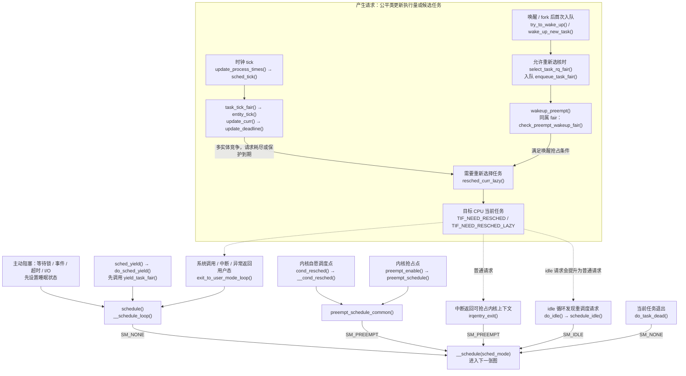
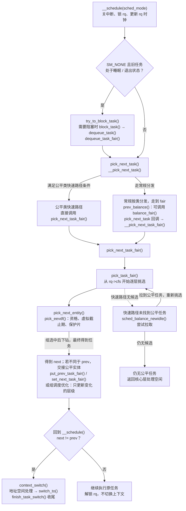
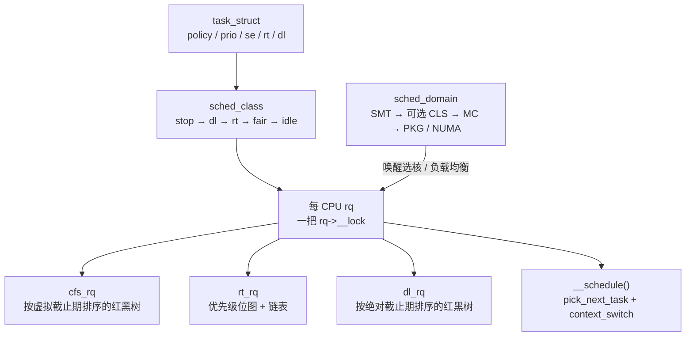
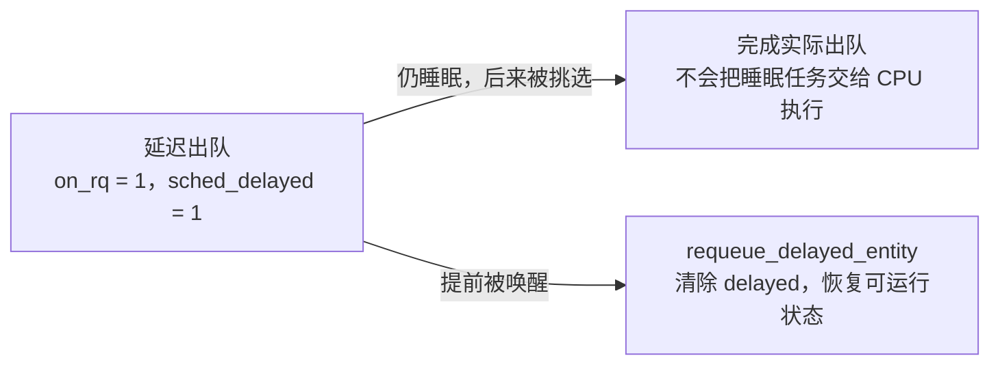
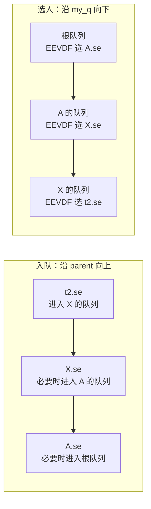
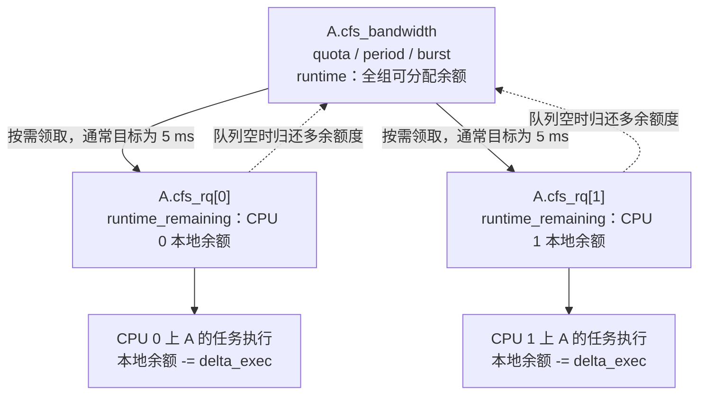
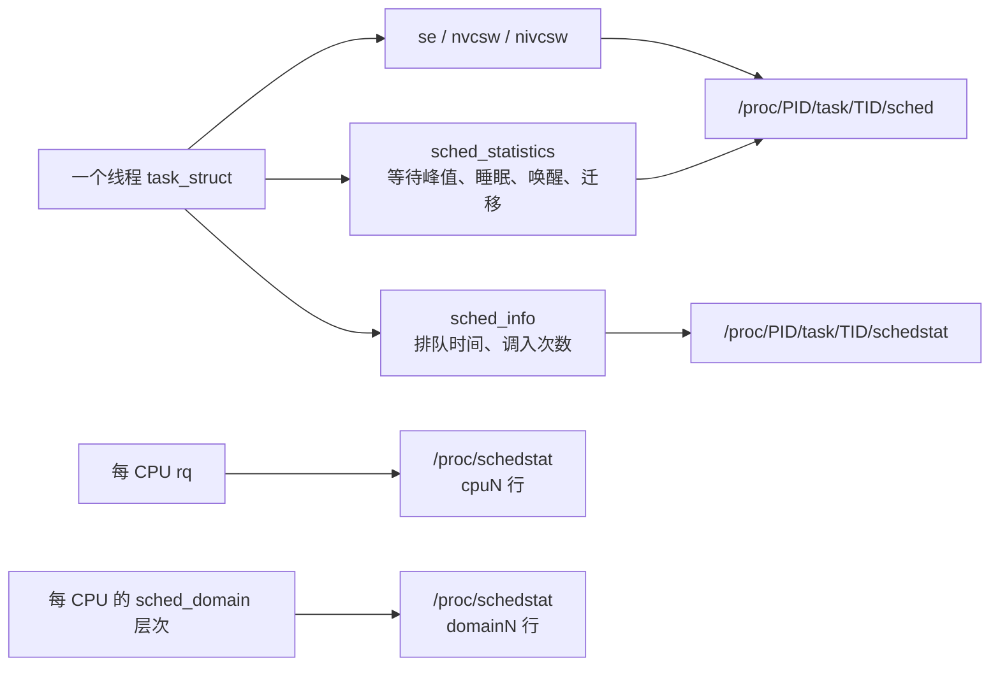

# Linux 调度器子系统：面试复习

> 源码基准：本项目 [Linux 6.18.52](../../linux/Makefile#L2)。所有源码链接均相对于本文。
>
> 学习主线：**每颗 CPU 一条运行队列；任务挂在某个调度类上；公平类用 EEVDF 在本队列里挑人；唤醒和负载均衡决定任务去哪颗 CPU；真正换人只发生在 `__schedule()`。**
>
> 下文以 x86-64、SMP、非 `PREEMPT_RT` 为范围，主要讨论同构数据中心 CPU，假定未启用 sched_ext 接管、core scheduling 和 proxy execution。[x86_64_defconfig](../../linux/arch/x86/configs/x86_64_defconfig#L5) 仅作为配置示例，不能代表所有云主机的实际配置：它选择 `NO_HZ`、`PREEMPT_VOLUNTARY`、`CGROUP_SCHED`、`SMP`、`NUMA` 和 `HZ_1000`。
>
> [`FAIR_GROUP_SCHED`](../../linux/init/Kconfig#L1111) 默认跟随 `CGROUP_SCHED`；`CFS_BANDWIDTH` 和 `RT_GROUP_SCHED` 默认关闭，后文分别说明启用后的行为。[拓扑调度选项](../../linux/arch/Kconfig#L53) `SCHED_SMT` / `SCHED_CLUSTER` / `SCHED_MC` 在架构支持时默认开启。[`PREEMPT_DYNAMIC`](../../linux/kernel/Kconfig.preempt#L126) 允许启动时更改抢占模型；上述 defconfig 选择的默认模型是自愿抢占。

## 进程调度总视图：入口 → 调度核心 → CFS 关键函数

先沿着一次调度看全貌，再往下学习各个结构和算法。这里的调度对象是 `task_struct` 表示的任务，线程也独立参与调度；本文所说的 **CFS 调度类对应源码中的 `fair_sched_class`，当前选人算法已经是 EEVDF**，见 [公平类回调表](../../linux/kernel/sched/fair.c#L14095) 和 [`pick_eevdf()`](../../linux/kernel/sched/fair.c#L1015)。下图只展开公平类路径，沿用本文的 x86-64、SMP、非 RT 配置范围。

先认识图中承载这条路径的四个对象：

| 核心对象       | 在总图中的作用                                                                                          | 源码                                                                                                                |
| -------------- | ------------------------------------------------------------------------------------------------------- | ------------------------------------------------------------------------------------------------------------------- |
| `task_struct`  | `__state` 表示任务能否运行，`sched_class` 决定回调分发，`se` 保存公平调度状态                           | [任务定义](../../linux/include/linux/sched.h#L815)、[`se` 与 `sched_class`](../../linux/include/linux/sched.h#L866) |
| 每 CPU 的 `rq` | 保存当前任务 `curr` 和本 CPU 的公平根队列 `cfs`；未启用 proxy execution 时 `donor` 与 `curr` 是同一指针 | [`rq->cfs`](../../linux/kernel/sched/sched.h#L1148)、[`curr` / `donor`](../../linux/kernel/sched/sched.h#L1171)     |
| `cfs_rq`       | 一个公平竞争层：`tasks_timeline` 保存排队实体，`curr` 指向本层正在执行的实体                            | [公平队列定义](../../linux/kernel/sched/sched.h#L676)                                                               |
| `sched_entity` | 任务或任务组的公平实体；以权重、`vruntime`、`deadline`、`vprot` 参与记账和选择                          | [实体定义](../../linux/include/linux/sched.h#L570)                                                                  |

### 入口总图：先请求重调度，再在允许的位置进入调度器

**显式阻塞、yield 可以直接调用调度入口；tick、唤醒等事件通常先更新队列并设置重调度标志，随后由目标 CPU 检查标志。** 这个区别来自 [`__schedule()` 的入口说明](../../linux/kernel/sched/core.c#L6778)：唤醒成功不等于立即切换到被唤醒的任务。

图中实线表示主要调用步骤，虚线表示“已经产生请求，稍后在这个位置检查”；省略的包装函数在下表中补齐。



| 真正进入调度器的位置 | 主要调用链                                                                                                                                    | 条件与源码                                                                                                                                                                                                                                  |
| -------------------- | --------------------------------------------------------------------------------------------------------------------------------------------- | ------------------------------------------------------------------------------------------------------------------------------------------------------------------------------------------------------------------------------------------- |
| 主动阻塞             | 等待代码 → `schedule()`；超时可经 `schedule_timeout()`，I/O 可经 `io_schedule()` → `schedule()` → `__schedule_loop(SM_NONE)` → `__schedule()` | 调用方设置睡眠状态；见 [`schedule_timeout()`](../../linux/kernel/time/sleep_timeout.c#L61)、[`io_schedule()`](../../linux/kernel/sched/core.c#L7904)、[`schedule()`](../../linux/kernel/sched/core.c#L7048)                                 |
| 主动让出 CPU         | `sched_yield()` → `do_sched_yield()` → `yield_task_fair()` → `schedule()` → `__schedule(SM_NONE)`                                             | 当前任务仍可处于 `TASK_RUNNING`，不按睡眠处理；见 [`do_sched_yield()`](../../linux/kernel/sched/syscalls.c#L1357)                                                                                                                           |
| 返回用户态           | `exit_to_user_mode_loop()` → `schedule()` → `__schedule(SM_NONE)`                                                                             | 返回前检查普通和 lazy 重调度标志；见 [返回路径](../../linux/kernel/entry/common.c#L19)                                                                                                                                                      |
| 内核自愿调度点       | `cond_resched()` → `__cond_resched()` → `preempt_schedule_common()` → `__schedule(SM_PREEMPT)`                                                | 该路径启用且 `should_resched(0)`、中断开启时进入；见 [`cond_resched()` 包装](../../linux/include/linux/sched.h#L2084)、[`__cond_resched()`](../../linux/kernel/sched/core.c#L7493)                                                          |
| 重新允许内核抢占     | `preempt_enable()` → `__preempt_schedule()` → `preempt_schedule()` → `preempt_schedule_common()` → `__schedule(SM_PREEMPT)`                   | 抢占计数归零、有重调度请求且允许内核抢占；见 [`preempt_enable()`](../../linux/include/linux/preempt.h#L229)、[x86 调用包装](../../linux/arch/x86/include/asm/preempt.h#L121)、[`preempt_schedule()`](../../linux/kernel/sched/core.c#L7161) |
| 中断返回内核态       | `irqentry_exit()` → `irqentry_exit_cond_resched()` → `raw_irqentry_exit_cond_resched()` → `preempt_schedule_irq()` → `__schedule(SM_PREEMPT)` | 返回可抢占上下文，抢占计数为零、有请求且该抢占路径启用；见 [IRQ 返回路径](../../linux/kernel/entry/common.c#L160)、[`preempt_schedule_irq()`](../../linux/kernel/sched/core.c#L7276)                                                        |
| idle 结束等待        | `do_idle()` → `schedule_idle()` → `__schedule(SM_IDLE)`                                                                                       | 本 CPU idle 循环观察到重调度请求；见 [循环条件](../../linux/kernel/sched/idle.c#L298)、[离开循环后调用](../../linux/kernel/sched/idle.c#L379)、[`schedule_idle()`](../../linux/kernel/sched/core.c#L7073)                                 |
| 当前任务结束执行     | `do_task_dead()` → `__schedule(SM_NONE)`                                                                                                      | 设置 `TASK_DEAD` 后直接进入核心，不再返回；见 [`do_task_dead()`](../../linux/kernel/sched/core.c#L6976)                                                                                                                                     |

### 核心总图：处理旧任务 → EEVDF 选人 → 交接实体 → 切换上下文

进入 `__schedule()` 后，调度核心锁住本 CPU 的 `rq`、更新时钟，再处理旧任务状态。下图展开核心选择到 fair 分支时的路径；各入口最终共用这段逻辑。



核心主干见 [`__schedule()`](../../linux/kernel/sched/core.c#L6817)、[处理阻塞状态](../../linux/kernel/sched/core.c#L6890)、[挑选与是否切换的判断](../../linux/kernel/sched/core.c#L6902) 和 [`context_switch()`](../../linux/kernel/sched/core.c#L5293)。未启用 core scheduling 时，[`pick_next_task()`](../../linux/kernel/sched/core.c#L6519) 直接转入 `__pick_next_task()`。

读这张图时要保留三个条件：

1. **公平类快速路径有明确前提。** [`__pick_next_task()` 的快速路径判断](../../linux/kernel/sched/core.c#L5983) 要求旧任务的类不高于 fair，并且 `rq->nr_running == rq->cfs.h_nr_queued`，才直接调用 `pick_next_task_fair(rq, prev, rf)`。常规分发先做 `prev_balance()`，再通过公平类 `pick_next_task` 回调进入 [`__pick_next_task_fair()`](../../linux/kernel/sched/fair.c#L9223)，后者传入 `rf=NULL`；它所需的 newidle 尝试已由前面的 [`balance_fair()`](../../linux/kernel/sched/fair.c#L8883) 处理。快速路径没有候选时，则在 [`pick_next_task_fair()` 内部](../../linux/kernel/sched/fair.c#L9201) 尝试 newidle。
2. **选人和交接有先后，组调度会优化交接。** [`pick_task_fair()`](../../linux/kernel/sched/fair.c#L9104) 先逐层选到任务；一般经 [`put_prev_set_next_task()`](../../linux/kernel/sched/sched.h#L2507) 分发旧任务的 `put_prev_task` 和新任务的 `set_next_task`。两者都属于 fair 且启用组调度时，[`pick_next_task_fair()` 的组层级优化](../../linux/kernel/sched/fair.c#L9153) 可以直接调用 `put_prev_entity()` / `set_next_entity()`，只更新变化的组层级，不能把每次调度都理解成完整执行两套任务级回调。
3. **睡眠处理和进入调度都不保证立即物理出队或换人。** [`try_to_block_task()`](../../linux/kernel/sched/core.c#L6545) 先检查能打断睡眠的待处理信号；公平类也可能延迟出队。挑选碰到延迟实体时，[`pick_next_entity()`](../../linux/kernel/sched/fair.c#L5683) 完成出队并让上层重选。最终可以再次选中 `prev`，只有 [`next != prev`](../../linux/kernel/sched/core.c#L6919) 才调用 `context_switch()`。

### 公平类关键函数索引：把入口与操作表对起来

下表中的“回调字段”来自 [`fair_sched_class`](../../linux/kernel/sched/fair.c#L14095)；`pick_next_entity()`、`pick_eevdf()`、`update_curr()` 是这些回调内部使用的算法函数。

| 阶段               | 调度类回调字段 → 公平类实现                                                                                                                                      | 围绕哪些对象做什么                                                                                                                 |
| ------------------ | ---------------------------------------------------------------------------------------------------------------------------------------------------------------- | ---------------------------------------------------------------------------------------------------------------------------------- |
| 唤醒 / fork 选 CPU | `select_task_rq` → [`select_task_rq_fair()`](../../linux/kernel/sched/fair.c#L8733)                                                                              | 为任务选择目标 CPU；在 [`select_task_rq()`](../../linux/kernel/sched/core.c#L3583) 允许调用选核回调时执行                          |
| 任务入队           | `enqueue_task` → [`enqueue_task_fair()`](../../linux/kernel/sched/fair.c#L7080)                                                                                  | 核心 `activate_task()` → `enqueue_task()` 分发，维护任务实体及祖先组实体的队列和负荷                                               |
| 睡眠出队           | `dequeue_task` → [`dequeue_task_fair()`](../../linux/kernel/sched/fair.c#L7321)                                                                                  | 核心 `block_task()` → `dequeue_task()` 分发，处理实体出队或延迟出队                                                                |
| 周期 / 高精度 tick | `task_tick` → [`task_tick_fair()`](../../linux/kernel/sched/fair.c#L13588)                                                                                       | 逐层 `entity_tick()` → [`update_curr()`](../../linux/kernel/sched/fair.c#L1286)，推进 `vruntime` 和 deadline，必要时请求重调度     |
| 唤醒抢占检查       | `wakeup_preempt` → [`check_preempt_wakeup_fair()`](../../linux/kernel/sched/fair.c#L8970)                                                                        | 对齐竞争层，结合 EEVDF 和保护片判断是否请求重调度                                                                                  |
| 主动让出           | `yield_task` → [`yield_task_fair()`](../../linux/kernel/sched/fair.c#L9259)                                                                                      | 多任务竞争且当前实体合格时放弃当前请求剩余的虚拟执行量；调用方随后 `schedule()`                                                    |
| 挑选前补充候选     | `balance` → [`balance_fair()`](../../linux/kernel/sched/fair.c#L8883)                                                                                            | 常规分发的 `prev_balance()` 调用；公平队列没有实体时尝试 newidle 拉取                                                              |
| 选出下一个任务     | `pick_next_task` → [`__pick_next_task_fair()`](../../linux/kernel/sched/fair.c#L9223)；`pick_task` → [`pick_task_fair()`](../../linux/kernel/sched/fair.c#L9104) | 前者包装 `pick_next_task_fair()`，包含选人和交接；内部通过 `pick_task_fair()` → `pick_next_entity()` → `pick_eevdf()` 逐层选到任务 |
| 旧任务交出 CPU     | `put_prev_task` → [`put_prev_task_fair()`](../../linux/kernel/sched/fair.c#L9245)                                                                                | 逐层 `put_prev_entity()` 记账；仍在队列上的实体重新加入红黑树                                                                      |
| 新任务接手 CPU     | `set_next_task` → [`set_next_task_fair()`](../../linux/kernel/sched/fair.c#L13778)                                                                               | 逐层 `set_next_entity()` 设置 `cfs_rq->curr`、把执行实体移出树，并在新的运行阶段设置保护片                                         |

## 核心数据结构

下面的结构体均为带解释的字段节选，省略了无关字段及部分配置分支；字段间距和排列不能当作完整内存布局。

```text
task_struct.sched_class ──► 全局只读操作表（SMP 下五个常规类，另有可选 ext）
                                    │
                                    │ enqueue / pick / tick
                                    ▼
每 CPU rq
  ├── stop   rq->stop          迁移、hotplug 用的 stop 线程
  ├── dl     rq->dl            按绝对截止期的红黑树
  ├── rt     rq->rt            优先级位图 + 每优先级一条链表
  ├── fair   rq->cfs           按虚拟截止期的红黑树
  ├── ext    rq->scx           仅 CONFIG_SCHED_CLASS_EXT
  └── idle   rq->idle          本 CPU idle 线程
```
### struct rq

字段定义见 [`struct rq`](../../linux/kernel/sched/sched.h#L1120)，计数更新见 [`add_nr_running()`](../../linux/kernel/sched/sched.h#L2744)。

```c
struct rq {
	/*
	 * 这条 rq 的调度任务计数，包含正在执行的非 idle 任务和公平类延迟实体。
	 * fair_server、每 CPU 的 idle 线程、公平类 limbo 任务不计入。
	 * 编译 RT_GROUP_SCHED 且顶层 RT 队列因限流被摘下时，也会减去相应任务数；
	 * 本文 defconfig 没有这条路径。
	 * 从不足 2 个变成不少于 2 个时，把所属 root domain 标成 overloaded。
	 */
	unsigned int		nr_running;

	/* 公平类子队列。根组直接用它，EEVDF 红黑树在 tasks_timeline。 */
	struct cfs_rq		cfs;
	/* 实时子队列。一张优先级位图，每个优先级一条链表。 */
	struct rt_rq		rt;
	/*
	 * deadline 子队列。红黑树按绝对截止期排序。
	 * fair_server 需要以 DL 身份运行时也挂在这里，并且不增加 nr_running。
	 */
	struct dl_rq		dl;
#ifdef CONFIG_SCHED_CLASS_EXT
	/* sched_ext 的每 CPU 状态。本文假定没有 BPF 调度器接管。 */
	struct scx_rq		scx;
#endif

	/* 本 CPU 的 idle 线程，属于 idle 调度类，不是 SCHED_IDLE。没有其它类可选时由它占用 CPU。 */
	struct task_struct	*idle;
	/*
	 * 本 CPU 的 stop 线程，属于最高的 stop 调度类。
	 * 迁移钉死任务、主动均衡等 stopper 工作由它执行，只有入队时才参与挑选。
	 */
	struct task_struct	*stop;
	/*
	 * 下一次周期负载均衡的 jiffies。tick 里到达这个时刻就抬 SCHED_SOFTIRQ。
	 * 队列上只剩下 SCHED_IDLE 任务时会被拉到当前 jiffies，让均衡马上发生。
	 */
	unsigned long		next_balance;

	/*
	 * 这颗 CPU 所属的 root domain。通常均衡分区内的 CPU 共用一个。
	 * cpuset 等机制可改变分区，但仅设置 CPU 独占标志不保证拆出新域。
	 * DL 准入带宽、RT/DL 的 push/pull 索引都放在这里。
	 */
	struct root_domain		*rd;
	/*
	 * 这颗 CPU 的最底层调度域，RCU 保护。顺着 parent 往上是 SMT、可选的 CLS、
	 * MC、PKG，NUMA 内核再接 NODE 与按距离的 NUMA 层；跨度重复的层挂接时已裁掉。
	 * 为 NULL 时不做周期均衡。
	 */
	struct sched_domain __rcu	*sd;
};
```

### struct task_struct

字段定义见 [`struct task_struct`](../../linux/include/linux/sched.h#L815)；x86 低层标志见 [`thread_info`](../../linux/arch/x86/include/asm/thread_info.h#L62)。

```c
struct task_struct {
#ifdef CONFIG_THREAD_INFO_IN_TASK
	/*
	 * 低层线程信息，x86 通过 THREAD_INFO_IN_TASK 把它嵌在这里，
	 * 而且必须是第一个成员：current_thread_info() 直接把 current
	 * 转成 thread_info *。x86-64 上装的是入口路径要用的低层标志
	 * （含 TIF_NEED_RESCHED）、syscall_work、status，以及当前 CPU 号。
	 * task_cpu() 读的就是 thread_info.cpu。
	 */
	struct thread_info		thread_info;
#endif
	/*
	 * 可运行性状态，不是“在不在 CPU 上”。TASK_RUNNING = 0 同时表示
	 * 正在执行和就绪；可中断/不可中断睡眠、停止、正在唤醒等用其它位。
	 * 退出状态另放在 exit_state，两套位不会互相踩。
	 */
	unsigned int			__state;

	/*
	 * 是否仍占用 CPU。prepare_task() 在切入前写 1，finish_task() 在
	 * 切出收尾后用 release 语义清 0。非 0 表示正在执行，或上一次切换
	 * 还没结束；唤醒方要等它变 0，才能把任务迁走。交接窗口里，同一颗
	 * CPU 上的 prev 和 next 可以同时为 1。
	 */
	int				on_cpu;
	/*
	 * 运行队列归属：
	 *   0                      不在任何 rq 上
	 *   TASK_ON_RQ_QUEUED(1)   核心层归属 rq；delayed 或 limbo 时仍可为 1，但不能执行
	 *   TASK_ON_RQ_MIGRATING(2) 正在跨队列迁移，此时 task_cpu() 不稳定
	 */
	int				on_rq;

	/* 公平实体：权重、vruntime、虚拟截止期、lag 和 PELT。RT/DL 也用它记执行时间。 */
	struct sched_entity		se;
	/* 实时实体：挂在 rt_rq 的优先级链表上，RR 的剩余时间片在 time_slice。 */
	struct sched_rt_entity		rt;
	/* 本任务自己的 deadline 实体：runtime、绝对 deadline、period。SCHED_DEADLINE 用它排队。 */
	struct sched_dl_entity		dl;
	/*
	 * DL 类挑到 fair_server 时，把被选中的公平任务和这台服务器绑在一起：
	 * 挑选完成后，把 prev 的关联清掉，再把 rq->dl_server 交给 next。
	 * 即使 next == prev 也会更新关联；并不要求发生实际上下文切换。
	 * 不借服务器取得调度机会时为 NULL，任务的 sched_class 仍保持 fair。
	 */
	struct sched_dl_entity		*dl_server;
#ifdef CONFIG_SCHED_CLASS_EXT
	/* sched_ext 的每任务状态。本文假定没有 BPF 调度器接管，公平策略不走这里。 */
	struct sched_ext_entity		scx;
#endif
	/* 当前调度类的操作表：入队、出队、挑选、选核、tick 都从这里分发。 */
	const struct sched_class	*sched_class;
} __attribute__ ((aligned (64)));

```

### struct sched_class

[`SCHED_DATA`](../../linux/include/asm-generic/vmlinux.lds.h#L136) 在只读数据布局中排列各类实例，地址从低到高如下；未编译的 ext 没有实例。

```c
#define SCHED_DATA				\
	STRUCT_ALIGN();				\
	__sched_class_highest = .;		\
	*(__stop_sched_class)			\
	*(__dl_sched_class)			\
	*(__rt_sched_class)			\
	*(__fair_sched_class)			\
	*(__ext_sched_class)			\
	*(__idle_sched_class)			\
	__sched_class_lowest = .;
```

```text
__sched_class_highest
        │
        ▼
   ┌─────────┬─────────┬─────────┬─────────┬─────────┬─────────┐
   │  stop   │   dl    │   rt    │  fair   │   ext   │  idle   │
   └─────────┴─────────┴─────────┴─────────┴─────────┴─────────┘
   高优先级 ◄──────────────────────────────────────────► 低优先级
                                                          │
                                                          ▼
                                              __sched_class_lowest
```

```c
struct sched_class {
	/* 把任务放进本类子队列。唤醒、迁移挂回、fork 后第一次入队都走这里。 */
	void (*enqueue_task) (struct rq *rq, struct task_struct *p, int flags);
	/*
	 * 从本类子队列摘下任务。返回 false 只出现在睡眠出队：
	 * 公平类延迟出队时任务仍留在队列上，调用方就不再把它标成已阻塞。
	 */
	bool (*dequeue_task) (struct rq *rq, struct task_struct *p, int flags);
	/*
	 * sched_yield()。rq->nr_running == 1 时公平类直接返回；否则先记账，
	 * 在实体仍合格时把 vruntime 拉到 deadline，并生成下一请求的 deadline。
	 * 调用方随后进入 schedule() 重选。
	 */
	void (*yield_task)   (struct rq *rq);
	/* yield_to()。公平类把目标设成 next buddy，再对当前任务执行 yield_task。 */
	bool (*yield_to_task)(struct rq *rq, struct task_struct *p);

	/*
	 * 同一个调度类里有新任务入队后，判断要不要抢占正在跑的任务。
	 * 唤醒者属于更高类时，核心直接请求重调度，不调用它。
	 */
	void (*wakeup_preempt)(struct rq *rq, struct task_struct *p, int flags);

	/*
	 * 常规挑选前，prev_balance() 从前一任务的类开始向低优先级遍历，补充候选。
	 * 公平类的 cfs_rq 上还有实体（含延迟出队）就返回 1，否则调用 newidle 尝试拉取，
	 * 后者可能因预计空闲时间、均衡成本等条件直接跳过。
	 * RT/DL 在当前任务实体不在本类队列、且满足 need_pull 条件时尝试 pull。
	 * 返回非 0 表示已有本类或更高类候选，结束这轮 balance 回调遍历。
	 */
	int (*balance)(struct rq *rq, struct rq_flags *rf);
	/*
	 * 选出候选，不执行 put_prev/set_next 交接。公平类从根队列逐层挑选，
	 * 但途中会更新当前实体记账、检查限流，还可能完成延迟实体的出队。
	 */
	struct task_struct *(*pick_task)(struct rq *rq);
	/*
	 * 可选。实现上应等价于 pick_task() 之后接 put_prev_task() 和
	 * set_next_task(first=true)。公平类用它少碰组层级里没有变化的那一段。
	 */
	struct task_struct *(*pick_next_task)(struct rq *rq, struct task_struct *prev);

	/* 当前任务离开 CPU。仍在队列上时先记完这一段执行，再把公平实体放回红黑树。 */
	void (*put_prev_task)(struct rq *rq, struct task_struct *p, struct task_struct *next);
	/*
	 * 把任务标成这一层的当前实体，正在跑的公平实体不留在树上。
	 * first 为真是一次新的运行，公平类这时设置保护片；
	 * 为假用于恢复正在运行任务的调度状态，例如改组或调度参数。
	 */
	void (*set_next_task)(struct rq *rq, struct task_struct *p, bool first);

	/* 唤醒、fork、exec 时选 CPU。调用方持有 pi_lock，任务此时可以还没入队。 */
	int  (*select_task_rq)(struct task_struct *p, int task_cpu, int flags);

	/*
	 * 改 task_cpu() 之前通知旧队列，这时读到的仍是旧 CPU。
	 * 公平类在任务还不是迁移态时卸下旧队列的 PELT 贡献并补偿缺失衰减；
	 * 无论是否已处于迁移态，都会清掉 last_update_time，让新 CPU 重新同步。
	 */
	void (*migrate_task_rq)(struct task_struct *p, int new_cpu);

	/*
	 * 任务已经入队并且完全唤醒之后。公平类没有这个回调。
	 * RT/DL 在它没占到 CPU、当前任务未置 NEED_RESCHED，且亲和性和
	 * 当前任务的优先级/截止期等条件满足时，尝试 push 等待任务到别的 CPU。
	 */
	void (*task_woken)(struct rq *this_rq, struct task_struct *task);

	/* 更新 cpus_mask/cpus_ptr 等亲和状态；公平类还会更新最大允许容量。 */
	void (*set_cpus_allowed)(struct task_struct *p, struct affinity_context *ctx);

	/* CPU 上线。公平类按在线 CPU 数重算 sched_base_slice，并同步各组的带宽开关。 */
	void (*rq_online)(struct rq *rq);
	/*
	 * CPU 下线。公平类重算 sched_base_slice；编译相应组/带宽选项时，
	 * 对已不 active 的 CPU 解除组限流，并清掉它对组份额的负荷贡献。
	 */
	void (*rq_offline)(struct rq *rq);

	/*
	 * 只由 stopper 执行的 push_cpu_stop() 调用：可推的 RT/DL 任务被 migrate_disable()
	 * 钉住时，改为把当前任务推走，用它找目标 rq 并和源 rq 一起锁住。
	 * RT 找运行优先级低于该任务的 CPU，DL 找没有 DL 任务或最早截止期更晚的 CPU。
	 * 公平类不实现，它的 stopper 主动均衡也不走这里。
	 */
	struct rq *(*find_lock_rq)(struct task_struct *p, struct rq *rq);

	/*
	 * 周期 tick，也可能来自 hrtick。公平类记 vruntime、推进 deadline，
	 * 必要时请求重调度。queued 非 0 表示这次 tick 对准了时间片，直接请求重调度。
	 */
	void (*task_tick)(struct rq *rq, struct task_struct *p, int queued);
	/* fork 出的子任务还没挂上任务链表。公平类只设置它允许使用的最大容量。 */
	void (*task_fork)(struct task_struct *p);
	/* 任务退出。公平类若还停在延迟出队，先完成真正出队，再去掉它的 PELT。 */
	void (*task_dead)(struct task_struct *p);

	/*
	 * 调度类即将切换、pi_lock 和 rq 锁都还持有。给新类做准备，不能再加锁。
	 * 当前只有 sched_ext 实现。
	 */
	void (*switching_to) (struct rq *this_rq, struct task_struct *task);
	/*
	 * 任务已经离开本类，由旧类善后。公平类卸下 cfs_rq 上的负荷。
	 * RT 在离开后队列上已经没有 RT 任务、且该任务仍在 rq 上时，安排从别处 pull。
	 */
	void (*switched_from)(struct rq *this_rq, struct task_struct *task);
	/* 任务已经进入本类。公平类把负荷挂到新的 cfs_rq，并检查要不要抢占当前任务。 */
	void (*switched_to)  (struct rq *this_rq, struct task_struct *task);
	/* 同一类内改权重。公平类按新权重重放 vruntime、deadline 和队列负荷。 */
	void (*reweight_task)(struct rq *this_rq, struct task_struct *task,
			      const struct load_weight *lw);
	/*
	 * 同一类内优先级变了。公平类对当前任务优先级下降请求重调度，
	 * 对已入队的等待任务重新检查唤醒抢占；后者仍按 EEVDF 判断。
	 */
	void (*prio_changed) (struct rq *this_rq, struct task_struct *task,
			      int oldprio);

	/*
	 * sched_rr_get_interval() 读到的时间片，单位是 jiffies。
	 * SCHED_RR 返回配置的轮转片，SCHED_FIFO 返回 0。
	 * 公平类在 cfs 队列权重合计非 0 时，把当前 slice 换成 jiffies，否则返回 0。
	 */
	unsigned int (*get_rr_interval)(struct rq *rq,
					struct task_struct *task);

	/* 把当前任务刚跑过的时间记进 sum_exec_runtime。公平类同时推进 vruntime。 */
	void (*update_curr)(struct rq *rq);

#ifdef CONFIG_FAIR_GROUP_SCHED
	/* 任务换 cgroup。从旧组的 cfs_rq 拆下负荷，挂到新组在同一 CPU 上的队列。 */
	void (*task_change_group)(struct task_struct *p);
#endif

#ifdef CONFIG_SCHED_CORE
	/* core scheduling 挑任务时跳过已限流的候选。本文未启用 core scheduling。 */
	int (*task_is_throttled)(struct task_struct *p, int cpu);
#endif
};

```

### fair_sched_class
```c
DEFINE_SCHED_CLASS(fair) = {

	.enqueue_task		= enqueue_task_fair,
	.dequeue_task		= dequeue_task_fair,
	.yield_task		= yield_task_fair,
	.yield_to_task		= yield_to_task_fair,

	.wakeup_preempt		= check_preempt_wakeup_fair,

	.pick_task		= pick_task_fair,
	.pick_next_task		= __pick_next_task_fair,
	.put_prev_task		= put_prev_task_fair,
	.set_next_task          = set_next_task_fair,

	.balance		= balance_fair,
	.select_task_rq		= select_task_rq_fair,
	.migrate_task_rq	= migrate_task_rq_fair,

	.rq_online		= rq_online_fair,
	.rq_offline		= rq_offline_fair,

	.task_dead		= task_dead_fair,
	.set_cpus_allowed	= set_cpus_allowed_fair,

	.task_tick		= task_tick_fair,
	.task_fork		= task_fork_fair,

	.reweight_task		= reweight_task_fair,
	.prio_changed		= prio_changed_fair,
	.switched_from		= switched_from_fair,
	.switched_to		= switched_to_fair,

	.get_rr_interval	= get_rr_interval_fair,

	.update_curr		= update_curr_fair,

#ifdef CONFIG_FAIR_GROUP_SCHED
	.task_change_group	= task_change_group_fair,
#endif

#ifdef CONFIG_SCHED_CORE
	.task_is_throttled	= task_is_throttled_fair,
#endif

#ifdef CONFIG_UCLAMP_TASK
	.uclamp_enabled		= 1,
#endif
};
```


## 1. 先记住分层

调度器回答四个不同的问题：

| 问题                            | 核心对象                                | 数据中心上的典型答案                                                                                                       |
| ------------------------------- | --------------------------------------- | -------------------------------------------------------------------------------------------------------------------------- |
| 谁可以上 CPU？                  | `task_struct` + `sched_class`           | 普通任务走 `fair_sched_class`                                                                                              |
| 这颗 CPU 上现在有哪些候选任务？ | 每 CPU `struct rq`                      | 里面嵌着 `cfs` / `rt` / `dl` 子队列；公平类还可能保留延迟出队的睡眠实体                                                    |
| 公平任务谁先跑、跑多久？        | `struct sched_entity` + `struct cfs_rq` | EEVDF：先合格，再取最早虚拟截止期                                                                                          |
| 任务该放哪颗 CPU？              | `sched_domain` 层次                     | 数据中心里，唤醒用 LLC 内的快速选核把新任务放下去；已经在跑的负载，靠周期软中断和即将空闲时的 newidle，由闲 CPU 再拉回来。 |



## 2. 任务、优先级、调度类

### 2.1 一个任务同时带着三套调度实体

[`struct task_struct`](../../linux/include/linux/sched.h#L815) 里和调度直接相关的是：

| 字段                                                   | 作用                                                                                                  |
| ------------------------------------------------------ | ----------------------------------------------------------------------------------------------------- |
| `__state`                                              | 任务状态。`TASK_RUNNING = 0` 同时表示正在执行或就绪，不能单靠它区分二者                               |
| `on_rq`                                                | 核心层队列归属：`0` 无归属；`1` 归属稳定；`2` 正在迁移；`1` 不保证公平实体仍在队列中，见第 7 节 limbo |
| `on_cpu`                                               | 执行及上下文切换交接状态，唤醒方用它等待前一次切换完成                                                |
| `prio` / `static_prio` / `normal_prio` / `rt_priority` | 有效优先级、nice 静态优先级、策略优先级、用户态 RT 优先级                                             |
| `se` / `rt` / `dl`                                     | 公平、实时、deadline 实体。排队由当前调度类决定，但 RT/DL 也复用 `se` 的执行时间记账字段              |
| `sched_class`                                          | 当前有效调度类的操作表；通常由策略决定，优先级继承等情况可改变它                                      |
| `sched_task_group`                                     | 所属 cgroup 任务组                                                                                    |

`on_rq` 的两个非零值见 [`TASK_ON_RQ_QUEUED`](../../linux/kernel/sched/sched.h#L97) 和 `TASK_ON_RQ_MIGRATING`。`2` 表示队列归属正在交接，不等于稳定地挂在某棵树上：[`deactivate_task()`](../../linux/kernel/sched/core.c#L2156) 在出队前设为迁移态，[`activate_task()`](../../linux/kernel/sched/core.c#L2143) 在入队后恢复为已排队；[均衡摘取与挂接](../../linux/kernel/sched/fair.c#L12112) 使用这套交接。

### 2.2 数字越小，优先级越高

[`MAX_RT_PRIO = 100`](../../linux/include/linux/sched/prio.h#L16)，`MAX_PRIO = 140`，`DEFAULT_PRIO = 120`。nice \([-20, 19]\) 映射到 `static_prio` \([100, 139]\)，nice 0 就是 120。RT 的通常优先级按 `prio = 99 - rt_priority` 映射：用户态 1 对应内核 98，用户态 99 对应内核 0，见 [`__normal_prio()`](../../linux/kernel/sched/syscalls.c#L19)。公平类内部使用 nice 决定权重，并不简单按 `prio` 数值依次运行。

nice 相邻级别的**权重比约为 1.25**，不能把它记成任意场景下 CPU 份额固定相差 10%。例如同一层级、同一 CPU 上两个持续运行的任务，nice 0 和 nice 1 的权重为 1024 和 820，理想份额约为 55.5% 和 44.5%。份额还取决于其他竞争者和组层级，权重表见 [`sched_prio_to_weight[]`](../../linux/kernel/sched/core.c#L10354)。

[`set_load_weight()`](../../linux/kernel/sched/core.c#L1448) 在任务初始化、参数调整等路径设置权重，并非每次入队重新查表。x86-64 的内部 `se.load.weight` 使用 [`scale_load()`](../../linux/kernel/sched/sched.h#L149) 放大 1024 倍，所以 nice 0 的内部权重及 `NICE_0_LOAD` 是 \(2^{20}\)，下文公式中的 1024 则采用未缩放的权重单位。

### 2.3 调度类是一张按优先级排好的函数表

[`struct sched_class`](../../linux/kernel/sched/sched.h#L2413) 把入队、出队、挑选、唤醒抢占、选 CPU、tick 都做成回调。实例用链接脚本排进独立段，地址从低到高是：

```text
stop → dl → rt → fair → ext → idle
```

见 [vmlinux.lds.h](../../linux/include/asm-generic/vmlinux.lds.h#L136)。[`for_each_active_class()`](../../linux/kernel/sched/sched.h#L2572) 按地址递增遍历，**低地址对应高调度类优先级**，所以先问 stop，最后才是 idle；未启用的 ext 会被跳过。全是公平任务、前一个调度类不高于 fair 且 sched_ext 未启用时，可直接调 `pick_next_task_fair()`，见 [`__pick_next_task()`](../../linux/kernel/sched/core.c#L5973)。

公平类这张表的热回调是：
* `enqueue_task_fair`
* `pick_next_task_fair`
* `select_task_rq_fair`
* `check_preempt_wakeup_fair`
* `task_tick_fair`

## 3. 每 CPU 运行队列

[`struct rq`](../../linux/kernel/sched/sched.h#L1120) 是调度器的中心对象，每 CPU 一份；本文未启用 core scheduling 时，实际使用 `rq->__lock` 保护。同时锁多条队列要按 [`rq_order_less()`](../../linux/kernel/sched/sched.h#L2929) 确定顺序：未编译 `SCHED_CORE` 时按 CPU 编号升序，编译该功能时先比较 `rq->core->cpu`、再比较 CPU 编号。实际调用见 [`double_rq_lock()`](../../linux/kernel/sched/core.c#L703)。`rq` 定义上方仍写着按运行队列地址排序的旧注释，实际锁顺序应以上述函数为准。

```text
rq
├── cfs          公平子队列，红黑树 tasks_timeline
├── rt           实时子队列，位图 + 每优先级一条链表
├── dl           deadline 子队列，红黑树按绝对截止期
├── fair_server  嵌在这条 rq 上的 deadline 服务器，用来给公平任务留带宽
├── curr         正在执行的任务
├── donor        调度上选中的任务；没有 proxy-exec 时和 curr 是同一份
├── idle / stop  本 CPU 的 idle 线程和 stop 线程
├── clock / clock_task / clock_pelt
└── nr_running
```

公平子队列 [`struct cfs_rq`](../../linux/kernel/sched/sched.h#L676) 里面试要记住的是：

| 字段                                              | 作用                                                                     |
| ------------------------------------------------- | ------------------------------------------------------------------------ |
| `load`                                            | 队列上实体权重之和                                                       |
| `nr_queued`                                       | 本层已入队实体数，包含仍在队列上的 `curr` 和延迟出队实体，不等于树节点数 |
| `h_nr_queued` / `h_nr_runnable`                   | 层级内排队任务数 / 可运行任务数；后者排除延迟出队任务                    |
| `tasks_timeline`                                  | 按虚拟截止期排序的增强红黑树                                             |
| `curr`                                            | 本层正在跑的实体。它在跑的时候不在树上                                   |
| `zero_vruntime` / `sum_w_vruntime` / `sum_weight` | 虚拟时间参考点及树内实体的加权和；计算平均时另加仍入队的 `curr`          |
| `avg`                                             | PELT 负荷：`load_avg` / `runnable_avg` / `util_avg`                      |

`FAIR_GROUP_SCHED` 打开时，非根任务组在每颗 CPU 上各有一个组 `sched_entity` 和一条自己的 `cfs_rq`；根组直接使用 `rq->cfs`，没有再向上排队的组实体。任务的 `se->cfs_rq` 是它挂上去的队列，组实体的 `se->my_q` 是它拥有的那条队列，见 [`struct sched_entity`](../../linux/include/linux/sched.h#L570) 和 [`init_tg_cfs_entry()`](../../linux/kernel/sched/fair.c#L13926)。

`rq` 的三种时钟也要分清，否则后面的统计单位虽然都写 ns，含义却会混淆：

| 时钟         | 维护方式                                         | 主要用途                                            |
| ------------ | ------------------------------------------------ | --------------------------------------------------- |
| `clock`      | 跟随本 CPU 的 `sched_clock_cpu()` 单调推进       | 排队等待、`sched_info` 的调入/离开时标              |
| `clock_task` | 从上述增量中扣除已启用记账的 IRQ 和 steal 时间   | `se.sum_exec_runtime`、公平类 `vruntime` 的执行记账 |
| `clock_pelt` | 对任务时钟增量再按容量、频率缩放，并处理空闲同步 | PELT 负荷历史；组队列还会扣除冻结时长               |

维护路径见 [`update_rq_clock()`](../../linux/kernel/sched/core.c#L846)、[`update_rq_clock_task()`](../../linux/kernel/sched/core.c#L787) 和 [`update_rq_clock_pelt()`](../../linux/kernel/sched/pelt.h#L100)。扣除 IRQ/steal 依赖对应配置和运行时记账，不能假定任何部署都同样精确。

## 4. 公平类：先理解经典 CFS，再理解 EEVDF

这里的“标准 CFS”指以最小 `vruntime` 为核心选人规则的经典 CFS（Completely Fair Scheduler）模型。先理解它如何分配 CPU 服务，再看 EEVDF（Earliest Eligible Virtual Deadline First）如何表达不同的请求长度和调度顺序。

**版本边界：本地 Linux 6.18.52 的公平类已经采用 EEVDF。** 经典 CFS 部分用教学模型和伪代码说明；链接到当前源码的数据结构与记账机制仍可用于理解它，但当前选人函数按虚拟截止期比较，见 [`entity_before()`](../../linux/kernel/sched/fair.c#L582)。后半部分再对应当前实现，避免把经典模型当成这一版本的实际执行路径。

### 4.1 经典 CFS 的核心对象：调度实体与公平队列

先把讨论限定在**一颗 CPU、同一层公平队列**。一个竞争者是一个 `sched_entity`：它可以代表任务，也可以代表任务组；`cfs_rq` 保存这一层的竞争者。组调度时，选中组实体后还要进入它的子队列继续挑选。

当前 [`struct sched_entity`](../../linux/include/linux/sched.h#L570) 和 [`struct cfs_rq`](../../linux/kernel/sched/sched.h#L676) 保留了以下公共骨架：

| 对象/字段               | 理解经典 CFS 时先记住什么                          |
| ----------------------- | -------------------------------------------------- |
| `se.load.weight`        | 实体的权重，决定持续竞争时的相对 CPU 份额          |
| `se.sum_exec_runtime`   | 已记账的实际执行时间，尚未按权重折算               |
| `se.vruntime`           | 按权重折算的服务进度，是经典 CFS 选人的核心依据    |
| `se.run_node`           | 把等待实体组织到红黑树中的节点                     |
| `cfs_rq.load`           | 本层已入队实体的权重总和                           |
| `cfs_rq.tasks_timeline` | 等待实体的红黑树；经典模型按 `vruntime` 排序       |
| `cfs_rq.curr`           | 本层当前执行实体；它仍参与竞争，但执行期间不在树中 |

```text
经典 CFS 的教学视图：按 vruntime 排序

cfs_rq
├── curr ──► 当前执行的实体，随执行不断增加 vruntime
└── tasks_timeline
        B(v=12)
       /       \
   A(v=8)     C(v=17)
     ↑
 等待实体中服务进度最落后的候选

最终还要比较 curr 与树内候选，当前实体也可能继续运行。
```

经典 CFS 还有一个重要的队列基准 `cfs_rq->min_vruntime`：它根据当前实体和树中最小进度单调推进，为新实体放置、唤醒和迁移时的相对位置提供参考。实体离开后，该基准不会简单退回到较小值；唤醒也不能把历史进度无条件重置成零。

**注意两个同名字段的含义。** 当前 `cfs_rq` 已使用 `zero_vruntime` 等字段维护虚拟时间参考；当前 `se->min_vruntime` 则是红黑树的**子树最小值**，服务于 EEVDF 的合格性剪枝，见 [子树统计更新](../../linux/kernel/sched/fair.c#L896)。它不是上述经典 CFS 的队列基准。

### 4.2 经典 CFS 的公平目标：权重把执行时间变成虚拟时间

假设所有竞争者都持续可运行，只有这一条公平队列使用 CPU。理想情况下，每个实体应得到与权重成比例的 CPU 服务：

```text
理想份额_i = weight_i / sum(weight)
理想执行时间_i = 队列取得的总执行时间 × 理想份额_i
```

这是当前源码仍使用的比例公平模型。实现上它写成 lag 守恒：\(\sum w_i(V - v_i) = 0\)，从而 \(V\) 是各实体 `vruntime` 的加权平均，见 [lag 与虚拟时间推导](../../linux/kernel/sched/fair.c#L615)。真实 CPU 同一时刻只能执行一个任务，调度器通过轮流执行来逼近这个比例。权重高意味着应得到更多服务，不能直接用未折算的执行时间判断谁已经跑得过多。

任务每跑过一段 `delta_exec`，虚拟时间增加：

```text
vruntime += delta_exec * 1024 / weight
```

这里的 `weight` 使用未缩放单位。当前实现仍是 [`calc_delta_fair()`](../../linux/kernel/sched/fair.c#L290)：内部权重等于 `NICE_0_LOAD` 时不缩放 `delta_exec`；更重的任务虚拟时间走得更慢，于是同样的虚拟进度对应更多 CPU 执行时间。记账发生在 [`update_curr()`](../../linux/kernel/sched/fair.c#L1286)，`delta_exec` 来自 `rq_clock_task()`，不是把睡眠、等待期间的墙钟时间也算进去，见 [`update_se()`](../../linux/kernel/sched/fair.c#L1232)。

例如 A/B 从相同的虚拟时间起点开始持续竞争，权重分别为 1024 和 2048（这里不对应特定 nice 档位）。公平队列取得 90 ms CPU 执行时间后，理想分配如下：

| 实体 | 相对权重 | 理想实际执行时间 | 增加的 `vruntime`               |
| ---- | -------- | ---------------- | ------------------------------- |
| A    | 1        | 30 ms            | `30 × 1024 / 1024 = 30` 虚拟 ms |
| B    | 2        | 60 ms            | `60 × 1024 / 2048 = 30` 虚拟 ms |

两者实际运行时间不同，虚拟进度却相同。因此，“公平”是持续竞争时服务与权重相称，不是所有任务运行一样长。

### 4.3 经典 CFS 如何选人、如何让出 CPU

经典模型优先选择 `vruntime` 最小的可运行实体：谁的相对服务进度最落后，就先给谁执行机会。等待实体按 `vruntime` 放进红黑树，树的最左节点是树内候选；正在执行的 `curr` 不在树中，需要另外比较。

下面只表达核心规则，省略经典实现中的 buddy、抢占粒度和组层级：

```text
pick_classic_cfs(cfs_rq):                 # 教学伪代码，不是当前源码函数
    更新 curr 的执行时间和 vruntime
    candidate = 按 vruntime 排序的树的最左实体
    若 curr 仍可运行，且 candidate 为空或 curr 的 vruntime 更小：
        candidate = curr
    返回 candidate
```

最左节点可缓存，读取树内候选不必扫描全部任务；插入、删除仍是红黑树操作。当前源码也保留了 [`__pick_first_entity()`](../../linux/kernel/sched/fair.c#L945) 这种读取方式，但当前树的比较键已经换成 `deadline`，所以同一个“取最左”动作不能证明选人算法仍是经典 CFS。

选人解决“谁先跑”，还需要控制“一次运行多久”。在只有一层队列、持续竞争的经典近似模型中：

```text
目标执行量_i ≈ 调度周期 × weight_i / sum(weight)
```

经典 CFS 用调度周期、最小运行粒度等机制平衡等待时间与切换成本。tick 更新运行量，在达到适用的执行量或公平性抢占条件时请求重调度；唤醒路径也会比较进度并检查抢占条件。一次请求最终仍可能选中原任务，只有 `next != prev` 才真正切换，这条核心边界见当前 [`__schedule()`](../../linux/kernel/sched/core.c#L6919)。上述周期和粒度属于经典模型，不是本地 EEVDF 的请求长度计算式。


仅凭 `vruntime` 能表达服务进度，却没有直接表达“这次请求希望运行多长”。例如两个进度接近的实体，一个希望获得较短的执行机会，另一个希望运行较长一段，最小 `vruntime` 规则仍先比较进度。EEVDF 在这套公平记账之上，增加请求长度和虚拟截止期来安排先后。

### 4.4 EEVDF 的核心字段：资格与请求分开表达

EEVDF 继续使用 `sched_entity`、`cfs_rq` 和加权 `vruntime`，增加或改变了选人所需的信息。当前定义见 [`sched_entity`](../../linux/include/linux/sched.h#L574)、[`cfs_rq`](../../linux/kernel/sched/sched.h#L683)：

| 字段/计算量                                              | 解决什么问题                                                                           |
| -------------------------------------------------------- | -------------------------------------------------------------------------------------- |
| `se.vruntime`                                            | 仍然衡量按权重折算的服务进度                                                           |
| 队列虚拟时间 `V`                                         | 已入队实体 `vruntime` 的加权平均，是判断服务超前或落后的参照                           |
| `se.vlag`                                                | 出队等时刻保存的近似虚拟 lag；当前合格性要用队列状态重新计算，不能只看保存值           |
| `se.slice` / `custom_slice`                              | 实际执行请求的长度，以及是否覆盖默认 slice；对任务表示显式自定义，组实体也可由内核设置 |
| `se.deadline`                                            | 请求对应的虚拟截止期，用来给合格实体排序                                               |
| `se.min_vruntime`                                        | 子树最小 `vruntime`，用于跳过完全不合格的子树                                          |
| `se.min_slice` / `max_slice`                             | 子树最短/最长 slice，分别用于当前实体保护和 lag 限幅                                   |
| `se.vprot`                                               | 当前实体的保护边界，减少过于频繁的抢占                                                 |
| `cfs_rq.zero_vruntime` / `sum_w_vruntime` / `sum_weight` | 用相对值维护队列虚拟时间，平均计算时另计仍入队的 `curr`                                |

其中 `vlag` 的保存见 [`update_entity_lag()`](../../linux/kernel/sched/fair.c#L778)，当前资格计算见 [`vruntime_eligible()`](../../linux/kernel/sched/fair.c#L802)，虚拟时间的相对形式见 [加权平均推导](../../linux/kernel/sched/fair.c#L650)。

### 4.5 EEVDF 改进了什么：先判断资格，再安排请求

EEVDF 将选人拆成两个问题：**现在是否还应给这个实体服务？合格实体中，哪个请求的虚拟截止期最早？** 这也是源码对算法目的和选择条件的说明，见 [`pick_eevdf()` 上方注释](../../linux/kernel/sched/fair.c#L997)。

| 比较项       | 经典 CFS 核心模型                      | 当前 EEVDF                                         |
| ------------ | -------------------------------------- | -------------------------------------------------- |
| 公平服务记账 | 按权重推进 `vruntime`                  | 保留同一套加权 `vruntime`                          |
| 选人依据     | 优先最小 `vruntime`                    | 先筛选合格实体，再比较虚拟 `deadline`              |
| 请求长度     | 用调度周期、权重和粒度等决定目标运行量 | `slice` 显式进入虚拟截止期计算，可单独设置         |
| 红黑树       | 按 `vruntime` 排序                     | 按 `deadline` 排序，并缓存子树最小 `vruntime`      |
| 睡眠与唤醒   | 围绕队列进度基准安排实体位置           | 保存、恢复 lag，并通过延迟出队处理尚未偿还的负 lag |

**权重控制比例公平，请求长度影响调度先后。** 在起点和权重相同时，短请求的虚拟截止期更早；它可以较早取得执行机会，但这不会增加其权重，也不能跳过合格性检查。是否马上抢占还要看当前保护片、buddy 等实现条件，见 [`pick_eevdf()`](../../linux/kernel/sched/fair.c#L1015) 和 [短请求唤醒抢占](../../linux/kernel/sched/fair.c#L9034)。这里说明的是机制，不是任何工作负载都必然降低延迟的性能结论。

**未自定义 slice 的公平任务**使用 `sysctl_sched_base_slice`，初值 0.70 ms，默认按 `1 + ilog2(min(在线逻辑 CPU 数, 8))` 缩放，见 [fair.c 初值](../../linux/kernel/sched/fair.c#L79) 和 [`get_update_sysctl_factor()`](../../linux/kernel/sched/fair.c#L192)。8 个及以上在线逻辑 CPU 时，未调整参数的默认请求约为 2.8 ms。`sched_setattr()` 还可以通过 `sched_runtime` 给公平任务设自定义 slice，范围夹在 0.1 ms 到 100 ms；传入 0 恢复默认，见 [`__setparam_fair()`](../../linux/kernel/sched/fair.c#L5288)。这不是不可抢占的连续运行时长保证。

组实体另有来源：[`enqueue_task_fair()`](../../linux/kernel/sched/fair.c#L7126) 将子队列最短 slice 向上层传播，并为新入队的组实体设置 `custom_slice = 1`。这样短请求经过组层级时仍有机会较早取得服务；不能把所有实体的 `custom_slice` 都解释成用户显式调用了 `sched_setattr()`。

虚拟截止期：

```text
deadline = vruntime + calc_delta_fair(slice, se)
         = vruntime + slice * 1024 / weight
```

权重越大，同样实际执行长度的请求对应的虚拟增量越小；只有起点相同，才能直接比较截止期远近。见 [`update_deadline()`](../../linux/kernel/sched/fair.c#L1117)。

这里的 `deadline` 是**公平队列中的虚拟时间标尺**，用于决定请求先后；第 8 节 `SCHED_DEADLINE` 的 `deadline` 则属于另一调度类的实际时间预算机制。设置公平任务的短 slice，并不把任务改成 DL 策略。

### 4.6 当前 EEVDF 如何判断合格、如何搜索

EEVDF 用 lag 表示“欠了这块实体多少服务”：

```text
lag_i = weight_i * (V - vruntime_i)
```

`V` 是已入队实体 `vruntime` 的加权平均，包含仍入队的当前实体和延迟出队实体，由 [`avg_vruntime()`](../../linux/kernel/sched/fair.c#L715) 计算。`lag >= 0` 等价于 `vruntime <= V`，此时实体合格；实际判断用交叉相乘避免除法精度损失，见 [`vruntime_eligible()`](../../linux/kernel/sched/fair.c#L802)。`se->vlag` 保存的是虚拟 lag，即 `V - vruntime` 的限幅近似值，并不是已经乘过权重的 `lag_i`。

EEVDF 的基本挑选准则有两条；实现还叠加了 buddy 和当前实体保护片，见 [`pick_eevdf()`](../../linux/kernel/sched/fair.c#L1015)：

1. 实体必须合格，也就是服务尚未超前（lag 为零也合格）。
2. 合格者里取虚拟截止期最早的。

红黑树按 `deadline` 排序，节点上还缓存子树最小 `vruntime`（`se->min_vruntime`）。搜索时如果左子树的最小 `vruntime` 都不合格，整棵左子树可以剪掉，所以是 \(O(\log n)\)。

```text
pick_eevdf(cfs_rq, protect):
    队列里只有 1 个实体 → 直接返回它
    PICK_BUDDY 开启且 next buddy 合格 → 返回 buddy
    当前实体已出队或不合格 → 不再把它作为候选
    protect 为真且当前候选还在保护片内 → 留住当前
    最左节点合格 → 将它记为树内 best
    否则从根向下查找树内 best：
        左子树存在合格实体 → 走进左子树
        当前节点合格 → 记为 best，结束搜索
        否则走进右子树
    没找到 best，或当前候选的 deadline 比 best 更早 → 返回当前候选
    否则返回 best
```

`PICK_BUDDY` [默认开启](../../linux/kernel/sched/features.h#L41)，但唤醒时提名 buddy 的 `NEXT_BUDDY` [默认关闭](../../linux/kernel/sched/features.h#L32)；组调度和 `yield_to` 等路径仍可设置 buddy。所以这段实现不是每次都严格返回截止期最早者。

正在运行的实体不在树上。[`set_next_entity()`](../../linux/kernel/sched/fair.c#L5632) 把它摘下来，在 `first` 为真时设置保护片；[`put_prev_entity()`](../../linux/kernel/sched/fair.c#L5700) 只把仍然 `on_rq` 的实体插回去。这里的 `on_rq` 指 **`se->on_rq`**，不是核心层 `p->on_rq`。组调度时 `pick_task_fair()` 从根 `cfs_rq` 一层层往下挑，直到挑到任务，见 [fair.c](../../linux/kernel/sched/fair.c#L9104)。

用同一组任务对比两种核心选法。假设同一 `cfs_rq` 只有 A/B/C，均为 nice 0、没有 delayed，也没有 buddy 或保护片提前返回；三者的请求长度不同：

| 实体 | 请求 `slice`（实际 ms） | `vruntime`（虚拟 ms） | `deadline`（虚拟 ms） | 是否合格     |
| ---- | ----------------------- | --------------------- | --------------------- | ------------ |
| A    | 4                       | 8                     | 12                    | 是，进度落后 |
| B    | 1.5                     | 9                     | 10.5                  | 是，lag 为零 |
| C    | 0.1                     | 10                    | 10.1                  | 否，服务超前 |

此时 `V = (8 + 9 + 10) / 3 = 9`。经典 CFS 的核心规则选 A，因为 A 的 `vruntime` 最小。EEVDF 先排除 `vruntime > V` 的 C，再在 A/B 中选截止期较早的 B。**C 的请求最短、截止期也最早，但它仍然不能越过资格检查。**

```text
经典 CFS： A(v=8) → B(v=9) → C(v=10)     按 vruntime 找最落后者 → A

EEVDF：    C(d=10.1) → B(d=10.5) → A(d=12)
              ×            ↑
           不合格       最早合格请求 → B
```

B 较短的请求可以更早得到一次执行机会；三者长期竞争的理想份额仍由相同权重决定，不能据此认定 B 或 C 应获得更多 CPU 服务。

### 4.7 出队保存 lag，入队恢复位置

[`place_entity()`](../../linux/kernel/sched/fair.c#L5305) 在入队前放位置：

```text
placement_vlag = saved_vlag * (W + w) / W  # 队列非空且 PLACE_LAG 生效时
vruntime = V - placement_vlag
deadline = vruntime + vslice              # 无待恢复的相对 deadline 时
```

`W` 是入队前其他实体的总权重，`w` 是新入队实体的权重。`PLACE_LAG` 默认打开，按上述比例放大放置距离，以补偿实体加入后 `V` 的变化；队列原本为空时以零 lag 放置。这里恢复的是**实际出队时**保存的虚拟 lag，延迟出队不能简单理解成“入睡瞬间保存欠账”。

新 `fork` 任务首次入队带 `ENQUEUE_INITIAL`，默认把计算初始 deadline 所用的 `vslice` 减半，**不是把 `se->slice` 本身永久减半**。迁移等非睡眠出队可通过 `PLACE_REL_DEADLINE` 保存 `deadline - vruntime`，入队时恢复剩余虚拟请求。见 [`place_entity()` 的后半段](../../linux/kernel/sched/fair.c#L5390)、[出队时保存相对 deadline](../../linux/kernel/sched/fair.c#L5596) 和 [默认开关](../../linux/kernel/sched/features.h#L7)。

实际出队时 [`update_entity_lag()`](../../linux/kernel/sched/fair.c#L778) 保存 `vlag`。当前 [`entity_lag()`](../../linux/kernel/sched/fair.c#L767) 的限幅为 `±calc_delta_fair(cfs_rq_max_slice(cfs_rq) + TICK_NSEC, se)`，使用本队列的最大 slice 加一个 tick，而不是固定的一片或两片当前任务 slice。

### 4.8 请求耗尽与当前实体保护

`vruntime` 到达或超过 `deadline` 时，`update_deadline()` 从**当前 vruntime** 加上一片虚拟请求，生成新截止期并返回 true。队列里不止一个实体、并且保护片已经走完或请求已经用尽时，[`update_curr()`](../../linux/kernel/sched/fair.c#L1326) 调用 `resched_curr_lazy()`；后续调度仍可能选中原任务。

当前实现把保护边界单独放在 `se->vprot`。`RUN_TO_PARITY` 默认开启时，[`set_protect_slice()`](../../linux/kernel/sched/fair.c#L963) 按队列最短 slice 和当前实体 slice 计算边界，并以当前 deadline 为上限；它没有直接计算零 lag 时刻。挑选时只有当前实体仍合格且 `vruntime < vprot` 才可走保护快路径，不能解释成保证连续运行到零 lag。`PREEMPT_SHORT` 让更短 slice 的唤醒者参与一次忽略保护的挑选，胜出后才取消当前保护，见 [唤醒抢占](../../linux/kernel/sched/fair.c#L9034)。

`resched_curr_lazy()` 是否设置 lazy 标志取决于实际抢占模型；在本文 defconfig 的 voluntary 模型下，它设置的仍是 `TIF_NEED_RESCHED`，见 [`get_lazy_tif_bit()`](../../linux/kernel/sched/core.c#L1173)。

周期 tick 通过同一个 `update_curr()` 完成记账和截止期更新。路径是 [`sched_tick()`](../../linux/kernel/sched/core.c#L5597) → [`task_tick_fair()`](../../linux/kernel/sched/fair.c#L13588) → [`entity_tick()`](../../linux/kernel/sched/fair.c#L5724)。`HZ = 1000` 时大约每 1 ms 来一次；NO_HZ 空闲 CPU 可以停掉这个 tick。

### 4.9 负 lag 的睡眠可以延迟出队

`DELAY_DEQUEUE` 和 `DELAY_ZERO` 默认打开。任务普通阻塞时若不合格（自己已经超前、lag 为负），[`dequeue_entity()`](../../linux/kernel/sched/fair.c#L5550) 保留其入队状态并设置 `sched_delayed`；特殊状态和 `DEQUEUE_THROTTLE` 不走这个延迟分支。当前实体随后由 `put_prev_entity()` 放回树中。它不执行，只随其他实体运行、队列虚拟时间推进而消耗负 lag。

后续有两条不同路径：



被挑选时，[`pick_next_entity()`](../../linux/kernel/sched/fair.c#L5683) 完成出队并让上层重新挑选。提前唤醒则由 [`ttwu_runnable()`](../../linux/kernel/sched/core.c#L3775) 触发 [`requeue_delayed_entity()`](../../linux/kernel/sched/fair.c#L7044)，保留队列归属；`DELAY_ZERO` 在这两条路径中都只消除已经变正的虚拟 lag，不会直接抹掉尚未偿还的负 lag。

**面试里如果被问“睡眠任务还在运行队列上吗”：** 延迟出队期间可以仍然 `on_rq = 1`，且占 `nr_queued`；`h_nr_runnable` 已减少，[`se_runnable()`](../../linux/kernel/sched/sched.h#L931) 返回 0，所以不再给 PELT 的 runnable 信号增加新贡献，历史值则逐渐衰减。它仍参与 EEVDF 的加权平均，不能把“已排队”和“可运行”当作同一概念。

## 5. 睡眠和唤醒

### 5.1 谁来调用 schedule

[`__schedule()`](../../linux/kernel/sched/core.c#L6817) 前面的注释把入口分成三类：

1. 任务自己阻塞：mutex、信号量、等待队列，最终 `schedule()`。
2. 已置位 `TIF_NEED_RESCHED`，在中断返回或返回用户态时检查。tick 和更高优先级唤醒都会置这个标志。
3. 唤醒本身只是入队。新任务如果该抢占，唤醒路径置标志，真正切换留到最近的抢占点。

自愿抢占下，内核态要碰到 `cond_resched()`、显式 `schedule()`，或者系统调用、中断返回用户态，才会切走。完全抢占模型还会在 `preempt_enable()` 以及中断返回可抢占上下文时进入调度。标志只是通知，切换都进 `__schedule()`。

`__schedule()` 的主干：

```text
关中断，锁本 CPU rq，更新 rq clock
若是主动睡眠且 __state != TASK_RUNNING：
    有能打断当前睡眠状态的待处理信号 → 改回 TASK_RUNNING
    否则尝试 block_task()，公平任务可能延迟出队
    将本次切换计数归到 nvcsw
pick_next_task()：按调度类从高到低挑
若 next != prev：
    增加选定的 nvcsw 或 nivcsw，记 nr_switches，切换 rq->curr
    context_switch()：地址空间 + 寄存器和栈
```

`switch_count` 默认指向 `nivcsw`，只有非抢占调度观察到非零 `prev_state` 时才改为 `nvcsw`，最后发生实际任务切换才增加计数。因此不能按“是不是主动调用 `schedule()`”划分，例如仍处于 `TASK_RUNNING` 的 yield 切换也会计入 `nivcsw`，见 [选择计数器](../../linux/kernel/sched/core.c#L6874) 和 [实际增加计数](../../linux/kernel/sched/core.c#L6919)。`try_to_wake_up()` 和 `__schedule()` 用 `p->pi_lock`、rq 锁和内存屏障处理“刚要睡着又被唤醒”的竞争，见 [唤醒路径注释](../../linux/kernel/sched/core.c#L4159)。

### 5.2 唤醒

普通等待场景下，`try_to_wake_up(p, state, wake_flags)` 先匹配 `p->__state` 和传入的 `state`；匹配后大致按以下路径唤醒，见 [core.c](../../linux/kernel/sched/core.c#L4159)：

```text
p 就是 current → 直接恢复 TASK_RUNNING
在锁内确认仍是 TASK_ON_RQ_QUEUED → ttwu_runnable()，原队列唤醒
    若 sched_delayed → 清除延迟状态，必要时调整位置
否则标成 TASK_WAKING：
    若旧 CPU 尚在完成切换且允许异步唤醒 → 可直接挂旧 CPU 的唤醒链表
    否则等 on_cpu 清零，再由 select_task_rq() 选 CPU
    TTWU_QUEUE 开启且 ttwu_queue_cond() 满足 → 挂目标 CPU 的链表
    否则直接锁目标 rq，执行入队和 wakeup_preempt()
最终恢复 TASK_RUNNING
```

非 RT 内核里 `TTWU_QUEUE` 默认打开，但并非所有远端唤醒都异步排队。[`ttwu_queue_cond()`](../../linux/kernel/sched/core.c#L3915) 在检查目标 CPU 可用性、亲和性等条件后，通常对不共享 LLC 或目标 `nr_running == 0` 的远端 CPU 使用链表；同 LLC 的忙 CPU 仍可走直接锁目标 rq 的路径。[`__ttwu_queue_wakelist()`](../../linux/kernel/sched/core.c#L3860) 通过 `__smp_call_single_queue()` 把任务交给目标 CPU，由 `sched_ttwu_pending()` 完成入队，必要时用 IPI 通知。

异步路径中，`try_to_wake_up()` 返回成功时，目标任务仍可能是 `TASK_WAKING`。由目标 CPU 的 [`sched_ttwu_pending()`](../../linux/kernel/sched/core.c#L3801) 调用 [`ttwu_do_activate()`](../../linux/kernel/sched/core.c#L3702) 完成入队、抢占检查和恢复 `TASK_RUNNING`；唤醒成功不等于这些步骤已在唤醒者返回前全部完成。

公平类唤醒抢占在 [`check_preempt_wakeup_fair()`](../../linux/kernel/sched/fair.c#L8970)。它先把组层级不同的两个实体对齐到共同竞争层：非 idle 实体唤醒可取消当前 `SCHED_IDLE` 实体的保护并请求调度；一般的 BATCH/IDLE 唤醒不会抢占普通公平任务。普通同级唤醒结合保护片和 EEVDF 挑选，胜出后调用的是 `resched_curr_lazy()`。

每 CPU 的 idle 线程属于独立的 idle 类，别与上述 `SCHED_IDLE` 实体混淆。[`__resched_curr()`](../../linux/kernel/sched/core.c#L1113) 设置重调度标志；远端 CPU 若在 idle polling 可省略 IPI，真正的 lazy 请求也不立即发 reschedule IPI，所以“重调度请求必然发送 IPI”同样不成立。

## 6. 选哪颗 CPU

### 6.1 调度域

x86 的拓扑描述从底向上是 SMT、可选的 CLS（cluster）、MC、PKG；包内还有多个 NUMA 节点时去掉 PKG 层，由 NUMA 层按距离建出跨度，见 [x86_topology](../../linux/arch/x86/kernel/smpboot.c#L481)。NUMA 内核随后在 [`sched_init_numa()`](../../linux/kernel/sched/topology.c#L1931) 中[复制这张表](../../linux/kernel/sched/topology.c#L2046)，再追加一层 NODE（同一节点）和每种更远距离各一层 NUMA，见 [追加 NODE/NUMA 层](../../linux/kernel/sched/topology.c#L2052)。跨度与子层相同、又不带来新行为标志的父层，会在 [`cpu_attach_domain()`](../../linux/kernel/sched/topology.c#L722) 中裁掉，所以单节点机器上的 NODE、或 LLC 覆盖整个封装时的 PKG 通常不会出现在最终层次里。实际域还受硬件拓扑和 CPU 分区影响，并非每台机器都有完整的每一层。

`sched_domain` 描述一颗 CPU 向上扩展的均衡层次；`root_domain` 则承载整个均衡分区共享的 RT/DL 索引和带宽。分区内的 CPU 在 [域挂接](../../linux/kernel/sched/topology.c#L2606) 时共用同一个 root domain。**CPU 独占不等于自动创建调度分区**：cpuset v1 的划分取决于 `sched_load_balance` 及集合是否重叠；cpuset v2 选择有效的 partition root。根 cpuset 仍覆盖整机参与均衡时，可以保持单分区，见 [`generate_sched_domains()`](../../linux/kernel/cgroup/cpuset.c#L851) 和 [v2 分区选择](../../linux/kernel/cgroup/cpuset.c#L908)。

[`sd_init()`](../../linux/kernel/sched/topology.c#L1624) 给每一层填上行为标志。默认有 `SD_BALANCE_NEWIDLE`、`SD_BALANCE_EXEC`、`SD_BALANCE_FORK`、`SD_WAKE_AFFINE`，**没有** `SD_BALANCE_WAKE`。共享容量的 SMT 层不平衡阈值是 110%，共享 LLC 的层是 117%。跨过 `node_reclaim_distance` 的远 NUMA 域会去掉 exec/fork 均衡和唤醒亲和。

```text
节点 0                         节点 1
CPU0  CPU1    CPU2  CPU3       CPU4  CPU5    CPU6  CPU7
 └──SMT──┘    └──SMT──┘         └──SMT──┘    └──SMT──┘     共享执行资源，SD_SHARE_CPUCAPACITY
 └────── MC / LLC ──────┘       └────── MC / LLC ──────┘   共享最后一级缓存
 └──── PKG / NODE ──────┘       └──── PKG / NODE ──────┘   与 MC 跨度相同时被裁掉
 └──────────────────────── NUMA ───────────────────────┘   按节点距离扩大，SD_NUMA
```

### 6.2 唤醒走快速路径

[`select_task_rq_fair()`](../../linux/kernel/sched/fair.c#L8733) 分两种：

| 场景               | 路径                                                                                                                                                                                                  |
| ------------------ | ----------------------------------------------------------------------------------------------------------------------------------------------------------------------------------------------------- |
| 普通唤醒 `WF_TTWU` | 通常走快速路径。初始目标为传入的 prev CPU；不“醒得很宽”、唤醒者 CPU 在亲和掩码内且找到覆盖两颗 CPU 的 `SD_WAKE_AFFINE` 域时，`wake_affine` 在两者之间选。无慢路径域时，再调用 `select_idle_sibling()`。例外：带 `WF_CURRENT_CPU` 且唤醒者 CPU 在亲和掩码内时，直接返回该 CPU |
| `fork` / `exec`    | 找到带 `SD_BALANCE_FORK` / `SD_BALANCE_EXEC` 的域时走慢路径，在域里找最空的组、最空的 CPU；没有这样的域时保留初始目标                                                                                 |

`WF_CURRENT_CPU` 来自 [`__wake_up_on_current_cpu()`](../../linux/kernel/sched/wait.c#L151) 和 [`complete_on_current_cpu()`](../../linux/kernel/sched/completion.c#L33)。它和 `WF_SYNC` 不同：后者只是亲和选择的提示，前者在亲和允许时于 [`select_task_rq_fair()`](../../linux/kernel/sched/fair.c#L8750) 里直接返回唤醒者 CPU，不再走 `wake_affine` 或 `select_idle_sibling`。亲和掩码不含唤醒者 CPU 时，这条提前返回不生效，仍按上面的唤醒路径继续。

同构 CPU 上，[`select_idle_sibling()`](../../linux/kernel/sched/fair.c#L7980) 主要扫描所选目标的 LLC 域，并受亲和掩码和扫描预算限制；找不到空闲 CPU 时仍可返回忙的目标。**扫描局部不等于任务不能跨 LLC 唤醒迁移**：[`wake_affine()`](../../linux/kernel/sched/fair.c#L7563) 的候选可来自不同 LLC，最终由 [`select_task_rq()`](../../linux/kernel/sched/core.c#L3583) 校验 CPU 是否允许使用。`WF_SYNC` 是“唤醒者预计很快睡眠”的提示，不是保证；[`wake_wide()`](../../linux/kernel/sched/fair.c#L7464) 通过多对多唤醒关系的启发式判断抑制过度聚集。

缓存热度用 `sysctl_sched_migration_cost`，默认 0.5 ms，见 [fair.c](../../linux/kernel/sched/fair.c#L82)。刚运行过的任务不容易被均衡拉走。

### 6.3 两条负载均衡

| 时机     | 入口                                                                                 | 行为                                                                                      |
| -------- | ------------------------------------------------------------------------------------ | ----------------------------------------------------------------------------------------- |
| 周期     | `sched_tick()` → [`sched_balance_trigger()`](../../linux/kernel/sched/fair.c#L13257) | `jiffies >= rq->next_balance` 时抬 `SCHED_SOFTIRQ`                                        |
| 即将空闲 | 快速路径里 `pick_next_task_fair()` 没挑到人（`rf` 非空），或 `balance_fair()` 看到 `cfs.nr_queued == 0` | [`sched_balance_newidle()`](../../linux/kernel/sched/fair.c#L13082) 尝试从其他 CPU 拉任务 |

软中断处理函数是 [`sched_balance_softirq()`](../../linux/kernel/sched/fair.c#L13234)。若 `nohz_idle_balance()` 已处理相应请求，就直接返回；否则更新阻塞负荷并做本 CPU 的域均衡。newidle 也不是每次都扫描：待处理唤醒、预计空闲时间、均衡成本等会使它跳过，默认的 `NI_RANDOM` 还按历史成功率减少尝试，见 [newidle 的检查与循环](../../linux/kernel/sched/fair.c#L13093)。

[`sched_balance_rq()`](../../linux/kernel/sched/fair.c#L12032) 的步骤可以记成：

```text
should_we_balance?          本 CPU 是不是这个域里负责拉的那个
找最忙的 sched_group
找组里最忙的 rq
忙队列上多于 1 个任务时，按本次迁移指标摘取任务、挂到目标 rq
亲和性不允许 → 可改目标或换源 rq 重试
持续不平衡且满足条件 → 可用 CPU stopper 主动迁移
全部被钉死等退出路径 → 周期均衡可拉长间隔；newidle 不因此加倍间隔
```

均衡并不只看 PELT。它结合负荷、利用率、任务数、空闲 CPU 数和容量判断，按情况选择 `migrate_load`、`migrate_util`、`migrate_task` 或 `migrate_misfit`，见 [`calculate_imbalance()`](../../linux/kernel/sched/fair.c#L11374)；具体迁移还要检查亲和性、是否正在运行、缓存热度等条件，见 [`can_migrate_task()`](../../linux/kernel/sched/fair.c#L9652)。

### 6.4 PELT：用衰减历史估计负荷

[`struct sched_avg`](../../linux/include/linux/sched.h#L505) 保存衰减历史。实现将时间右移 10 位，以 **1024 ns** 为单位，每 1024 个单位为一段，即约 **1.049 ms 的 PELT 时间**；\(y^{32} = 0.5\)，半衰期为 32 段，约 33.55 ms，通常近似称为 32 ms。见 [时间单位换算](../../linux/kernel/sched/pelt.c#L196) 和 [分段累积](../../linux/kernel/sched/pelt.c#L102)。

| 信号           | 含义                                                                                   | 谁在用                          |
| -------------- | -------------------------------------------------------------------------------------- | ------------------------------- |
| `load_avg`     | 实体入队历史 × 权重；延迟出队期间 `on_rq` 仍为真                                       | 负载均衡比忙闲                  |
| `runnable_avg` | 可运行历史 × 1024，包含正在执行的时间，排除 delayed 的新贡献                           | 反映运行需求，包含等 CPU 的时间 |
| `util_avg`     | 实际执行历史 × 1024，基于 PELT 时钟                                                    | 选核容量判断、schedutil 调频    |
| `util_est`     | 在一次运行活动结束时更新的利用率估计；上升直接采纳，符合条件的下降用 1/4 新样本的 EWMA | 保留下一次唤醒的运行需求估计    |

前三项对任务实体可按时间比例理解，队列或组的 `runnable_avg` 会汇总多个任务，可能超过 1024，见 [PELT 实体更新](../../linux/kernel/sched/pelt.c#L307)。任务睡眠后也不会立即清零历史。

“上升直接采纳、下降才平滑”针对 `util_est`，**`util_avg` 本身始终是衰减平均**。[`util_est_update()`](../../linux/kernel/sched/fair.c#L5042) 只在睡眠出队且取得新样本时更新，接近原估计或任务未获得足够运行时间等情况会跳过下降。新公平任务的 `util_avg` 见 [`post_init_entity_util_avg()`](../../linux/kernel/sched/fair.c#L1194)：剩余容量上限始终是 `(cpu_scale - 队列 util_avg) / 2`。队列 `util_avg` 非 0 时，先按 `队列 util_avg × se_weight(se) / (队列 load_avg + 1)` 估算，再压到这个上限；队列 `util_avg` 为 0 时直接取上限；上限不大于 0 则保持原值。分子是队列利用率，`load_avg` 只出现在分母里。源码注释里的 \(2^n\) 是连续放入多个任务后剩余容量逐次减半形成的数列，单次调用并没有任务序号做指数。

时钟基于 `rq->clock_pelt`，由 [`update_rq_clock_pelt()`](../../linux/kernel/sched/pelt.h#L100) 按 CPU 容量和架构提供的频率比例缩放运行期间的增量，空闲时再与 `clock_task` 同步。因此“运行 1 ms 墙钟”未必等于提供满速 1 ms 的算力，半衰期也不能无条件视为同样长度的墙钟时间。

## 7. 组调度和带宽

组调度把公平竞争的单位从“任务”扩展到“任务组”。学习时先回答两个问题：**同一层的组怎样分 CPU 时间？一个组用掉多少 CPU 时间后必须暂停？** 前者由权重和逐层 EEVDF 选择回答，后者由 CFS bandwidth 的配额记账回答。

本节以 cgroup v2 的 CPU 控制器为主，仍限定公平类、x86-64、SMP、非 `PREEMPT_RT`，不考虑 sched_ext 接管。[`FAIR_GROUP_SCHED`](../../linux/init/Kconfig#L1111) 提供公平组层级；[`CFS_BANDWIDTH`](../../linux/init/Kconfig#L1117) 另行提供公平类配额限制。本文开头的 x86_64_defconfig 开启 `CGROUP_SCHED`，但默认没有开启 `CFS_BANDWIDTH`；以下带宽流程以显式启用该选项为前提。非 RT 内核也可以同时启用这两个选项。

### 7.1 核心数据结构：组是全局对象，竞争队列是每 CPU 对象

先区分四个对象及其作用域。字段定义见 [`task_group`](../../linux/kernel/sched/sched.h#L472)、[`sched_entity`](../../linux/include/linux/sched.h#L570)、[`cfs_rq`](../../linux/kernel/sched/sched.h#L676) 和 [`cfs_bandwidth`](../../linux/kernel/sched/sched.h#L445)。

| 对象 | 关键字段 | 学习时怎样理解 |
| ---- | -------- | -------------- |
| `task_group` | `parent`、`children`、`siblings` | 一个 CPU 控制器任务组在整机上的身份，以及它的父子关系 |
| `task_group` | `se[cpu]`、`cfs_rq[cpu]` | 该组在某颗 CPU 上的“对外竞争实体”和“内部竞争队列” |
| `task_group` | `shares`、`load_avg` | 配置权重及跨 CPU 汇总的组负荷；用于计算各 CPU 的组实体权重 |
| 组 `sched_entity` | `cfs_rq` | 这个组实体参加竞争的父队列 |
| 组 `sched_entity` | `my_q` | 这个组实体代表的子队列；选中它后沿此指针往下挑选 |
| 任务或组 `sched_entity` | `parent`、`load.weight`、`vruntime`、`deadline` | 向上找到组实体，以及在当前竞争层的权重、虚拟进度和请求截止期 |
| 组的每 CPU `cfs_rq` | `tg`、`rq`、`tasks_timeline`、`curr` | 属于哪个组、哪颗 CPU，以及本层排队和执行中的实体 |
| 组的每 CPU `cfs_rq` | `runtime_enabled`、`runtime_remaining` | 本组是否有有限配额，以及当前 CPU 已领取但尚未用完的额度；后者是有符号数，可形成欠账 |
| 组的每 CPU `cfs_rq` | `throttled`、`throttle_count` | 自身是否因本组预算耗尽而限流，以及自身加祖先共有多少层限流约束 |
| 组的每 CPU `cfs_rq` | `throttled_limbo_list` | 已从公平队列摘下、等待限流解除的任务链表 |
| 组的 `cfs_bandwidth` | `period`、`quota`、`burst`、`runtime` | 全组共享的周期、每周期新增配额、突发储备上限和当前可分配额度 |
| 组的 `cfs_bandwidth` | `lock`、`period_timer`、`slack_timer`、`throttled_cfs_rq` | 保护跨 CPU 配额池，周期补充、回收额度再分配，以及登记需要恢复的本地队列 |

一个非根组在每颗 possible CPU 上分配一对 `se` / `cfs_rq`，见 [`alloc_fair_sched_group()`](../../linux/kernel/sched/fair.c#L13833)。这些组实体并不因为被分配就全部入队；只有相应 CPU 上存在需要参与调度的实体时，才通过入队路径建立竞争关系。

```text
CPU 0：rq0->cfs（根队列）
  ├── A.se[0] ──my_q──► A.cfs_rq[0]
  │                       ├── Y.se[0] ──my_q──► Y.cfs_rq[0]
  │                       │                     └── t1.se
  │                       └── X.se[0] ──my_q──► X.cfs_rq[0]
  │                                             └── t2.se
  └── B.se[0] ──my_q──► B.cfs_rq[0]
                          └── t3.se

t2.se.parent   = X.se[0]         X.se[0].parent = A.se[0]
t2.se.cfs_rq   = X.cfs_rq[0]     X.se[0].cfs_rq = A.cfs_rq[0]
A.se[0].cfs_rq = rq0->cfs        A.se[0].parent = NULL

CPU 1：另有 A.se[1] / A.cfs_rq[1]、X.se[1] / X.cfs_rq[1]……
       A.cfs_rq[0] 和 A.cfs_rq[1] 共用 A.cfs_bandwidth
```

这里的树是**队列之间的逻辑层级**，每层内部另有自己的 EEVDF 红黑树。`cfs_rq` 指向“我在哪里竞争”，`my_q` 指向“我代表谁”，不能互换。任务实体没有子队列，`my_q == NULL`；源码用 [`entity_is_task()`](../../linux/kernel/sched/sched.h#L923) 区分任务和组。

根组是特例：直接使用每 CPU 的 `rq->cfs`，`root_task_group.se[cpu] == NULL`，不再构造一个参加更高层竞争的根组实体，见 [根组初始化](../../linux/kernel/sched/core.c#L8764) 和 [`init_tg_cfs_entry()`](../../linux/kernel/sched/fair.c#L13926)。任务迁移 CPU 或改变组后，[`set_task_rq()`](../../linux/kernel/sched/sched.h#L2178) 将它的 `se.cfs_rq`、`se.parent` 改为目标组在目标 CPU 上的那一对对象。

### 7.2 围绕层级看算法：向上入队，向下选人，逐层记账

假设 A 组在 CPU 0 上原来为空，第一次唤醒 t1 时，既要将 `t1.se` 入队到 `A.cfs_rq[0]`，也要让 `A.se[0]` 进入根队列。随后同组另一个任务唤醒，只增加组内竞争者，不重复插入已经在父队列上的 `A.se[0]`。

[`enqueue_task_fair()`](../../linux/kernel/sched/fair.c#L7118) 分成两段向上遍历：第一段对尚未入队的实体调用 `enqueue_entity()`，遇到已在队列上的祖先便结束实体插入；[第二段](../../linux/kernel/sched/fair.c#L7148) 继续向上更新 PELT、组权重、层级任务计数和 slice。祖先不需要再插树，统计仍然需要增加。

| 计数 | 统计范围 | 示例：A 内有两个普通可运行任务、没有子组 |
| ---- | -------- | --------------------------------------- |
| `cfs_rq->nr_queued` | 本层直接排队或执行的实体，包含组实体和 delayed 实体 | A 队列为 2；若根队列只包含 A，根队列为 1 |
| `cfs_rq->h_nr_queued` | 递归到任务层的公平任务数，包含 delayed 任务 | A 和根队列都为 2 |
| `cfs_rq->h_nr_runnable` | 层级中的可运行公平任务数，排除 delayed 的贡献 | 此例也为 2；有睡眠延迟出队时可小于 `h_nr_queued` |

定义见 [`cfs_rq` 计数字段](../../linux/kernel/sched/sched.h#L678)，增加过程见 [入队计数](../../linux/kernel/sched/fair.c#L7138)。不要把根队列里的“一个组实体”理解成“一个任务”。

挑选方向正好相反。[`pick_task_fair()`](../../linux/kernel/sched/fair.c#L9104) 从根队列开始，每层调用 `pick_next_entity()`；选中组实体则进入 `my_q`，选中任务实体才返回 `task_struct`。因此 EEVDF 的资格、虚拟时间和截止期都在**各自竞争层**内比较；不能直接拿不同子队列任务的 `deadline` 排成一张全机列表。



记账也覆盖这条祖先链。[`task_tick_fair()`](../../linux/kernel/sched/fair.c#L13588) 对任务及祖先逐层调用 `entity_tick()` → `update_curr()`：任务执行一段时间，既推进任务自己的虚拟时间，也推进 X、A 的组实体虚拟时间；启用配额的层级还各自扣减本地预算。**同一次执行会消耗每个受限祖先的额度，不是只消耗叶子组额度。** 扣减入口见 [`update_curr()`](../../linux/kernel/sched/fair.c#L1324)。

实际出队从任务向上进行；只要某层还有其他实体，便不再继续摘取其父实体，但仍向上传播统计。当前版本还存在第 4.9 节的延迟出队，所以“最后一个任务睡眠”不总等于“整条祖先链立即从树上消失”，见 [`dequeue_entities()`](../../linux/kernel/sched/fair.c#L7209)。

### 7.3 `cpu.weight`：分配相对份额，先组间再组内

cgroup v2 的权重范围是 **1～10000，默认 100**，见 [权重常量](../../linux/include/linux/cgroup.h#L39)。写入后不是直接把数值赋给每 CPU 的 `se.load.weight`，而是经过以下两步：

1. [`cpu_weight_write_u64()`](../../linux/kernel/sched/core.c#L10140) 将用户权重换算为调度器权重，再经 `scale_load()` 写入 `tg->shares`。换算是 `round(cpu.weight × 1024 / 100)`，所以默认权重对应未缩放的 1024，见 [`sched_weight_from_cgroup()`](../../linux/kernel/sched/sched.h#L259)；x86-64 上还使用 [内部负荷缩放](../../linux/kernel/sched/sched.h#L149)。
2. [`calc_group_shares()`](../../linux/kernel/sched/fair.c#L4086) 根据该 CPU 的组负荷在全组中的占比计算组实体权重；[`update_cfs_group()`](../../linux/kernel/sched/fair.c#L4124) 用 `reweight_entity()` 更新父队列中的组实体。

把源码计算整理成伪代码如下，保留其负荷近似和边界处理：

```text
local_load = max(scale_load_down(cfs_rq.load.weight), cfs_rq.avg.load_avg)
group_load = atomic_read(tg.load_avg) - cfs_rq.tg_load_avg_contrib + local_load
weight     = tg.shares * local_load
if group_load != 0:
    weight /= group_load
return clamp(weight, MIN_SHARES, tg.shares)
```

`max()` 让刚唤醒的任务不必等 PELT 缓慢增长后才获得合适权重；分母用当前本地负荷替换此前已计入全组的本地贡献。全组负荷汇总与本地即时负荷存在近似、更新延迟和取整，所以不能断言所有 CPU 组实体权重之和时时严格等于 `tg->shares`，见 [公式与近似的源码说明](../../linux/kernel/sched/fair.c#L4020)。

为理解权重效果，先看**一颗 CPU、所有任务持续可运行、没有配额限制或其他调度类干扰**的稳态例子：根队列只有 A、B，`A.cpu.weight = 100`，`B.cpu.weight = 300`；A 内有两个 nice 0 任务，B 内只有一个 nice 0 任务。

| 层级 | 竞争权重 | 长期 CPU 时间份额近似 |
| ---- | -------- | --------------------- |
| 根队列的 A 与 B | 100 : 300 | A 为 1/4，B 为 3/4 |
| A 内的 t1 与 t2 | 1024 : 1024 | 各占 A 的 1/2，即整颗 CPU 的 1/8 |
| B 内的 t3 | 唯一任务 | 取得 B 的份额，即整颗 CPU 的 3/4 |

任务 nice 0 的未缩放权重 1024 来自 [`sched_prio_to_weight[]`](../../linux/kernel/sched/core.c#L10354)。例子说明：增加 A 的线程数是在 A 的份额里继续分配，不能靠多建线程把 A 的配置权重变成 B 的三倍；提高 t1 的 nice 优先级主要改变 A 内部的竞争，也不会直接改写 A 的 `shares`。

这些比例表达争用时的长期趋势，EEVDF 每次如何选人仍取决于资格、截止期和保护片。B 睡眠后，A 可以使用空余 CPU；`cpu.weight = 100` 不是 100%、100 ms，也不提供一份无条件的最低 CPU 保证。多 CPU 上还要结合任务分布、亲和性和每 CPU 组实体的动态权重，不能把上表机械复制到全机。

### 7.4 `cpu.max`：先把配额单位和约束范围读对

`cpu.max` 的格式是 `quota period`，两个数的单位均为 **μs**；`max` 表示本组不设有限 quota，省略 period 则保留原周期，见 [参数解析](../../linux/kernel/sched/core.c#L10208) 和 [`cpu_max_write()`](../../linux/kernel/sched/core.c#L10237)。新组默认 quota 无限、period 为 100 ms、burst 为 0，见 [`init_cfs_bandwidth()`](../../linux/kernel/sched/fair.c#L6695) 和 [默认周期](../../linux/kernel/sched/sched.h#L439)。

| 配置 | 配额含义 | 在有充足 CPU 和持续负荷时怎样理解 |
| ---- | -------- | -------------------------------- |
| `max 100000` | 本组无有限配额，周期参数为 100 ms | 仍受祖先配额、权重竞争和允许 CPU 范围影响 |
| `50000 100000` | 每 100 ms 向全组新增 50 ms CPU 执行额度 | 基础预算相当于 0.5 颗逻辑 CPU 的时间 |
| `200000 100000` | 每 100 ms 向全组新增 200 ms CPU 执行额度 | 基础预算相当于 2 颗逻辑 CPU；不是每颗 CPU 各有 200 ms |

有限 quota 至少为 1 ms，period 范围为 1 ms～1 s；quota 可以大于 period，内核另有防溢出的上限，见 [限制常量](../../linux/kernel/sched/core.c#L9801) 和 [`tg_set_bandwidth()` 校验](../../linux/kernel/sched/core.c#L9835)。这里的“0.5 / 2 颗 CPU”是 `quota / period` 的**时间预算比例**，不保证相同算力，也不指定运行在哪些 CPU；SMT、CPU 频率和任务可并行程度都会影响实际完成的工作量。

四种容易混淆的约束可以这样对应：

| 机制 | 围绕哪个对象起作用 | 回答的问题 |
| ---- | ------------------ | ---------- |
| 任务 nice | 任务 `se.load.weight` | 同一公平竞争层里，任务怎样分时间？ |
| `cpu.weight` | 组 `shares` → 每 CPU 组实体权重 | 同层组争用时怎样分时间？ |
| `cpu.max` | 组共享带宽池 → 每 CPU 本地预算 | 本组及后代消耗多少执行时间后需要限流？ |
| cpuset / 任务 CPU 亲和性 | 任务允许的 CPU 集合；见第 6 节 | 任务允许在哪些 CPU 上执行？ |

例如仅允许一个逻辑 CPU 的组，即使 `cpu.max = 200000 100000`，也无法在 100 ms 内执行 200 ms；设置 `cpu.max = 100000 100000` 的组却可以让多个线程短时间并行，提前花完额度。**权重决定有竞争时的相对分配，配额决定执行预算，允许 CPU 集合决定放置范围。**

在本文配置范围内，公平类的 `cpu.max` 生效需要 `CONFIG_CFS_BANDWIDTH`。当前文件注册使用更通用的 [`CONFIG_GROUP_SCHED_BANDWIDTH`](../../linux/kernel/sched/core.c#L10273)，不要仅凭文件存在就推断所用调度类的实现。v1 的对应接口是 `cpu.shares`、`cpu.cfs_quota_us`、`cpu.cfs_period_us`，可对照 [shares 写入](../../linux/kernel/sched/core.c#L9538)、[period 写入](../../linux/kernel/sched/core.c#L9903) 和 [quota 写入](../../linux/kernel/sched/core.c#L9913)。

### 7.5 配额记账：共享池按需分配，本地队列按执行时间扣款

为什么需要两级预算？如果每次执行记账都修改整组共享计数，多颗 CPU 会争用同一把锁。当前实现把配额放在组级 `cfs_bandwidth.runtime` 中，各 CPU 按需领取到自己的 `cfs_rq.runtime_remaining`；日常执行先扣本地余额，领取时才锁共享池，见 [`assign_cfs_rq_runtime()`](../../linux/kernel/sched/fair.c#L5847)。



默认领取粒度由 [`sched_cfs_bandwidth_slice_us = 5000`](../../linux/kernel/sched/fair.c#L125) 决定。它是**配额分配粒度**，不是 EEVDF 请求 slice，也不是要求任务连续运行 5 ms。实际实现更准确地说是“尝试把本地余额补到目标值”：

```text
# 普通补款路径；省略锁、无限配额分支和定时器操作
local_remaining -= delta_exec
if local_remaining <= 0 and not already_throttled:
    need   = bandwidth_slice - local_remaining
    amount = min(group_runtime, need)
    group_runtime   -= amount
    local_remaining += amount
    if local_remaining <= 0 and this_cfs_rq_has_current_entity:
        请求当前 CPU 重调度
```

对应 [`__account_cfs_rq_runtime()`](../../linux/kernel/sched/fair.c#L5859) 和 [`__assign_cfs_rq_runtime()`](../../linux/kernel/sched/fair.c#L5819)。本地余额为 -1 ms 时，目标 5 ms 意味着要领取 6 ms；共享池只剩 2 ms 就只能领取 2 ms。**先还欠账、余额转正才能继续**，不能理解成每次固定拿到一个完整的 5 ms。

`delta_exec` 来自 [`update_se()`](../../linux/kernel/sched/fair.c#L1232) 的 `rq_clock_task()` 差值。带宽扣减使用这一执行时长，不乘 nice 权重，也不使用 PELT 的容量/频率缩放；虚拟时间另走 `calc_delta_fair()`，见 [`update_curr()`](../../linux/kernel/sched/fair.c#L1302)。用户态和任务的内核态执行都可能消耗额度；因锁或事件阻塞、睡眠、排队等待 CPU 的时间不按执行时间扣款，自旋等待仍属于执行。启用相应记账时，任务时钟还扣除 IRQ 和虚拟机 steal 时间，见 [`update_rq_clock_task()`](../../linux/kernel/sched/core.c#L787)。

再看 `cpu.max = 50000 100000` 的理想化时序：假定刚完成一次周期补充，起初无本地结余额度、burst 为 0、各线程一直有 CPU 可用。

```text
一个线程占用一颗 CPU：
  0 ms                  50 ms                         100 ms
  |------ 消耗 50 ms -----|----------- 等待补款 ---------|

四个线程占用四颗 CPU：
  0 ms       约 12.5 ms                               100 ms
  |-- 四 CPU 并行 --|--------------- 等待补款 ------------|
   累计执行量 ≈ 4 × 12.5 ms = 50 ms
```

这只是额度消耗模型；真实耗尽时刻还受本地分配、其他任务争用、记账和 task work 执行时机影响。它解释了数据中心常见现象：**平均 CPU 用量看起来不高，线程突发并行却很快耗尽 quota，随后请求延迟突然增大。** 增加线程数可以更快花掉同一份预算，不会增加配额。

### 7.6 当前版本怎样限流：标记队列，再把任务移入 limbo

本地额度耗尽、共享池也无法使余额转正时，记账路径先调用 `resched_curr()`。[`put_prev_entity()`](../../linux/kernel/sched/fair.c#L5700) 和挑选路径中的 [`check_cfs_rq_runtime()`](../../linux/kernel/sched/fair.c#L6612) 会进一步检查并限流；首次实体入队也有 [`check_enqueue_throttle()`](../../linux/kernel/sched/fair.c#L6565)，防止空队列重新激活时无预算却额外执行。

当前源码不能套用“`throttle_cfs_rq()` 当场把整个组实体从父树摘掉”的流程。要分开看三个阶段：

1. **标记这个 CPU 上的组队列。** [`throttle_cfs_rq()`](../../linux/kernel/sched/fair.c#L6141) 在锁内最后尝试把本地余额补到 1 ns，以处理配额刚好恢复的竞争；仍失败才加入组的 `throttled_cfs_rq` 链表，对同 CPU 的组子树增加 `throttle_count`，设置本队列 `throttled = 1`。它没有直接调用 `dequeue_entity()`。
2. **选到任务后安排返回路径上的工作。** [`pick_task_fair()`](../../linux/kernel/sched/fair.c#L9123) 沿所选路径记录是否有限流层，仍可选到任务，再调用 [`task_throttle_setup_work()`](../../linux/kernel/sched/fair.c#L6092)。这个 work 使用 `TWA_RESUME`；普通用户任务在返回用户态前，经 [`resume_user_mode_work()`](../../linux/include/linux/resume_user_mode.h#L41) 执行 `task_work_run()`。在虚拟化场景中，这类 work 也会在进入 guest mode 前执行，见 [`TWA_RESUME` 语义说明](../../linux/kernel/task_work.c#L40)。
3. **摘下具体任务。** [`throttle_cfs_rq_work()`](../../linux/kernel/sched/fair.c#L5913) 重新检查任务的调度类及当前层级是否仍受限；若仍受限，调用 `dequeue_task_fair(..., DEQUEUE_SLEEP | DEQUEUE_THROTTLE)`，把任务挂到所属叶子 `cfs_rq` 的 `throttled_limbo_list`，设置 `p->throttled = true` 并请求重调度。`DEQUEUE_THROTTLE` 会 [跳过普通睡眠的延迟出队](../../linux/kernel/sched/fair.c#L5566)。

```text
运行 / 排队中的任务
  └─ 本地预算耗尽，组池补款失败
       └─ 队列标记 throttled，限流约束向同 CPU 的后代传播
            └─ 选到具体任务，安排 throttle task work
                 └─ 返回用户态前：公平实体出队 → limbo → 调度其他任务

周期补款或回收额度再分配
  └─ 本地余额转正，unthrottle_cfs_rq()
       └─ 后代 throttle_count 递减；减到零的层级才能恢复任务
            └─ limbo 任务重新公平入队，等待正常选择
```

每个普通用户任务沿这条路径逐个离开公平队列；组实体是否出队再由组内是否还有其他实体决定。内核线程和退出中的任务不会安排此 work；用户任务正在内核中执行时，也不保证在额度归零的那一瞬间停下，见 [work 的例外条件](../../linux/kernel/sched/fair.c#L6097)。因此配额是带记账与恢复机制的执行预算限制，不能当成没有任何欠账的瞬时硬截止。

这里还必须区分核心层的 `p->on_rq` 与公平实体的 `p->se.on_rq`。task work 直接调用公平类出队，没有调用核心层的 `block_task()`；所以进入 limbo 后，任务可以仍为 `TASK_RUNNING`、`p->on_rq = 1`，但 `se.on_rq = 0`，并已从 `rq->nr_running` 中减去。稳定状态可对照下表，切换中的短暂窗口不在表内：

| 任务状态               | `p->on_rq` | `se.on_rq` | `se.sched_delayed` | 是否计入 `rq->nr_running` |
| ---------------------- | ---------- | ---------- | ------------------ | ------------------------- |
| 普通公平任务排队或执行 | 1          | 1          | 0                  | 是                        |
| 公平任务睡眠但延迟出队 | 1          | 1          | 1                  | 是                        |
| 因配额耗尽停在 limbo   | 1          | 0          | 0                  | 否                        |
| 已完成实际睡眠出队     | 0          | 0          | 0                  | 否                        |

limbo 的摘取与标记见 [task work](../../linux/kernel/sched/fair.c#L5947)，任务计数的减少见 [`dequeue_entities()`](../../linux/kernel/sched/fair.c#L7292)，核心层清 `on_rq` 的路径见 [`__block_task()`](../../linux/kernel/sched/sched.h#L2770)。因此 `/proc` 的 `State: R` 和 `p->on_rq = 1` 都不能单独证明该任务此刻可被公平类选中。

### 7.7 怎样恢复：周期补充、回收余额和 burst 是三件事

**周期补充是向组池加额度，再恢复本地队列。** [`sched_cfs_period_timer()`](../../linux/kernel/sched/fair.c#L6640) 调用 [`do_sched_cfs_period_timer()`](../../linux/kernel/sched/fair.c#L6393)，补充共享池并处理限流队列。共享池的普通补充公式为：

```text
group_runtime = min(group_runtime + quota, quota + burst)
```

公式见 [`__refill_cfs_bandwidth_runtime()`](../../linux/kernel/sched/fair.c#L5795)。burst 为 0 时，共享池在补充后的余额不超过一个 quota；有 burst 时，未用余额可以成为有限储备。这个公式约束的是共享池，周期回调没有把每 CPU 的 `runtime_remaining` 全部清零，所以不能把它说成“周期边界上全机所有剩余额度统一作废”。

[`distribute_cfs_runtime()`](../../linux/kernel/sched/fair.c#L6305) 遍历限流链表，**先分配足够偿还本地欠账并使余额达到 1 ns 的额度**，而非给每条队列固定发一个 5 ms；恢复执行后再按普通路径领取。目标是远端 CPU 时，通过 [`smp_call_function_single_async()`](../../linux/kernel/sched/fair.c#L6291) 安排异步解限流。若已有欠账太大，补充的额度仍不能使余额转正，该队列会继续受限。

[`unthrottle_cfs_rq()`](../../linux/kernel/sched/fair.c#L6182) 清除自身 `throttled`、从带宽池的限流链表删除队列，再遍历同 CPU 的组子树；[`tg_unthrottle_up()`](../../linux/kernel/sched/fair.c#L6047) 只有在 `throttle_count` 减到零后才把 limbo 任务重新入队。因此“定时器到期”不等于“所有任务立刻执行”，还需要余额转正、所有层级约束解除和重新取得调度机会。组没有活动且没有受限队列时，周期定时器可以停用，见 [idle 停用判断](../../linux/kernel/sched/fair.c#L6411)。

**回收余额让同组其他 CPU 有机会提前恢复。** 某个本地队列已经没有排队实体时，[`return_cfs_rq_runtime()`](../../linux/kernel/sched/fair.c#L6520) 归还超过 `min_cfs_rq_runtime` 的额度；默认保留最多 1 ms 本地缓存，而不是把正余额全部退回，见 [保留阈值](../../linux/kernel/sched/fair.c#L6447) 和 [归还实现](../../linux/kernel/sched/fair.c#L6497)。

例如 CPU 0 领了 5 ms、只运行 1 ms 后队列变空，本地余额 4 ms 中可以归还 3 ms、保留 1 ms。共享池余额超过一个 bandwidth slice 且存在限流队列时，可能启动 slack timer，默认等待 5 ms 汇集归还额度，再调用 `distribute_cfs_runtime()`；临近周期补充时跳过这次再分配，见 [`start_cfs_slack_bandwidth()`](../../linux/kernel/sched/fair.c#L6478) 和 [`do_sched_cfs_slack_timer()`](../../linux/kernel/sched/fair.c#L6535)。因此受限队列可能在下一次周期补充前恢复，也可能暂时无法取得另一颗 CPU 尚未归还的本地余额。

**`cpu.max.burst` 允许保存有限的共享池储备。** 设 quota 为 20 ms、burst 为 10 ms：某轮共享池开始有 20 ms，只分出 2 ms，还剩 18 ms；下一次普通补充后得到 `min(18 + 20, 20 + 10) = 30 ms`。这份储备可以支持某个补充区间从共享池分出超过 20 ms，但池子不能无限积累，也不是每轮无条件新增 30 ms。接口见 [`cpu.max.burst` 注册](../../linux/kernel/sched/core.c#L10280)，有限 quota 下 burst 不能超过 quota，见 [burst 校验](../../linux/kernel/sched/core.c#L9873)。

本地缓存、有限 burst、欠账以及恢复时机共同说明：`quota / period` 适合表达基础预算比例，不能直接改写成“任意长度为 period 的滑动时间窗都绝不超 quota”。改变配置本身也是一条恢复路径：[`tg_set_cfs_bandwidth()`](../../linux/kernel/sched/core.c#L9600) 更新池参数并补充额度，把在线 CPU 的本地余额置为 1，再尝试解除本组限流；写 `max` 关闭的是本组有限配额，祖先约束仍然存在。

### 7.8 层级带宽：子组有余额，也可能被祖先挡住

每个非根组有自己的共享池，但父组不是为每个子组复制一份预算。运行 A 的任务时，A 与祖先 P 对应的当前实体都要记账；P 的额度因此汇总了子树在各 CPU 上的执行消耗。考虑没有 burst 的配置：

```text
P：cpu.max = 100000 100000       基础预算 1 CPU
├── A：cpu.max = 80000 100000    自身预算 0.8 CPU
└── B：cpu.max = 80000 100000    自身预算 0.8 CPU

同一轮预算中：A 已执行 60 ms，B 已执行 40 ms
  A 自己还剩约 20 ms，B 自己还剩约 40 ms
  P 的 100 ms 已消耗完 → 两个子组都受 P 的约束
```

这是汇总额度的简化示例，忽略本地缓存与欠账。**子组预算之和允许超过父组预算，配置不是 CPU 容量预留或 deadline 式准入保证。** 当前 [层级检查](../../linux/kernel/sched/core.c#L9695) 并未累加兄弟 quota：v2 将本组与祖先的有限预算比例取最小值，记录到 `hierarchical_quota`；v1 在子组显式有限比例超过祖先时会拒绝配置。比较使用 [`normalize_cfs_quota()`](../../linux/kernel/sched/core.c#L9675) 的 `quota / period` 比例，而不是只比较 quota 数字。

`hierarchical_quota` 描述祖先链的带宽约束，不代替运行时各层独立的 `runtime_remaining`。v2 中 A 即使配置得比 P 更宽，或直接设置 `max`，也不能绕过 P；不同组的周期和定时器相位还可能不同，所以恢复时必须分别检查各层。[`tg_throttle_down()`](../../linux/kernel/sched/fair.c#L6118) 向同 CPU 后代传播 `throttle_count`，就是为了表示这种叠加关系。

| 队列状态 | `throttled` | `throttle_count` | 含义 |
| -------- | ----------- | ---------------- | ---- |
| 本组及祖先都未限流 | 0 | 0 | 没有当前层级限流约束 |
| 仅祖先限流 | 0 | 至少 1 | 自己未限流，仍受祖先影响 |
| 仅本组限流 | 1 | 1 | 自己的预算耗尽 |
| 本组与一个祖先同时限流 | 1 | 2 | 解除其中一层仍不能恢复 limbo 任务 |

只有一个祖先限流时计数为 1，多个祖先受限时继续增加；这些状态都针对当前 CPU 上的队列。检查层级的函数是 [`throttled_hierarchy()`](../../linux/kernel/sched/fair.c#L5897)，恢复时按 [计数归零条件](../../linux/kernel/sched/fair.c#L6053) 决定是否重新入队。

PELT 也要配合这种状态：当受限队列本来为空，或其实体陆续完成出队后变空，才冻结相应 PELT 时钟，见 [`tg_throttle_down()`](../../linux/kernel/sched/fair.c#L6126) 和 [最后一个实体出队](../../linux/kernel/sched/fair.c#L5615)；解除全部层级约束时记录冻结时长，后续从队列 PELT 时钟中扣除，见 [`tg_unthrottle_up()`](../../linux/kernel/sched/fair.c#L6056) 和 [`cfs_rq_clock_pelt()`](../../linux/kernel/sched/pelt.h#L174)。限流造成的执行机会损失因此不会简单按普通睡眠来推进同一份负荷历史。

### 7.9 怎么观测：同时看本组、祖先和统计口径

cgroup v2 的 `cpu.stat` 先输出基础 CPU 使用统计，再输出 CPU 控制器的附加统计，见 [文件读取入口](../../linux/kernel/cgroup/cgroup.c#L3952)。当前源码的基础项还包括 `nice_usec`，见 [基础统计输出](../../linux/kernel/cgroup/rstat.c#L722)；带宽项由 [`cpu_extra_stat_show()`](../../linux/kernel/sched/core.c#L10088) 提供。

| 字段 / 文件 | 当前源码的口径 | 不宜怎样解读 |
| ----------- | -------------- | ------------ |
| `cpu.stat: usage_usec` | 累计 CPU 执行时间，μs；基础 cgroup 统计 | 不是仅统计公平类的 quota 消耗计数器 |
| `cpu.stat: nr_periods` | 活跃周期回调累计的 overrun 数 | 不是机器启动至今的墙钟时间除以 period；空闲时定时器可停 |
| `cpu.stat: nr_throttled` | 周期处理时限流链表非空所累计的 overrun 数 | 不是 `throttle_cfs_rq()` 调用次数，也不是被限流任务数 |
| `cpu.stat: throttled_usec` | 本组各 CPU 队列因自身配额限流、记录 `throttled_clock` 后到解限流的时长之和 | 不是一个线程的等待时长，也不是去重后的整组墙钟暂停时间 |
| `cpu.stat: nr_bursts`、`burst_usec` | 补充时根据 `runtime_snap` 统计此前共享池净分配量（扣除归还额度）超过 quota 的区间次数和超出量 | 不是配置的 burst 值，也不是逐任务采集的精确突发执行量 |
| `cpu.stat.local: throttled_usec` | 汇总本组每 CPU 队列记录的 `throttled_clock_self_time`；祖先限流也可使本组累计这一项 | `local` 不表示“只统计自己 quota 耗尽”，也不等于递归累加子组统计 |

周期计数见 [`do_sched_cfs_period_timer()`](../../linux/kernel/sched/fair.c#L6401)，burst 计数见 [补充函数](../../linux/kernel/sched/fair.c#L5802)。限流时钟在 [实际 throttle 出队路径](../../linux/kernel/sched/fair.c#L7248) 调用 [`record_throttle_clock()`](../../linux/kernel/sched/fair.c#L6107) 开始记录，解限流时累计到 [组池 `throttled_time`](../../linux/kernel/sched/fair.c#L6204) 或 [本地 `throttled_clock_self_time`](../../linux/kernel/sched/fair.c#L6062)；`cpu.stat.local` 的汇总与单位转换见 [`throttled_time_self()`](../../linux/kernel/sched/core.c#L9778) 和 [`cpu_local_stat_show()`](../../linux/kernel/sched/core.c#L10114)。

例如四颗 CPU 上的队列同时被限流 80 ms，`throttled_usec` 增量可以接近 320000 μs；超过采样窗口的墙钟时长不等于计数损坏，也不能据此声称一个请求等待了 320 ms。尚未结束的受限区间还未完整累计，所以观测要使用一段时间内的增量，并留意采样边界。

在云主机或容器里，可以按以下顺序连接配置与现象：

1. 确认任务实际 CPU cgroup、调度类和允许 CPU 范围，结合第 11.11 节的 `/proc/<pid>/cgroup` 与 cpuset 信息。
2. 读取叶子组及非根祖先的 `cpu.weight`、`cpu.max`、`cpu.max.burst`；叶子设置 `max`，仍需检查父组预算。
3. 连续取样本组及祖先的 `cpu.stat`，比较 `usage_usec`、`nr_periods`、`nr_throttled`、`throttled_usec` 的增量；需要区分祖先影响时再结合 `cpu.stat.local`。
4. 限流计数增加，优先判断配额、并行突发和祖先约束；没有相应限流增长但排队很久，再看同层权重、CPU 亲和性、其他调度类与第 11 节的排队/PSI 统计。

降低 period 同时按比例降低 quota，可以保持相同基础带宽比例、改变额度释放节奏；它也会缩小每轮预算并提高周期处理频率，且短周期可能被 [定时器的保护逻辑放大](../../linux/kernel/sched/fair.c#L6657)。所以低延迟问题不能只靠提高 `cpu.weight` 或只看平均 CPU 百分比判断，要把“在哪些 CPU 上竞争、按什么权重竞争、哪一层预算先耗尽”连起来解释。

## 8. 实时、deadline，以及公平服务器

这三套都在非 RT 内核里。非 RT 只是说内核抢占模型不是 `PREEMPT_RT`，不是说没有 `SCHED_FIFO`。

### 8.1 SCHED_FIFO / SCHED_RR

[`struct rt_rq`](../../linux/kernel/sched/sched.h#L827) 用 [`rt_prio_array`](../../linux/kernel/sched/sched.h#L309)：一张优先级位图，每个优先级一条链表。挑选就是位图里最高优先级队列的第一个，见 [`pick_task_rt()`](../../linux/kernel/sched/rt.c#L1704)。

`SCHED_FIFO` 没有时间片，普通唤醒的同优先级任务排在队尾；正在执行者可一直运行到阻塞、yield、被更高优先级任务抢占或受适用的带宽限制。`SCHED_RR` 默认时间片是 [`RR_TIMESLICE`](../../linux/include/linux/sched/rt.h#L84)，`HZ = 1000` 时为 100 个 jiffies，即 100 ms，也可通过 [`sched_rr_timeslice_ms`](../../linux/kernel/sched/rt.c#L52) 调整。用完后若同级队列还有其他实体，就移到队尾并 `resched_curr()`，见 [`task_tick_rt()`](../../linux/kernel/sched/rt.c#L2517)。

**当前源码不能无条件记成“RT 每秒最多跑 950 ms”。** [`sched_rt_runtime_us` / `sched_rt_period_us`](../../linux/kernel/sched/rt.c#L18) 的默认数值确为 950000 / 1000000，但 RT 执行时间扣款与超限检查被包在 [`CONFIG_RT_GROUP_SCHED`](../../linux/kernel/sched/rt.c#L986) 中；未编译该选项时 [`rt_rq_throttled()` 恒为 false](../../linux/kernel/sched/rt.c#L937)。上述 defconfig 默认关闭该选项，因此没有这一条传统 RT 限流路径，防止 RT 饿死普通任务主要依靠下一节的 `fair_server`。

编译 RT 组调度时，受限 `rt_rq` 才会按其配置预算进行扣款和限流，见 [`sched_rt_runtime_exceeded()`](../../linux/kernel/sched/rt.c#L863)。这是队列/组的共享预算，不是每个 RT 任务各有 950 ms；`sched_rt_runtime_us = -1` 可禁用传统 RT 带宽限制。无论是否编译 RT 组调度，这两个全局参数还用于 DL 准入容量的默认设置。

组层级是否启用还受 [`rt_group_sched=` 启动参数](../../linux/kernel/sched/core.c#L10060) 影响，但关闭层级不等于删除已编译的根 RT 队列扣款路径：任务会 [改用根组的 RT 队列](../../linux/kernel/sched/sched.h#L2191)。此外，当前版本的 [`sched_rt_do_global()` 是空函数](../../linux/kernel/sched/rt.c#L2862)；根 RT 预算在 [启动时初始化](../../linux/kernel/sched/core.c#L8717)，后续写正数的全局 runtime/period 不会自动把该值同步进所有现有 `rt_rq`。判断传统限流还要读实际组预算和队列状态；全局 sysctl 的修改会更新 DL 准入配置，并控制 `rt_bandwidth_enabled()`，见 [处理函数](../../linux/kernel/sched/rt.c#L2878) 和 [开关条件](../../linux/kernel/sched/sched.h#L816)。

多 CPU 上，RT 用 push/pull：过载队列尝试把可迁移的等待任务推到合适 CPU，当前 CPU 降低运行优先级等情形则尝试拉取别处更优先的等待任务，见 [`push_rt_task()`](../../linux/kernel/sched/rt.c#L1939) 和 [`pull_rt_task()`](../../linux/kernel/sched/rt.c#L2240)。非 RT 内核里 [`RT_PUSH_IPI`](../../linux/kernel/sched/features.h#L114) 默认关闭。

### 8.2 SCHED_DEADLINE

[`struct sched_dl_entity`](../../linux/include/linux/sched.h#L639) 的三个参数：

| 字段          | 含义               |
| ------------- | ------------------ |
| `dl_runtime`  | 每轮预留的执行预算 |
| `dl_deadline` | 这一轮的相对截止期 |
| `dl_period`   | 两轮释放之间的间隔 |

普通用户 DL 参数需满足 `runtime <= deadline <= period`；传入 `period = 0` 时以 `deadline` 作为周期，还要满足周期上下界等校验，见 [`__checkparam_dl()`](../../linux/kernel/sched/deadline.c#L3539)。启用 DL 带宽控制时，用户设置 DL 策略还要求允许 CPU 集合覆盖当前 root domain 的 span，见 [亲和性检查](../../linux/kernel/sched/syscalls.c#L660)。因此，不能在同一个宽 root domain 内任意缩窄亲和性，再按整域容量理解准入结果。

运行时 `runtime` 递减，`deadline` 是绝对时间。通常预算用尽后设置 `dl_throttled`，由定时器触发 CBS 补充预算并推进 deadline，见 [`update_curr_dl_se()`](../../linux/kernel/sched/deadline.c#L1426) 和 [`replenish_dl_entity()`](../../linux/kernel/sched/deadline.c#L804)。队列是按绝对截止期排序的红黑树，选最左节点，见 [`pick_next_dl_entity()`](../../linux/kernel/sched/deadline.c#L2556)。

扣款经过 [`dl_scaled_delta_exec()`](../../linux/kernel/sched/deadline.c#L1398)：通常按 CPU 容量和频率缩放，启用 `SCHED_FLAG_RECLAIM` 时则按回收带宽规则计算。因此 `dl_runtime` 不能无条件理解成固定的墙钟执行时长上限。

准入在 root domain 的 `dl_bw` 上做，比较已预留带宽与该域允许的带宽容量，见 [`__dl_overflow()`](../../linux/kernel/sched/deadline.c#L213)。允许比例默认来自 `sched_rt_runtime_us / sched_rt_period_us = 0.95`，见 [`init_dl_bw()`](../../linux/kernel/sched/deadline.c#L515)。`fair_server` 的预留也计入 `total_bw`；它不是可再分配给用户 DL 任务的空闲额度，见 [`dl_server_apply_params()`](../../linux/kernel/sched/deadline.c#L1860)。**准入控制与运行时 CBS 限流同时存在**，分别解决能否接纳和如何约束已接纳任务的问题。

### 8.3 每 CPU 一个 fair_server

每条 `rq` 嵌着 `fair_server`；启动阶段对当时在线的 CPU 将它初始化成可推迟运行的 deadline 服务器：runtime 50 ms，period 1000 ms，见 [`sched_init_dl_servers()`](../../linux/kernel/sched/deadline.c#L1818)。不能仅凭 `rq` 有此字段就认定所有 possible CPU 都已有这组预算。根公平队列的 `h_nr_queued` 从零变为非零时调用 [`dl_server_start()`](../../linux/kernel/sched/fair.c#L7172)，首次启动时先推迟激活，给 fair 类自行取得 CPU 时间的机会。

公平任务正常运行时也会消耗服务器预算，见 [`update_curr()` 中的扣款](../../linux/kernel/sched/fair.c#L1320)；如果已经取得足够执行时间，服务器可继续推迟而不以 DL 身份入队。若普通任务长期得不到 CPU，服务器才激活到 DL 队列。DL 类挑到它后，回调 [`fair_server_pick_task()`](../../linux/kernel/sched/fair.c#L9228) 选择公平任务，以 DL 调度机会让该任务运行，见 [`__pick_task_dl()`](../../linux/kernel/sched/deadline.c#L2570)。因此公平任务可以借服务器获得高于 RT 类的运行机会。

这 5% 是每 CPU 上公平任务整体的默认保留带宽，不是每个任务的份额，也不是公平任务的使用上限。当前代码不会在最后一条公平任务出队时立即调用 `dl_server_stop()`：普通停止路径是 DL 类再次挑选服务器、回调返回 NULL 时停止，见 [实际停止位置](../../linux/kernel/sched/deadline.c#L2586)。空闲时间也会按 [`dl_server_update_idle_time()`](../../linux/kernel/sched/deadline.c#L1551) 扣减服务器剩余预算。

服务器预算可调整，`dl_runtime = 0` 时关闭其预算服务，见 [`dl_server_update()`](../../linux/kernel/sched/deadline.c#L1576)。因此应结合配置理解防饥饿机制，不能把 `fair_server` 与传统 RT 限流描述成在所有配置下同时生效的两道固定百分比限制。

## 9. 换人的时候发生什么

[`context_switch()`](../../linux/kernel/sched/core.c#L5293) 做两件事：

```text
next 是内核线程（next->mm == NULL）：
    借用 prev->active_mm，lazy TLB，不切页表
next 有用户地址空间：
    switch_mm_irqs_off() 检查并按需切换地址空间 / 更新 TLB 状态
然后 switch_to() 切换寄存器和内核栈
返回到 next 之后，由 finish_task_switch() 收拾 prev
```

调度器选中的是 `rq->donor`。没有 proxy-exec 时 `donor` 和 `curr` 是同一指针。`nr_switches` 统计的是这条 `rq` 上发生过的切换次数。

两个线程可以共享同一 `mm`，这时切换任务不一定需要更换页表。x86 的 [`switch_mm_irqs_off()`](../../linux/arch/x86/mm/tlb.c#L782) 会区分同一 `mm`、lazy TLB、TLB 代次等情况；[`enter_lazy_tlb()`](../../linux/arch/x86/mm/tlb.c#L986) 则主要设置 lazy 状态。

## 10. 面试时怎么把一条路径说完

**已经实际出队的普通任务被唤醒，并在目标 CPU 上触发抢占：**

下面展开完成 `on_cpu` 同步后再选核的分支；若旧 CPU 尚在切出且满足异步排队条件，第 5.2 节的提前唤醒链表路径可直接交给旧 CPU，不执行这次 `select_task_rq_fair()`。

```text
wake_up()
  try_to_wake_up(p, state, wake_flags)
    匹配 __state，标 TASK_WAKING
    等待前一次 CPU 切换完成，再 select_task_rq_fair()
    ttwu_queue()                  # 直接入队，或交目标 CPU 异步处理
      enqueue_task_fair()
        place_entity()           # 按虚拟 lag 放置；按标志生成或恢复 deadline
        插入 cfs 红黑树，向祖先传播必要的入队和统计更新
      wakeup_preempt()
        同为 fair → check_preempt_wakeup_fair()
          唤醒者胜出 → resched_curr_lazy()
目标 CPU 到达允许的抢占点 / 返回用户态
  __schedule()
    按调度类重新挑选；走 fair 时逐层 pick_eevdf()
    若换人，put_prev / set_next 维护树和保护片
    next != prev 时 context_switch()
```

唤醒时的抢占判断只是请求重新调度，不能保证稍后一定运行刚唤醒的任务；在此期间还可能出现其他候选。

**CPU 密集型任务在本核上轮转：**

```text
sched_tick()
  update_curr()：vruntime 增加
  vruntime 到达 deadline → 从当前 vruntime 生成下一段 deadline
  多实体竞争，且请求用尽或保护到期 → resched_curr_lazy()
下次 __schedule()
  pick_task_fair() / pick_eevdf() 比较树中候选与仍在树外的当前实体
  若选到不同任务，再 put_prev / set_next 维护队列并切换
```

**这颗 CPU 快没任务了：**

```text
快速路径：pick_next_task_fair() 传入的 rf 非空，内部未找到公平任务
  sched_balance_newidle()
    满足条件时沿调度域层次尝试拉取公平任务
拉到公平任务 → 重新 pick
期间出现更高调度类任务 → 返回 RETRY_TASK，重新按类挑选
仍无任务 → 返回 NULL，由核心调度器选择 idle 线程

常规类分发：balance_fair() 只在 cfs.nr_queued == 0 时调用 newidle；
  pick 回调传入 rf=NULL，内部不再调用
```

可以主动说清的边界：

- 公平类按权重分配 CPU 服务；同层持续竞争时，权重高的实体得到更多执行时间。
- 红黑树按虚拟截止期排序，合格性用子树最小 `vruntime` 剪枝。正在跑的实体不在树上。
- 普通唤醒通常走局部快速选核，但也可能跨 LLC 迁移；周期均衡和 newidle 均衡会另外调整任务分布。
- `cpu.weight` 是竞争时的相对份额；`cpu.max` 是依赖 `CFS_BANDWIDTH` 的周期配额，当前实现通过返回用户态前的 task work 落实限流。
- RT 类高于普通 fair 类；公平任务经 `fair_server` 获得的 DL 运行机会又高于 RT。传统 RT 限流是否存在必须结合 `RT_GROUP_SCHED` 判断。

## 11. /proc 中的调度观测与调试

读调度信息时，先回答三个问题：**这是哪个对象的统计？时间用什么单位？这项统计有没有开启？** 然后再看两次采样之间的变化。一个很大的累计数值，可能只是线程运行了很久；一个始终为零的字段，也可能根本没有更新路径。

### 11.1 先认识承载统计的数据结构

这些文件把前文的数据结构转换成文本，主要涉及以下四组对象：

| 核心对象                                                                                                                                | 保存什么                                                  | 主要观察入口                                   |
| --------------------------------------------------------------------------------------------------------------------------------------- | --------------------------------------------------------- | ---------------------------------------------- |
| `task_struct.se`、`nvcsw`、`nivcsw`                                                                                                     | 执行时间、虚拟时间、负荷历史、迁移次数和切出次数          | `/proc/<pid>/sched`、`status`、`stat`          |
| [`task_struct.sched_info`](../../linux/include/linux/sched.h#L951)，类型为 [`sched_info`](../../linux/include/linux/sched.h#L414)       | 排队时间 `run_delay`、调入次数 `pcount`、排队与调入时间戳 | `/proc/<pid>/schedstat`                        |
| [`task_struct.stats`](../../linux/include/linux/sched.h#L904)，类型为 [`sched_statistics`](../../linux/include/linux/sched.h#L528)      | 等待、睡眠、阻塞的累计值与峰值，以及唤醒和迁移细项        | `/proc/<pid>/sched` 的扩展字段                 |
| [`rq` 的统计成员](../../linux/kernel/sched/sched.h#L1270)、[`sched_domain` 的统计成员](../../linux/include/linux/sched/topology.h#L101) | 每 CPU 调度、唤醒、排队汇总，以及各层调度域的均衡结果     | `/proc/schedstat`；全局切换数另见 `/proc/stat` |



**线程粒度是第一条边界。** `/proc/<pid>/sched` 和 `schedstat` 读取对应的一个 `task_struct`，即使第一行显示 `#threads: 32`，下面也不是 32 个线程的总和，见 [`sched_show()`](../../linux/fs/proc/base.c#L1481) 和 [`proc_sched_show_task()`](../../linux/kernel/sched/debug.c#L1152)。多线程服务应读 `/proc/<pid>/task/<tid>/sched`、`schedstat` 和 `status`；这些线程入口见 [`tid_base_stuff`](../../linux/fs/proc/base.c#L3647)。`/proc/<pid>/stat` 的用户/内核 CPU 时间则有线程组汇总逻辑，后文单独说明。

### 11.2 入口总表：先决定要回答什么问题

下表的入口都以已挂载 procfs 为前提。附加配置决定某些文件或字段是否存在，不能把示例 defconfig 当成部署内核的实际配置。

| 入口                                                     | 回答的问题                                                           | 配置或源码入口                                                                                                                   |
| -------------------------------------------------------- | -------------------------------------------------------------------- | -------------------------------------------------------------------------------------------------------------------------------- |
| `/proc/<pid>/sched`，以及 `/proc/<pid>/task/<tid>/sched` | 这个线程的策略、有效优先级、执行量、PELT 和详细调度统计如何？        | [文件注册](../../linux/fs/proc/base.c#L3311)；[输出函数](../../linux/kernel/sched/debug.c#L1152)                                 |
| `/proc/<pid>/schedstat`，以及对应线程入口                | 累计跑了多久、等 CPU 多久、调入多少次？                              | `CONFIG_SCHED_INFO`；[三列输出](../../linux/fs/proc/base.c#L504)                                                                 |
| `/proc/<pid>/status`，以及对应线程入口                   | 任务处于什么状态、允许在哪些 CPU/NUMA 节点运行或分配内存、如何切出？ | [状态与统计输出](../../linux/fs/proc/array.c#L437)                                                                               |
| `/proc/<pid>/stat`，以及对应线程入口                     | 适合程序采集的 CPU 时间、nice、策略、RT 优先级和 CPU 归属            | [`do_task_stat()`](../../linux/fs/proc/array.c#L465)                                                                             |
| `/proc/<pid>/wchan`、`stack`，以及对应线程入口           | 睡眠线程停在什么内核调用路径？                                       | 分别需 `CONFIG_KALLSYMS`、`CONFIG_STACKTRACE`；[文件注册](../../linux/fs/proc/base.c#L3345)                                      |
| `/proc/schedstat`                                        | 哪颗 CPU 等待多？哪个拓扑层次均衡失败多？                            | `CONFIG_SCHEDSTATS`；[编译条件](../../linux/kernel/sched/build_utility.c#L73)、[文件创建](../../linux/kernel/sched/stats.c#L215) |
| `/proc/stat`                                             | 整机及每 CPU 时间分布、实际切换数、运行和 I/O 等待任务数             | [`show_stat()`](../../linux/fs/proc/stat.c#L82)                                                                                  |
| `/proc/loadavg`                                          | 历史活动任务负荷，以及当前入队任务数/总线程数                        | [输出](../../linux/fs/proc/loadavg.c#L14)、[负荷计算](../../linux/kernel/sched/loadavg.c#L13)                                    |
| `/proc/pressure/cpu`、`memory`、`io`                     | CPU 竞争、内存或 I/O 停顿是否影响工作推进？                          | `CONFIG_PSI` 且启动时启用；[文件创建](../../linux/kernel/sched/psi.c#L1710)                                                      |
| `/proc/pressure/irq`                                     | IRQ/softirq 对任务执行造成多少时间压力？                             | 另需 `CONFIG_IRQ_TIME_ACCOUNTING` 且 IRQ 时间记账有效；[读出条件](../../linux/kernel/sched/psi.c#L1257)                          |
| `/proc/softirqs`、`/proc/interrupts`                     | SCHED 软中断与 x86 重调度 IPI 在哪些 CPU 上频繁发生？                | [软中断输出](../../linux/fs/proc/softirqs.c#L11)、[x86 RES 输出](../../linux/arch/x86/kernel/irq.c#L105)                         |
| `/proc/<pid>/cgroup`、`cpuset`                           | 线程受哪个组的权重、配额或 CPU 集合约束？                            | 分别需 `CONFIG_CGROUPS`、`CONFIG_PROC_PID_CPUSET`；[文件注册](../../linux/fs/proc/base.c#L3357)                                  |
| `/proc/<pid>/autogroup`                                  | 是否存在会改变竞争份额的会话自动组？                                 | `CONFIG_SCHED_AUTOGROUP`；[输出](../../linux/kernel/sched/autogroup.c#L271)                                                      |
| `/proc/sys/kernel/` 下的调度参数                         | 当前统计开关、RT/DL 带宽及其他调度约束是什么？                       | proc sysctl 接口；[核心参数注册](../../linux/kernel/sched/core.c#L4636)                                                          |

### 11.3 编译开关与运行时开关：文件存在不等于细项正在累计

[`CONFIG_SCHEDSTATS`](../../linux/lib/Kconfig.debug#L1332) 会选择 `CONFIG_SCHED_INFO`；[`CONFIG_TASK_DELAY_ACCT`](../../linux/init/Kconfig#L662) 也会选择后者。所以 `schedstat` 线程文件不要求一定编译完整的 `SCHEDSTATS`。

| 统计                                                  | 编译条件                                 | 运行时条件                                                                            | 关闭详细统计后会怎样                                                             |
| ----------------------------------------------------- | ---------------------------------------- | ------------------------------------------------------------------------------------- | -------------------------------------------------------------------------------- |
| `se.sum_exec_runtime`、切出数、迁移数及策略等基本字段 | 相应基本调度实现                         | 不依赖 `kernel.sched_schedstats`                                                      | 继续维护                                                                         |
| 线程 `sched_info.run_delay`、`pcount`                 | `CONFIG_SCHED_INFO`                      | 本版本 [`sched_info_on()`](../../linux/include/linux/sched/stat.h#L25) 只检查编译配置 | 继续维护，线程 `schedstat` 仍可用于采样                                          |
| `sched_statistics` 细项及 `rq`/调度域的事件计数       | `CONFIG_SCHEDSTATS`                      | `schedstat_enabled()` 为真                                                            | 细项停止累计；线程 `sched` 不打印这一组，整机 `schedstat` 中相关计数可能保留旧值 |
| `rq_sched_info.run_delay`、`pcount`、`rq_cpu_time`    | 需编译 `SCHEDSTATS`，其选择 `SCHED_INFO` | [汇总函数](../../linux/kernel/sched/stats.h#L12) 内没有上述运行时开关判断             | `/proc/schedstat` 的 CPU 行最后三列仍会更新                                      |

完整统计的静态分支[初始为关闭](../../linux/kernel/sched/core.c#L4574)，可用启动参数 `schedstats=enable` 或 `/proc/sys/kernel/sched_schedstats` 开启；编译 `CONFIG_LATENCYTOP` 时，打开 `/proc/sys/kernel/latencytop` 也会[强制开启它](../../linux/kernel/latencytop.c#L75)。开关和权限检查见 [`setup_schedstats()` / `sysctl_schedstats()`](../../linux/kernel/sched/core.c#L4592)。以下是在**目标 Linux 主机**上操作的示例，开启写操作需要相应权限：

```sh
cat /proc/sys/kernel/sched_schedstats
echo 1 > /proc/sys/kernel/sched_schedstats
```

开关只控制是否累计，不自动清空已有计数，见 [统计宏](../../linux/kernel/sched/stats.h#L37)。开启后重新取基线，再观察增量；刚开启时已经在队列中的实体可能尚无 `wait_start`，公平类[会跳过这一次无起点的等待结算](../../linux/kernel/sched/fair.c#L1368)。

**当前源码的 `sched` 文件没有包在旧的 `CONFIG_SCHED_DEBUG` 条件里。** [`debug.c` 直接参与构建](../../linux/kernel/sched/build_utility.c#L71)，[进程文件表](../../linux/fs/proc/base.c#L3311) 也直接注册 `sched`；是否有扩展字段应检查 `SCHEDSTATS`、`UCLAMP_TASK`、`NUMA_BALANCING` 等具体条件。

### 11.4 `/proc/<pid>/schedstat`：先用三列区分执行与排队

[`proc_pid_schedstat()`](../../linux/fs/proc/base.c#L508) 的输出没有列名，顺序固定为：

```text
se.sum_exec_runtime   sched_info.run_delay   sched_info.pcount
累计执行时间(ns)      累计排队时间(ns)       调入次数
```

| 列  | 含义                                                        | 容易误读的地方                                                                       |
| --- | ----------------------------------------------------------- | ------------------------------------------------------------------------------------ |
| 1   | 线程累计的实际执行时间                                      | 不按 nice 权重折算；不是 `vruntime`，也不是进程所有线程之和                          |
| 2   | 已结算的运行队列等待时间                                    | 睡眠等待事件的时间不属于这项；迁移时会分段结算，避免跨 CPU 时钟偏差                  |
| 3   | `sched_info_arrive()` 在 `last_queued` 非零时记录的调入次数 | 没有排队起点时会直接返回；不是 tick 数、唤醒次数，也不是 `nvcsw + nivcsw` 的同义字段 |

记账围绕入队、调入、离开 CPU 和出队展开，见 [`sched_info_enqueue()`](../../linux/kernel/sched/stats.h#L294)、[`sched_info_arrive()`](../../linux/kernel/sched/stats.h#L268)、[`sched_info_depart()`](../../linux/kernel/sched/stats.h#L308) 和 [`sched_info_dequeue()`](../../linux/kernel/sched/stats.h#L246)。有有效排队起点时，调入才累计等待并增加 `pcount`；`__state == TASK_RUNNING` 的任务切出后重新设置等待起点。当前尚未结算的等待段不会因读取文件而自动补入。

第 7 节的 limbo 任务也可以保持 `TASK_RUNNING`，所以切出时仍会记录排队起点，后续重新调入可能把**等待配额的时间**计入 `run_delay`。限流 work 和解限流分别直接调用公平类的出队/入队函数，见 [摘入 limbo](../../linux/kernel/sched/fair.c#L5947)、[重新入队](../../linux/kernel/sched/fair.c#L6073)，没有因此把核心 `sched_info` 的等待段清掉。这项增量大，只能说明线程长时间未取得执行机会，不能单凭它断定允许 CPU 已饱和。

```text
等待事件             已唤醒、等 CPU             在 CPU 上执行
─────────────┬───────────────────────┬──────────────────────► 时间
             入队                    调入                   切出
 sleep/block       run_delay 增加             sum_exec_runtime 增加
                   调入时 pcount + 1
```

两次采样相隔 `Δt` 秒，可以计算：

```text
线程使用一颗逻辑 CPU 的比例 ≈ Δsum_exec_runtime / (Δt × 10^9)
区间平均排队时间          ≈ Δrun_delay / Δpcount       # ns，分母需 > 0
调入频率                  = Δpcount / Δt             # 次/秒
```

例如 1 秒内增量是 `180000000 620000000 20`，表示执行约 180 ms、结算排队约 620 ms、调入 20 次，平均约 31 ms/次。它提示线程有较多时间在等 CPU；应继续检查允许 CPU、局部负荷、优先级和组约束。**31 ms 是采样区间均值，不能代替一次唤醒到运行的延迟分布或 P99。** 迁移分段、跨越采样边界的执行/等待都会影响这个近似值。

### 11.5 `/proc/<pid>/sched`：把基本状态与详细事件统计分开读

字段清单以 [`proc_sched_show_task()`](../../linux/kernel/sched/debug.c#L1152) 为准。本版本的一个重要细节是：**带小数的 `PN()` 时间输出按 ms 展示，部分整数时间字段却仍是原始 ns。** [`SPLIT_NS`](../../linux/kernel/sched/debug.c#L48) 使用 [`nsec_high()` / `nsec_low()`](../../linux/kernel/sched/debug.c#L28) 将 ns 除以 `1000000`，再打印六位余数；例如 `123.456789` 表示 123.456789 ms。不要给整个文件统一套一种单位。

**基本字段与策略字段**，见 [基本时间输出](../../linux/kernel/sched/debug.c#L1166)、[负荷和策略输出](../../linux/kernel/sched/debug.c#L1228)：

| 字段                                                | 单位/类型          | 详细含义                                                                                                                                                           |
| --------------------------------------------------- | ------------------ | ------------------------------------------------------------------------------------------------------------------------------------------------------------------ |
| 首行 `comm (pid, #threads: N)`                      | 标识               | 任务名、当前 PID namespace 中的线程 ID、线程组大小；后续仍是该线程的数据                                                                                           |
| `se.exec_start`                                     | ms，调度时钟时间戳 | 最近一次执行记账所用的起点；持续执行中的 [`update_se()`](../../linux/kernel/sched/fair.c#L1232) 也会推进它，不能理解为进程创建时刻                                 |
| `se.vruntime`                                       | 虚拟 ms            | 按权重折算的执行进度，用于公平类比较；绝对值不是用户感知延迟，跨队列直接相减也不能判公平                                                                           |
| `se.sum_exec_runtime`                               | ms，累计           | 已记账的执行时间；和 `schedstat` 第一列同源，但格式和单位不同                                                                                                      |
| `se.nr_migrations`                                  | 次数               | `set_task_cpu()` 实际改变任务 CPU 时增加；包含多种迁移原因，不只周期负载均衡，见 [更新位置](../../linux/kernel/sched/core.c#L3344)                                 |
| `nr_switches`                                       | 次数               | `nvcsw + nivcsw`，该线程的累计切出次数                                                                                                                             |
| `nr_voluntary_switches` / `nr_involuntary_switches` | 次数               | 主动睡眠类切出/仍可运行等情况下的切出；具体分类见 11.6                                                                                                             |
| `se.load.weight`                                    | 内部权重           | nice 对应权重经过 `scale_load()`；x86-64 的 nice 0 普通任务为 `1024 << 10 = 1048576`，见 [64 位缩放](../../linux/kernel/sched/sched.h#L147)，不能照搬未缩放的 1024 |
| `policy`                                            | 策略编号           | `NORMAL=0`、`FIFO=1`、`RR=2`、`BATCH=3`、`IDLE=5`、`DEADLINE=6`；若编译 EXT，编号还有 `EXT=7`，见 [UAPI 定义](../../linux/include/uapi/linux/sched.h#L114)         |
| `prio`                                              | 内核有效优先级     | nice 0 通常为 120；数值越小优先级越高。它是有效优先级，可能受优先级继承影响                                                                                        |
| `se.slice`                                          | **ns，整数**       | 仅 `fair_policy()` 打印：`SCHED_NORMAL`、`SCHED_BATCH`；编译 EXT 时 `SCHED_EXT` 也打印。`SCHED_IDLE` 属于公平类但不打印本行。当前 EEVDF 请求长度，不保证连续执行这么久，见 [输出条件](../../linux/kernel/sched/debug.c#L1252) |
| `dl.runtime` / `dl.deadline`                        | **ns，整数**       | 仅 DL 策略输出：当前剩余预算/当前绝对截止期；不是声明的 `dl_runtime`/相对 `dl_deadline`                                                                            |
| `clock-delta`                                       | **ns，整数**       | 输出代码在读取者当前 CPU 上连续两次调用 `cpu_clock()` 的差值，见 [代码](../../linux/kernel/sched/debug.c#L1261)；不是目标线程的调度延迟                            |
| `ext.enabled`                                       | 布尔值             | 编译 `SCHED_CLASS_EXT` 时输出，表示该任务当前是否在 sched_ext 上；本文假定未被接管                                                                                 |

**PELT 与利用率约束字段**，见 [打印位置](../../linux/kernel/sched/debug.c#L1232) 和 [`struct sched_avg`](../../linux/include/linux/sched.h#L505)：

| 字段                                            | 读法                                                                                       |
| ----------------------------------------------- | ------------------------------------------------------------------------------------------ |
| `se.avg.load_sum` / `runnable_sum` / `util_sum` | PELT 内部衰减累积量，后续要按窗口归一化；不是 ns，也不能直接当累计执行时间                 |
| `se.avg.load_avg`                               | 加权的入队历史；nice 权重会影响它，不能直接当 CPU 百分比                                   |
| `se.avg.runnable_avg`                           | 可运行历史，包含等待 CPU 与执行；对任务实体按 1024 标度理解，延迟出队的新贡献被排除        |
| `se.avg.util_avg`                               | 执行历史的衰减平均；按容量/频率归一化的 PELT 时钟记账，与墙钟 CPU 使用率有区别，见 6.4     |
| `se.avg.last_update_time`                       | 原始 ns 格式的 PELT 时钟时间戳，不是距今多少时间                                           |
| `se.avg.util_est`                               | 利用率估计，输出时已屏蔽 `UTIL_AVG_UNCHANGED` 标志；用于预测下一次运行需求                 |
| `uclamp.min` / `uclamp.max`                     | 需 `CONFIG_UCLAMP_TASK`；线程请求的利用率下限/上限，标度 0～1024                           |
| `effective uclamp.min` / `effective uclamp.max` | 经过组/系统约束计算的有效值；约束利用率信号及相应容量、调频决策，不能当作 CPU 执行时间配额 |

上述 `se.avg` 的负荷解释适用于公平实体。RT/DL 任务也会打印这些成员，但两类的运行负荷主要维护在 `rq->avg_rt` / `rq->avg_dl`，见 [RT 队列 PELT](../../linux/kernel/sched/pelt.c#L347)、[DL 队列 PELT](../../linux/kernel/sched/pelt.c#L373)；不能把 RT/DL 任务残留的公平实体历史直接当作其当前利用率。

**扩展等待、睡眠与执行统计**：只有 `schedstat_enabled()` 为真时才打印。输出字段名不带 `stats.`，下面的时间项均按 ms 展示，次数项为整数，见 [字段输出](../../linux/kernel/sched/debug.c#L1174)。

| 字段                                         | 详细含义与边界                                                                                                                                                                 |
| -------------------------------------------- | ------------------------------------------------------------------------------------------------------------------------------------------------------------------------------ |
| `wait_start` / `sleep_start` / `block_start` | 当前一段排队/可中断睡眠/不可中断睡眠的起点，通常以 0 表示无活动起点；迁移期间 `wait_start` 可暂存已等待时长，不能始终按绝对时间戳解释                                          |
| `wait_sum` / `wait_count` / `wait_max`       | 已结算等待的累计时间、次数、历史最大单段等待；以 `Δwait_sum / Δwait_count` 观察区间均值，见 [等待结算](../../linux/kernel/sched/stats.c#L21)                                   |
| `sum_sleep_runtime`                          | **可中断睡眠与不可中断睡眠都累计到这里**，见 [两类睡眠的更新](../../linux/kernel/sched/stats.c#L48)；不能再与 `sum_block_runtime` 相加当总睡眠                                 |
| `sum_block_runtime`                          | 不可中断睡眠的累计时间，是上项的一部分；不可中断等待也可能来自锁或其他内核资源，不能都解释成磁盘 I/O                                                                           |
| `sleep_max` / `block_max`                    | 可中断/不可中断睡眠的历史最大单段时间，通常在唤醒重新入队时结算；当前尚未结束的睡眠可能还未体现在峰值里                                                                        |
| `iowait_sum` / `iowait_count`                | 不可中断睡眠结束且 `p->in_iowait` 为真时累计的时间/次数，见 [条件](../../linux/kernel/sched/stats.c#L87)；属于阻塞细项，不是队列等待，也不是所有 I/O 延迟                      |
| `exec_max`                                   | 一次执行记账的最大 `delta_exec`，见 [`update_se()` 中的更新](../../linux/kernel/sched/fair.c#L1262)；tick 也会分段记账，所以它不等于最长连续占用 CPU 的时间                    |
| `slice_max`                                  | 公平类重新设置当前实体时，记录其上一运行段的执行量峰值；只在根公平队列权重至少为实体权重两倍时更新，见 [条件](../../linux/kernel/sched/fair.c#L5655)，不是无条件统计所有运行段 |
| `avg_atom`                                   | 累计 `sum_exec_runtime / nr_switches`，按 ms 打印；是运行至今的粗略平均执行段长度，不是区间值或请求延迟                                                                        |
| `avg_per_cpu`                                | 累计 `sum_exec_runtime / se.nr_migrations`，按 ms 打印；不是“每颗 CPU 的平均利用率”，分母是迁移次数而非访问的 CPU 个数                                                         |

**延迟出队会改变这组统计的边界。** [`dequeue_entity()`](../../linux/kernel/sched/fair.c#L5571) 设置 delayed 后直接返回，尚未执行 [`update_stats_dequeue_fair()`](../../linux/kernel/sched/fair.c#L5594)，所以此刻不会记录 `sleep_start` / `block_start`。切出时 [`put_prev_entity()`](../../linux/kernel/sched/fair.c#L5712) 仍给留在队列上的实体设置 `wait_start`：这段睡眠中的延迟驻留可能进入 `wait_sum`；实际出队之后才开始记录余下的睡眠。若提前唤醒，[`requeue_delayed_entity()`](../../linux/kernel/sched/fair.c#L7044) 也不走普通的 sleeper 统计结算。因而不能把这些字段无条件解释成完整的“就绪等待时间”和“从调用 schedule 到唤醒的睡眠时间”。

两个 `avg_*` 的分母为零时，代码赋原始值 `-1LL` 后使用时间格式打印；它是无有效均值的哨兵，不代表负执行时间，见 [计算](../../linux/kernel/sched/debug.c#L1206)。编译并使用 core scheduling 时还有 `core_forceidle_sum`，表示 core 强制空闲相关的统计；本文范围未启用该机制。

`wait_sum` 属于调度类实体统计，`schedstat` 第二列属于 `sched_info` 的核心记账，两者有不同更新路径、启用时间和重置范围，不能要求任何快照都逐位相等。

**扩展唤醒与迁移统计**：以下均为次数。`local` 和 `remote` 的参照是**唤醒者当前 CPU**，不是被唤醒线程上一次所在的 CPU，见 [`ttwu_stat()`](../../linux/kernel/sched/core.c#L3655)。

| 字段                                                            | 详细含义                                                                                                                                        |
| --------------------------------------------------------------- | ----------------------------------------------------------------------------------------------------------------------------------------------- |
| `nr_wakeups`                                                    | 经 `ttwu_stat()` 记录的唤醒总次数                                                                                                               |
| `nr_wakeups_sync`                                               | 带 `WF_SYNC` 提示的唤醒次数；提示唤醒者可能很快阻塞，不是同步调用的耗时                                                                         |
| `nr_wakeups_migrate`                                            | 带 `WF_MIGRATED` 的唤醒次数；说明此次唤醒改变了 CPU 归属                                                                                        |
| `nr_wakeups_local` / `nr_wakeups_remote`                        | 目标 CPU 与唤醒者相同/不同；远端唤醒未必是跨 socket，也未必改变目标线程原来的 CPU                                                               |
| `nr_wakeups_affine_attempts` / `nr_wakeups_affine`              | 调用 `wake_affine()` 的次数/该路径选择唤醒者 CPU 的次数，见 [计数更新](../../linux/kernel/sched/fair.c#L7574)；不是用户设置 CPU affinity 的次数 |
| `nr_failed_migrations_affine`                                   | 均衡候选因 `p->cpus_ptr` 不允许目标 CPU 被拒绝的次数，见 [检查](../../linux/kernel/sched/fair.c#L9692)                                          |
| `nr_failed_migrations_running`                                  | 候选仍占用源 CPU 等运行条件使迁移被拒绝的次数，见 [检查](../../linux/kernel/sched/fair.c#L9727)                                                 |
| `nr_failed_migrations_hot`                                      | 缓存热度/NUMA 局部性检查拒绝迁移的次数，见 [检查](../../linux/kernel/sched/fair.c#L9743)                                                        |
| `nr_forced_migrations`                                          | 热任务在多次失败后获准迁移、实际摘取时增加的计数，见 [`detach_task()`](../../linux/kernel/sched/fair.c#L9762)；不等于所有 stopper 主动迁移      |
| `nr_migrations_cold` / `nr_wakeups_passive` / `nr_wakeups_idle` | 本源码保留定义和输出，但在 C/H 源码中没有对应更新路径；通常为 0，不能据此断言没有冷迁移或空闲核唤醒                                             |

迁移失败计数描述的是候选检查次数，同一个任务可被重复检查。它们既不是独立任务数，也不覆盖所有拒绝原因，例如 delayed、目标组限流和不合格实体可在更早处返回，见 [`can_migrate_task()`](../../linux/kernel/sched/fair.c#L9652)。

**NUMA 字段**需 `CONFIG_NUMA_BALANCING`，见 [`sched_show_numa()`](../../linux/kernel/sched/debug.c#L1137)：

| 字段                                                                     | 含义                                                                                                                                                 |
| ------------------------------------------------------------------------ | ---------------------------------------------------------------------------------------------------------------------------------------------------- |
| `mm->numa_scan_seq`                                                      | 地址空间 NUMA 扫描轮次；多个线程共享 `mm` 时也共享这项                                                                                               |
| `numa_pages_migrated`                                                    | 该线程 NUMA hint fault 处理中记下的成功迁移页数，见 [更新](../../linux/kernel/sched/fair.c#L3300)；不是线程跨 CPU 次数                               |
| `numa_preferred_nid` / `current_node`                                    | NUMA 均衡希望线程靠近的节点/线程当前 CPU 归属节点；preferred 是偏好，不是硬亲和性掩码                                                                |
| `total_numa_faults`                                                      | 当前 NUMA 访问历史的总量；旧窗口会衰减，见 [窗口折叠](../../linux/kernel/sched/fair.c#L3003)，不是单调增长的缺页累计数                               |
| `numa_group_id`                                                          | NUMA 共享访问分组标识，与 cgroup ID、进程组 ID 是不同对象                                                                                            |
| `numa_faults node=N task_private/task_shared/group_private/group_shared` | 每节点、按私有/共享访问划分的任务和 NUMA 组 hint fault 历史，见 [数组读出](../../linux/kernel/sched/fair.c#L14155)；不是磁盘缺页次数或内存占用字节数 |

**写 `sched` 是重置操作，不是修改调度策略。** [`sched_write()`](../../linux/fs/proc/base.c#L1497) 不解析写入内容，只调用 [`proc_sched_set_task()`](../../linux/kernel/sched/debug.c#L1273)，将 `p->stats` 清零；不清 `se.sum_exec_runtime`、`se.nr_migrations`、切换计数或 `sched_info`。因此它不能重置 `schedstat` 的三列，也不能设置 nice。采样通常用增量即可，避免把不同统计起点的量混在一起。

### 11.6 `status` 与 `stat`：状态、允许 CPU 和有效优先级

`status` 更适合直接阅读。调度相关字段的输出见 [任务状态](../../linux/fs/proc/array.c#L126)、[切出计数和 CPU 掩码](../../linux/fs/proc/array.c#L396)、[内存节点掩码](../../linux/kernel/cgroup/cpuset.c#L4575)。

| 字段                                 | 解释与排查用法                                                                                                                                          |
| ------------------------------------ | ------------------------------------------------------------------------------------------------------------------------------------------------------- |
| `State`                              | `R` 是运行或就绪，不能据此证明正在 CPU 上；`S` 是可中断睡眠；`D` 是不可中断睡眠；`T/t` 是停止/跟踪停止；`I` 是 idle 状态的内核任务，不等于该 CPU 正空闲 |
| `Tgid` / `Pid` / `Threads`           | 线程组 ID、当前线程 ID、线程组大小；用来确认读的是哪个线程                                                                                              |
| `Cpus_allowed` / `Cpus_allowed_list` | `p->cpus_mask` 的十六进制位图/CPU 编号列表；例如 `2-3,8` 表示允许集合，不表示这些 CPU 正被线程使用                                                      |
| `Mems_allowed` / `Mems_allowed_list` | 允许分配内存的 NUMA 节点集合；不是现有内存页的节点分布                                                                                                  |
| `voluntary_ctxt_switches`            | `p->nvcsw`，通常对应任务设置睡眠状态后切出                                                                                                              |
| `nonvoluntary_ctxt_switches`         | `p->nivcsw`，通常对应抢占等仍可运行的切出；不能把所有次数都归因于时间片用完                                                                             |

`status` 打印的是 `cpus_mask`；选核和迁移通常检查 `cpus_ptr`。内核处于 `migrate_disable()` 区间并被切出时，后者可临时指向当前 CPU 的单 CPU 掩码，见 [`migrate_disable_switch()`](../../linux/kernel/sched/core.c#L2383) 和 [`set_cpus_allowed_common()`](../../linux/kernel/sched/core.c#L2694)。所以打印出的允许集合还不是“此刻一定可以迁往其中任一 CPU”的保证。

分类以 `__schedule()` 为准：默认选择 `nivcsw`，非抢占调度且 `prev->__state` 非零时选择 `nvcsw`，见 [分类代码](../../linux/kernel/sched/core.c#L6874)；只有实际换人时才增加选中的计数，见 [切换记账](../../linux/kernel/sched/core.c#L6953)。所以仍是 `TASK_RUNNING` 的线程调用 `sched_yield()` 后发生切换，也不能简单归到 voluntary。

`stat` 是一行定位置输出；下表只列调度排查常用列，编号从 PID 算第 1 列。输出顺序见 [`do_task_stat()`](../../linux/fs/proc/array.c#L587)。

| 列号/名称                     | 详细含义                                                                                                                                                                                                                              |
| ----------------------------- | ------------------------------------------------------------------------------------------------------------------------------------------------------------------------------------------------------------------------------------- |
| 3 `state`                     | 与 `status` 对应的单字符状态                                                                                                                                                                                                          |
| 14 `utime`、15 `stime`        | 用户态/内核态 CPU 时间，单位为 **USER_HZ tick**；x86 此接口标度为 100，即每单位 10 ms，见 [用户标度](../../linux/include/uapi/asm-generic/param.h#L5) 和 [ns 转换](../../linux/kernel/time/time.c#L733)。与内核 `CONFIG_HZ=1000` 不同 |
| 18 `priority`                 | `task_prio()` 输出 `p->prio - MAX_RT_PRIO`；nice 0 普通线程通常显示 20，而 `sched` 的 `prio` 是 120，见 [转换](../../linux/kernel/sched/syscalls.c#L168)                                                                              |
| 19 `nice`                     | nice 值，范围 -20～19；nice 对 RT/DL 不构成公平类份额控制                                                                                                                                                                             |
| 20 `num_threads`              | 当前线程组中的线程数                                                                                                                                                                                                                  |
| 39 `processor`                | 读取时的 `task_cpu(task)`；睡眠线程也保留 CPU 归属，不能当作实时运行位置                                                                                                                                                              |
| 40 `rt_priority`、41 `policy` | 用户态 RT 优先级/调度策略编号；普通任务的 `rt_priority` 为 0                                                                                                                                                                          |

[`proc_tgid_stat()`](../../linux/fs/proc/array.c#L676) 令 `whole=1`，CPU 时间使用 [`thread_group_cputime_adjusted()`](../../linux/fs/proc/array.c#L569) 汇总线程组；线程目录中的 [`proc_tid_stat()`](../../linux/fs/proc/array.c#L670) 则只取一个线程。策略、有效优先级和 CPU 归属仍来自被读取的任务，不能把整行都理解成线程组统一状态。

自动采集时应正确解析第 2 列的括号任务名；它可能含空格，直接 `awk '{print $39}'` 会把后续位置读错，见 [任务名输出](../../linux/fs/proc/array.c#L587)。

### 11.7 `wchan` 与 `stack`：线程为什么睡着

排队等待 CPU 与睡眠等待资源是两件事。线程长时间为 `S/D` 时，先看等待路径比继续比较 `vruntime` 更有帮助。

| 文件    | 输出与边界                                                                                                                                                |
| ------- | --------------------------------------------------------------------------------------------------------------------------------------------------------- |
| `wchan` | 一个等待位置的符号名。x86 沿内核栈展开并跳过调度函数，返回遇到的调用位置，见 [`__get_wchan()`](../../linux/arch/x86/kernel/process.c#L1040)               |
| `stack` | 内核调用栈，最多取 64 层，见 [`proc_pid_stack()`](../../linux/fs/proc/base.c#L460)；可沿栈判断是在等锁、I/O、定时器还是其他事件，用户态调用栈不在此文件中 |

`wchan=0` 有多种原因：权限不足、符号未解析，或者目标还在运行/唤醒/队列中；核心代码只对满足条件的阻塞任务展开栈，见 [`get_wchan()`](../../linux/kernel/sched/core.c#L2077) 和 [proc 权限与输出](../../linux/fs/proc/base.c#L412)。公平类延迟出队时，睡眠任务也可能因 `on_rq` 非零而读不到等待位置。

`stack` 额外要求读取文件者在初始 user namespace 有 `CAP_SYS_ADMIN`，并通过 ptrace 类权限检查，见 [权限代码](../../linux/fs/proc/base.c#L477)。容器里显示为 root 不一定具备这个能力。一次栈快照只能说明采样时路径，不能直接给出该路径已等待多久。

### 11.8 `/proc/schedstat`：版本 17 的 CPU 与调度域统计

本源码固定输出 [`version 17`](../../linux/kernel/sched/stats.c#L107)。解析器应先检查版本；CPU 行和 domain 行的字段布局不同，不要套用其它版本的固定列号。

```text
version 17
timestamp <jiffies>
cpu0 <9 个数值>
domain0 <name> <span 位图> <45 个数值>
domain1 <name> <span 位图> <45 个数值>
cpu1 <9 个数值>
...
```

`timestamp` 是内部 `jiffies`，不是 ns 或 Unix 时间戳；版本和时标输出见 [文件头](../../linux/kernel/sched/stats.c#L113)。CPU 迭代只输出在线 CPU，见 [迭代器](../../linux/kernel/sched/stats.c#L175)。每个 CPU 后面跟它自身的域层次，`domain0` 不是整机唯一的编号；`name` 是该层名称，`span` 是十六进制 CPU 位图，见 [域输出](../../linux/kernel/sched/stats.c#L134)。

**CPU 行：下面编号只数 `cpuN` 后面的 9 个数值。** 精确顺序见 [格式化代码](../../linux/kernel/sched/stats.c#L123)。

| 数值位置 | 源码字段                      | 单位与解释                                                                                                                                                                                                            |
| -------- | ----------------------------- | --------------------------------------------------------------------------------------------------------------------------------------------------------------------------------------------------------------------- |
| 1        | `rq->yld_count`               | 次数，本 CPU 上 yield 相关路径的统计                                                                                                                                                                                  |
| 2        | 字面量 `0`                    | 保留位置，当前代码固定打印 0，不解释成有效事件                                                                                                                                                                        |
| 3        | `rq->sched_count`             | 调度进入计数，见 [`schedule_debug()`](../../linux/kernel/sched/core.c#L5934)；一次调度可以继续选到原任务，不等于实际切换数                                                                                            |
| 4        | `rq->sched_goidle`            | `set_next_task_idle()` 回调执行的计数，见 [idle 类](../../linux/kernel/sched/idle.c#L482)；继续选择同一个 idle 任务时可跳过该回调，不是每次挑选 idle 的次数或 CPU 空闲时间                                            |
| 5        | `rq->ttwu_count`              | 在该 CPU 执行的 `ttwu_stat()` 唤醒记录数；记在唤醒者 CPU 上，不能解释成该 CPU 收到多少目标任务                                                                                                                        |
| 6        | `rq->ttwu_local`              | 上项中目标也在当前 CPU 的次数                                                                                                                                                                                         |
| 7        | `rq->rq_cpu_time`             | ns，非 idle 任务调入至离开之间的 `rq_clock()` 差值汇总，见 [`sched_info_depart()`](../../linux/kernel/sched/stats.h#L308)；可能含 IRQ/steal，既不是各任务 `sum_exec_runtime` 之和，也不是 `/proc/stat` 的分类时间之和 |
| 8        | `rq->rq_sched_info.run_delay` | ns，该 CPU 上结算的排队等待总量；多个线程并发排队时会各自累计，增量可超过采样墙钟时长                                                                                                                                 |
| 9        | `rq->rq_sched_info.pcount`    | 次数，该 CPU 的非 idle 任务调入记账次数                                                                                                                                                                               |

位置 1、3～6 的事件计数受运行时 schedstats 开关影响，最后三列的区别见 11.3。实际上下文切换数应看 `/proc/stat` 的 `ctxt`，或 debugfs 中每 CPU 的 `nr_switches`。

第 7 列使用第 3 节的队列时钟，任务 `sum_exec_runtime` 使用任务时钟；两者不能因为同为 ns 就直接对账。第 8 列也会汇总适用的配额等待，边界与线程 `run_delay` 相同，见 11.4。

**domain 行：先跳过 `domainN name span`，再给数值编号。** 前 33 个数值分成三组，每组 11 项。状态顺序来自 [`enum cpu_idle_type`](../../linux/include/linux/sched/idle.h#L7)：

| 数值范围 | 发起均衡时的状态       | 场景                      |
| -------- | ---------------------- | ------------------------- |
| 1～11    | `__CPU_NOT_IDLE`，值 0 | 忙 CPU 上发起的均衡       |
| 12～22   | `CPU_IDLE`，值 1       | 已空闲 CPU 上发起的均衡   |
| 23～33   | `CPU_NEWLY_IDLE`，值 2 | 即将空闲时的 newidle 均衡 |

每组内部的 11 项如下，顺序见 [打印循环](../../linux/kernel/sched/stats.c#L141)：

| 组内位置 | 字段                  | 含义                                                                                       |
| -------- | --------------------- | ------------------------------------------------------------------------------------------ |
| 1        | `lb_count`            | 进入 `sched_balance_rq()` 的次数                                                           |
| 2        | `lb_balanced`         | 走到 balanced 类退出路径的次数；也包含跳过、不需要迁移及全被钉死等情况，不是“成功迁移次数” |
| 3        | `lb_failed`           | 找到需要拉取的源后，未能迁走任务的失败计数                                                 |
| 4        | `lb_imbalance_load`   | 采用 `migrate_load` 时累计的待平衡负荷量                                                   |
| 5        | `lb_imbalance_util`   | 采用 `migrate_util` 时累计的待平衡利用率量                                                 |
| 6        | `lb_imbalance_task`   | 采用 `migrate_task` 时累计的待迁移任务数量目标                                             |
| 7        | `lb_imbalance_misfit` | 采用 `migrate_misfit` 时累计的容量不匹配指标                                               |
| 8        | `lb_gained`           | 成功拉取的任务数量                                                                         |
| 9        | `lb_hot_gained`       | 成功拉取中被标记为热任务的数量                                                             |
| 10       | `lb_nobusyq`          | 已找到源组，但没有合适的最忙源运行队列                                                     |
| 11       | `lb_nobusyg`          | 没有找到应拉取任务的最忙源组                                                               |

`lb_imbalance_*` 的四项来自不同迁移目标，见 [`update_lb_imbalance_stat()`](../../linux/kernel/sched/fair.c#L11991)；不是四个时间值，不能相加求“均衡延迟”，也不是实际已迁移量。`lb_count`、找组/队列失败与 balanced 路径见 [均衡入口](../../linux/kernel/sched/fair.c#L12057) 和 [balanced 出口](../../linux/kernel/sched/fair.c#L12280)。

末尾 12 项为：

| 数值位置 | 字段                                        | 含义                                                                                                                  |
| -------- | ------------------------------------------- | --------------------------------------------------------------------------------------------------------------------- |
| 34～36   | `alb_count` / `alb_failed` / `alb_pushed`   | stopper 主动均衡的尝试/失败/成功推送计数，见 [主动均衡](../../linux/kernel/sched/fair.c#L12404)                       |
| 37～39   | `sbe_count` / `sbe_balanced` / `sbe_pushed` | 保留的 exec 均衡统计；当前 C/H 源码没有更新路径，不能用其零值断言 exec 不会选核                                       |
| 40～42   | `sbf_count` / `sbf_balanced` / `sbf_pushed` | 保留的 fork 均衡统计；当前 C/H 源码没有更新路径，不能用其零值断言 fork 不会选核                                       |
| 43       | `ttwu_wake_remote`                          | 从本 CPU 发起的远端唤醒，记在包含目标 CPU 的第一个调度域上，见 [`ttwu_stat()`](../../linux/kernel/sched/core.c#L3668) |
| 44       | `ttwu_move_affine`                          | `wake_affine()` 选择唤醒者 CPU 的计数，见 [更新](../../linux/kernel/sched/fair.c#L7578)                               |
| 45       | `ttwu_move_balance`                         | 保留的唤醒均衡计数；当前 C/H 源码没有更新路径                                                                         |

尾部顺序见 [输出](../../linux/kernel/sched/stats.c#L155)，保留字段定义见 [`sched_domain`](../../linux/include/linux/sched/topology.h#L115)。周期均衡和 newidle 均衡统计主要针对公平类；不能拿这些计数评估 RT/DL 的全部 push/pull 行为。

应用上先找 `Δrun_delay` 较大的 CPU，再对它的各层域分别比较 `Δlb_failed`、`Δlb_gained`、`Δalb_*`。失败多且迁移少，只能说明需要继续检查候选、亲和性、局部性与组限流，不能直接得出“均衡器有 bug”。计数也会受 CPU hotplug、域重建和计数器回绕影响；出现负增量时重新建立采样基线。

### 11.9 `/proc/stat` 与 `loadavg`：整机看起来忙，究竟忙在哪里

`/proc/stat` 的 CPU 行依次输出：

```text
cpu[N] user nice system idle iowait irq softirq steal guest guest_nice
```

各项是 USER_HZ 单位的累计 CPU 时间，见 [输出转换](../../linux/fs/proc/stat.c#L127)。`cpu` 汇总所有 possible CPU 的统计，`cpuN` 行只列在线 CPU，见 [两个循环](../../linux/fs/proc/stat.c#L99)。用同一行两次采样的增量求时间占比，才能观察当前负荷。

| 字段                       | 和调度问题的关系                                                                                                                                                                     |
| -------------------------- | ------------------------------------------------------------------------------------------------------------------------------------------------------------------------------------ |
| `user` / `nice` / `system` | 用户态、正 nice 用户任务、内核态执行；先确认时间消耗主要在哪一类                                                                                                                     |
| `idle`                     | 空闲记账；其它 CPU 有空闲不保证某个被绑核线程能够迁过去                                                                                                                              |
| `iowait`                   | CPU 空闲记账中的 I/O 等待项，不是线程 `run_delay`；SMP 上任务可从另一颗 CPU 醒来，不能据此认定某核专门在等某次磁盘 I/O，见 [源码中的口径说明](../../linux/kernel/sched/core.c#L5406) |
| `irq` / `softirq`          | 中断/软中断消耗的执行时间，可挤占普通任务执行机会                                                                                                                                    |
| `steal`                    | 虚拟化下记账的被宿主占用时间，见 [paravirt steal 记账](../../linux/kernel/sched/cputime.c#L254)；客体任务等不到 vCPU 时，需连同此项考虑，不能只看客体内部 runnable 竞争              |
| `guest` / `guest_nice`     | 执行 guest vCPU 的时间，已计入相应的 `user`/`nice`，求总时间不能重复相加，见 [guest 记账](../../linux/kernel/sched/cputime.c#L144)                                                   |

末尾的调度相关字段见 [输出](../../linux/fs/proc/stat.c#L173)：

| 字段            | 源码对象与含义                                                                                                                                                  |
| --------------- | --------------------------------------------------------------------------------------------------------------------------------------------------------------- |
| `ctxt`          | `nr_context_switches()` 汇总每 CPU 的 `rq->nr_switches`，是实际上下文切换累计数；看 `Δctxt / Δt` 得到切换频率，见 [汇总](../../linux/kernel/sched/core.c#L5395) |
| `processes`     | `total_forks`，启动以来创建任务的累计次数，包含创建线程；不是当前存活的进程数                                                                                   |
| `procs_running` | 在线 CPU 的 `rq->nr_running` 之和，见 [`nr_running()`](../../linux/kernel/sched/core.c#L5361)；包含正在执行的非 idle 任务，本版本也可能含公平类延迟出队实体     |
| `procs_blocked` | `nr_iowait()`，I/O 等待任务数；不是所有 `D` 状态任务数，见 [汇总](../../linux/kernel/sched/core.c#L5448)                                                        |

`/proc/loadavg` 的格式为 `1分钟负荷 5分钟负荷 15分钟负荷 当前入队数/总线程数 最近PID`，见 [输出](../../linux/fs/proc/loadavg.c#L20)。前三项是 `nr_running + nr_uninterruptible` 的指数衰减平均，约每 5 秒更新，见 [统计对象](../../linux/kernel/sched/loadavg.c#L18) 和 [周期/衰减系数](../../linux/include/linux/sched/loadavg.h#L20)，不是三段简单算术均值，也不是 CPU 利用率。末项取读取者当前 PID namespace 的分配游标减一，不代表当前正在执行的任务。

因此“load 很高但 CPU 不满”可能来自不可中断等待，也可能是任务只能争用少数 CPU；需要结合每 CPU 时间、线程状态与允许集合。上述全局 `rq` 统计没有按容器 cgroup 过滤，容器中看到的 proc 视图不能自动视为容器自己的配额和使用率。

### 11.10 PSI、软中断和 IPI：补上执行机会损失的视角

`/proc/pressure/cpu` 示例格式如下，数字只是格式示意：

```text
some avg10=12.34 avg60=8.00 avg300=3.21 total=123456789
full avg10=0.00 avg60=0.00 avg300=0.00 total=0
```

| 字段                         | 含义                                                                                                                                      |
| ---------------------------- | ----------------------------------------------------------------------------------------------------------------------------------------- |
| CPU `some`                   | 有可运行任务尚未获得 CPU 的压力；按每 CPU 的 runnable 数与 oncpu 状态识别，见 [`test_states()`](../../linux/kernel/sched/psi.c#L243)      |
| `avg10` / `avg60` / `avg300` | 10/60/300 秒尺度的指数衰减压力百分比，例如 12.34 表示 12.34%；不是任务数或 CPU 利用率，见 [衰减系数](../../linux/kernel/sched/psi.c#L160) |
| `total`                      | 累计压力时间，单位 **微秒**，见 [输出转换](../../linux/kernel/sched/psi.c#L1286)；不能与原始 ns 的 schedstat 直接比较                     |
| 整机 CPU `full`              | 当前代码明确认为系统级 CPU FULL 无定义，固定输出 0；不能据此判定没有 CPU 竞争                                                             |
| memory/io 的 `some` / `full` | 相应资源导致部分任务/所有能推进工作的任务停顿的压力，用来区分 CPU 排队与内存、I/O 停顿                                                    |
| irq 的 `full`                | IRQ/softirq 时间压力，只有这一行，需 IRQ 时间记账有效，见 [输出选择](../../linux/kernel/sched/psi.c#L1273)                                |

PSI 先累计各 CPU 状态时间，再按非 idle 时间加权归一化，见 [`collect_percpu_times()`](../../linux/kernel/sched/psi.c#L362)；不是把全部线程等待 ns 简单相加，也不是“任意 CPU 出现等待的时间并集”。`Δtotal / (Δt × 10^6)` 可观察区间归一化压力比例；定位具体线程仍应使用线程统计。

文件依赖 `CONFIG_PSI`；若选择 [`PSI_DEFAULT_DISABLED`](../../linux/init/Kconfig#L712) 或启动时 `psi=0`，可能没有这些 proc 入口。启动参数和创建条件见 [参数解析](../../linux/kernel/sched/psi.c#L149)、[文件创建](../../linux/kernel/sched/psi.c#L1710)。系统 CPU `full=0` 与 cgroup v2 的 `cpu.pressure` 口径不同，后者可以报告组的 CPU FULL。

`/proc/softirqs` 的每 CPU 数值是处理次数；其中 `SCHED` 对应调度软中断。它可以反映周期/nohz 均衡活动，但不包含全部 newidle 均衡，见 [`sched_balance_softirq()`](../../linux/kernel/sched/fair.c#L13234)。`/proc/interrupts` 在 x86 上的 `RES` 是各 CPU 收到的重调度 IPI 次数，见 [输出](../../linux/arch/x86/kernel/irq.c#L106) 和 [接收记账](../../linux/arch/x86/kernel/smp.c#L251)。**SCHED 次数、RES 次数、唤醒次数与实际切换次数是四种不同事件，不能相互替代；次数也不能代替执行耗时。**

### 11.11 `cgroup`、`cpuset`、`autogroup`：先确认线程在哪个竞争范围里

[`/proc/<pid>/cgroup`](../../linux/kernel/cgroup/cgroup.c#L6578) 每行是 `层级ID:控制器列表:组路径`。cgroup v2 通常形如 `0::/service-a`；路径按读取者的 cgroup namespace 展示，见 [路径生成](../../linux/kernel/cgroup/cgroup.c#L6625)。它提供组归属，**不会直接输出 `cpu.weight`、`cpu.max` 或限流次数**。需根据实际挂载与 namespace 找到对应 cgroup 文件，检查 7 节所述权重、配额；编译 `CFS_BANDWIDTH` 时还可读 `cpu.stat` 的 `nr_throttled`、`throttled_usec` 等[限流统计](../../linux/kernel/sched/core.c#L10088)。父组约束也要一起考虑。

[`/proc/<pid>/cpuset`](../../linux/kernel/cgroup/cpuset-v1.c#L382) 只打印所属 cpuset 的路径，不打印实际 CPU 列表。实际允许集合先看线程 `status` 的 `Cpus_allowed_list`，再核对 cpuset 层级的有效 CPU 集合和 CPU 在线情况；路径相同的线程仍可能设置不同的用户 affinity。

[`/proc/<pid>/autogroup`](../../linux/kernel/sched/autogroup.c#L271) 可能输出 `/autogroup-42 nice 0`。这个 nice 控制自动组的 shares，见 [写入实现](../../linux/kernel/sched/autogroup.c#L233)，不是该线程本身的 nice；同一自动组中的任务共享这层组份额。自动组是否真正参与调度，还取决于 `sched_autogroup_enabled`，且任务的 CPU 调度组必须为根组，见 [选择逻辑](../../linux/kernel/sched/autogroup.h#L32) 和 [`task_wants_autogroup()`](../../linux/kernel/sched/autogroup.c#L131)。因此看到 autogroup 名称不能证明它覆盖了服务已有的 CPU cgroup 约束。

### 11.12 `/proc/sys/kernel/`：调试时应记录的参数

这些是全局配置/控制入口，读取用于解释行为，写入会改变后续行为；不是历史统计。下表路径均以 `/proc/sys/kernel/` 为前缀，列出当前调度实现注册的相关项。

| 文件名                                          | 默认值、单位与作用                                                                        | 额外条件/源码                                                                                                                                                                                                            |
| ----------------------------------------------- | ----------------------------------------------------------------------------------------- | ------------------------------------------------------------------------------------------------------------------------------------------------------------------------------------------------------------------------ |
| `sched_schedstats`                              | 初始 0，启动参数或开启 `latencytop` 可打开；0/1 控制详细事件统计                          | `SCHEDSTATS`；[实现](../../linux/kernel/sched/core.c#L4572)                                                                                                                                                              |
| `sched_rt_period_us`                            | 1000000 μs，全局带宽周期参数；用于初始根 RT 预算和 DL 准入配置                            | [默认值](../../linux/kernel/sched/rt.c#L18)、[注册](../../linux/kernel/sched/rt.c#L34)；当前写入不会自动同步现有 RT 队列周期，见 8.1                                                                                     |
| `sched_rt_runtime_us`                           | 950000 μs，全局预算参数；-1 关闭传统 RT 扣款，同时取消 DL 准入的比例上限                  | [默认值](../../linux/kernel/sched/rt.c#L24)、[注册](../../linux/kernel/sched/rt.c#L43)、[DL 配置更新](../../linux/kernel/sched/deadline.c#L3399)；传统 RT 执行限流需编译 `RT_GROUP_SCHED`，实际预算还要看组/队列，见 8.1 |
| `sched_rr_timeslice_ms`                         | 默认 100 ms，RR 同优先级轮转片；内部转换为 jiffies，写入非正数恢复默认                    | [处理函数](../../linux/kernel/sched/rt.c#L2913)                                                                                                                                                                          |
| `sched_deadline_period_min_us`                  | 默认 100 μs，允许设置的用户 DL 周期下界                                                   | [默认值](../../linux/kernel/sched/deadline.c#L31)、[注册](../../linux/kernel/sched/deadline.c#L43)                                                                                                                       |
| `sched_deadline_period_max_us`                  | 默认 `1 << 22` μs，即 4194304 μs，用户 DL 周期上界                                        | [默认值](../../linux/kernel/sched/deadline.c#L30)、[注册](../../linux/kernel/sched/deadline.c#L35)；不是每 CPU fair_server 当前 period                                                                                   |
| `sched_cfs_bandwidth_slice_us`                  | 默认 5000 μs，组带宽池向每 CPU `cfs_rq` 分配执行额度的粒度                                | `CFS_BANDWIDTH`；[分配粒度说明](../../linux/kernel/sched/fair.c#L114)、[注册](../../linux/kernel/sched/fair.c#L137)；不是 EEVDF 的请求 slice，也不是组配额本身                                                           |
| `sched_autogroup_enabled`                       | 编译该功能时默认 1；允许自动组参与公平份额竞争                                            | `SCHED_AUTOGROUP`；[默认值](../../linux/kernel/sched/autogroup.c#L10)、[注册](../../linux/kernel/sched/autogroup.c#L17)                                                                                                  |
| `sched_util_clamp_min` / `sched_util_clamp_max` | 默认均为 1024；分别限制任务可用的利用率下限/上限的最大值，不表示所有任务都被设成 min=1024 | `UCLAMP_TASK`；[定义](../../linux/kernel/sched/core.c#L1484)、[注册](../../linux/kernel/sched/core.c#L4649)                                                                                                              |
| `sched_util_clamp_min_rt_default`               | 默认 1024；没有显式自定义 uclamp 的 RT 任务使用的 min 默认值，受系统约束                  | `UCLAMP_TASK`；[定义与说明](../../linux/kernel/sched/core.c#L1490)                                                                                                                                                       |
| `numa_balancing`                                | 0 关闭；掩码 `0x1` 为普通 NUMA 均衡，`0x2` 为内存分层模式，可组合；启动默认受配置影响     | `NUMA_BALANCING`；[位定义](../../linux/include/linux/sched/sysctl.h#L22)、[处理函数](../../linux/kernel/sched/core.c#L4545)                                                                                              |
| `numa_balancing_promote_rate_limit_MBps`        | 默认 65536 MB/s，限制每个目标节点的内存提升速率                                           | `NUMA_BALANCING`；[默认值](../../linux/kernel/sched/fair.c#L130)、[注册](../../linux/kernel/sched/fair.c#L147)；不是任务跨 CPU 迁移频率                                                                                  |

### 11.13 当前全局队列调试信息在 debugfs

按当前源码，应读 **`/sys/kernel/debug/sched/debug`**，而不是假定存在 `/proc/sched_debug`。文件在 [`sched_init_debug()`](../../linux/kernel/sched/debug.c#L495) 中[通过 debugfs 创建](../../linux/kernel/sched/debug.c#L530)；前提是内核支持并允许使用 debugfs，且它挂载在相应路径。

| debugfs 内容                                                                                | 用途与源码                                                                                                                                                                                                      |
| ------------------------------------------------------------------------------------------- | --------------------------------------------------------------------------------------------------------------------------------------------------------------------------------------------------------------- |
| `sched/debug` 的每 CPU `nr_running`、`nr_switches`、`curr->pid`、`clock`/`clock_task`       | 观察队列规模、实际切换数和当前任务，见 [CPU 输出](../../linux/kernel/sched/debug.c#L954)                                                                                                                        |
| 同一文件的 `cfs_rq`：`avg_vruntime`、`left_deadline`、`nr_queued`、`h_nr_runnable`、PELT 等 | 将 EEVDF 状态与队列层次对应；当前运行实体在树外，最左 deadline 候选也未必合格，见 [输出](../../linux/kernel/sched/debug.c#L801)                                                                                 |
| `cfs_rq` 的 `throttled` / `throttle_count`                                                  | 编译 `CFS_BANDWIDTH` 时观察本层限流标志和层级限制，见 [输出](../../linux/kernel/sched/debug.c#L868)                                                                                                             |
| `rt_rq` / `dl_rq`                                                                           | RT/DL 队列任务数及适用配置下的带宽信息，见 [RT 输出](../../linux/kernel/sched/debug.c#L880)、[DL 输出](../../linux/kernel/sched/debug.c#L910)                                                                   |
| `sched/debug` 的任务表                                                                      | 展示 `vruntime`、合格标记 `E/N`、虚拟 `deadline`、slice 和组路径，见 [`print_task()`](../../linux/kernel/sched/debug.c#L731)；线程 `sched` 文件没有打印公平实体的 `se.deadline`                                 |
| `sched/base_slice_ns`、`migration_cost_ns`、`nr_migrate`、`features`                        | 读取当前公平类参数与功能开关，见 [注册](../../linux/kernel/sched/debug.c#L499)；变量名带 `sysctl_` 不代表有对应 `/proc/sys/kernel/` 文件                                                                        |
| `sched/domains/cpuN/domainN/`                                                               | 域名称、层次、flags、均衡间隔与成本等，见 [具体字段](../../linux/kernel/sched/debug.c#L566)；需要 verbose 启用后才创建，见 [创建条件](../../linux/kernel/sched/debug.c#L595)。域 CPU 跨度可读 `/proc/schedstat` |
| `sched/fair_server/cpuN/runtime`、`period`                                                  | 每 CPU fair_server 的预算和周期，按原始 ns 整数[读出](../../linux/kernel/sched/debug.c#L402)，用于核对 8.3 的实际配置；[文件创建](../../linux/kernel/sched/debug.c#L474)                                        |

任务表标题虽写 `runnable tasks`，实现却遍历任务并仅检查 `task_cpu(p)` 是否为该 CPU，见 [`print_rq()`](../../linux/kernel/sched/debug.c#L791)；所以表内可能出现睡眠任务，应同时看状态列，不能把表的行数当作 `nr_running`。

### 11.14 把文件连成一条排查路径

以下采样示例用于目标 Linux 主机。把 PID/TID 换成实际值；对多线程服务先确定受影响的线程，不要只盯着主线程。

```sh
pid=1234
tid=1235
taskdir="/proc/$pid/task/$tid"

cat "$taskdir/status"
cat "$taskdir/sched"
cat "$taskdir/schedstat"       # 记录 t0 的三列
sleep 1
cat "$taskdir/schedstat"       # 记录 t1，计算增量；实际间隔以采样时标为准

cat /proc/stat
cat /proc/loadavg
cat /proc/schedstat            # 有 CONFIG_SCHEDSTATS 时
cat /proc/pressure/cpu         # PSI 启用时
cat /proc/softirqs
cat /proc/interrupts
```

| 观察结果                              | 下一步检查                                               | 能得到的结论边界                                             |
| ------------------------------------- | -------------------------------------------------------- | ------------------------------------------------------------ |
| 线程排队增量大，允许 CPU 上也持续繁忙 | `status` 允许集合、每 CPU 时间、策略/优先级、组份额      | 说明有执行机会竞争，不能只凭均值断定某次请求的尾延迟         |
| 整机有空闲，线程仍排队很久            | 用户 affinity、cpuset、局部 rq、RT/DL 竞争、组及父组配额 | 远处空闲不能证明线程可以使用那些 CPU                         |
| 长时间 `S/D`，执行和排队增量都少      | `wchan`、`stack`、memory/io PSI                          | 优先查等待资源或事件；`D` 不能直接等价于磁盘慢               |
| `se.nr_migrations` 增长快             | 远端唤醒、调度域各状态的 `lb_gained`、NUMA 偏好          | 区分唤醒选核、均衡与局部性变化；次数本身不能证明迁移损害性能 |
| `ctxt` 增长快、单线程平均执行段短     | voluntary/involuntary 增量、唤醒频率、队列规模           | 区分频繁阻塞与竞争切换；高切换率本身不是错误                 |
| 客体 CPU 等待显著、`steal` 也增长     | 客体每 vCPU 时间及宿主调度情况                           | 客体内部统计不足以独立说明宿主为何没有运行 vCPU              |

最后记住两个采样边界：这些文件大多是动态对象的快照，不保证跨文件、跨 CPU 原子一致，见 [统计接口说明](../../linux/include/linux/sched/stat.h#L8)；累计执行与等待通常在各自记账点更新，读取并不强制结算全部正在进行的时间段。诊断要用**同一对象、同一口径、明确单位的增量**，并把线程状态、允许集合和组约束放在一起解释。
