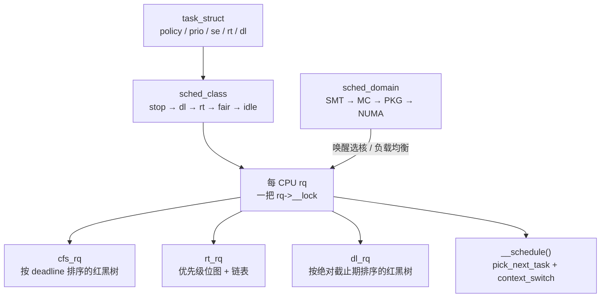
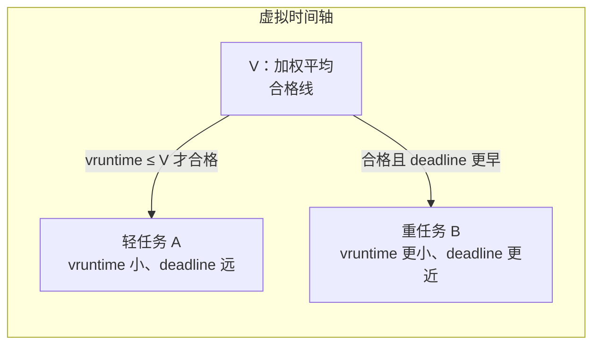

# Linux 调度器子系统：面试复习

> 源码基准：本项目 [Linux 6.18.52](../../linux/Makefile#L2)。所有源码链接均相对于本文。
>
> 学习主线：**每颗 CPU 一条运行队列；任务挂在某个调度类上；公平类用 EEVDF 在本队列里挑人；唤醒和负载均衡决定任务去哪颗 CPU；真正换人只发生在 `__schedule()`。**
>
> 下文按 x86、非 RT、数据中心常见配置来记。[x86_64 defconfig](../../linux/arch/x86/configs/x86_64_defconfig#L5) 打开 `CONFIG_NO_HZ`、`CONFIG_PREEMPT_VOLUNTARY`、`CONFIG_CGROUP_SCHED`、`CONFIG_SMP`、`CONFIG_NUMA`、`CONFIG_HZ_1000`。`FAIR_GROUP_SCHED` 默认跟随 `CGROUP_SCHED`，所以 cgroup v2 的 `cpu.weight` 在。`CFS_BANDWIDTH` 上游默认关闭，`cpu.max` 配额要另行打开。`SCHED_SMT` / `SCHED_CLUSTER` / `SCHED_MC` 默认打开。x86 还有 `PREEMPT_DYNAMIC`，启动参数可以改抢占模型，编译期默认仍是自愿抢占。

## 1. 先记住分层

调度器回答四个不同的问题：

| 问题 | 核心对象 | 数据中心上的典型答案 |
| --- | --- | --- |
| 谁可以上 CPU？ | `task_struct` + `sched_class` | 普通任务走 `fair_sched_class` |
| 这颗 CPU 上现在有哪些可运行任务？ | 每 CPU `struct rq` | 里面嵌着 `cfs` / `rt` / `dl` 三条子队列 |
| 公平任务谁先跑、跑多久？ | `struct sched_entity` + `struct cfs_rq` | EEVDF：先合格，再取最早虚拟截止期 |
| 任务该放哪颗 CPU？ | `sched_domain` 层次 | 唤醒走快速选核，周期和 newidle 再拉负载 |



**面试里先把“本 CPU 上挑谁”和“放到哪颗 CPU”拆开。** 红黑树只排本 `cfs_rq` 里的实体；跨 CPU 是 `select_task_rq_fair()` 和 `sched_balance_rq()` 的事。

## 2. 任务、优先级、调度类

### 2.1 一个任务同时带着三套调度实体

[`struct task_struct`](../../linux/include/linux/sched.h#L815) 里和调度直接相关的是：

| 字段 | 作用 |
| --- | --- |
| `__state` | 睡眠状态。`0` 就是 `TASK_RUNNING` |
| `on_rq` | `0` 不在队列；`1` 已入队；`2` 正在迁移 |
| `on_cpu` | 是否正占着某颗 CPU 执行 |
| `prio` / `static_prio` / `normal_prio` / `rt_priority` | 有效优先级、nice 静态优先级、策略优先级、用户态 RT 优先级 |
| `se` / `rt` / `dl` | 公平、实时、deadline 三套实体，任务只使用其中一套 |
| `sched_class` | 当前策略对应的操作表 |
| `sched_task_group` | 所属 cgroup 任务组 |

`on_rq` 的两个非零值见 [`TASK_ON_RQ_QUEUED`](../../linux/kernel/sched/sched.h#L97) 和 `TASK_ON_RQ_MIGRATING`。迁移窗口里任务仍算“在队列上”，但还不能被目标 CPU 选中。

用户可见策略在 [uapi](../../linux/include/uapi/linux/sched.h#L114)：

| policy | 调度类 | 记什么 |
| --- | --- | --- |
| `SCHED_NORMAL` / `SCHED_BATCH` / `SCHED_IDLE` | fair | 权重不同。`SCHED_IDLE` 的权重是常数 3 |
| `SCHED_FIFO` / `SCHED_RR` | rt | FIFO 不轮转；RR 用时间片 |
| `SCHED_DEADLINE` | dl | runtime / deadline / period |
| `SCHED_EXT` | ext | BPF 调度器。默认没接管公平任务 |

`SCHED_BATCH` 和 `SCHED_IDLE` 不是独立调度类，它们仍进 `fair_sched_class`。

### 2.2 数字越小，优先级越高

[`MAX_RT_PRIO = 100`](../../linux/include/linux/sched/prio.h#L16)，`MAX_PRIO = 140`，`DEFAULT_PRIO = 120`。nice \([-20, 19]\) 映射到 `static_prio` \([100, 139]\)，nice 0 就是 120。用户态 RT 优先级 1–99 会反过来填进内核 `prio` 0–98 这一段。

nice 每差 1，CPU 份额大约差 10%。权重表相邻项大约是 1.25 倍，nice 0 的权重是 1024，见 [`sched_prio_to_weight[]`](../../linux/kernel/sched/core.c#L10354)。公平类入队时用这张表填 `se.load`，见 [`set_load_weight()`](../../linux/kernel/sched/core.c#L1448)。

### 2.3 调度类是一张按优先级排好的函数表

[`struct sched_class`](../../linux/kernel/sched/sched.h#L2413) 把入队、出队、挑选、唤醒抢占、选 CPU、tick 都做成回调。实例用链接脚本排进独立段，地址从低到高是：

```text
stop → dl → rt → fair → ext → idle
```

见 [vmlinux.lds.h](../../linux/include/asm-generic/vmlinux.lds.h#L138)。`for_each_active_class()` 从高地址类走向低地址类，所以挑选时先问 stop，最后才是 idle。全是公平任务时有一条快路径：直接调 `pick_next_task_fair()`，见 [`__pick_next_task()`](../../linux/kernel/sched/core.c#L5973)。

公平类这张表的热回调是：`enqueue_task_fair`、`pick_next_task_fair`、`select_task_rq_fair`、`check_preempt_wakeup_fair`、`task_tick_fair`，见 [`DEFINE_SCHED_CLASS(fair)`](../../linux/kernel/sched/fair.c#L14095)。

## 3. 每 CPU 运行队列

[`struct rq`](../../linux/kernel/sched/sched.h#L1120) 是调度器的中心对象，每 CPU 一份，用 `rq->__lock` 保护。要同时锁多条队列，必须按 `&runqueue` 地址升序加锁。

```text
rq
├── cfs          公平子队列，红黑树 tasks_timeline
├── rt           实时子队列，位图 + 每优先级一条链表
├── dl           deadline 子队列，红黑树按绝对截止期
├── fair_server  嵌在这条 rq 上的 deadline 服务器，用来给公平任务留带宽
├── curr         正在执行的任务
├── donor        调度上选中的任务；没有 proxy-exec 时和 curr 是同一份
├── idle / stop  本 CPU 的 idle 线程和 stop 线程
├── clock / clock_task / clock_pelt
└── nr_running
```

公平子队列 [`struct cfs_rq`](../../linux/kernel/sched/sched.h#L676) 里面试要记住的是：

| 字段 | 作用 |
| --- | --- |
| `load` | 队列上实体权重之和 |
| `nr_queued` | 本层排队实体数 |
| `tasks_timeline` | 按虚拟截止期排序的增强红黑树 |
| `curr` | 本层正在跑的实体。它在跑的时候不在树上 |
| `sum_w_vruntime` / `sum_weight` | 用来算加权平均虚拟时间 |
| `avg` | PELT 负荷：`load_avg` / `runnable_avg` / `util_avg` |

组调度打开时，一个任务组在每颗 CPU 上各有一个 `sched_entity` 和一条自己的 `cfs_rq`。任务的 `se->cfs_rq` 是它挂上去的队列，组实体的 `se->my_q` 是它拥有的那条队列，见 [`struct sched_entity`](../../linux/include/linux/sched.h#L570)。

## 4. 公平类：EEVDF

公平类的名字还叫 CFS，挑选算法已经是 **EEVDF**（Earliest Eligible Virtual Deadline First）。旧的“取 `vruntime` 最小的最左节点”不再成立。树的排序键是虚拟截止期，见 [`entity_before()`](../../linux/kernel/sched/fair.c#L582)。

### 4.1 权重把墙上时间变成虚拟时间

任务每跑过一段 `delta_exec`，虚拟时间增加：

```text
vruntime += delta_exec * 1024 / weight
```

实现是 [`calc_delta_fair()`](../../linux/kernel/sched/fair.c#L290)：权重正好是 `NICE_0_LOAD`（1024）时不做缩放；更重的任务虚拟时间走得更慢，于是同样的虚拟进度对应更多墙上时间。记账发生在 [`update_curr()`](../../linux/kernel/sched/fair.c#L1286)。

请求长度 `slice` 默认来自 `sysctl_sched_base_slice`，初值 0.70 ms，再乘 `1 + ilog2(min(在线 CPU 数, 8))`，见 [fair.c 初值](../../linux/kernel/sched/fair.c#L79) 和 [`get_update_sysctl_factor()`](../../linux/kernel/sched/fair.c#L192)。8 核及以上机器上默认请求约 2.8 ms。`sched_setattr()` 还可以给单个任务设自定义 slice，范围夹在 0.1 ms 到 100 ms。

虚拟截止期：

```text
deadline = vruntime + calc_delta_fair(slice, se)
         = vruntime + slice * 1024 / weight
```

权重越大，同样的墙上请求对应的虚拟截止期越近。见 [`update_deadline()`](../../linux/kernel/sched/fair.c#L1117)。

### 4.2 合格，再比截止期

EEVDF 用 lag 表示“欠了这块实体多少服务”：

```text
lag_i = weight_i * (V - vruntime_i)
```

`V` 是队列上实体 `vruntime` 的加权平均，由 [`avg_vruntime()`](../../linux/kernel/sched/fair.c#L715) 维护。`lag >= 0` 等价于 `vruntime <= V`，这时实体才合格，见 [`vruntime_eligible()`](../../linux/kernel/sched/fair.c#L802) 上面的注释。

挑选规则只有两条，见 [`pick_eevdf()`](../../linux/kernel/sched/fair.c#L1015)：

1. 实体必须合格，也就是还欠它服务。
2. 合格者里取虚拟截止期最早的。

红黑树按 `deadline` 排序，节点上还缓存子树最小 `vruntime`（`se->min_vruntime`）。搜索时如果左子树的最小 `vruntime` 都不合格，整棵左子树可以剪掉，所以是 \(O(\log n)\)。

```text
pick_eevdf(cfs_rq):
    队列里只有 1 个实体 → 直接返回它
    next buddy 合格 → 返回 buddy          # 公平性不变，只影响延迟
    当前实体仍合格，且还在保护片内 → 留住当前
    最左节点合格 → 它的 deadline 最早，返回它
    否则从根向下：
        左子树存在合格实体 → 走进左子树
        当前节点合格 → 返回它
        否则走进右子树
    若当前实体比找到的 best 更早 → 留住当前
```

正在运行的实体不在树上。[`set_next_entity()`](../../linux/kernel/sched/fair.c#L5632) 把它摘下来并设保护片；[`put_prev_entity()`](../../linux/kernel/sched/fair.c#L5700) 再插回去。组调度时 `pick_task_fair()` 从根 `cfs_rq` 一层层往下挑，直到挑到任务，见 [fair.c](../../linux/kernel/sched/fair.c#L9104)。



上图里 B 更重，虚拟时间涨得慢，截止期也更近，所以它拿到更多墙上时间。A 一旦 `vruntime` 超过 `V` 就暂时不合格，哪怕它的截止期看起来很早也不会被选中。这就是 EEVDF 和“只看最左 vruntime”的差别。

### 4.3 入睡时的 lag 要带回来

[`place_entity()`](../../linux/kernel/sched/fair.c#L5305) 在入队前放位置：

```text
vruntime = V - lag
deadline = vruntime + vslice
```

`PLACE_LAG` 默认打开，睡眠前记在 `se->vlag` 里的欠账会在唤醒时加回去，并按新队列权重放大，避免一入队就把平均时间拉偏。新 `fork` 出来的任务走 `ENQUEUE_INITIAL`，默认只给半片 slice，让它缓进竞争。这些开关在 [features.h](../../linux/kernel/sched/features.h#L7)。

出队时 [`update_entity_lag()`](../../linux/kernel/sched/fair.c#L778) 先把 lag 记下来。lag 被夹在大约一片 slice 的范围内，避免加入、移除实体把 `V` 甩开以后 lag 无限变大，见 [`entity_lag()`](../../linux/kernel/sched/fair.c#L767)。

### 4.4 时间片用完只是请求重新调度

`vruntime` 走到 `deadline` 时，`update_deadline()` 把截止期再往后推一片，并返回 true。队列里不止一个实体、并且保护片已经走完或请求已经用尽时，[`update_curr()`](../../linux/kernel/sched/fair.c#L1326) 调用 `resched_curr_lazy()`。

`RUN_TO_PARITY` 默认打开：当前任务至少跑到 0-lag 点或吃完这片请求，才让同级唤醒抢占，见 [`set_protect_slice()`](../../linux/kernel/sched/fair.c#L963)。`PREEMPT_SHORT` 允许更短 slice 的唤醒者取消这个保护。

tick 本身不重新计算截止期逻辑，它只是周期性调用 `update_curr()`。路径是 [`sched_tick()`](../../linux/kernel/sched/core.c#L5597) → [`task_tick_fair()`](../../linux/kernel/sched/fair.c#L13588) → [`entity_tick()`](../../linux/kernel/sched/fair.c#L5724)。`HZ = 1000` 时大约每 1 ms 来一次；NO_HZ 空闲 CPU 可以停掉这个 tick。

### 4.5 负 lag 的睡眠可以延迟出队

`DELAY_DEQUEUE` 和 `DELAY_ZERO` 默认打开。任务要睡，但此时还不合格（欠的是别人，自己 lag 为负）时，[`dequeue_entity()`](../../linux/kernel/sched/fair.c#L5550) 先不把它拿下树，只打上 `sched_delayed`。它继续留在竞争里把负 lag 烧掉；真被挑中或者被唤醒时再完成出队。`DELAY_ZERO` 会在这时把正的 `vlag` 削成 0，避免延迟出队的任务醒来后还拿着额外欠账。

**面试里如果被问“睡眠任务还在运行队列上吗”：** 普通合格任务会马上出队；负 lag 且打开了 `DELAY_DEQUEUE` 的公平任务会暂时留在树上，`on_rq` 仍为 1，但 `sched_delayed` 使它不算 runnable 负荷。

## 5. 睡眠和唤醒

### 5.1 谁来调用 schedule

[`__schedule()`](../../linux/kernel/sched/core.c#L6817) 前面的注释把入口分成三类：

1. 任务自己阻塞：mutex、信号量、等待队列，最终 `schedule()`。
2. 已置位 `TIF_NEED_RESCHED`，在中断返回或返回用户态时检查。tick 和更高优先级唤醒都会置这个标志。
3. 唤醒本身只是入队。新任务如果该抢占，唤醒路径置标志，真正切换留到最近的抢占点。

自愿抢占下，内核态要碰到 `cond_resched()`、显式 `schedule()`，或者系统调用、中断返回用户态，才会切走。完全抢占模型还会在 `preempt_enable()` 以及中断返回可抢占上下文时进入调度。标志只是通知，切换都进 `__schedule()`。

`__schedule()` 的主干：

```text
关中断，锁本 CPU rq，更新 rq clock
若是主动睡眠且 __state != TASK_RUNNING：
    有信号则改回 TASK_RUNNING
    否则 block_task()，记一次自愿切换
pick_next_task()：按调度类从高到低挑
若 next != prev：
    记 nr_switches，切换 rq->curr
    context_switch()：地址空间 + 寄存器和栈
```

主动睡眠和抢占的差别在 `switch_count`：阻塞记 `nvcsw`，抢占记 `nivcsw`。`try_to_wake_up()` 和 `__schedule()` 用 `pi_lock`、`rq->lock` 和内存屏障配对接住“刚要睡着又被唤醒”的竞争，见 [try_to_wake_up()](../../linux/kernel/sched/core.c#L4159) 里的注释。

### 5.2 唤醒

`try_to_wake_up(p, state)` 只有 `p->__state` 和传入的 `state` 有交集才成功。成功后：

```text
已经 on_rq（含 sched_delayed）→ ttwu_runnable()，就地唤醒
否则标成 TASK_WAKING
select_task_rq() 选 CPU
TTWU_QUEUE 打开时，远端唤醒挂到目标 CPU 的唤醒链表，用调度 IPI 入队
本 CPU 则直接 enqueue + check_preempt
```

非 RT 内核里 `TTWU_QUEUE` 默认打开，见 [features.h](../../linux/kernel/sched/features.h#L82)。目的是少去抢远端 `rq->lock`。

公平类唤醒抢占在 [`check_preempt_wakeup_fair()`](../../linux/kernel/sched/fair.c#L8970)。空闲任务被普通任务唤醒会强制重调度；同级任务则先看保护片，再让 `pick_eevdf()` 决定新来的是不是更该跑。`resched_curr()` 在本 CPU 上置 `TIF_NEED_RESCHED`，在远端 CPU 上发 reschedule IPI，见 [core.c](../../linux/kernel/sched/core.c#L1113)。

## 6. 选哪颗 CPU

### 6.1 调度域

x86 的域从底向上是 SMT、可选的 CLUSTER、MC、PKG；包内还有 NUMA 时，PKG 域让给按距离建出来的 NUMA 域，见 [x86_topology](../../linux/arch/x86/kernel/smpboot.c#L481)。

[`sd_init()`](../../linux/kernel/sched/topology.c#L1624) 给每一层填上行为标志。默认有 `SD_BALANCE_NEWIDLE`、`SD_BALANCE_EXEC`、`SD_BALANCE_FORK`、`SD_WAKE_AFFINE`，**没有** `SD_BALANCE_WAKE`。共享容量的 SMT 层不平衡阈值是 110%，共享 LLC 的层是 117%。跨过 `node_reclaim_distance` 的远 NUMA 域会去掉 exec/fork 均衡和唤醒亲和。

```text
CPU0  CPU1    CPU2  CPU3
 └──SMT──┘    └──SMT──┘     共享执行资源，SD_SHARE_CPUCAPACITY
 └────── MC / LLC ──────┘   共享最后一级缓存
 └──────── PKG / NUMA ─────┘
```

### 6.2 唤醒走快速路径

[`select_task_rq_fair()`](../../linux/kernel/sched/fair.c#L8733) 分两种：

| 场景 | 路径 |
| --- | --- |
| 普通唤醒 `WF_TTWU` | 默认同 LLC。不“醒得很宽”且唤醒者 CPU 在亲和掩码里时，`wake_affine` 在 prev CPU 和当前 CPU 之间选，然后 `select_idle_sibling()` 在 LLC 里找空闲核 |
| `fork` / `exec` | 域上有 `SD_BALANCE_FORK` / `SD_BALANCE_EXEC`，走慢路径，在域里找最空的组、最空的 CPU |

`WF_SYNC` 表示唤醒者马上要睡，可以把被唤醒者拉到当前 CPU。`wake_wide()` 用来避免一对多唤醒把所有任务都堆到唤醒者所在的 LLC。

缓存热度用 `sysctl_sched_migration_cost`，默认 0.5 ms，见 [fair.c](../../linux/kernel/sched/fair.c#L82)。刚运行过的任务不容易被均衡拉走。

### 6.3 两条负载均衡

| 时机 | 入口 | 行为 |
| --- | --- | --- |
| 周期 | `sched_tick()` → [`sched_balance_trigger()`](../../linux/kernel/sched/fair.c#L13257) | `jiffies >= rq->next_balance` 时抬 `SCHED_SOFTIRQ` |
| 即将空闲 | `pick_next_task_fair()` 没挑到人 | [`sched_balance_newidle()`](../../linux/kernel/sched/fair.c#L13082) 立刻从别的 CPU 拉 |

软中断处理函数是 [`sched_balance_softirq()`](../../linux/kernel/sched/fair.c#L13234)。它先帮停了 tick 的空闲 CPU 做 NO_HZ 均衡，再做本 CPU 的域均衡。

[`sched_balance_rq()`](../../linux/kernel/sched/fair.c#L12032) 的步骤可以记成：

```text
should_we_balance?          本 CPU 是不是这个域里负责拉的那个
找最忙的 sched_group
找组里最忙的 rq
忙队列上多于 1 个任务时，按负荷把任务拉过来
迁不动（全被亲和钉死）则下次再试，并拉长 balance_interval
```

比较的负荷来自 PELT，不是就绪队列长度。

### 6.4 PELT：用衰减历史估计负荷

[`struct sched_avg`](../../linux/include/linux/sched.h#L505) 把历史切成约 1 ms（1024 µs）一段，几何衰减，\(y^{32} = 0.5\)。大约 32 ms 前的贡献只剩一半，见 [pelt.c](../../linux/kernel/sched/pelt.c#L168)。

| 信号 | 含义 | 谁在用 |
| --- | --- | --- |
| `load_avg` | 可运行时间比例 × 权重 | 负载均衡比忙闲 |
| `runnable_avg` | 可运行时间比例 × 1024 | 排队程度 |
| `util_avg` | 真正在 CPU 上跑的时间比例 × 1024 | 选核是否塞得下、cpufreq schedutil |
| `util_est` | 对 `util_avg` 的估计。上升立刻采纳，下降用 1/4 新样本的 EWMA | 避免睡眠把利用率打得过低 |

利用率上升不平滑、下降才平滑，见 [`util_est_update()`](../../linux/kernel/sched/fair.c#L5042)。新任务的 `util_avg` 按当前队列剩余容量逐次减半来猜，避免一串新任务把利用率加爆，见 [`post_init_entity_util_avg()`](../../linux/kernel/sched/fair.c#L1194)。

时钟用 `rq->clock_pelt`。CPU 频率变低时，PELT 时间走得更慢，这样“跑了 1 ms 墙钟”不会被看成“提供了满血 1 ms 的算力”。

## 7. 组调度和带宽

`CONFIG_CGROUP_SCHED` 打开后，cgroup 任务组 [`struct task_group`](../../linux/kernel/sched/sched.h#L472) 在每颗 CPU 上有自己的 `sched_entity` 和 `cfs_rq`。入队从任务的 `se` 顺着 `parent` 往上走，每一层都 `enqueue_entity()`，见 [`enqueue_task_fair()`](../../linux/kernel/sched/fair.c#L7080)。

```text
根 cfs_rq
└── 组 A 的 se（权重来自 cpu.weight）
    └── 组 A 的 cfs_rq
        ├── 任务 t1 的 se
        └── 任务 t2 的 se
```

cgroup v2 的 `cpu.weight` 写成组的 `shares`，再变成组实体的 `load.weight`，见 [`cpu_weight_write_u64()`](../../linux/kernel/sched/core.c#L10140)。组之间先按权重分 CPU，组内再按任务的 nice 分。所以一个 nice 0 的任务如果待在权重很小的组里，拿到的 CPU 仍然很少。

`cpu.max` 依赖 `CONFIG_CFS_BANDWIDTH`（上游 defconfig 默认关，云上配额功能要打开）。组有一段周期和配额；每条 `cfs_rq` 本地先领一片，默认 5 ms，见 [`sysctl_sched_cfs_bandwidth_slice`](../../linux/kernel/sched/fair.c#L125)。本地额度用尽且全局池也没有时，[`throttle_cfs_rq()`](../../linux/kernel/sched/fair.c#L6141) 把这层从树上摘掉，周期定时器到了再放回来。限流期间 PELT 时钟单独记账，避免“被限流”被误记成“任务不忙”。

## 8. 实时、deadline，以及公平服务器

这三套都在非 RT 内核里。非 RT 只是说内核抢占模型不是 `PREEMPT_RT`，不是说没有 `SCHED_FIFO`。

### 8.1 SCHED_FIFO / SCHED_RR

[`struct rt_rq`](../../linux/kernel/sched/sched.h#L827) 用 [`rt_prio_array`](../../linux/kernel/sched/sched.h#L309)：一张优先级位图，每个优先级一条链表。挑选就是位图里最高优先级队列的第一个，见 [`pick_task_rt()`](../../linux/kernel/sched/rt.c#L1704)。

`SCHED_FIFO` 没有时间片，同优先级后来者排在队尾，直到它阻塞、yield 或被更高优先级抢占。`SCHED_RR` 的时间片是 [`RR_TIMESLICE`](../../linux/include/linux/sched/rt.h#L84)，`HZ = 1000` 时是 100 个 jiffies，也就是 100 ms。用完后若同级队列里还有别人，就移到队尾并 `resched_curr()`，见 [`task_tick_rt()`](../../linux/kernel/sched/rt.c#L2517)。

实时任务默认每 1 s 最多跑 0.95 s（`sched_rt_runtime` / `sched_rt_period`，单位微秒），见 [rt.c](../../linux/kernel/sched/rt.c#L18)。超限后这颗 CPU 上的 RT 被限流，把时间还给普通任务。

多 CPU 上，RT 用 push/pull：当前 CPU 上有更高优先级 RT 时，把可迁移的低优先级 RT 推走；有 CPU 降优先级时，再把别处排队的 RT 拉过来。非 RT 内核里 `RT_PUSH_IPI` 默认关。

### 8.2 SCHED_DEADLINE

[`struct sched_dl_entity`](../../linux/include/linux/sched.h#L639) 的三个参数：

| 字段 | 含义 |
| --- | --- |
| `dl_runtime` | 每个周期最多跑多久 |
| `dl_deadline` | 这一轮的相对截止期 |
| `dl_period` | 两轮释放之间的间隔 |

运行时 `runtime` 递减，`deadline` 是绝对时间。用尽则 `dl_throttled`，等到 `dl_timer` 按 CBS 补回 runtime 并后推 deadline。队列是按绝对截止期排序的红黑树，选最左节点，见 [`pick_next_dl_entity()`](../../linux/kernel/sched/deadline.c#L2556)。

准入在 root domain 的 `dl_bw` 上做：这条独占 CPU 集合里，所有 deadline 任务的 `runtime/period` 之和不能超过容量。这是接纳控制，不是跑起来再限流。

### 8.3 每 CPU 一个 fair_server

每条 `rq` 嵌着 `fair_server`，初始化成 deferrable 的 deadline 服务器：runtime 50 ms，period 1000 ms，见 [`sched_init_dl_servers()`](../../linux/kernel/sched/deadline.c#L1825)。第一条公平任务入队时 `dl_server_start()`，公平任务全部离开时停掉。

DL 类挑到这个服务器时，不运行服务器自己，而是回调 [`fair_server_pick_task()`](../../linux/kernel/sched/fair.c#L9228) 去挑一个公平任务。公平任务消耗的时间记到这台服务器上，见 [`update_curr()`](../../linux/kernel/sched/fair.c#L1311)。这样普通任务在 deadline 调度里占有固定带宽，不会被 `SCHED_FIFO` 完全饿死。RT 的 95% 上限和这 5% 的公平服务器是两套并存的保护。

## 9. 换人的时候发生什么

[`context_switch()`](../../linux/kernel/sched/core.c#L5293) 做两件事：

```text
next 是内核线程（next->mm == NULL）：
    借用 prev->active_mm，lazy TLB，不切页表
next 是用户任务：
    switch_mm_irqs_off() 切换地址空间
然后 switch_to() 切换寄存器和内核栈
返回到 next 之后，由 finish_task_switch() 收拾 prev
```

调度器选中的是 `rq->donor`。没有 proxy-exec 时 `donor` 和 `curr` 是同一指针。`nr_switches` 统计的是这条 `rq` 上发生过的切换次数。

## 10. 面试时怎么把一条路径说完

**普通任务被唤醒并抢占当前任务：**

```text
wake_up()
  try_to_wake_up()
    匹配 __state，标 TASK_WAKING
    select_task_rq_fair()          # LLC 内找空闲兄弟核
    enqueue_task_fair()
      place_entity()                # vruntime = V - lag，重算 deadline
      插入 cfs 红黑树，组调度则向上传播
    check_preempt_wakeup_fair()
      新任务更该跑 → resched_curr()
返回用户态或抢占点
  __schedule()
    pick_eevdf() 选出它
    set_next_entity() 把它移出树，设保护片
    context_switch()
```

**CPU 密集型任务在本核上轮转：**

```text
sched_tick()
  update_curr()：vruntime 增加
  vruntime 到达 deadline → 推下一段 deadline，resched_curr_lazy()
下次 __schedule()
  put_prev 把当前插回树
  pick_eevdf() 在合格实体里取最早 deadline
```

**这颗 CPU 快没任务了：**

```text
pick_next_task_fair() 返回空
  sched_balance_newidle()
    从本域最忙的 rq 拉公平任务
拉到了就重新 pick；拉不到就运行 idle 线程
```

可以主动说清的边界：

- 公平类的“公平”是虚拟时间公平，权重高的任务得到更多墙上时间。
- 红黑树按虚拟截止期排序，合格性用子树最小 `vruntime` 剪枝。正在跑的实体不在树上。
- 唤醒默认不走全系统负载均衡，只在共享缓存的域里找空闲 CPU。周期均衡和 newidle 均衡才搬任务。
- `cpu.weight` 分的是组之间的份额；`cpu.max` 才是硬配额，而且要打开 `CFS_BANDWIDTH`。
- `SCHED_FIFO` 能抢占所有公平任务，但受 RT 带宽和 `fair_server` 约束，不能无限占用 CPU。
