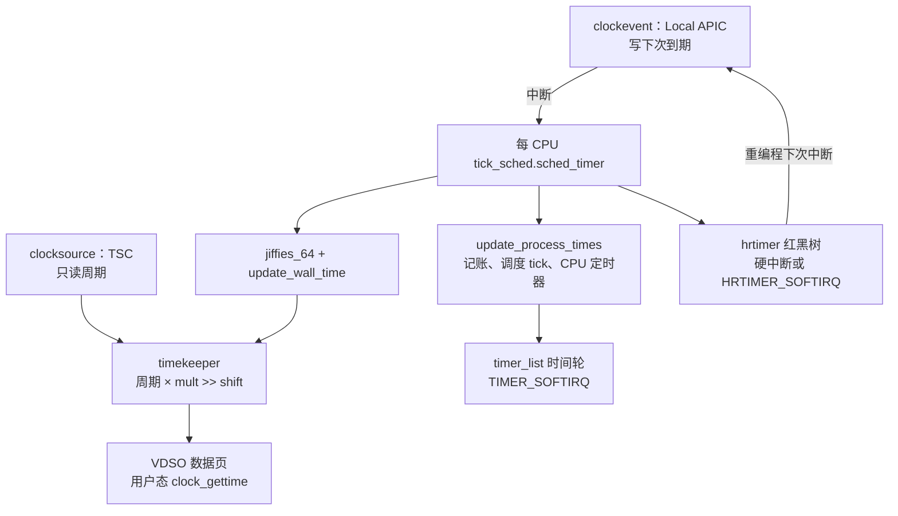

# Linux 时间子系统：面试复习

> 源码基准：本项目 [Linux 6.18.52](../../linux/Makefile#L2)。所有源码链接均相对于本文。
>
> 学习主线：**clocksource 提供自由递增的周期，clockevent 到点打断 CPU，timekeeper 把周期换成纳秒并维护多种时钟，tick 沿这条时间轴做系统记账，timer_list 和 hrtimer 才保存“到点要做的事”。**
>
> 下文按 x86、非 RT、数据中心常见配置来记：[x86_64 defconfig](../../linux/arch/x86/configs/x86_64_defconfig#L5) 打开 `CONFIG_NO_HZ`、`CONFIG_HIGH_RES_TIMERS`、`CONFIG_HZ_1000`。`CONFIG_NO_HZ` 对应的默认选项是 idle dyntick（`NO_HZ_IDLE`）。`HZ = 1000` 时一个 tick 是 1 ms，见 [`TICK_NSEC`](../../linux/include/vdso/jiffies.h#L9)。

## 1. 先记住分层

时间子系统回答三个不同的问题，对应三层对象：

| 问题 | 核心对象 | x86 数据中心上的典型实现 |
| --- | --- | --- |
| 现在过去了多少周期？ | `struct clocksource` | TSC，`read_tsc()` |
| 何时打断这颗 CPU？ | `struct clock_event_device` | Local APIC，优先 TSC-deadline |
| 这些周期等于多少纳秒、墙上时间是多少？ | `struct timekeeper` | 全局一份核心 timekeeper |
| 每个 tick 要给系统和当前任务记什么账？ | 每 CPU `struct tick_sched` | 用一个 hard hrtimer 模拟 1 ms tick |
| 内核里谁在等一个到期点？ | `struct timer_list` / `struct hrtimer` | jiffies 时间轮 / 纳秒红黑树 |



**面试里先把“读时间”和“到点回调”拆开。** TSC 自己不会在 10 ms 后调用某个函数；到期回调来自 APIC 定时器中断，再由 tick / hrtimer / 时间轮分发。

## 2. 两种硬件抽象

### 2.1 clocksource：自由运行计数器

[`struct clocksource`](../../linux/include/linux/clocksource.h#L101) 的热路径只有读周期，以及把周期差换成纳秒：

```text
ns = (delta * mult) >> shift
```

`mult` / `shift` 把除法变成乘法和移位，见 [`clocksource_cyc2ns()`](../../linux/include/linux/clocksource.h#L212)。绝对周期容易溢出，这个换算只用于相对 delta。

| 字段 | 作用 |
| --- | --- |
| `read` | 读当前周期 |
| `mask` | 计数器位宽，用于回绕减法 |
| `mult` / `shift` | 周期到纳秒的缩放 |
| `rating` | 越大越优先。300–399 是期望使用的时钟源 |
| `max_idle_ns` | 两次读取之间允许空闲的最长时间，NO_HZ 用它限制时间维护 CPU 睡多久 |
| `flags` | 是否连续、是否必须校验、能否做高精度 |

x86 启动时先注册 `tsc-early`（rating 299），校验通过后再换成 `tsc`（rating 300）。`tsc` 带 `CLOCK_SOURCE_IS_CONTINUOUS`、`CLOCK_SOURCE_VALID_FOR_HRES`、`CLOCK_SOURCE_MUST_VERIFY`、`CLOCK_SOURCE_VERIFY_PERCPU`，见 [clocksource_tsc](../../linux/arch/x86/kernel/tsc.c#L1189)。

oneshot / 高精度模式下，[`clocksource_find_best()`](../../linux/kernel/time/clocksource.c#L1002) 只在带 `CLOCK_SOURCE_VALID_FOR_HRES` 的时钟源里选 rating 最高的。用户用 `clocksource=` 指定的名字如果还不能做高精度，切换会被推迟。

x86 打开了 [clocksource watchdog](../../linux/arch/x86/Kconfig#L157)。看门狗用另一只时钟（常见是 HPET 或 ACPI PM）周期比较 TSC。偏差超过两边的 `uncertainty_margin` 之和，就把该时钟源标成 unstable，rating 降到 0，再重新选择，见 [偏差判断](../../linux/kernel/time/clocksource.c#L515)。TSC 被标不稳定时还会拆掉基于它的稳定 `sched_clock`，见 [`tsc_cs_mark_unstable()`](../../linux/arch/x86/kernel/tsc.c#L1137)。

### 2.2 clockevent：可编程的到期设备

[`struct clock_event_device`](../../linux/include/linux/clockchips.h#L100) 不负责“现在几点”，它负责“过多久产生一次中断”。框架填 `event_handler`，驱动实现 `set_next_event`。

现代服务器 CPU 有 `TSC_DEADLINE_TIMER` 时，每 CPU 设备名叫 `lapic-deadline`，只有 oneshot：把 `rdtsc() + delta * TSC_DIVISOR` 写入 `MSR_IA32_TSC_DEADLINE`，见 [`lapic_next_deadline()`](../../linux/arch/x86/kernel/apic/apic.c#L420)。没有该特性时走传统 APIC 周期/单次模式，向 `APIC_TMICT` 写计数值，见 [`lapic_next_event()`](../../linux/arch/x86/kernel/apic/apic.c#L413)。

`X86_FEATURE_ARAT`（APIC 定时器在深 C-state 仍运行）会去掉 `CLOCK_EVT_FEAT_C3STOP`，并把 rating 提到 150，使本地 APIC 优于 per-CPU HPET，见 [`setup_APIC_timer()`](../../linux/arch/x86/kernel/apic/apic.c#L572)。没有 ARAT 时，深睡眠可能停掉本地定时器，需要广播设备把 CPU 唤醒。

中断入口是 [`sysvec_apic_timer_interrupt()`](../../linux/arch/x86/kernel/apic/apic.c#L1052)：EOI 之后调用本 CPU `lapic_events.event_handler`。高精度启用后，这个 handler 是 [`hrtimer_interrupt`](../../linux/kernel/time/tick-oneshot.c#L126)。

## 3. timekeeper：周期如何变成时间

### 3.1 读路径用的缓存

[`struct tk_read_base`](../../linux/include/linux/timekeeper_internal.h#L50) 把 clocksource 的热字段拷出来，和 seqcount 放在同一条 cache line。[`struct timekeeper`](../../linux/include/linux/timekeeper_internal.h#L140) 里有两份：

| 读出基址 | 服务的时钟 | NTP 是否修正倍率 |
| --- | --- | --- |
| `tkr_mono` | `CLOCK_MONOTONIC`，并借偏移得到 REALTIME / BOOTTIME / TAI | 会。`timekeeping_adjust()` 改 `tkr_mono.mult` |
| `tkr_raw` | `CLOCK_MONOTONIC_RAW` | 保持时钟源原始倍率 |

读一次单调时间的公式在 [`timekeeping_cycles_to_ns()`](../../linux/kernel/time/timekeeping.c#L378)：

```text
delta = (cycles - cycle_last) & mask
ns    = (delta * mult + xtime_nsec) >> shift
返回值 = base + ns          # ktime_get()
```

`cycle_last` 是上次推进 timekeeper 时的周期。`xtime_nsec` 是还没进位成整纳秒的小数部分，已经按 `shift` 左移。`base` 是上次更新时的单调时间起点。

[`ktime_get()`](../../linux/kernel/time/timekeeping.c#L814) 用 `tk_core.seq` 做 seqcount：更新方在写，读方重试。NMI 不能等这把锁，所以另有一份 latch 双缓冲。[`ktime_get_mono_fast_ns()`](../../linux/kernel/time/timekeeping.c#L490) 读它，最坏情况差几个纳秒。

`ktime_t` 在 64 位上就是有符号纳秒，见 [types.h](../../linux/include/linux/types.h#L126)。

### 3.2 几种时钟差在偏移，不差在硬件

硬件还是同一只 TSC。区别是 timekeeper 上叠加哪一个偏移。

| clockid | 含义 | 会不会被 settimeofday 拉开 | 是否包含挂起时间 | 是否吃 NTP |
| --- | --- | --- | --- | --- |
| `CLOCK_REALTIME` | 墙上时间，`xtime_sec` + 亚秒 | 会跳 | 恢复后补上睡眠 | 会 |
| `CLOCK_MONOTONIC` | 启动后单调递增，超时首选 | 不跳 | 不含挂起 | 会 |
| `CLOCK_MONOTONIC_RAW` | 同一时钟源、不做 NTP 调速 | 不跳 | 不含挂起 | 不会 |
| `CLOCK_BOOTTIME` | 单调时间加上挂起 | 不跳 | 含挂起 | 会 |
| `CLOCK_TAI` | 国际原子时，闰秒放在偏移里 | 随 REALTIME 和闰秒偏移变 | 含与 REALTIME 相同的睡眠补偿 | 会 |
| `*_COARSE` | 上次 tick 更新留下的整值，不再读 TSC | 与对应精细时钟一致 | 与对应精细时钟一致 | 与对应精细时钟一致 |

编号见 [uapi time.h](../../linux/include/uapi/linux/time.h#L49)。`ktime_get_real()` / `ktime_get_boottime()` / `ktime_get_clocktai()` 都走 [`ktime_get_with_offset()`](../../linux/kernel/time/timekeeping.c#L857)，在单调 `base` 上加 `offs_real` / `offs_boot` / `offs_tai`。

`wall_to_monotonic` 是“墙上时间加上它得到单调时间”。单调时钟从启动附近的 0 起算，所以这个偏移的秒部分通常是负数。注释写明它已经不是 boot time，见 [timekeeper 注释](../../linux/include/linux/timekeeper_internal.h#L101)。

### 3.3 推进发生在影子副本上

更新不直接改读者看到的 `tk_core.timekeeper`。持有 `tk_core.lock` 后改 `shadow_timekeeper`，算完再一次性发布，见 [`timekeeping_update_from_shadow()`](../../linux/kernel/time/timekeeping.c#L708)：

1. `write_seqcount_begin` 挡住读者。
2. 刷新 leap、`ktime` 基数，调用 `update_vsyscall()` 写 VDSO 页。
3. 更新 NMI 用的 fast timekeeper。
4. 把影子副本拷回正式 timekeeper，再 `write_seqcount_end`。

先更新 VDSO、再放行内核读者，是为了避免“用户态已经看到新时间，内核还读到旧 timekeeper”造成时间回退。

[`__timekeeping_advance()`](../../linux/kernel/time/timekeeping.c#L2328) 的步骤：

```text
offset = 当前周期 - cycle_last
若 offset 小于一个 NTP 间隔且本次是普通 tick：直接返回

用 ilog2 找到能一次吃掉的最大 2^shift 个间隔
logarithmic_accumulation()：
    cycle_last += interval << shift
    xtime_nsec += xtime_interval << shift
    满 1 秒则 xtime_sec++，并询问 NTP 是否插入闰秒
    累积 ntp_error

timekeeping_adjust()：按 ntp_error 对 tkr_mono.mult 做 ±1 的微调
发布影子副本
```

NO_HZ 睡了多个 tick 时，按 2 的幂次累加，避免一个间隔一个间隔地循环。入口是 [`update_wall_time()`](../../linux/kernel/time/timekeeping.c#L2400)。

## 4. 一次本地定时器中断做了什么

高精度 + oneshot 是数据中心这条配置的主路径。每 CPU 的调度 tick 本身是一个 `CLOCK_MONOTONIC` 上的 hard hrtimer，回调是 `tick_nohz_handler`，见 [`tick_setup_sched_timer()`](../../linux/kernel/time/tick-sched.c#L1571)。

```text
sysvec_apic_timer_interrupt
  → local_apic_timer_interrupt
  → hrtimer_interrupt                 # 硬中断，关中断
       到期的 HARD hrtimer 就地调用，其中包括 tick_nohz_handler
       到期的 SOFT hrtimer 只 raise HRTIMER_SOFTIRQ
       按下一个到期点重编程 APIC
  → tick_nohz_handler
       tick_sched_do_timer
         若本 CPU 是 tick_do_timer_cpu：
           tick_do_update_jiffies64 → jiffies_64 += ticks → update_wall_time
       tick_sched_handle
         update_process_times
           account_process_tick      # 当前任务的用户/内核时间
           run_local_timers          # 决定要不要 raise TIMER_SOFTIRQ
           rcu_sched_clock_irq
           irq_work_tick
           sched_tick                # CFS 时间片、负载
           run_posix_cpu_timers      # 进程/线程 CPU 时间定时器
       若 tick 没停：hrtimer_forward(TICK_NSEC) 并 HRTIMER_RESTART
```

源码：[中断入口](../../linux/arch/x86/kernel/apic/apic.c#L1052)、[hrtimer 中断](../../linux/kernel/time/hrtimer.c#L1878)、[tick 回调](../../linux/kernel/time/tick-sched.c#L284)、[谁推进 jiffies](../../linux/kernel/time/tick-sched.c#L206)、[jiffies 与墙钟](../../linux/kernel/time/tick-sched.c#L57)、[进程记账](../../linux/kernel/time/timer.c#L2467)。

全局只有 `tick_do_timer_cpu` 这一颗 CPU 负责推进 `jiffies_64` 和墙钟。其他 CPU 的 tick 仍然给自己的任务记账、跑本地定时器。`jiffies` 与 `jiffies_64` 在 64 位小端上是同一地址的低位视图，初值是 `INITIAL_JIFFIES = -300*HZ`，让回绕问题在启动后不久就能暴露，见 [jiffies.h](../../linux/include/linux/jiffies.h#L85) 与 [定义初值](../../linux/include/linux/jiffies.h#L320)。

周期模式仍存在，handler 是 [`tick_handle_periodic()`](../../linux/kernel/time/tick-common.c#L108)，里面 [`tick_periodic()`](../../linux/kernel/time/tick-common.c#L86) 调用 [`do_timer(1)`](../../linux/kernel/time/timekeeping.c#L2549)。TSC-deadline 设备没有周期模式，主路径记 oneshot 那条。

`sched_skew_tick` 打开时，各 CPU 的 tick 到期点按 CPU 号错开，减轻 `jiffies_lock` 争用，见 [tick 设置](../../linux/kernel/time/tick-sched.c#L1584)。

## 5. 低精度定时器：没有级联的时间轮

`struct timer_list` 以 jiffies 为到期单位，回调在 `TIMER_SOFTIRQ` 里执行，见 [结构](../../linux/include/linux/timer_types.h#L8)、[软中断注册](../../linux/kernel/time/timer.c#L2579)。

### 5.1 轮子怎么分桶

每 CPU 的 [`struct timer_base`](../../linux/kernel/time/timer.c#L250) 有 `WHEEL_SIZE` 个链表和一张 pending 位图。`HZ > 100` 时 9 层，每层 64 个桶，层与层粒度差 8 倍。`HZ = 1000` 时：

| 层 | 粒度 | 大约覆盖 |
| --- | --- | --- |
| 0 | 1 ms | 0–63 ms |
| 1 | 8 ms | 64–511 ms |
| 2 | 64 ms | 0.5 s–4 s |
| … | 每层 ×8 | … |
| 8 | 约 4.6 小时 | 约 1 天–12 天 |

依据是 [timer.c 文件头的 HZ 1000 表](../../linux/kernel/time/timer.c#L103)。

旧时间轮到期时把外层定时器拆到内层，叫级联。现在的轮子**入队时就按距离选层，到期直接从该桶取下**，不再级联。外层把到期时间按该层粒度向上取整，保证不提前触发，见 [`calc_index()`](../../linux/kernel/time/timer.c#L524)。超过最外层容量的定时器被夹到轮子最大值。

因此：近处的网络超时落在第 0 层，精度就是 1 个 jiffy；几分钟后的定时器可能晚一个该层粒度才到期。绝大多数超时在到期前就被取消，这点延迟是换 O(1) 入队和去掉级联的代价。

`NO_HZ` 下每个 CPU 有三份 base，见 [NR_BASES](../../linux/kernel/time/timer.c#L189)：

| base | 谁放进来 | idle 时 |
| --- | --- | --- |
| `BASE_LOCAL` | 本 CPU 普通定时器 | 参与“下次何时醒来” |
| `BASE_GLOBAL` | 允许迁移的定时器 | 可由别的 CPU 代为到期 |
| `BASE_DEF` | `TIMER_DEFERRABLE` | 不把 idle CPU 拉起来 |

### 5.2 标志位决定落在哪、能否挪走

| 标志 | 行为 |
| --- | --- |
| `TIMER_DEFERRABLE` | 系统忙时正常到期；CPU idle 时不专门为它醒来，等下次非可延迟定时器或退出 idle |
| `TIMER_PINNED` | 留在入队的那颗 CPU。`add_timer()` / `mod_timer()` 总是入本 CPU；指定 CPU 用 `add_timer_on()` |
| `TIMER_IRQSAFE` | 回调在关中断下执行，中断里可以 `timer_delete_sync()` 等它结束 |

见 [timer.h 注释](../../linux/include/linux/timer.h#L25)。`flags` 低位还编码 CPU 号。

到期时 [`expire_timers()`](../../linux/kernel/time/timer.c#L1766) 先摘下定时器、记下 `running_timer`，再放开 `base->lock` 调用回调。所以回调里可以再次 `add_timer`，也可以睡眠到别的锁；不能假设还持有 base 锁。`timer_delete_sync()` 看到 `running_timer` 指向自己时会等到回调结束。

`run_local_timers()` 在每个 tick 里无锁看 `next_expiry`，到点才 `raise_softirq(TIMER_SOFTIRQ)`，见 [timer.c](../../linux/kernel/time/timer.c#L2415)。软中断里依次跑 LOCAL、GLOBAL、DEF，并处理定时器迁移的远程到期，见 [`run_timer_softirq()`](../../linux/kernel/time/timer.c#L2400)。

`schedule_timeout()` 在栈上放一个 jiffies 定时器，到期把任务唤醒，然后 `schedule()`，见 [sleep_timeout.c](../../linux/kernel/time/sleep_timeout.c#L61)。它的精度是 jiffy，不是纳秒。

## 6. 高精度定时器

[`struct hrtimer`](../../linux/include/linux/hrtimer_types.h#L39) 的到期时间是 `ktime_t`。每 CPU 一个 [`hrtimer_cpu_base`](../../linux/include/linux/hrtimer_defs.h#L101)，下面 8 棵时间红黑树：MONOTONIC / REALTIME / BOOTTIME / TAI，各有 HARD 和 SOFT 一份，见 [枚举](../../linux/include/linux/hrtimer_defs.h#L56)。

| 模式位 | 含义 |
| --- | --- |
| `HRTIMER_MODE_ABS` / `REL` | 绝对时间，或相对现在 |
| `HRTIMER_MODE_PINNED` | 固定在当前 CPU |
| `HRTIMER_MODE_SOFT` | 回调进 `HRTIMER_SOFTIRQ` |
| `HRTIMER_MODE_HARD` | 回调在 `hrtimer_interrupt` 硬中断里执行 |

见 [hrtimer.h](../../linux/include/linux/hrtimer.h#L26)。非 RT 上，没标 SOFT 的定时器走硬中断。调度 tick 用的是 `HRTIMER_MODE_ABS_HARD`。

`node.expires` 是“可以开始跑”的最晚时间，`_softexpires` 是调用者请求的最早时间。范围定时器允许内核把到期点推迟到这个窗口里，以便合并中断。窗口为 0 时两者相同。

[`hrtimer_interrupt()`](../../linux/kernel/time/hrtimer.c#L1878) 的循环：

```text
更新各 clock base 的 offset（settimeofday / 闰秒后序号变了才刷新）
若 soft 队列已到期：raise HRTIMER_SOFTIRQ，硬中断里不跑它们
跑 HARD 队列：__run_hrtimer 摘下定时器、放锁、调用回调
回调返回 HRTIMER_RESTART 且尚未重新入队：再插回红黑树
计算下一次 expires_next，tick_program_event() 写 APIC
若编程时发现已经过期：最多重试 3 次，再失败就往后推，避免死循环
```

回调同样在放锁之后执行，见 [`__run_hrtimer()`](../../linux/kernel/time/hrtimer.c#L1739)。`hrtimer_active()` 同时看 `state` 和 `base->running`，并用 seqcount 把“在队列里 / 正在跑 / 已经结束”分成三段，避免取消方漏看正在执行的定时器。

`nanosleep`、`hrtimer_sleeper` 的回调只做 `wake_up_process`，见 [`hrtimer_wakeup()`](../../linux/kernel/time/hrtimer.c#L2010)。

## 7. NO_HZ：没有工作时停掉周期 tick

`NO_HZ_IDLE` 在 CPU 进入 idle、并且近期没有必须服务的定时器时停掉周期 tick。下次中断被编程到“下一个非可延迟定时器、下一个 hrtimer、时间维护还能再推迟多久”这几者的最早点。

[`tick_nohz_stop_tick()`](../../linux/kernel/time/tick-sched.c#L970) 里和面试相关的约束：

| 条件 | 结果 |
| --- | --- |
| 下一个定时器距离不超过 1 个 tick | 继续周期 tick |
| RCU、架构、irq_work 或本地 timer 软中断还需要 CPU | 下一个 tick 仍是 1 ms 后 |
| 本 CPU 当前负责 `tick_do_timer_cpu` | 先放弃这个职责，睡眠长度不超过 `clocksource->max_idle_ns` |
| 职责在别的 CPU 上 | 本 CPU 可以睡到下一个真正的定时器 |
| `TIMER_DEFERRABLE` | 不参与这次唤醒计算，也不为它发 IPI |

`max_idle_ns` 来自 [`timekeeping_max_deferment()`](../../linux/kernel/time/timekeeping.c#L1719)。睡太久，`(delta * mult) >> shift` 会溢出，时间会算错。

idle CPU 把职责设成 `TICK_DO_TIMER_NONE` 后，下一颗还在走 tick 的 CPU 在 [`tick_sched_do_timer()`](../../linux/kernel/time/tick-sched.c#L206) 里接手。`jiffies_lock` 保证即使两颗 CPU 同时自荐，`jiffies_64` 也只被串行增加。

`NO_HZ_FULL` 还试图在“CPU 上只有一个任务、且大多在用户态”时停 tick。Kconfig 写明：不传 `nohz_full=` 时行为与 `NO_HZ_IDLE` 相同，而且时间维护那颗 CPU 不放弃 `tick_do_timer_cpu`，见 [Kconfig](../../linux/kernel/time/Kconfig#L118)。停 tick 前还要看依赖位：POSIX 定时器、perf、调度、时钟源不稳定、RCU，见 [`check_tick_dependency()`](../../linux/kernel/time/tick-sched.c#L321)。

定时器迁移是一棵按节点组织的组层次。CPU idle 时把“我这边下一个到期点”上报到父组；还醒着的 CPU 在 `TIMER_SOFTIRQ` 里可以远程到期这些定时器，见 [层次注释](../../linux/kernel/time/timer_migration.c#L20) 与 [`tmigr_handle_remote()` 的调用点](../../linux/kernel/time/timer.c#L2407)。底层组按节点划分，锁争用尽量留在节点内。

## 8. sched_clock 和 VDSO 是两条旁路

### 8.1 sched_clock 不是 ktime_get

[`native_sched_clock()`](../../linux/arch/x86/kernel/tsc.c#L236) 在 TSC 可用时直接 `rdtsc()`，用每 CPU 的 `cyc2ns` 换成纳秒。注释写明：即使 timekeeping 已经把 TSC 标成不稳定，调度时钟仍可能继续用 TSC，因为它要快，并且容忍小误差。没有 TSC 时退回 `(jiffies_64 - INITIAL_JIFFIES) * (NSEC_PER_SEC / HZ)`。

所以：

- 调度、trace、锁等待时间用 `sched_clock()`。
- 墙上时间和 `clock_gettime` 用 timekeeper。
- 两者都读 TSC 时数值接近，但倍率和“TSC 不稳定之后还用不用”可以不同。

`sched_clock()` 会短暂关抢占，因为 `cyc2ns` 是每 CPU 数据，见 [tsc.c](../../linux/arch/x86/kernel/tsc.c#L284)。虚拟化里 KVM、Xen、VMware 可以换成自己的 `paravirt` 调度时钟。

### 8.2 用户态 clock_gettime 多数不进内核

timekeeper 发布时 [`update_vsyscall()`](../../linux/kernel/time/vsyscall.c#L77) 把 `clock_mode`、`mult`、`shift`、`cycle_last` 和各时钟的基准时间写进 VDSO 页。用户态 [`__arch_get_hw_counter()`](../../linux/arch/x86/include/asm/vdso/gettimeofday.h#L238) 在 `VDSO_CLOCKMODE_TSC` 下执行 `rdtsc_ordered()`，再用与内核相同的公式换算，见 [`vdso_calc_ns()`](../../linux/lib/vdso/gettimeofday.c#L43)。

页上的 seqlock 和内核读者一样：更新过程中重试。coarse 时钟连 `rdtsc` 都不做，直接返回上次 tick 留下的值。进程 CPU 时钟、部分辅助时钟等 VDSO 没实现的 id 会回到系统调用。

## 9. 接口最后落在哪

| 调用 | 落到 |
| --- | --- |
| `clock_gettime(CLOCK_REALTIME / MONOTONIC / …)` | VDSO 成功则用户态读 TSC；否则内核 `ktime_get_*` |
| `clock_nanosleep` / `nanosleep` | hrtimer sleeper，到期 `wake_up_process` |
| `timer_create` + `timer_settime`（REALTIME、MONOTONIC、BOOTTIME、TAI） | `k_itimer` 里嵌一个 hrtimer，[`common_hrtimer_arm()`](../../linux/kernel/time/posix-timers.c#L806) |
| `CLOCK_PROCESS_CPUTIME_ID` / `CLOCK_THREAD_CPUTIME_ID`、`ITIMER_VIRTUAL` / `ITIMER_PROF` | 记账在 tick 的 `run_posix_cpu_timers()`，按任务消耗的 CPU 时间到期 |
| `schedule_timeout()`、`mod_timer()`、延迟工作队列 | `timer_list`，jiffy 精度，`TIMER_SOFTIRQ` |
| `hrtimer_start()`、网络 pacing、高精度睡眠 | hrtimer |

POSIX 时钟的操作表是 `struct k_clock`。`CLOCK_REALTIME` 和 `CLOCK_MONOTONIC` 的 `timer_arm` 都是 `common_hrtimer_arm`，见 [posix-timers.c](../../linux/kernel/time/posix-timers.c#L1433)。

## 10. 场景题

### 10.1 dmesg 出现 clocksource 被标成 unstable

看门狗认为 TSC 与参考时钟的偏差超过允许裕量。后果是 timekeeping 改选 rating 更低、但更稳的时钟源，`sched_clock` 的稳定标记被清掉。排查时先看这行打印里的两个时钟名、偏差纳秒和比较区间，见 [watchdog 打印](../../linux/kernel/time/clocksource.c#L522)。虚拟机上常见原因是宿主机偷时或 TSC 在热迁移后不连续；裸机上要核对 invariant TSC、是否跨插槽不同步。`CLOCK_SOURCE_VERIFY_PERCPU` 还会抽样比较各 CPU 的 TSC，见 [`clocksource_verify_percpu()`](../../linux/kernel/time/clocksource.c#L359)。

### 10.2 超时比请求值晚了几十毫秒

先分清用的是哪套定时器。`schedule_timeout(1)` 在 `HZ=1000` 下最多大约 1 ms 粒度，而且入队时刻若卡在 tick 边缘，实际睡眠会跨到下一个 jiffy。更长的 `timer_list` 落在外层轮子上，还会按该层粒度向上取整。hrtimer 的额外延迟来自：范围定时器的 slack、SOFT 模式要等软中断、CPU 在 NO_HZ 里把中断合到了更晚的点、或者硬中断回调太长导致 `hrtimer_interrupt` 重试后主动后推。

### 10.3 idle CPU 上的定时器一直不跑

`TIMER_DEFERRABLE` 故意不唤醒 idle CPU。非 pinned 定时器可能被迁移层次推迟到别的醒着的 CPU 上到期。pinned 定时器入到已经 idle 的 CPU 时，`enqueue_timer()` 会 `wake_up_nohz_cpu()`，见 [timer.c](../../linux/kernel/time/timer.c#L579)。若这颗 CPU 在 `nohz_full` 集合里且 tick 依赖为空，还要确认是不是被当成“不该打断”的 CPU。

### 10.4 只有一颗 CPU 的 sy 很高，和 tick 有关吗

每 CPU tick 都会进 `sched_tick`、RCU 和本地定时器。`tick_do_timer_cpu` 额外做 `update_wall_time()`。看 `/proc/interrupts` 里 `LOC`（本地 APIC 定时器）是否在 idle 机器上仍然每毫秒加一次：仍在加，说明 tick 没停；idle 后明显变稀，说明 NO_HZ 生效。时间维护 CPU 因为 `max_idle_ns` 不能无限睡，LOC 不会永远为零。

## 11. 高频问答

| 追问 | 回答 |
| --- | --- |
| jiffies 和 ktime 是什么关系？ | `HZ=1000` 时 1 jiffy = 1 ms。`ktime_t` 是纳秒。时间轮用前者，hrtimer 和 timekeeper 用后者。 |
| 为什么超时用 `CLOCK_MONOTONIC`？ | 管理员或 NTP 把墙上时间拨回去时，REALTIME 定时器会跟着跳；单调时钟只随 timekeeper 往前走。 |
| `clock_gettime` 为什么那么快？ | VDSO 里直接 `rdtsc`，用内核公布的 `mult`/`shift` 换算，不进系统调用。 |
| TSC 是定时器吗？ | TSC 是 clocksource。真正发中断的是 Local APIC，deadline 模式只是把 TSC 值当作比较寄存器。 |
| 谁更新墙上时间？ | 某一时刻只有 `tick_do_timer_cpu`。它在 tick 里调用 `update_wall_time()`，按 TSC delta 推进影子 timekeeper 再发布。 |
| 高精度定时器精度是 1 ns 吗？ | 软件到期单位是纳秒，实际分辨率取决于 TSC 频率和 APIC 编程开销。`ktime_get_resolution_ns()` 返回的是 `mult >> shift`。 |
| timer 回调在什么上下文？ | `timer_list` 在软中断；普通回调开中断。hrtimer 的 HARD 在定时器硬中断里，SOFT 在 `HRTIMER_SOFTIRQ`。两边回调前都会把 base 锁放开。 |
| 为什么时间轮外层不精确？ | 入队时按层粒度向上取整，换掉级联。近处第 0 层仍是 1 jiffy。 |
| NO_HZ 之后 jiffies 会停吗？ | 全系统都 idle 时，时间维护 CPU 仍会在 `max_idle_ns` 之内醒来补 tick。单颗 idle CPU 停的是自己的周期记账，不是全局时间。 |
| `sched_clock` 和 `ktime_get` 可以混用吗？ | 两者在 x86 上都常读 TSC，但 `sched_clock` 用每 CPU `cyc2ns`，并且在 TSC 被 timekeeping 放弃后仍可能继续用。间隔测量选同一套 API。 |
| deferrable timer 适合做什么？ | 可以晚一点的周期工作，例如某些统计。不能用来做“必须在截止时间前醒来”的协议超时。 |
| 软锁死和时钟什么关系？ | 看门狗自己挂在 hrtimer 上。soft lockup 的喂狗线程要被调度到才算数；tick 停在 NO_HZ idle 路径上会 `touch_softlockup_watchdog_sched()`，避免误报。细节见软中断笔记。 |
