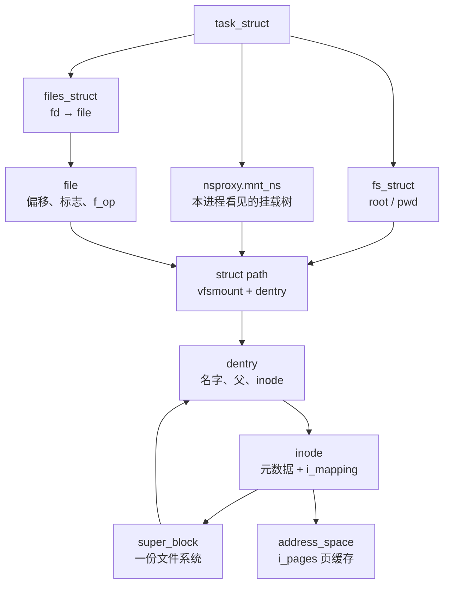

# Linux VFS 子系统：面试复习

> 源码基准：本项目 [Linux 6.18.52](../../linux/Makefile#L2)。所有源码链接均相对于本文。
>
> 学习主线：**名字在 dentry 上，对象在 inode 上，一次打开是一个 file，一份文件系统是一个 super_block，一次挂载是一个 mount。路径查找先无锁走缓存，对不上再拿引用重走。普通文件的读写最后落到这份 inode 的页缓存。**
>
> 下文按 x86、非 RT、数据中心常见配置来记。[x86_64 defconfig](../../linux/arch/x86/configs/x86_64_defconfig#L233) 打开 `CONFIG_EXT4_FS`、`CONFIG_EXT4_FS_POSIX_ACL`、`CONFIG_QUOTA`、`CONFIG_TMPFS_POSIX_ACL`。`NAMESPACES` 在非 EXPERT 构建里默认打开。容器和本地盘上的 XFS、overlayfs 仍挂在同一套 VFS 操作表上，下文用它们说明具体文件系统从哪里接入。

## 1. 先记住分层

VFS 把“这个路径叫什么”和“这个对象是什么”拆开，再把“这次打开”和“这份文件系统被挂在哪里”拆开。

| 问题 | 核心对象 | 数据中心上的典型答案 |
| --- | --- | --- |
| 这个名字现在指向谁？ | `struct dentry` | 目录项缓存。负目录项表示这个名字查过、不存在 |
| 这个文件对象本身是什么？ | `struct inode` | 元数据、权限、`i_op` / `i_fop`、页缓存 |
| 这次 `open` 的状态是什么？ | `struct file` | 偏移、打开标志、`f_op`、指向 `(vfsmount, dentry)` |
| 这是哪一份文件系统？ | `struct super_block` | ext4/XFS 的一个已挂载实例，根在 `s_root` |
| 它挂在这棵命名空间树的哪？ | `struct mount` | 嵌着对外的 `struct vfsmount`，挂载点是一个 dentry |



**面试里先把四个引用关系说清。** 一个 inode 可以有多个名字（硬链接，多个 dentry 挂在 `i_dentry` 上）。一个 dentry 在某一时刻只指向一个 inode，`d_inode == NULL` 且类型是 `DCACHE_MISS_TYPE` 就是负目录项。一次打开有自己的 `file`，多个 fd 可以指向同一个 `file`（`dup`），多个 `file` 也可以指向同一个 inode（两次 `open`）。路径跨挂载点时，`path.mnt` 换成子挂载，`path.dentry` 换成那份文件系统的根。

## 2. 五个对象怎么串起来

### 2.1 路径是一对指针

[`struct path`](../../linux/include/linux/path.h#L8) 只有两项：

| 字段 | 作用 |
| --- | --- |
| `mnt` | 当前这段路径所在的 `vfsmount` |
| `dentry` | 当前组件的目录项 |

`path_get()` 同时 `mntget` + `dget`，`path_put()` 反过来，见 [`path_get()`](../../linux/fs/namei.c#L611)。只拿 dentry、不拿挂载，跨挂载点就会走错树。

### 2.2 dentry：目录树里的一个名字

[`struct dentry`](../../linux/include/linux/dcache.h#L92) 前半段是 RCU 路径查找会碰的字段：

| 字段 | 作用 |
| --- | --- |
| `d_flags` | 类型、是否挂载点、是否在 LRU、是否需要 `d_op` |
| `d_seq` | 每目录项 seqcount。改名、改父、改 inode 时递增 |
| `d_hash` | 全局哈希桶里的节点 |
| `d_parent` | 父目录项。根的父是自己，`IS_ROOT()` 判这个 |
| `d_name` | [`struct qstr`](../../linux/include/linux/dcache.h#L49)：`hash`、`len`、`name` |
| `d_inode` | 这个名字对应的 inode。负目录项这里是 `NULL` |
| `d_shortname` | 短名字内嵌缓冲区。64 位上 `DNAME_INLINE_LEN` 是 40 字节 |

后半段是拿引用之后才碰的：`d_op`、`d_sb`、`d_lockref`（自旋锁和引用计数合一）、`d_lru`、`d_children` / `d_sib`、以及和 RCU 回调共用的 `d_alias`。

类型放在 `d_flags` 的 bit 19–21，见 [`DCACHE_ENTRY_TYPE`](../../linux/include/linux/dcache.h#L215)：

| 类型 | 含义 |
| --- | --- |
| `DCACHE_MISS_TYPE` | 负目录项，`d_is_negative()` 为真 |
| `DCACHE_DIRECTORY_TYPE` | 普通目录，`d_can_lookup()` 为真，路径查找可以走进去 |
| `DCACHE_REGULAR_TYPE` / `SYMLINK` / `SPECIAL` / `WHITEOUT` | 普通文件、符号链接、设备/管道等、whiteout |

`d_is_dir()` 把可查找目录和 `DCACHE_AUTODIR_TYPE` 都算目录。路径查找用 `d_can_lookup()`，自动挂载目录要另走 `d_automount`。

### 2.3 inode：对象本身

[`struct inode`](../../linux/include/linux/fs.h#L793) 开头是路径查找和 `stat` 的热字段：`i_mode`、`i_uid` / `i_gid`、`i_op`、`i_sb`、`i_mapping`。后面才是 `i_ino`、`i_nlink`、`i_size`、时间戳。

| 字段 | 作用 |
| --- | --- |
| `i_op` | 目录和元数据操作：`lookup` / `create` / `unlink` / `rename` / `getattr` |
| `i_fop` | 打开之后的文件操作，`do_dentry_open()` 把它抄到 `file->f_op` |
| `i_mapping` | 页缓存。初始化时指向内嵌的 `i_data`，见 [`inode_init_always_gfp()`](../../linux/fs/inode.c#L231) |
| `i_data` | 这份 inode 自己的 `address_space` |
| `i_hash` | 挂在全局 `inode_hashtable`，键是 `(super_block, i_ino)` |
| `i_dentry` | 所有指向本 inode 的 dentry（硬链接） |
| `i_count` | 引用计数。降到 0 可以进 LRU，仍然活着 |
| `i_state` | `I_NEW` / `I_FREEING` / 脏位等，由 `i_lock` 保护 |
| `i_rwsem` | 目录和文件的读写信号量。VFS 里常叫 inode mutex |
| `i_nlink` | 硬链接数。文件系统只能读，改要用 `inc_nlink` / `drop_nlink` |

`i_mapping` 可以改指向别的 inode 的 `address_space`。堆叠文件系统用这个让上下层共用页缓存。普通 ext4/XFS 文件上，`i_mapping == &i_data`。

### 2.4 file：一次打开

[`struct file`](../../linux/include/linux/fs.h#L1211) 是 fd 背后的对象。

| 字段 | 作用 |
| --- | --- |
| `f_mode` | `FMODE_READ` / `FMODE_WRITE` / `FMODE_OPENED` / `FMODE_CREATED` 等 |
| `f_op` | 这次打开使用的 `file_operations` |
| `f_mapping` | 打开时从 `inode->i_mapping` 抄来 |
| `f_inode` | 缓存的 inode，和 `f_path.dentry->d_inode` 一致 |
| `f_flags` | 用户传入的 `O_*`，打开完成后清掉 `O_CREAT` / `O_EXCL` / `O_TRUNC` |
| `f_path` | 打开时的 `(vfsmount, dentry)` |
| `f_pos` | 当前偏移。普通文件和目录用 `f_pos_lock` |
| `f_ra` | 预读窗口 |
| `f_cred` | 打开者的凭证。后续 `read`/`write` 的权限检查用打开时的结果，DAC 不再按当前 fsuid 重算 |

`f_pos` 和 inode 无关。两个 fd 指向两个 `file` 时，各有各的偏移。

### 2.5 super_block 和 mount

[`struct super_block`](../../linux/include/linux/fs.h#L1446) 是一份已挂载文件系统的内存对象：`s_op`、`s_root`、`s_flags`（`SB_RDONLY` 等）、`s_blocksize`、`s_fs_info`（文件系统私有）、`s_dentry_lru` / `s_inode_lru`、`s_inodes`。`s_umount` 是卸载和冻结用的读写信号量。`s_writers` 把冻结分成写、缺页、文件系统内部三级，见 [`SB_FREEZE_WRITE`](../../linux/include/linux/fs.h#L1427)。

挂载有两层结构：

| 对象 | 谁看见 | 记什么 |
| --- | --- | --- |
| [`struct vfsmount`](../../linux/include/linux/mount.h#L58) | 路径查找 | `mnt_root`、`mnt_sb`、`mnt_flags`（`MNT_NOSUID` / `MNT_READONLY` / `MNT_NOEXEC`）、`mnt_idmap` |
| [`struct mount`](../../linux/fs/mount.h#L43) | 命名空间代码 | 用 `container_of` 包住 `vfsmount`。父、挂载点、子链表、共享/从属链表、所属 `mnt_namespace` |

`real_mount()` 从 `vfsmount *` 找回 `struct mount`，见 [`fs/mount.h`](../../linux/fs/mount.h#L120)。`mnt_flags` 是这次挂载的，`s_flags` 是整份 superblock 的。只读可以只打在挂载上（`MNT_READONLY`），也可以打在 superblock 上（`SB_RDONLY`）。

## 3. 四张操作表

具体文件系统向 VFS 注册四张表。面试时按“谁在什么阶段被调用”记。

| 表 | 挂在哪 | 典型回调 | 什么时候走 |
| --- | --- | --- | --- |
| [`super_operations`](../../linux/include/linux/fs.h#L2459) | `sb->s_op` | `alloc_inode` / `write_inode` / `evict_inode` / `sync_fs` / `statfs` / `put_super` | 分配、写回、回收 inode，同步和卸载 |
| [`inode_operations`](../../linux/include/linux/fs.h#L2341) | `inode->i_op` | `lookup` / `create` / `unlink` / `mkdir` / `rename` / `getattr` / `permission` / `get_link` / `atomic_open` | 目录项未命中、改目录、符号链接、改元数据 |
| [`file_operations`](../../linux/include/linux/fs.h#L2271) | `file->f_op`，来自 `inode->i_fop` | `read_iter` / `write_iter` / `llseek` / `mmap` / `open` / `release` / `fsync` / `iterate_shared` | 打开之后的系统调用 |
| [`address_space_operations`](../../linux/include/linux/fs.h#L439) | `mapping->a_ops` | `read_folio` / `readahead` / `write_begin` / `write_end` / `writepages` / `direct_IO` / `dirty_folio` | 页缓存缺页、缓冲写、回写、直接 IO |

[`file_system_type`](../../linux/include/linux/fs.h#L2684) 是文件系统种类，不是某一次挂载。`name`、`init_fs_context` / `mount`、`kill_sb`、`fs_supers` 把同一种类的全部 superblock 串起来。`FS_USERNS_MOUNT` 允许用户命名空间里的 root 挂载，`FS_ALLOW_IDMAP` 表示支持 idmapped mount。

目录的 `lookup` 只负责“这个名字在磁盘目录里有没有”。找到了用 `d_add` / `d_splice_alias` 把 inode 接到调用者准备好的 dentry 上；没有就留下负目录项。VFS 不会让文件系统自己去哈希桶里找缓存，缓存查找在 `lookup` 之前已经做过。

## 4. 进程侧：根、当前目录、文件表、挂载命名空间

[`task_struct`](../../linux/include/linux/sched.h#L1185) 上和 VFS 直接相关的是三份指针，外加路径查找的临时 `nameidata`：

| 字段 | 对象 | 作用 |
| --- | --- | --- |
| `fs` | [`struct fs_struct`](../../linux/include/linux/fs_struct.h#L9) | `root`、`pwd`、`umask`。`seq` 保护根和当前目录 |
| `files` | [`struct files_struct`](../../linux/include/linux/fdtable.h#L38) | fd 表。线程可以共享（`CLONE_FILES`） |
| `nsproxy->mnt_ns` | [`struct mnt_namespace`](../../linux/fs/mount.h#L10) | 本进程能看见的挂载树，红黑树 `mounts` |
| `nameidata` | 路径查找栈帧 | 嵌套查找时保存上一层，符号链接计数往下传 |

`fs_struct` 和 `files_struct` 跟挂载命名空间是三套共享关系。`clone` 可以只共享 fd 表、只共享根和 cwd、或只共享挂载命名空间。`chroot` 改的是 `fs->root`，`chdir` 改的是 `fs->pwd`。容器的新挂载树来自 `copy_mnt_ns()`。

fd 表的布局：

```text
files_struct
├── fdt → fdtable
│         ├── fd[]              RCU 保护的 file 指针数组
│         ├── open_fds          已占用位图
│         ├── close_on_exec
│         └── full_fds_bits     加速“这一长字全满”
├── file_lock
├── next_fd                     下次分配的起点
└── fd_array[64]                嵌入的初始表，x86_64 上 NR_OPEN_DEFAULT = 64
```

分配和安装分成两步，见 [`alloc_fd()`](../../linux/fs/file.c#L570) 和 [`fd_install()`](../../linux/fs/file.c#L652)：

1. `alloc_fd()` 拿 `file_lock`，在位图里找空位，设上 `open_fds`，推进 `next_fd`。槽位已经占住，指针仍是空。
2. `fd_install()` 用 `rcu_assign_pointer` 把 `file` 填进去。表没在扩容时不必拿 `file_lock`。

`close` 在锁里把指针换成 `NULL`、清位图，锁外再 `filp_close()`。读侧用 RCU 加 `array_index_mask_nospec`，越界 fd 不会把别的槽位露出去，见 [`files_lookup_fd_raw()`](../../linux/include/linux/fdtable.h#L72)。

## 5. 目录项缓存

### 5.1 哈希桶按“父指针 + 名字”定位

全局 [`dentry_hashtable`](../../linux/fs/dcache.c#L114) 是 `hlist_bl`（每桶一把位锁）。启动时 `alloc_large_system_hash("Dentry cache", ...)`，可用 `dhash_entries=` 改大小，见 [`dcache_init_early()`](../../linux/fs/dcache.c#L3194)。

名字哈希用父 dentry 指针当盐，见 [`hash_name()`](../../linux/fs/namei.c#L2404) 里的 `init_name_hash(nd->path.dentry)`。同一个字符串在不同目录下进不同桶。查找时还要比对 `d_parent` 和名字。桶定位是 [`d_hash()`](../../linux/fs/dcache.c#L116)，取哈希的高位。

并行查找另有一张小表 [`in_lookup_hashtable`](../../linux/fs/dcache.c#L123)，1024 个桶。`d_alloc_parallel()` 把“正在问文件系统”的 dentry 标上 `DCACHE_PAR_LOOKUP`。第二个同名查找等到第一个 `d_lookup_done()`，避免对同一个名字调用两次 `->lookup`。

### 5.2 正目录项、负目录项、别名

```text
目录 /data                         inode 2  (目录)
  ├─ dentry "disk.img"  ───────►  inode 18  ◄─── dentry "disk-link"
  └─ dentry "missing"   ───────►  NULL            （负目录项，仍留在哈希里）
```

硬链接是多条 dentry 通过 `d_alias` 挂在同一个 `inode->i_dentry` 上。目录通常只有一个别名。`d_instantiate()` 把负目录项变成正的：挂上别名链表，在 `d_seq` 保护下写入 inode 和类型，见 [`__d_instantiate()`](../../linux/fs/dcache.c#L1921)。调用者必须已经持有 inode 引用，这份引用此后算在 dentry 上。

负目录项是缓存的“不存在”。下次查找命中它就直接 `ENOENT`，不必再读目录块。创建文件时要在父目录的 `i_rwsem` 下重新确认，避免把过期的负目录项当成最终结果。

### 5.3 引用降到 0 仍然可以留在缓存里

[`dput()`](../../linux/fs/dcache.c#L899) 先走 [`fast_dput()`](../../linux/fs/dcache.c#L812)。引用还没到 0 就返回。到 0 时 [`retain_dentry()`](../../linux/fs/dcache.c#L744) 决定去留：

- 还在哈希里、不是 `DCACHE_DISCONNECTED`、没有 `DCACHE_DONTCACHE`、`d_delete` 也没要求丢掉 → 放进该 superblock 的 dentry LRU，引用保持 0。
- 已经 `d_drop` 出哈希、或者文件系统要求删除 → `__dentry_kill()`，再沿着父链看父目录项是不是也该回收。

**引用计数是 0 的 dentry 可以仍在哈希表里。** 下一次 `__d_lookup` / `__d_lookup_rcu` 会把它重新拿起来。内存紧张时 per-sb shrinker 从 `s_dentry_lru` 上回收。`DCACHE_REFERENCED` 让刚用过的项在 LRU 上多活一轮。

### 5.4 三条 seqlock 把无锁查找圈起来

| 锁 | 保护什么 | 查找时怎么用 |
| --- | --- | --- |
| `dentry->d_seq` | 这一项的父、名字、inode、类型 | RCU 走完一步就 `read_seqcount_retry` |
| 全局 `rename_lock` | `rename` 搬动目录树 | `d_lookup()` 包住整个哈希扫描；RCU 快路径故意不拿它 |
| 全局 `mount_lock` | 挂载树 | 跨挂载点前后比对 `m_seq` |

`__d_lookup_rcu()` 不拿 `rename_lock`，并发 `rename` 可能让它漏掉一个其实存在的项，见 [注释](../../linux/fs/dcache.c#L2273)。调用者把这次失败当成未命中，退出 RCU 模式后再查一次。`d_lookup()` 在 `rename_lock` 的 seqlock 里循环，给需要确定答案的路径用。

## 6. inode 缓存与生命周期

### 6.1 按 (superblock, ino) 全局哈希

[`inode_hashtable`](../../linux/fs/inode.c#L65) 一把 [`inode_hash_lock`](../../linux/fs/inode.c#L66)。哈希把 superblock 指针和 inode 号搅在一起，见 [`hash()`](../../linux/fs/inode.c#L645)。不同文件系统的同号 inode 不会撞成同一个对象。

[`iget_locked()`](../../linux/fs/inode.c#L1425) 是文件系统把磁盘 inode 拿进内存的入口：

```text
find_inode_fast(sb, ino)
  命中且正在释放  → 等到它从哈希摘掉，再找一次
  命中且 I_NEW    → wait_on_inode()，等创建者填完
  命中且可用      → i_count++，返回
未命中:
  alloc_inode()
  再次在 inode_hash_lock 下查找
  仍没有 → i_state = I_NEW，插入哈希，返回这个上锁的 inode
  创建者读盘、填字段，unlock_new_inode() 清 I_NEW 并唤醒
```

`I_NEW` 既是“还没填完”的标志，也是等待点。两个进程同时 `iget` 同一个号，只有一个负责读盘。`iget5_locked()` 用自定义 `test`/`set`，给 inode 号不够唯一的文件系统用。

每个 superblock 还有 `s_inodes` 链表和 `s_inode_lru`。哈希负责按号找，LRU 负责回收 `i_count == 0` 的 inode。

### 6.2 iput：链接数为 0 就销毁，否则进 LRU

[`iput()`](../../linux/fs/inode.c#L1926) 把 `i_count` 减一。还没用到最后一份引用就返回。最后一份时：

| 条件 | 结果 |
| --- | --- |
| 还有 `I_DIRTY_TIME` 且 `i_nlink != 0` | 先把时间戳升级成普通脏，再减引用 |
| [`inode_generic_drop()`](../../linux/include/linux/fs.h#L3345) 为假，且 superblock 仍 `SB_ACTIVE` | 放进 inode LRU。`i_count` 已经是 0 |
| `i_nlink == 0`，或已经不在哈希里，或 `I_DONTCACHE` | 置 `I_FREEING`，调用 [`evict()`](../../linux/fs/inode.c#L785) |

`inode_generic_drop()` 就是 `!i_nlink || inode_unhashed(inode)`。ext4 和 XFS 的 `drop_inode` 都走它。

`evict()` 先等回写结束，再调 `s_op->evict_inode()`（或 `truncate_inode_pages_final` + `clear_inode`），然后 `remove_inode_hash()`。正在 `iget` 的人若看见 `I_FREEING`，会睡在这个 inode 上，直到它离开哈希，再分配一个新的。

**dentry 的引用和 inode 的引用是两层。** 打开的 `file` 通过 `path_get` 抓住 dentry；正 dentry 抓住 inode。最后一个 fd 关掉、dentry 被杀掉时才 `iput`。文件已经 `unlink`（`i_nlink == 0`）但 fd 还在时，inode 继续活着，页缓存也还在；最后一个 `fput` 之后才 `evict`。

### 6.3 脏状态

`i_state` 里和回写有关的是四位，见 [`fs.h`](../../linux/include/linux/fs.h#L682)：

| 位 | 含义 |
| --- | --- |
| `I_DIRTY_SYNC` | inode 本身脏，常见是时间戳。`fdatasync` 可以不写它 |
| `I_DIRTY_DATASYNC` | 影响数据一致性的 inode 变化，例如大小、块映射 |
| `I_DIRTY_PAGES` | 页缓存里有脏页。inode 结构可以仍是干净的 |
| `I_DIRTY_TIME` | `lazytime` 下推迟写的时间戳 |

`I_DIRTY_PAGES` 只说明有脏页。页在 `address_space->i_pages` 这棵 XArray 里，用 `PAGECACHE_TAG_DIRTY` 标出来。

## 7. 路径查找

### 7.1 一次查找的三次尝试

[`filename_lookup()`](../../linux/fs/namei.c#L2697) 和 [`do_filp_open()`](../../linux/fs/namei.c#L4157) 都是同一模式：

```text
先带 LOOKUP_RCU
  返回 -ECHILD  → 去掉 RCU，拿 dentry/mnt 引用再走一遍
  返回 -ESTALE  → 加上 LOOKUP_REVAL，让 d_revalidate 不信任缓存
```

RCU 模式里 `rcu_read_lock()` 包住全程，不增加 dentry 和 vfsmount 的引用，也不拿 `d_lock`、`i_rwsem`、`rename_lock`。任何 seqcount 对不上、需要睡眠、权限检查返回 `MAY_NOT_BLOCK` 失败，都通过 [`try_to_unlazy()`](../../linux/fs/namei.c#L840) 转成带引用的走法；转失败就整次返回 `-ECHILD`。成功结束前 [`complete_walk()`](../../linux/fs/namei.c#L944) 一定把 RCU 模式卸掉，交给调用者的 `path` 已经持有引用。

### 7.2 nameidata 是这次查找的工作区

[`struct nameidata`](../../linux/fs/namei.c#L632) 放在调用者栈上，并挂到 `current->nameidata`：

| 字段 | 作用 |
| --- | --- |
| `path` / `inode` / `seq` | 当前走到的路径、inode、对应的 `d_seq` |
| `last` / `last_type` | 下一个组件的 `qstr`，以及它是普通名、`.`、`..` 还是纯根 |
| `root` | 这次查找的根。绝对路径用 `fs->root`；`LOOKUP_BENEATH` / `LOOKUP_IN_ROOT` 用起始目录 |
| `stack` / `depth` | 符号链接栈。栈上内嵌 2 层，更多再分配，上限 [`MAXSYMLINKS = 40`](../../linux/include/linux/namei.h#L13) |
| `m_seq` / `r_seq` | 起步时采样的 `mount_lock` 和 `rename_lock` |

[`path_init()`](../../linux/fs/namei.c#L2540) 决定起点：

| 路径 | 起点 |
| --- | --- |
| 以 `/` 开头，且没有 `LOOKUP_IN_ROOT` | `nd_jump_root()`，进程的 `fs->root` |
| `dfd == AT_FDCWD` | `fs->pwd` |
| 其他 `dfd` | 该 fd 的 `f_path`。起始点必须是目录 |

`..` 不会走出 `nd->root`。走到当前 `vfsmount` 的根时，先找到父挂载上的挂载点，再取挂载点的父 dentry。`LOOKUP_BENEATH`（`openat2` 的 `RESOLVE_BENEATH`）连“跳出起点”都不允许；`LOOKUP_IN_ROOT` 把 dirfd 当成 `/`。

### 7.3 逐组件走

[`link_path_walk()`](../../linux/fs/namei.c#L2441) 处理最后一个组件之前的全部路径。最后一个组件留给调用者：纯查找用 `lookup_last()`，`open` 用 `open_last_lookups()`。

```text
path_init → 当前目录，采样 mount_lock / rename_lock
对每个组件:
    may_lookup: 父目录要有 MAY_EXEC（搜索权限）
    hash_name: 切到下一个 '/'，算出 qstr
    "." / ".." 单独处理
    lookup_fast:
        RCU  → __d_lookup_rcu + d_revalidate
        引用 → __d_lookup + d_revalidate
        都没有 → lookup_slow
    step_into:
        若该 dentry 是挂载点，换成子挂载的 mnt_root
        若是符号链接且这条路径要求跟随，pick_link，栈上记下返回点
        否则当前 path 前进到这个 dentry
最后一个组件先不走进去（LOOKUP_PARENT 在走到它之前清掉）
```

父目录的权限是**搜索**（`MAY_EXEC`），见 [`may_lookup()`](../../linux/fs/namei.c#L1852)。没有目录的读权限仍然可以打开里面已知名字的文件；没有执行权限则中间任何一级都过不去。

[`lookup_slow()`](../../linux/fs/namei.c#L1826) 对父 inode 拿 `i_rwsem` 共享锁，[`__lookup_slow()`](../../linux/fs/namei.c#L1789) 再 `d_alloc_parallel()`。新 dentry 带着 `DCACHE_PAR_LOOKUP` 时才调用 `inode->i_op->lookup()`。文件系统返回 `NULL` 表示它已经把 inode 填进这个 dentry，或者确认这是负目录项。

### 7.4 符号链接和挂载点

符号链接的跟随规则在 `namei.c` 开头的注释里，实现落在 [`step_into()`](../../linux/fs/namei.c#L1984)：

| 位置 | 行为 |
| --- | --- |
| 路径中间 | 总是跟随 |
| 最后一个组件 | 只有 `LOOKUP_FOLLOW` 才跟随。`open` 默认跟随，`O_NOFOLLOW` 关闭它 |
| 末尾带 `/` | 当成目录，强制跟随 |
| 创建、删除、改名的最后一个组件 | `path_parentat()` 停在父目录，最后一截只是个字符串 |

正文优先读 `inode->i_link`。没有缓存正文时调 `i_op->get_link`。目标以 `/` 开头就 `nd_jump_root()`。绝对链接和 `..` 都受 `nd->root` 约束。`MNT_NOSYMFOLLOW` 或 `LOOKUP_NO_SYMLINKS` 直接 `-ELOOP`。超过 40 次也是 `-ELOOP`，见 [`reserve_stack()`](../../linux/fs/namei.c#L1876)。

挂载点看 dentry 标志 `DCACHE_MOUNTED`。RCU 模式用 [`__lookup_mnt()`](../../linux/fs/namespace.c#L795)：哈希键是 `(父 vfsmount, 挂载点 dentry)`，命中后 `path.mnt` 换成子挂载，`path.dentry` 换成 `mnt_root`，见 [`__follow_mount_rcu()`](../../linux/fs/namei.c#L1581)。引用模式走 `lookup_mnt()`，对 `mount_lock` 做 seqlock。`LOOKUP_NO_XDEV`（`RESOLVE_NO_XDEV`）禁止换挂载。

`..` 从子文件系统根往上时，走的是 `struct mount` 的 `mnt_parent` / `mnt_mountpoint`，然后才是挂载点 dentry 的 `d_parent`。dentry 的父指针出不了自己的 superblock。

## 8. open 怎么把 file 造出来

[`openat`](../../linux/fs/open.c#L1463) → [`do_sys_open()`](../../linux/fs/open.c#L1449) → [`do_sys_openat2()`](../../linux/fs/open.c#L1420)：

```text
build_open_flags
getname                 把用户路径拷进内核
get_unused_fd_flags     占一个 fd 槽
do_filp_open
  path_openat
    alloc_empty_file
    path_init + link_path_walk     走到父目录
    open_last_lookups              处理最后一个组件
    do_open                        权限、截断、vfs_open
fd_install              把 file 放进 fd 表
putname
```

最后一个组件在 [`open_last_lookups()`](../../linux/fs/namei.c#L3848)：

- 普通打开先 `lookup_fast`。未命中就共享锁父目录，`lookup_open()`。
- `O_CREAT` 改拿父目录的独占 `i_rwsem`。负目录项上调用 `i_op->create`，成功则 `file->f_mode |= FMODE_CREATED`。
- 文件系统提供 `atomic_open` 时，查找、创建、打开合成一次调用。
- `O_CREAT | O_EXCL` 要求这次确实创建了文件，否则 `-EEXIST`。

[`do_open()`](../../linux/fs/namei.c#L3931) 做 `may_open`。还没打开过就 [`vfs_open()`](../../linux/fs/open.c#L1092) → [`do_dentry_open()`](../../linux/fs/open.c#L903)：

1. `path_get`，记下 `f_inode` 和 `f_mapping`。
2. 只读打开增加 `i_readcount`；可写打开走 `file_get_write_access`，置 `FMODE_WRITER`。
3. `f_op = inode->i_fop`，然后 `security_file_open`、`break_lease`、`f_op->open`。
4. 按 `f_op` 是否提供 `read` / `read_iter` / `write` / `write_iter` / `direct_IO` 置 `FMODE_CAN_READ`、`FMODE_CAN_WRITE`、`FMODE_CAN_ODIRECT`。
5. 清掉 `f_flags` 里的 `O_CREAT | O_EXCL | O_NOCTTY | O_TRUNC`，初始化预读状态。

`O_PATH` 在这里短路：`f_op` 换成空表，只有 `FMODE_PATH | FMODE_OPENED`，不能读也不能写。`O_TMPFILE` 不把名字链进目录，走 `i_op->tmpfile`。

`O_TRUNC` 在 `do_open` 里对普通文件再要一次写挂载许可，然后 `handle_truncate`。新建文件不再截断。

## 9. 读、写和页缓存

### 9.1 系统调用停在 file_operations

[`vfs_read()`](../../linux/fs/read_write.c#L552) 检查 `FMODE_READ`、`FMODE_CAN_READ`、用户地址和 `rw_verify_area`，然后：

```text
有 f_op->read        → 直接调用（字符设备、部分伪文件）
否则有 f_op->read_iter → new_sync_read() 包成 kiocb + iov_iter
```

写路径对称，见 [`vfs_write()`](../../linux/fs/read_write.c#L666) 和 [`new_sync_write()`](../../linux/fs/read_write.c#L583)。内核内部读写只接受 `read_iter` / `write_iter`，两套回调都挂上会被当成不支持。

XFS 的普通读是 [`xfs_file_read_iter()`](../../linux/fs/xfs/xfs_file.c#L292)：非 DAX、非 `O_DIRECT` 时拿共享 `i_rwsem`，再进 [`generic_file_read_iter()`](../../linux/mm/filemap.c#L2910)。ext4 一类本地文件系统同样把缓冲 IO 交给这套通用函数。

### 9.2 页缓存挂在 address_space 上

[`struct address_space`](../../linux/include/linux/fs.h#L506) 的主体是 XArray `i_pages`，键是文件页偏移。三个标记：

| 标记 | 含义 |
| --- | --- |
| `PAGECACHE_TAG_DIRTY` | 脏页，等回写 |
| `PAGECACHE_TAG_WRITEBACK` | 正在写盘 |
| `PAGECACHE_TAG_TOWRITE` | 这一轮回写选中的页 |

`i_mmap` 是映射了这个文件的 VMA 红黑树。`nrpages` 是缓存页数。`wb_err` 记下最近的回写错误，`file->f_wb_err` 在打开时采样，之后 `read`/`fsync` 能把“这次打开之后发生的错误”报给调用者。

缓冲读 [`generic_file_read_iter()`](../../linux/mm/filemap.c#L2910)：

```text
IOCB_DIRECT:
    等已有回写完成
    a_ops->direct_IO()
    短读且不是 DAX → 剩下的落到缓冲读
否则:
    filemap_read()
        filemap_get_pages()   查 i_pages，缺页则 a_ops->read_folio / readahead
        按 i_size 截断
        拷贝到用户缓冲区
        推进 ki_pos，更新预读窗口 file->f_ra
```

缓冲写 [`generic_file_write_iter()`](../../linux/mm/filemap.c#L4406) 先独占 `i_rwsem`，再 [`__generic_file_write_iter()`](../../linux/mm/filemap.c#L4359)：

```text
file_remove_privs、file_update_time
IOCB_DIRECT → a_ops->direct_IO，必要时再缓冲补写
否则 generic_perform_write:
    balance_dirty_pages_ratelimited
    a_ops->write_begin     准备 folio，必要时读入不满一块的两侧
    从用户缓冲区拷贝
    a_ops->write_end       标脏
写成功且是 O_SYNC → generic_write_sync
```

**缓冲写返回时，数据在页缓存里，并已标脏。** 磁盘上的持久化发生在回写：脏 inode 带着 `I_DIRTY_PAGES`，flusher 按 `a_ops->writepages` 把带 `PAGECACHE_TAG_DIRTY` 的 folio 写出去。`O_SYNC` / `O_DSYNC` / 显式 `fsync` 才在系统调用里等这次范围落盘。`fdatasync` 可以不写只含 `I_DIRTY_SYNC` 的时间戳。

直接 IO 和缓冲 IO 的交界是：`generic_file_read_iter` 在 `direct_IO` 之前等待该范围的回写；直接写之前也会把重叠的缓冲页清掉，避免同一范围两份数据。具体文件系统可以自己做这件事，再决定要不要调用上述通用函数。

## 10. 挂载与传播

[`do_mount()`](../../linux/fs/namespace.c#L4042) 先 `user_path_at` 找到挂载点，再 [`path_mount()`](../../linux/fs/namespace.c#L3963) 按标志分发：

| 标志 | 去向 |
| --- | --- |
| `MS_REMOUNT` | 改 superblock 或这次挂载的标志 |
| `MS_BIND` | 绑定挂载，`do_loopback` |
| `MS_SHARED` / `PRIVATE` / `SLAVE` / `UNBINDABLE` | 只改传播类型 |
| `MS_MOVE` | 把已有挂载挪到新挂载点 |
| 都没有 | `do_new_mount`：按 `file_system_type` 建 superblock，再挂上树 |

新建挂载走 `vfs_kern_mount()` → `fs_context` → `fc_mount()`。superblock 建好之后，[`graft_tree()`](../../linux/fs/namespace.c#L2811) 要求挂载点和新文件系统根同为目录，再 [`attach_mnt()`](../../linux/fs/namespace.c#L1056)：设置父、挂载点，链进父的子链表和 `mount_hashtable`。挂载点 dentry 被标上 `DCACHE_MOUNTED`。

传播类型在 `struct mount` 的链表上，见 [`mount.h`](../../linux/fs/mount.h#L68)：

| 类型 | 结构 | 新挂载发生在这里时 |
| --- | --- | --- |
| private | 不在共享环里，也没有 master | 只出现在这一处 |
| shared | `mnt_share` 成环，同一个 `mnt_group_id` | [`propagate_mnt()`](../../linux/fs/pnode.c#L311) 给每个对等挂载复制一棵 |
| slave | `mnt_master` 指向共享挂载，挂在 master 的 `mnt_slave_list` | 接收 master 上的传播，自己的新挂载不往回传 |
| unbindable | `T_UNBINDABLE` | 不能被绑定挂载，也不会被复制到别的传播点 |

`propagate_mnt()` 对目标所在的对等组做深度优先：目标自己这份用 `CL_MAKE_SHARED`，从属组用 `CL_SLAVE`。容器运行时先把 `/` 设成 slave of 主机，再在容器里挂卷，这样容器里的新挂载不会漏回主机，主机之后的传播仍能进容器。

卸载 [`do_umount()`](../../linux/fs/namespace.c#L1865) 看的是这次 `mount` 的引用，不是 superblock。绑定挂载拆掉一处，其他挂载点上的同一 superblock 还在。最后一个挂载离开、`s_active` 归零，才 `kill_sb` → `put_super`。`MNT_DETACH` 允许忙卸载，路径上仍持有的 `vfsmount` 继续可用到 `mntput`。

## 11. 目录修改时的锁

查找拿父目录 `i_rwsem` 的共享锁，创建和删除拿独占锁。`rename` 更严格，见 [`lock_rename()`](../../linux/fs/namei.c#L3357)：

1. 同一文件系统上先拿 `s_vfs_rename_mutex`，避免两个交叉 rename 互锁。
2. [`lock_two_directories()`](../../linux/fs/namei.c#L3322) 沿 `d_parent` 判断谁是祖先。祖先用 `I_MUTEX_PARENT`，另一侧用 `I_MUTEX_PARENT2`。
3. 锁类的顺序写在 [`inode_i_mutex_lock_class`](../../linux/include/linux/fs.h#L968)：父、子、孙、普通、xattr、第二个非目录。

返回值如果是一个目录，说明源或目标是对方的祖先，VFS 直接拒绝，防止把目录搬进自己的子树。

`i_rwsem` 还串起缓冲写和直接 IO：通用缓冲写独占它，XFS 缓冲读共享它。`mmap` 改页不走这条锁，页缓存一致性另有 `address_space->invalidate_lock`。

## 12. 把一条路径说完

**打开已存在的普通文件 `/data/disk.img`：**

```text
openat(AT_FDCWD, "/data/disk.img", O_RDONLY)
  getname、alloc_fd
  do_filp_open，先 LOOKUP_RCU
    path_init          绝对路径，起点 = fs->root
    link_path_walk     "data"：may_lookup(MAY_EXEC) → lookup_fast 命中 dentry
                       若 dentry 标了 DCACHE_MOUNTED，__lookup_mnt 跳进子文件系统
    open_last_lookups  "disk.img"：__d_lookup_rcu 命中，d_revalidate 通过
    complete_walk      退出 RCU，dget + mntget
    do_open → vfs_open → do_dentry_open
                       f_op = inode->i_fop，f_mapping = i_mapping
  fd_install
```

RCU 中途 `-ECHILD` 就整条重走，这次 `__d_lookup` 会拿引用。缓存没有 "disk.img" 时，`lookup_slow` 共享锁父目录，调用父 inode 的 `->lookup` 去读目录块。

**`read` 这个 fd：**

```text
vfs_read
  f_op->read_iter          例如 xfs_file_read_iter
    generic_file_read_iter
      filemap_read
        i_pages 命中 → 拷贝到用户缓冲区
        缺页 → a_ops->read_folio，装进页缓存再拷贝
```

**缓冲 `write` 然后进程退出：**

```text
vfs_write → write_iter → generic_file_write_iter
  独占 i_rwsem
  write_begin / 拷贝 / write_end，folio 标 PAGECACHE_TAG_DIRTY
  inode 标 I_DIRTY_PAGES
系统调用返回。回写线程之后按 a_ops->writepages 写盘
close → fput
  最后一个 file 引用：f_op->release，dput
  dentry 引用到 0：仍可能留在 dcache LRU
  若已经 unlink，最后一个 dput 触发 iput
  i_nlink == 0 → evict_inode，丢掉页缓存和 inode
```

## 13. 追问

| 追问 | 回答 |
| --- | --- |
| dentry 和 inode 怎么分工？ | dentry 是名字和父子关系，inode 是对象。硬链接多个 dentry 对一个 inode。符号链接是另一个 inode，正文在 `i_link` 或 `get_link`。 |
| 负目录项有什么用？ | 把“查过且不存在”放进哈希。下次 `lookup_fast` 命中就返回 `ENOENT`，不必读目录。创建路径会在父目录锁下再确认。 |
| 引用计数是 0 为什么还在？ | `dput` 到 0 时，仍在哈希里的 dentry 进 LRU。`iput` 到 0 时，`i_nlink != 0` 的 inode 进 inode LRU。shrinker 才真正释放。 |
| RCU 路径查找失败了怎么办？ | 返回 `-ECHILD`，`filename_lookup` / `do_filp_open` 不带 `LOOKUP_RCU` 再走一遍。`-ESTALE` 再带 `LOOKUP_REVAL` 走第三遍。 |
| 为什么中间目录要执行权限？ | `may_lookup` 检查的是 `MAY_EXEC`。这是搜索权限。读权限只影响 `readdir`。 |
| `..` 怎么越过挂载点？ | 当前 dentry 等于 `mnt_root` 时，用 `struct mount` 的父和挂载点回到上一层，再取挂载点的 `d_parent`。dentry 父指针本身不出 superblock。 |
| 打开文件后 `unlink`，文件还在吗？ | 目录项被删除，`i_nlink` 变 0。fd 仍持有 dentry，inode 和页缓存还在。最后一个 `fput` 才 `evict`。 |
| `dup` 和再次 `open` 的差别？ | `dup` 复制 fd 槽，两个 fd 同一个 `file`，共享 `f_pos`。再次 `open` 是新的 `file`，偏移独立，inode 相同。 |
| 缓冲写返回是否已落盘？ | 数据在页缓存并标脏。落盘靠回写或 `fsync` / `O_SYNC`。`fdatasync` 可以不写纯时间戳脏。 |
| `i_mapping` 和 `i_data` 呢？ | 初始化时 `i_mapping = &i_data`。堆叠文件系统可以把 `i_mapping` 指到下层，让页缓存只有一份。`file->f_mapping` 在打开时抄 `i_mapping`。 |
| 挂载只读有几层？ | `sb->s_flags & SB_RDONLY` 是整份文件系统。`vfsmount->mnt_flags & MNT_READONLY` 是这一处挂载。绑定挂载可以一处只读、另一处可写，只要 superblock 本身可写。 |
| shared 和 slave 呢？ | shared 的新挂载会复制到 `mnt_share` 环上的每个对等体。slave 接收 master 的传播，自己往上挂的东西不传回 master。private 不参与。 |
| rename 为什么要 `s_vfs_rename_mutex`？ | 两个目录的 `i_rwsem` 顺序由祖先关系决定。交叉 rename 如果只锁 inode，会 AB-BA。同一 superblock 的这把 mutex 把“决定顺序”串行化。 |
| `O_PATH` 拿到了什么？ | 一个只有路径的 `file`。`f_op` 是空表，不能读写。可以当作 `*at` 系统调用的 dirfd，或用来表示一个挂载、目录槽位。 |
