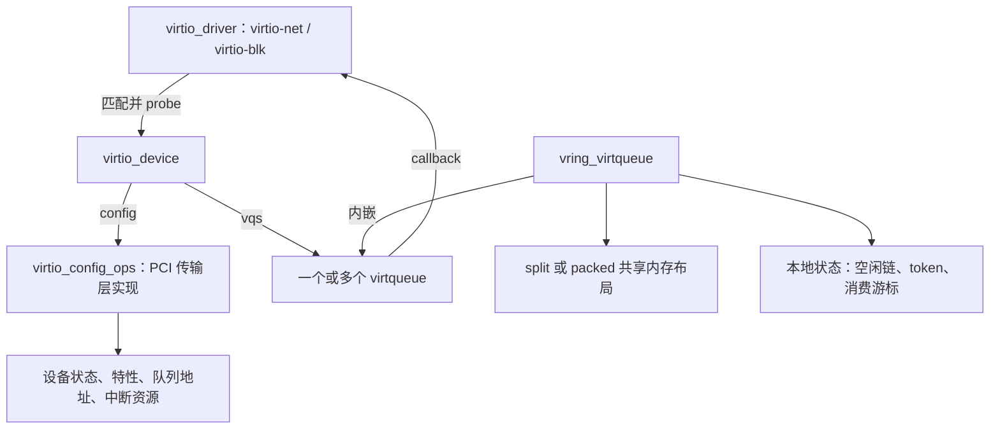
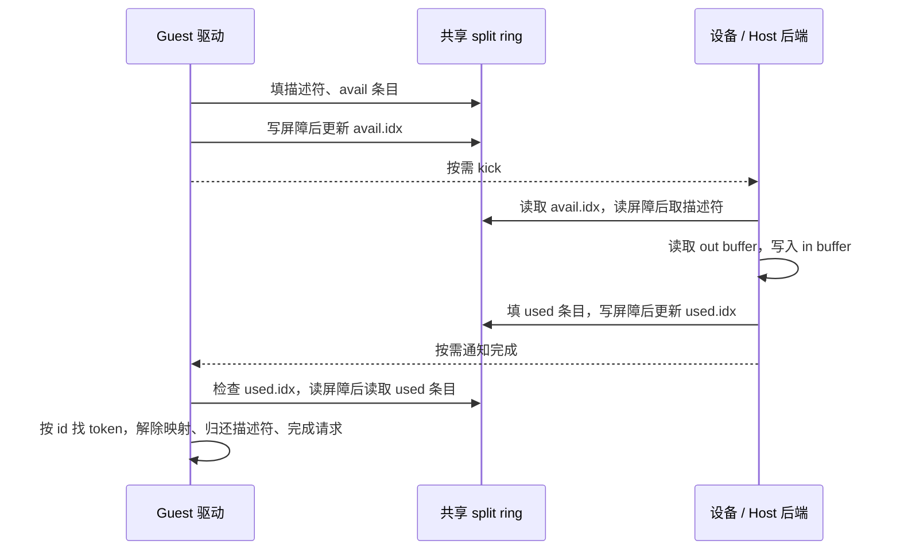
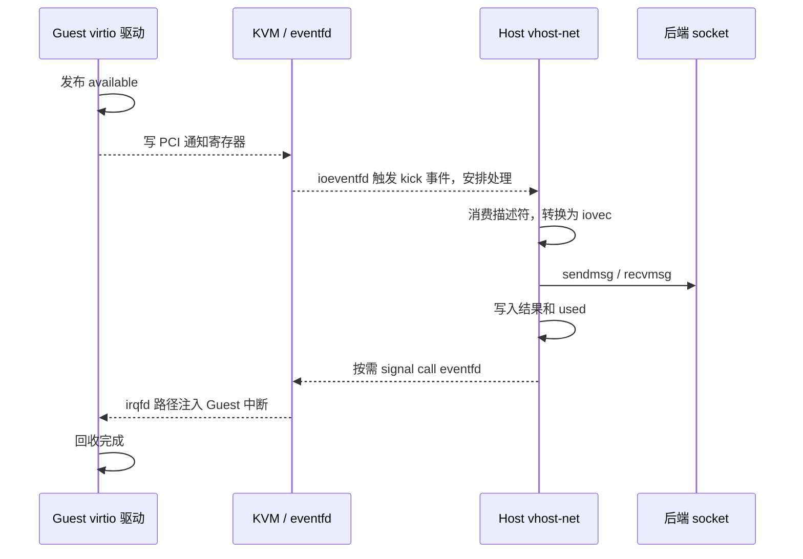

# virtio 子系统面试总结：从队列结构到一次 I/O

本文以仓库中的 Linux 源码为依据，版本标记为 [6.18.52](../../linux/Makefile#L2)，分析范围是 **x86、非 RT 内核、云计算数据中心场景**。以 Guest 中的 virtio-pci、virtio-net、virtio-blk 和 Host 中的 vhost-net 为主线；packed ring、DMA/IOMMU、vDPA 作为进阶内容。

文中的配置是分析前提，不代表已经确认某台机器的运行配置。设备特性是否生效，要看前端、传输层和后端的最终协商结果。只根据本仓库源码解释实现，不展开 QEMU、DPDK 等外部项目的内部逻辑。

阅读顺序：先掌握第 1～4 节的结构、所有权和通知机制，再读实际网络、块设备路径；面试前可直接复习第 12～13 节。

## 1. 先认识核心对象：设备、驱动、队列和后端

virtio 的核心是：**驱动把缓冲区描述发布给设备，设备处理后发布完成信息，双方通过通知减少等待，通过共享队列减少反复交互。** 这里的“设备”既可以是软件后端，也可以是支持相应数据路径的硬件。

### 1.1 前端四个核心结构

| 结构 | 重要成员 | 解决的问题 |
| --- | --- | --- |
| `struct virtio_device` | `id`、`config`、`vqs`、`features_array`、`priv` | 表示一个 virtio 设备，保存协商结果和队列集合 |
| `struct virtio_driver` | `id_table`、`feature_table`、`probe`、`remove` | 表示某类设备的功能驱动，例如网络或块设备驱动 |
| `struct virtqueue` | `vdev`、`index`、`callback`、`num_free` | 提供提交缓冲区、通知设备和回收完成的统一接口 |
| `struct vring_virtqueue` | 内嵌 `vq`，以及 `split/packed`、`free_head`、`last_used_idx`、`notify` | 实现具体的环形队列布局和本地管理状态 |

源码：[virtio_device](../../linux/include/linux/virtio.h#L161)、[virtio_driver](../../linux/include/linux/virtio.h#L241)、[virtqueue](../../linux/include/linux/virtio.h#L32)、[vring_virtqueue](../../linux/drivers/virtio/virtio_ring.c#L162)。



`virtio_config_ops` 把设备发现和寄存器访问等传输细节隔离出去。功能驱动调用 `find_vqs()`，不必自己解析 PCI capability；提交数据时调用 `virtqueue_add_*()`，不必自己维护 ring。接口见 [virtio_config_ops](../../linux/include/linux/virtio_config.h#L112)。

**面试区分：virtqueue 是队列抽象，vring 是其共享内存实现；`vring_virtqueue` 还包含只供 Guest 内核使用的管理信息，整个结构不会原样交给 Host。**

### 1.2 token 为什么能找回原请求？

`virtqueue_add_*()` 接收的 `data` 是驱动保存的上下文 token，例如 `virtblk_req *`，或者编码了类型的 skb 指针。split ring 把它放进本地的 `desc_state[head].data`；设备只返回描述符链头编号，驱动据此取回 token。

```text
Guest 本地对象                   双方共享的数据

virtblk_req / skb
       ↑
desc_state[head].data  ← head ←  used.ring[slot].id
                                  ↑
                           设备完成描述符链
```

因此，设备不需要理解 Guest 的 `struct request` 或 `struct sk_buff`，也不需要拿到这些内核对象的虚拟地址。源码：[保存 token](../../linux/drivers/virtio/virtio_ring.c#L668)、[完成时找回 token](../../linux/drivers/virtio/virtio_ring.c#L840)、[网络 token 编码](../../linux/drivers/net/virtio_net.c#L570)。

### 1.3 Host 端对应哪些结构？

| 结构 | 关键成员 | 含义 |
| --- | --- | --- |
| `struct vhost_dev` | `mm`、`vqs`、`umem`、`iotlb`、`worker_xa` | 保存后端设备、地址映射和 worker 管理状态 |
| `struct vhost_virtqueue` | `desc/avail/used`、`last_avail_idx`、`last_used_idx` | 从 Host 一侧消费 Guest 队列、发布完成 |
| `struct vhost_virtqueue` | `kick`、`call_ctx`、`handle_kick`、`mutex` | 保存事件通知、处理函数及串行化资源 |

源码：[vhost_dev](../../linux/drivers/vhost/vhost.h#L177)、[vhost_virtqueue](../../linux/drivers/vhost/vhost.h#L93)。

注意两端的 `last_used_idx` 含义不同：Guest 的是“已经回收到了哪里”，vhost 的是“已经向 Guest 发布完成到了哪里”。不能只看变量名就把两个游标当成同一个状态。

## 2. Split ring：三块共享区域如何配合

先分析普通 split ring 路径。结构定义见 [virtio_ring.h](../../linux/include/uapi/linux/virtio_ring.h#L96)。

### 2.1 Descriptor table：描述缓冲区，不存放整个请求的数据

每个 `vring_desc` 为 16 字节：

| 字段 | 含义 | 容易答错的地方 |
| --- | --- | --- |
| `addr` | 设备可访问的缓冲区地址 | 不能直接当作 Guest 内核虚拟地址或 Host 物理地址 |
| `len` | 该缓冲区长度 | 与整个请求的长度不一定相同 |
| `flags` | `NEXT`、`WRITE`、`INDIRECT` | `WRITE` 的视角是设备 |
| `next` | 下一个描述符的编号 | 只有 `NEXT` 有效时才表示链的下一项 |

方向必须统一成设备视角：

| 驱动接口/标志 | 设备访问方式 | 典型用途 |
| --- | --- | --- |
| `virtqueue_add_outbuf()` | 设备读取，`WRITE=0` | Guest 发包、写磁盘的数据 |
| `virtqueue_add_inbuf()` | 设备写入，`WRITE=1` | Guest 收包、读磁盘的数据 |
| `virtqueue_add_sgs()` | 同一请求先放 out SG，再放 in SG | 块请求的命令头、数据和状态 |

例如“写磁盘”是 Guest 把数据交给设备，所以数据描述符不设 `WRITE`；“读磁盘”是设备把数据写进 Guest 内存，所以数据描述符设 `WRITE`。源码：[标志定义](../../linux/include/uapi/linux/virtio_ring.h#L40)、[out/in 描述符构造](../../linux/drivers/virtio/virtio_ring.c#L603)。

### 2.2 Available ring 与 used ring

| 共享区域 | 主要写入方 | 主要读取方 | 记录的内容 |
| --- | --- | --- | --- |
| descriptor table | Guest 驱动 | 设备 | buffer 地址、长度、方向及链关系 |
| available ring | Guest 驱动 | 设备 | 可处理的描述符链头编号 |
| used ring | 设备 | Guest 驱动 | 完成的链头编号 `id` 和写入长度 `len` |

这里描述的是运行期普通 split 数据路径。通知抑制字段也遵循各自区域的写入方向，第 4 节单独说明。

```text
descriptor table              available ring           used ring
┌──────────────────────┐      ┌──────────────────┐     ┌─────────────────────┐
│ desc[3] 命令头       │ ←─── │ ring[0] = 3      │     │ ring[0] = {3, len}  │
│    next = 7          │      │ idx = 1          │     │ idx = 1             │
│ desc[7] 数据缓冲区   │      └──────────────────┘     └─────────────────────┘
│    next = 1          │        Guest 发布 head           设备归还 head
│ desc[1] 状态缓冲区   │
└──────────────────────┘
三个描述符组成一次请求；avail 中只占一个条目，普通完成也只占一个 used 条目。
```

这是教学示例，编号不要求连续。`used.len` 表示设备写入的长度信息，**不能拿它直接当作网络发送字节数，也不能拿它替代块设备的完成状态**。源码：[used 元素定义](../../linux/include/uapi/linux/virtio_ring.h#L120)、[块设备读取状态](../../linux/drivers/block/virtio_blk.c#L334)。

### 2.3 区分三个概念：槽位、描述符编号、累计索引

以队列大小 `N=8` 为例：

```text
avail_idx_shadow = 10
发布位置 slot = 10 & (8 - 1) = 2
avail.ring[2] = 5                  // 5 是描述符链头编号
发布后 avail.idx = 11              // 11 是累计发布进度
```

`avail.idx`、`used.idx` 是 16 位持续递增、自然回绕的索引；访问数组时才映射到 ring 槽位。不能把 `idx` 每次到 `N` 就归零，否则会丢掉区分不同轮次的进度信息。Linux split 实现使用 `idx & (N - 1)` 取槽位，见 [发布 available](../../linux/drivers/virtio/virtio_ring.c#L675) 和 [读取 used](../../linux/drivers/virtio/virtio_ring.c#L840)。

`num_free` 是主描述符表中的剩余描述符数量，**不总等于还能提交的请求数**。直接描述符链有多少个 SG 元素，就可能占多少个主描述符；间接描述符则通常每个请求只占一个主描述符。源码：[num_free 的约定](../../linux/include/linux/virtio.h#L27)。

### 2.4 Indirect descriptor 解决什么问题？

```text
直接描述：主表 [头] → [数据片段 0] → [数据片段 1] → [状态]
          占用 4 个主描述符

间接描述：主表 [INDIRECT，addr 指向下表]
                        ↓
              间接表 [头] → [数据 0] → [数据 1] → [状态]
          占用 1 个主描述符，另分配一张间接表
```

它减少多片段请求对主 ring 的占用，提高同样 ring 大小下可挂起的请求数；代价是额外的表分配、映射和间接访问。它不会把 payload 变成连续内存，也不会自动消除数据拷贝。

当前实现要求队列允许使用间接表、`total_sg > 1` 且还有主描述符；间接表分配失败时可以尝试直接描述符路径。即使已协商 `VIRTIO_RING_F_INDIRECT_DESC`，创建队列时启用的额外 context 模式也会关闭该队列的 indirect 使用。源码：[队列 indirect 设置](../../linux/drivers/virtio/virtio_ring.c#L1168)、[使用条件](../../linux/drivers/virtio/virtio_ring.c#L234)、[split 构建及回退](../../linux/drivers/virtio/virtio_ring.c#L565)。

## 3. 围绕 split ring 走完一次 I/O

### 3.1 提交：先填内容，再发布，再决定是否通知

`virtqueue_add_split()` 的主线可以概括为：

```c
// 教学伪代码：省略端序转换、错误回滚和 DMA 细节。
head = allocate_descriptors();
fill_out_descriptors();                // 设备读
fill_in_descriptors();                 // 设备写
desc_state[head].data = request_token;
avail.ring[avail_idx % N] = head;
virtio_wmb();                          // 先让描述符与 ring 条目可见
avail.idx = ++avail_idx;               // 向设备发布

if (virtqueue_kick_prepare(vq))        // 按对端要求判断是否需要通知
    virtqueue_notify(vq);             // 调传输层的 notify
```

真实代码见 [virtqueue_add_split](../../linux/drivers/virtio/virtio_ring.c#L533)、[发布屏障](../../linux/drivers/virtio/virtio_ring.c#L680)、[kick_prepare_split](../../linux/drivers/virtio/virtio_ring.c#L720)。

**提交成功后，设备可能立即看到新请求，不需要等到 kick 才能开始处理。** kick 是唤醒或提示机制，`avail.idx` 才是 split ring 的发布进度。

### 3.2 完成：先看到新索引，再读结果，最后回收



`virtqueue_get_buf()` 返回原来的 token，并通过参数返回长度。split 实现会验证 `used.id` 没有越界、确实对应已提交的链头，然后回收描述符和本次提交所拥有的映射资源；预映射缓冲区另有调用者的映射生命周期。源码：[get_buf_ctx_split](../../linux/drivers/virtio/virtio_ring.c#L815)、[detach_buf_split](../../linux/drivers/virtio/virtio_ring.c#L751)、[预映射标记](../../linux/drivers/virtio/virtio_ring.c#L290)。

正常运行时，在完成被回收之前，驱动不能复用或释放仍由设备访问的缓冲区。设备读过描述符、驱动发过 kick，都不能作为释放依据。

### 3.3 x86 内存顺序较强，为什么仍需要屏障？

| 顺序要求 | Guest 侧位置 | 要防止的问题 |
| --- | --- | --- |
| 描述符和 avail 条目先于 `avail.idx` 可见 | `virtio_wmb()` | 设备看到新索引，却读到未填好的内容 |
| 发布索引先于读取对端通知条件 | `virtio_mb()` | 双方都认为不需要通知，导致进度停住 |
| 看到新 `used.idx` 后再读完成信息 | `virtio_rmb()` | 驱动拿到旧的 id、长度或结果 |
| 重新开启通知后再检查完成 | `virtio_mb()` | 漏掉开启通知窗口中的新完成 |

接口会根据 `weak_barriers` 选择虚拟化共享内存屏障或面向设备的屏障。x86 上部分读写屏障可实现为编译器屏障，但完整屏障仍有独立实现；“底层实现较轻”不等于“协议不需要顺序约束”。源码：[virtio 屏障封装](../../linux/include/linux/virtio_ring.h#L26)、[x86 屏障](../../linux/arch/x86/include/asm/barrier.h#L50)、[virt 屏障定义](../../linux/include/asm-generic/barrier.h#L213)。

Host 侧也必须配对：vhost 读取 available 索引后执行读屏障，写完结果后执行写屏障再发布 used 索引。见 [vhost_get_avail_idx](../../linux/drivers/vhost/vhost.c#L1526)、[vhost_add_used_n](../../linux/drivers/vhost/vhost.c#L3113)。

### 3.4 共享队列是否意味着无锁？

**前后端通过协议转移所有权，不需要共用一把 Guest/Host 锁；同一侧的多个执行流仍需串行化。**

`virtqueue_add_*()` 等接口要求调用者避免与其他队列操作并发。多个 CPU 同时提交、提交与完成回调并发，都可能修改同一组 `num_free`、空闲链和本地状态。非 RT 的 virtio-blk 用每队列 `spin_lock_irqsave()` 保护提交和回收；virtio-net 则结合网络发送队列的串行化约束与 NAPI 管理访问。

源码：[接口并发约定](../../linux/drivers/virtio/virtio_ring.c#L2370)、[块设备提交锁](../../linux/drivers/block/virtio_blk.c#L442)、[完成锁](../../linux/drivers/block/virtio_blk.c#L359)。内存屏障解决可见顺序，不能代替同侧互斥。

## 4. 通知抑制：为什么不会每个请求都触发一次中断

### 4.1 分清两个方向

| 方向 | 发起者 → 接收者 | 告诉对方什么 | split ring 中的控制字段 |
| --- | --- | --- | --- |
| kick / available 通知 | Guest → 设备 | 有新的可用 buffer | 设备写 `used.flags` 或 `avail_event` |
| call / used 通知 | 设备 → Guest | 有 buffer 已完成 | Guest 写 `avail.flags` 或 `used_event` |

不使用 `EVENT_IDX` 时，`VRING_USED_F_NO_NOTIFY` 抑制 kick，`VRING_AVAIL_F_NO_INTERRUPT` 抑制完成中断。协商 `VIRTIO_RING_F_EVENT_IDX` 后，用事件索引表达希望通知的进度。

名称容易混淆：`used_event` 放在 **avail 区尾部**，由 Guest 写；`avail_event` 放在 **used 区尾部**，由设备写。源码：[标志定义](../../linux/include/uapi/linux/virtio_ring.h#L54)、[事件字段位置](../../linux/include/uapi/linux/virtio_ring.h#L194)。

### 4.2 `EVENT_IDX` 如何减少通知？

核心判断见 [vring_need_event](../../linux/include/uapi/linux/virtio_ring.h#L222)：

```c
(__u16)(new_idx - event_idx - 1) < (__u16)(new_idx - old_idx)
```

它判断本批推进是否跨过对端要求通知的位置，使用 16 位模运算兼容索引回绕。例如 `old=10、new=14、event=12` 时需要通知；`event=14` 时本次还不需要。这里的阈值语义包含公式中的 `-1`，不能简单替换为普通整数比较 `new >= event`。

批量提交与通知抑制可以同时使用：驱动先连续放入多个请求，再统一执行一次 `kick_prepare()`，后者仍可能判断无需真正通知。

### 4.3 三个 API 的返回值分别说明什么？

| API | 返回值的意义 | 不能据此得出的结论 |
| --- | --- | --- |
| `virtqueue_add_*()` 返回 0 | buffer 已成功加入队列 | I/O 已完成 |
| `virtqueue_kick_prepare()` 返回 true | 这次需要通知 | 通知已经发出 |
| `virtqueue_kick()` 返回 true | kick 路径成功，或判断不必发通知 | 一定写了 doorbell，或后端已经处理 |
| `virtqueue_get_buf()` 返回非 NULL | 取回一个已使用 buffer 的 token | 块请求一定成功，或数据一定已持久化 |

`kick_prepare()` 需要与队列操作串行化，`notify()` 本身不需要，因此可以锁内判断、锁外通知；virtio-blk 就这样缩短临界区。源码：[kick 的实现](../../linux/drivers/virtio/virtio_ring.c#L2457)、[virtio_commit_rqs](../../linux/drivers/block/virtio_blk.c#L377)。

### 4.4 重新开启通知时，怎样避免漏唤醒？

错误时序：

```text
Guest                                      设备
关闭完成通知
处理完当前 used，发现队列空
                                           写入一个新完成
                                           看到通知关闭，不发中断
开启完成通知
退出处理、等待中断                          没有后续请求，不再产生中断

结果：完成已经在 ring 中，却没有人继续回收。
```

正确做法是“开启通知，再检查进度”：

```c
// 教学伪代码；调用者还需满足队列串行化约束。
do {
    virtqueue_disable_cb(vq);
    while ((token = virtqueue_get_buf(vq, &len)) != NULL)
        handle_completion(token, len);
} while (!virtqueue_enable_cb(vq));
// false 表示已有待处理完成，应继续处理；不是“开启操作失败”。
```

`virtqueue_enable_cb()` 实际组合了 `enable_cb_prepare()` 和带完整屏障的 `virtqueue_poll()`。新完成要么在复查时被发现，要么设备观察到已开启的通知条件并发出通知。源码：[enable_cb/poll](../../linux/drivers/virtio/virtio_ring.c#L2573)、[virtblk_done 中的实际循环](../../linux/drivers/block/virtio_blk.c#L350)。

反方向也一样：vhost 在准备等待 Guest 新 buffer 前，要先恢复 kick 通知，再复查 available 进度。注意 `vhost_enable_notify()` 返回 true 表示发现新工作，与前端 `virtqueue_enable_cb()` 的返回值语义相反。源码：[vhost_enable_notify](../../linux/drivers/vhost/vhost.c#L3230)。

通知抑制只是优化，不保证已经在途的中断消失。**`virtqueue_disable_cb()` 不能替代停止设备或同步回调。** 其异步语义见 [接口注释](../../linux/drivers/virtio/virtio_ring.c#L2553)。

## 5. Packed ring：改变的是共享布局和进度表示

packed ring 的描述符包含 `addr、len、id、flags`，用一张描述符环承载可用和完成信息，另有 driver/device 两个事件抑制结构。源码：[packed 共享结构](../../linux/include/uapi/linux/virtio_ring.h#L232)、[驱动本地 packed 状态](../../linux/drivers/virtio/virtio_ring.c#L126)。

```text
Split：   descriptor table + available ring + used ring

Packed：  descriptor ring [addr, len, id, flags] × N
                           flags 中的 AVAIL / USED 表示状态
          driver event：驱动控制完成通知
          device event：设备控制可用通知
```

### 5.1 为什么需要 wrap counter？

循环使用同一槽位时，必须区分本轮的新描述符与上一轮留下的状态。驱动和设备各维护自己的位置及 wrap counter，绕环后翻转 counter。

对设备正在检查的位置，用设备当前的 available wrap 值 `w` 判断可用：`AVAIL == w && USED != w`；驱动在自己的完成位置，用 used wrap 值 `w` 判断完成：`AVAIL == w && USED == w`。两端的 `w` 是各自的进度状态，不是一份共享全局变量。

| 当前轮次 | 发布为 available 时的 AVAIL/USED | 发布为 used 时的 AVAIL/USED |
| --- | --- | --- |
| `w=1` | `1 / 0` | `1 / 1` |
| `w=0` | `0 / 1` | `0 / 0` |

初始 available wrap 为 1。驱动先填好整条链，在写屏障后最后发布链头 flags；回收端先判断状态，再经过读屏障读取 id 和 len。源码：[初始化](../../linux/drivers/virtio/virtio_ring.c#L2069)、[发布链头](../../linux/drivers/virtio/virtio_ring.c#L1567)、[完成判断](../../linux/drivers/virtio/virtio_ring.c#L1701)。

### 5.2 Split 与 packed 怎么比较？

| 维度 | Split | Packed |
| --- | --- | --- |
| 共享数据布局 | 描述符表、avail、used 三部分 | 一张描述符环，加两个事件结构 |
| 发布依据 | 更新 `avail.idx` | 发布描述符状态位 |
| 完成依据 | `used.idx` 与 used 元素 | 描述符状态位、id、len |
| 直接链表示 | 通过 `next` 指向后续描述符 | 按环中相邻位置继续，配合 `NEXT` |
| 环绕表示 | 16 位持续递增索引 | 槽位加 wrap counter |
| 性能讨论 | 前后端主要写入不同元数据区域 | 元数据更紧凑，但双方也会修改描述符区域 |

仅按共享结构计算，忽略对齐、间接表和本地状态，split 布局约为 `26N + 12` 字节，packed 为 `16N + 8` 字节。这个计算说明布局差异，**不能证明 packed 在某个业务中必然更快**。收益还取决于批处理、cache 行交互、通知频率和后端实现。结构依据见 [split 布局](../../linux/include/uapi/linux/virtio_ring.h#L170) 与 [packed 定义](../../linux/include/uapi/linux/virtio_ring.h#L232)。

`VIRTIO_F_RING_PACKED` 与 `VIRTIO_F_IN_ORDER` 是不同特性；“用了 packed”不能推出“请求按提交顺序完成”。特性定义见 [virtio_config.h](../../linux/include/uapi/linux/virtio_config.h#L82)。

## 6. 初始化：如何把 PCI 设备变成可用的 virtqueue

### 6.1 先区分三个层次

| 层次 | 本文对应实现 | 职责 |
| --- | --- | --- |
| 设备功能层 | `virtio_net.c`、`virtio_blk.c` | 网络包、块请求的语义和上层子系统接口 |
| virtio 核心与 ring 层 | `virtio.c`、`virtio_ring.c` | 驱动匹配、特性协商、队列提交和回收 |
| 传输层 | `virtio_pci_common.c`、`virtio_pci_modern.c` | 通过 PCI 访问配置、设置队列地址、通知和中断 |

Guest 的 virtio-pci 与 Host 的 vhost-net 分处两端。不能把 vhost 当成 Guest 功能驱动下面必经的一层；只有选择了这种后端时，Host 才使用 vhost-net。边界见 [VIRTIO_PCI 配置说明](../../linux/drivers/virtio/Kconfig#L50)、[VHOST_NET 配置说明](../../linux/drivers/vhost/Kconfig#L34)。

### 6.2 Modern 设备的启动顺序

```text
PCI probe
  └─ 建立 transport，实现 virtio_config_ops
     └─ register_virtio_device()
        ├─ reset，状态归零
        ├─ ACKNOWLEDGE：已识别设备
        └─ 匹配 virtio_driver，进入 virtio_dev_probe()
           ├─ DRIVER：已找到驱动
           ├─ 读取设备特性，筛选驱动与传输层支持的特性
           ├─ finalize_features，必要时 validate 并重新写入
           ├─ FEATURES_OK，并读回检查设备是否接受
           ├─ 功能驱动 probe：创建队列、注册回调、准备资源
           └─ DRIVER_OK：允许设备正常工作
```

这些状态是累计设置的位，不是每一步只保留一个枚举值；`FAILED` 表示驱动放弃设备，`NEEDS_RESET` 表示设备需要复位。源码：[状态位](../../linux/include/uapi/linux/virtio_config.h#L34)、[设备注册](../../linux/drivers/virtio/virtio.c#L530)、[驱动 probe](../../linux/drivers/virtio/virtio.c#L270)。

面试追问有两处关键细节：

1. **特性协商不只是按位求交。** 设备功能特性先求交，transport 特性还要交给 ring/PCI 层筛选，再校验依赖；写下 `FEATURES_OK` 后必须读回来，设备可以拒绝。见 [transport 特性处理](../../linux/drivers/virtio/virtio.c#L318)、[PCI finalize](../../linux/drivers/virtio/virtio_pci_modern.c#L420)、[FEATURES_OK 检查](../../linux/drivers/virtio/virtio.c#L204)。
2. **probe 内提前使用队列，必须先使设备 ready。** 驱动可调用 `virtio_device_ready()`；如果 probe 没有设置 `DRIVER_OK`，核心会在其成功返回后设置。见 [ready 接口约定](../../linux/include/linux/virtio_config.h#L336)、[核心补设 DRIVER_OK](../../linux/drivers/virtio/virtio.c#L347)。

### 6.3 队列、doorbell 和 MSI-X 如何接上？

modern PCI 的 `setup_vq()` 创建 vring，`vp_active_vq()` 把队列大小、三个区域的设备地址和 MSI-X vector 配给设备，随后建立通知地址映射。源码：[setup_vq](../../linux/drivers/virtio/virtio_pci_modern.c#L685)、[vp_active_vq](../../linux/drivers/virtio/virtio_pci_modern.c#L567)。

普通通知函数 `vp_notify()` 通过 `iowrite16()` 写队列编号；协商 notification data 后可换另一种通知格式。**doorbell 传递的是“哪个队列有进度”等通知信息，payload 仍在描述符指向的内存里。** 见 [vp_notify](../../linux/drivers/virtio/virtio_pci_common.c#L51)、[通知函数选择](../../linux/drivers/virtio/virtio_pci_modern.c#L701)。

完成中断最终到 `vring_interrupt()`，检查队列是否有 used buffer，再调用功能驱动注册的 `callback`。它本身不负责完成全部网络包或块请求。见 [vring_interrupt](../../linux/drivers/virtio/virtio_ring.c#L2693)。

MSI-X 支持按队列分配向量，但不是“一条队列必然一个独占中断”：当前代码会依次尝试每队列向量、部分共享、队列共享，最后回退到 INTx。见 [vp_find_vqs](../../linux/drivers/virtio/virtio_pci_common.c#L520)。

### 6.4 高频特性速查

| 特性 | 解决的问题 |
| --- | --- |
| `VIRTIO_F_VERSION_1` | modern virtio 接口语义 |
| `VIRTIO_RING_F_INDIRECT_DESC` | 减少多 SG 请求的主描述符占用 |
| `VIRTIO_RING_F_EVENT_IDX` | 按进度阈值抑制通知 |
| `VIRTIO_F_RING_PACKED` | 使用 packed 布局 |
| `VIRTIO_F_ACCESS_PLATFORM` | 使用平台 DMA 地址转换和访问机制 |
| `VIRTIO_F_ORDER_PLATFORM` | 按平台对设备访问的排序要求选择屏障路径 |
| `VIRTIO_F_RING_RESET` | 在支持的传输实现上单独复位队列 |

源码：[ring 特性](../../linux/include/uapi/linux/virtio_ring.h#L80)、[设备与传输特性](../../linux/include/uapi/linux/virtio_config.h#L66)。有宏定义不代表当前驱动、后端或配置一定支持，更不代表已协商启用。

## 7. 地址与 DMA：描述符里的 addr 到底是什么

先分清四种地址：Guest 内核虚拟地址、Guest 物理地址 GPA、设备使用的 DMA 地址/IOVA、Host 地址。它们属于不同地址空间。

```text
Guest 缓冲区
    │ 构造 SG、按设备要求映射
    ▼
descriptor.addr：设备视角的地址
    ├─ 常见软件后端、无平台 DMA 转换：可对应 GPA
    │      └─ vhost 按已配置的内存映射找到 Host 用户地址
    └─ 使用平台 DMA：可以是 IOVA
           └─ 经相应 IOMMU / IOTLB 映射找到可访问内存
```

这个图是地址关系示意，不表示所有后端都经过相同的软件转换函数。Guest ring 层依据 `VIRTIO_F_ACCESS_PLATFORM` 等条件决定是否使用映射 API；不使用时，部分映射路径直接返回物理地址。见 [vring_use_map_api](../../linux/drivers/virtio/virtio_ring.c#L270)、[virtqueue_map_single_attrs](../../linux/drivers/virtio/virtio_ring.c#L3255)。

vhost 的 `translate_desc()` 根据内存映射或 IOTLB 查找区间、检查读写权限，再构造 Host 用户地址范围。映射缺失可以触发 IOTLB miss 处理，不能把 Guest 给出的地址直接强转成 Host 内核指针。源码：[translate_desc](../../linux/drivers/vhost/vhost.c#L2654)。

**DMA 映射、CPU/设备访问顺序、缓冲区生命周期是三个问题。** 地址可访问不代表内容已经按顺序发布；内容已经发布也不代表设备已经用完。

## 8. virtio-net：一对队列如何完成收发包

### 8.1 先看网络驱动自身的数据结构

`virtnet_info` 把 `virtio_device`、`net_device`、发送队列数组 `sq`、接收队列数组 `rq` 和可选控制队列 `cvq` 联系起来。`send_queue` 保存 vq、SG 和 TX NAPI；`receive_queue` 保存 vq、RX NAPI 和接收缓冲区相关状态。

源码：[virtnet_info](../../linux/drivers/net/virtio_net.c#L390)、[send_queue](../../linux/drivers/net/virtio_net.c#L302)、[receive_queue](../../linux/drivers/net/virtio_net.c#L327)。

```text
net_device
   └─ virtnet_info
      ├─ rq[0] → vq 0：RX0        sq[0] → vq 1：TX0
      ├─ rq[1] → vq 2：RX1        sq[1] → vq 3：TX1
      ├─ ... 多个队列对
      └─ cvq：按协商结果配置控制队列
```

数据队列编号关系是 `RX_i = 2i`、`TX_i = 2i + 1`，见 [队列编号转换](../../linux/drivers/net/virtio_net.c#L650)。多队列是增加并行处理资源；一条队列内部仍有自己的容量、顺序和并发约束。

### 8.2 TX：Guest 发出的 skb 怎样交给设备？

```text
网络栈选择发送队列
  → start_xmit()
  → xmit_skb()：构造 virtio net header，生成 skb 的 SG
  → virtnet_add_outbuf() / virtqueue_add_outbuf()
  → 批次边界或需要推进时 kick_prepare + notify
  → 后端消费 buffer，发布 used
  → TX NAPI 或后续发送过程回收完成，释放 skb 等资源
```

`virtio_net_hdr` 系列表达 checksum、GSO 等元数据，告诉后端该如何处理这个 buffer。它不是以太网线上协议头，也不是每种特性组合下都固定同一长度。源码：[网络头结构](../../linux/include/uapi/linux/virtio_net.h#L152)、[xmit_skb](../../linux/drivers/net/virtio_net.c#L3326)。

`start_xmit()` 利用 `netdev_xmit_more()` 等条件批量通知；队列紧张时需要停止对应发送子队列，完成回收后再推进。TX 回收可以结合 TX NAPI，也可以在后续发送中执行，不能概括为“每个发送完成中断立即释放一个 skb”。见 [start_xmit](../../linux/drivers/net/virtio_net.c#L3384)、[skb_xmit_done](../../linux/drivers/net/virtio_net.c#L782)。

### 8.3 RX：为什么没有包时也要预先提交 buffer？

设备需要先有可写入的 Guest 内存。接收队列中的 available 表示“这些空 buffer 可以给设备写”，并不表示“已经有网络包”。


主线是 `try_fill_recv()` 补 buffer，`skb_recv_done()` 调度 NAPI，`virtnet_poll()` 调用接收处理；普通 skb 路径继续进入 GRO/网络栈。若启用了 XDP，还可能执行 drop、redirect 或 XDP_TX，不能把所有 RX 都画成必然构造 skb。

源码：[补充接收 buffer](../../linux/drivers/net/virtio_net.c#L2834)、[RX 中断回调](../../linux/drivers/net/virtio_net.c#L2868)、[接收并补队列](../../linux/drivers/net/virtio_net.c#L3029)、[NAPI poll](../../linux/drivers/net/virtio_net.c#L3121)、[GRO 入口](../../linux/drivers/net/virtio_net.c#L2617)。

`virtqueue_napi_complete()` 使用 `enable_cb_prepare → napi_complete_done → virtqueue_poll`，是第 4 节防漏唤醒协议与 NAPI 生命周期的结合。源码：[virtqueue_napi_complete](../../linux/drivers/net/virtio_net.c#L764)。

### 8.4 三种网络优化不要混淆

| 机制 | 作用 | 不等价于 |
| --- | --- | --- |
| 多队列 / RSS | 把流量分散到不同队列和处理 CPU | 单个流必然跨所有队列线性加速 |
| checksum / GSO / TSO 元数据 | 把部分校验和、分段工作交给支持它的另一端 | 消除全部协议栈处理和拷贝 |
| `MRG_RXBUF` | 一个接收包可使用多个已提交的 RX buffer | GRO，也不是把多个网络包合成一个包 |

特性定义见 [virtio_net.h](../../linux/include/uapi/linux/virtio_net.h#L35)，vhost-net 按 `num_buffers` 报告接收用了多少个 buffer，见 [接收 buffer 数写回](../../linux/drivers/vhost/net.c#L1270)。

## 9. virtio-blk：用一个请求理解双向描述符链

### 9.1 请求与队列的结构关系

```text
virtio_blk
   ├─ gendisk + blk_mq_tag_set
   └─ vqs[qid]：virtio_blk_vq { virtqueue, spinlock }

blk-mq request
   └─ 驱动私有区 virtblk_req
      ├─ out_hdr：操作类型、扇区等命令信息
      ├─ sg_table：数据 buffer
      └─ in_hdr.status：设备写回的结果
```

源码：[virtio_blk 与 virtio_blk_vq](../../linux/drivers/block/virtio_blk.c#L49)、[virtblk_req](../../linux/drivers/block/virtio_blk.c#L88)。`hctx->queue_num` 用于选择 virtqueue，不能笼统说所有 CPU 共用一个块设备 ring。

### 9.2 读写磁盘时描述符方向如何变化？

| 请求 | 命令头 | 数据 buffer | 状态 |
| --- | --- | --- | --- |
| 写磁盘 | 设备读，out | 设备读，out | 设备写，in |
| 读磁盘 | 设备读，out | 设备写，in | 设备写，in |
| flush | 设备读命令头 | 无普通读写数据 buffer | 设备写，in |

这解释了为什么一次 virtqueue 请求可以同时包含 out 和 in 描述符。`virtblk_add_req()` 按上述顺序组织 SG 列表，见 [请求组装](../../linux/drivers/block/virtio_blk.c#L139)；flush 操作转换见 [REQ_OP_FLUSH](../../linux/drivers/block/virtio_blk.c#L262)。

### 9.3 提交、背压和完成

```text
blk-mq
  → virtio_queue_rq()
    → 准备 virtblk_req，选择 hctx 对应的 vq
    → 持队列锁，virtblk_add_req()
    → 批次最后一个请求决定是否通知
  → 设备发布完成
  → virtblk_done()
    → 持队列锁，批量 virtqueue_get_buf()
    → blk_mq_complete_request()
    → 驱动完成处理读取 status，结束请求
```

环满时 `virtblk_add_req()` 可返回 `-ENOSPC`，驱动停止对应硬件队列；有完成释放资源后再启动停止的队列。这是背压，不必直接判定为设备损坏。`-ENOMEM` 是另一个问题，当前代码明确不因它执行同样的 stop 逻辑。源码：[提交与错误处理](../../linux/drivers/block/virtio_blk.c#L426)、[完成与重新启动队列](../../linux/drivers/block/virtio_blk.c#L350)。

三个“完成”要区分：加入 virtqueue 成功、buffer 被设备归还、块 I/O 的状态成功。进一步的持久化语义还取决于缓存和 flush 等操作；看到 used 条目并不能直接宣布数据已安全落盘。见 [完成状态处理](../../linux/drivers/block/virtio_blk.c#L334)、[缓存模式处理](../../linux/drivers/block/virtio_blk.c#L1076)。

## 10. vhost 与 vDPA：谁在另一端消费队列

### 10.1 vhost-net 把哪些工作放到 Host 内核？

vhost-net 在 Host 内核中取描述符、转换地址、操作后端 socket、写回 used，并通过事件机制通知 Guest。用户态管理程序仍需配置内存、队列、事件和后端等资源。

| 配置接口 | 建立的关系 |
| --- | --- |
| `VHOST_SET_MEM_TABLE` | Guest 内存范围与 Host 可访问内存的对应关系 |
| `VHOST_SET_VRING_NUM/ADDR/BASE` | ring 大小、地址和进度 |
| `VHOST_SET_VRING_KICK` | 有新 available 时供 vhost 等待的事件 |
| `VHOST_SET_VRING_CALL` | 有新 used 时由 vhost 发出的事件 |

这些是配置关系，不是完整 ioctl 调用顺序。接口定义见 [vhost.h](../../linux/include/uapi/linux/vhost.h#L37) 和 [事件配置](../../linux/include/uapi/linux/vhost.h#L105)。

### 10.2 KVM、eventfd、vhost 如何串起来？

下面以用户态已连接好 ioeventfd、vhost kick/call 和 irqfd 的软件后端配置为前提：



依据：[KVM ioeventfd_write](../../linux/virt/kvm/eventfd.c#L804)、[KVM irqfd_wakeup](../../linux/virt/kvm/eventfd.c#L203)、[vhost 取描述符](../../linux/drivers/vhost/vhost.c#L2831)、[vhost_signal](../../linux/drivers/vhost/vhost.c#L3183)。

**KVM 管理虚拟机执行及中断等机制，vhost 处理所支持设备的后端数据路径。** 启用 vhost 可以让上述数据处理和事件传递在 Host 内核中完成，减少用户态设备处理参与；不能由此推出每次 kick 都没有 VM exit，也不能把每次 VM exit 都理解为必须返回用户态。

### 10.3 “vhost 等于零拷贝”为什么不对？

共享 ring 首先减少的是请求描述和进度交接成本，payload 是否复制取决于具体路径。

本树 `handle_tx_zerocopy()` 内仍会按包长、未完成数量等条件选择是否使用零拷贝；普通路径可在 socket 接收数据后发布 used，零拷贝路径需要等待相应 buffer 引用释放，才适合归还给 Guest 复用。见 [零拷贝条件](../../linux/drivers/vhost/net.c#L911)、[不同路径的完成处理](../../linux/drivers/vhost/net.c#L944)。

面试回答应说明“哪一段复制被省掉、谁持有 buffer、什么时候可以释放”，不要只说“用了 virtio/vhost，所以零拷贝”。

### 10.4 vhost-net 支持的特性不能代表所有后端

本树的 vhost-net 特性集合没有 `VIRTIO_F_RING_PACKED`；因此 Guest 的 ring 层有 packed 代码，不代表这条 vhost-net 数据路径可以协商 packed。依据：[VHOST_FEATURES](../../linux/drivers/vhost/vhost.h#L290)、[vhost_net_features](../../linux/drivers/vhost/net.c#L72)。

反过来，不能把这一结论推广为“所有 vhost 相关后端都不支持 packed”：vhost-vdpa 中明确存在 packed 队列状态的配置和恢复分支。见 [vhost-vdpa 队列状态](../../linux/drivers/vhost/vdpa.c#L696)。

### 10.5 vDPA 与 vhost-net 的差别

先看 vDPA 的两个对象：`vdpa_device` 表示设备，`vdpa_config_ops` 提供设置队列地址、大小、状态、callback 和 kick 等操作。源码：[vdpa_device](../../linux/include/linux/vdpa.h#L87)、[vdpa_config_ops](../../linux/include/linux/vdpa.h#L370)。

| 维度 | vhost-net | vhost-vdpa |
| --- | --- | --- |
| 队列数据由谁处理 | Host 内核网络后端代码 | 交给 vDPA 设备所实现的数据路径 |
| 主要衔接点 | 描述符 → iovec → 后端 socket | 队列配置、地址映射、kick 和完成通知 |
| 与 Guest 的关系 | 为 virtio-net 提供软件后端 | 为 Guest virtio 设备连接 vDPA 后端 |
| 分析重点 | worker、socket、复制、通知开销 | 队列状态、DMA 映射、设备能力和通知 |

`handle_vq_kick()` 转调 `ops->kick_vq()`，队列地址通过 `ops->set_vq_address()` 传给设备。见 [kick 转发](../../linux/drivers/vhost/vdpa.c#L166)、[队列地址配置](../../linux/drivers/vhost/vdpa.c#L724)。

vDPA 用统一框架衔接符合 virtio 数据路径的设备与各自控制操作，常用于数据路径加速；**vDPA 不必然等于硬件**，本树也有网络和块设备模拟器。见 [vDPA 定义与模拟器配置](../../linux/drivers/vdpa/Kconfig#L2)。

## 11. 生命周期与健壮性：停止通知不等于停止设备

### 11.1 删除队列前为什么要先停 I/O？

队列内存、buffer、回调和设备访问必须有明确的结束顺序：先阻止新请求和软件并发访问，再让设备停止访问并处理回调同步，最后释放队列资源。

virtio-blk 的 remove/freeze 路径展示了上层队列停用、`virtio_reset_device()`、`del_vqs()` 的配合；PCI reset 还会等待设备状态归零并同步中断向量。源码：[virtblk_remove/freeze](../../linux/drivers/block/virtio_blk.c#L1556)、[PCI reset 同步](../../linux/drivers/virtio/virtio_pci_modern.c#L555)。

不能只调用 `virtqueue_disable_cb()` 就释放 ring：它控制的是通知意愿，设备可能还在访问内存，已排队的回调也可能正在运行。单队列 reset 同样要求调用者排除其他 virtqueue 操作，见 [disable_vq_and_reset 的约定](../../linux/include/linux/virtio_config.h#L99)。

### 11.2 后端为什么要校验描述符？

Guest 提供的链头、`next`、长度和地址都必须校验。vhost 检查 available 索引跨度、描述符编号、链长以防成环、out/in 顺序、映射存在性和访问权限。依据：[索引跨度检查](../../linux/drivers/vhost/vhost.c#L1539)、[链校验](../../linux/drivers/vhost/vhost.c#L2881)、[方向检查](../../linux/drivers/vhost/vhost.c#L2936)、[地址权限检查](../../linux/drivers/vhost/vhost.c#L2654)。

Guest 回收端也不能盲信设备写入的 used id，要检查它确实对应有效请求。见 [used id 检查](../../linux/drivers/virtio/virtio_ring.c#L846)。

### 11.3 如果被问到热迁移，怎样把回答限定在源码证据内？

可以从“哪些状态不能丢”回答：协商特性、队列地址与大小、生产/消费进度、packed wrap 状态、设备配置、在途请求，以及后端写内存产生的脏页信息。

本树可看到 vhost 的写日志接口、used 更新后的日志记录，以及 vDPA 的队列状态读取/设置。这些是迁移可能需要的基础机制；**仅有 virtio 队列格式或 reset 接口，不能证明某个完整设备支持无损热迁移**。具体设备与用户态编排仍需额外实现，本章不作外推。

源码：[写日志接口](../../linux/include/uapi/linux/vhost.h#L40)、[used 日志](../../linux/drivers/vhost/vhost.c#L3133)、[vDPA 保存与设置队列状态](../../linux/drivers/vhost/vdpa.c#L696)。

## 12. 数据中心场景：怎样分析性能与故障

以下是由前述实现推导出的排查框架，不是对某台机器的实测结论。先确认协商特性、队列数和后端类型，再沿“发布 → 消费 → 完成 → 回收”定位停在哪里。

### 12.1 用四个进度定位卡点

对普通 split ring 路径：

```text
Guest 发布                   后端消费                      后端完成                 Guest 回收
avail.idx   ───────────→   last_avail_idx   ───────────→   used.idx   ───────────→   last_used_idx
            差距 A                         差距 B                      差距 C
```

| 现象 | 优先验证的假设 | 源码入口 |
| --- | --- | --- |
| 有请求但 `avail.idx` 不前进 | 前端队列满、映射失败、上层停止发送 | [virtqueue_add_split](../../linux/drivers/virtio/virtio_ring.c#L589) |
| A 长时间增大 | 后端没运行、kick/事件连接有问题、描述符校验失败 | [vhost_get_vq_desc_n](../../linux/drivers/vhost/vhost.c#L2831) |
| B 长时间增大 | 后端 socket/存储处理慢，或仍持有 buffer | [vhost TX 完成处理](../../linux/drivers/vhost/net.c#L944) |
| C 长时间增大 | Guest 回收没有及时运行，通知、NAPI 或 CPU 调度需检查 | [vring_interrupt](../../linux/drivers/virtio/virtio_ring.c#L2693)、[virtnet_poll](../../linux/drivers/net/virtio_net.c#L3121) |
| RX buffer 不足 | 补 buffer 失败或 Guest 消费不及时 | [virtnet_receive](../../linux/drivers/net/virtio_net.c#L3029) |

索引比较要使用对应宽度的模运算，观测时还要考虑采样不同步。packed 不能照搬这张索引表，应结合槽位、wrap counter 和 flags 判断。单次看到队列暂时积压，也不能直接判定为丢中断。

### 12.2 调优要回答“减少了什么成本，增加了什么代价”

| 手段 | 预期收益 | 必须一起检查的代价/边界 |
| --- | --- | --- |
| 增加队列并合理安排 CPU 亲和性 | 增加并行度，减少单队列竞争 | 流量是否分散、vCPU/后端是否有运行时间、中断资源是否足够 |
| 配合 NUMA 安排 vCPU、内存、后端和物理 I/O | 减少远端内存访问和跨节点交接 | 不能只改 Guest IRQ 亲和性就认为整条路径已经局部化 |
| 批量 add、kick 和完成回收 | 摊薄通知、锁和处理调度成本 | 可能增加等待时间，应同时看吞吐与尾延迟 |
| `EVENT_IDX`、NAPI、通知合并 | 降低高负载下的中断频率 | 低负载响应、重开通知竞态、poll budget |
| indirect descriptor | 减少主描述符消耗 | 间接表分配、DMA 映射和额外访存 |
| packed ring | 减少共享元数据体积 | 后端是否支持，实际 cache 行交互和吞吐是否改善 |
| 增大 ring | 容纳更多在途请求和短时突发 | 排队延迟、内存占用；不能修复长期服务能力不足 |
| offload 或条件性零拷贝 | 减少指定路径的 CPU 工作或复制 | 协商条件、buffer 生命周期、具体工作负载 |

实现抓手包括 [PCI 向量分配](../../linux/drivers/virtio/virtio_pci_common.c#L520)、[网络批量通知](../../linux/drivers/net/virtio_net.c#L3430)、[块请求批量通知](../../linux/drivers/block/virtio_blk.c#L456)、[NAPI 完成复查](../../linux/drivers/net/virtio_net.c#L764) 和 [vhost 零拷贝条件](../../linux/drivers/vhost/net.c#L911)。

好的面试回答会先给出可验证的瓶颈假设，再解释调整怎样影响相应成本；“队列越多越好”“关中断一定更快”“ring 越大吞吐越高”都缺少成立条件。

## 13. 面试速答与源码阅读路线

### 13.1 高频问答

| 面试题 | 回答要点 |
| --- | --- |
| virtio 的核心是什么？ | 统一设备/驱动框架，通过 virtqueue 发布 buffer、交换完成并按需通知；传输层与设备功能分离 |
| virtqueue 与 vring 的区别？ | 前者是队列抽象和 API，后者是共享内存布局；Linux 另维护本地 token、空闲链与游标 |
| split ring 为什么要三部分？ | descriptor 描述 buffer，avail 发布链头，used 归还完成；发布和回收有独立进度 |
| `WRITE` 是谁写？ | 设备写。Guest 发包/写盘的数据是 out，收包/读盘的数据是 in |
| 一个请求只能有一个描述符吗？ | 可以有 SG 描述符链，也可用 indirect 表；普通 split avail 只发布链头 |
| `num_free` 等于剩余请求数吗？ | 不一定，它数主描述符，直接链与间接链消耗不同 |
| add 成功后不 kick，设备能看到吗？ | 能，发布索引/状态后已可见；但不能随意跳过通知判断，否则睡眠中的后端可能不推进 |
| kick 返回 true 说明什么？ | kick 路径成功或不必通知，不能说明发生了 doorbell 写，更不能说明 I/O 完成 |
| 怎么从 used 找回 skb/request？ | 设备返回 id，驱动用本地 desc_state 找 token；不向设备传整个内核对象 |
| x86 为什么保留屏障？ | 需要编译器与内存访问顺序约束，特别是发布后读取通知条件；遵循统一的设备访问协议 |
| 关闭中断后再开，怎样防漏完成？ | 开启通知后带屏障复查队列；发现新完成就继续处理或重新调度 NAPI |
| virtqueue 无锁吗？ | 两端靠协议交接，但同侧操作需满足串行化要求；屏障不能替代锁 |
| packed 为什么需要 wrap bit？ | 区分同一槽位不同轮次，不能只看 AVAIL 与 USED 是否相等 |
| packed 是否一定有序、更快？ | 不一定；IN_ORDER 是另一特性，性能依赖后端和负载 |
| virtio-net 为什么 RX 也要 kick？ | RX add 发布的是可写空 buffer，设备可能需要获知已经补充了接收资源 |
| NAPI 在哪里参与？ | RX 回调调度 NAPI，poll 批量回收与补 buffer，完成时恢复通知并复查；TX 也可使用 NAPI |
| virtio-blk 环满怎么办？ | `-ENOSPC` 触发对应 blk-mq 硬件队列背压，完成释放资源后恢复 |
| vhost 与 KVM 有什么区别？ | vhost 是设备后端数据处理框架；KVM 提供虚拟机执行及事件/中断等机制，两者可通过 eventfd 衔接 |
| vhost 是否零拷贝、零 VM exit？ | 都不能保证，必须分析具体数据与通知路径 |
| vDPA 是否只能是硬件？ | 不是。统一设备控制接口之下可以是硬件加速路径，也有软件模拟实现 |
| 停止 callback 后能释放 ring 吗？ | 不能，先排除软件并发和设备访问、同步回调，再释放资源 |
| 完成归还等于块数据落盘吗？ | 不等于，还需检查状态和缓存/flush 等持久化语义 |

以上答案的结构与实现依据分别见第 1～11 节；追问时最好选 virtio-net 或 virtio-blk 走一遍完整路径，而不是只罗列函数名。

### 13.2 一分钟组织答案

> 我会先把 virtio 分成设备功能驱动、通用队列实现和传输层。核心对象是 virtio_device 和它拥有的 virtqueue，Linux 用 vring_virtqueue 保存共享 ring 与本地管理状态。以 split ring 为例，驱动填写描述符链，把链头放进 avail，经过写屏障更新索引，再根据通知条件 kick。设备消费 buffer 后写 used，驱动经过读屏障按 id 找回 token，回收资源并完成上层请求。性能来自批量处理、通知抑制、多队列以及合适的后端；正确性则依赖所有权、内存顺序和重新开启通知后的复查。网络场景结合 NAPI，块设备结合 blk-mq，Host 可用 vhost-net 或 vDPA 等后端，但共享队列本身不保证零拷贝、零 VM exit 或一定的性能提升。

### 13.3 最短源码阅读路线

| 顺序 | 入口 | 带着什么问题读 |
| --- | --- | --- |
| 1 | [virtio.h](../../linux/include/linux/virtio.h#L16) | 设备、驱动、队列怎样关联？ |
| 2 | [共享 ring 定义](../../linux/include/uapi/linux/virtio_ring.h#L96) | 双方真正共享了哪些字节？ |
| 3 | [virtqueue_add_split](../../linux/drivers/virtio/virtio_ring.c#L533) | buffer 怎样转成描述符并安全发布？ |
| 4 | [virtqueue_get_buf_ctx_split](../../linux/drivers/virtio/virtio_ring.c#L815) | 完成怎样找回对象并回收资源？ |
| 5 | [kick](../../linux/drivers/virtio/virtio_ring.c#L2457)、[enable_cb](../../linux/drivers/virtio/virtio_ring.c#L2573) | 如何减少通知而不丢进度？ |
| 6 | [virtio_dev_probe](../../linux/drivers/virtio/virtio.c#L270)、[PCI setup_vq](../../linux/drivers/virtio/virtio_pci_modern.c#L685) | 特性和队列如何被两端认可？ |
| 7 | [virtio-net start_xmit](../../linux/drivers/net/virtio_net.c#L3384)、[virtnet_poll](../../linux/drivers/net/virtio_net.c#L3121) | 网络数据如何进入、离开队列？ |
| 8 | [virtio-blk 请求组装](../../linux/drivers/block/virtio_blk.c#L139)、[virtblk_done](../../linux/drivers/block/virtio_blk.c#L350) | 双向 buffer、背压和完成状态如何配合？ |
| 9 | [vhost 取描述符](../../linux/drivers/vhost/vhost.c#L2831)、[发布完成](../../linux/drivers/vhost/vhost.c#L3113) | 站在设备一侧，同一协议如何实现？ |
| 10 | [packed 提交](../../linux/drivers/virtio/virtio_ring.c#L1447)、[packed 完成](../../linux/drivers/virtio/virtio_ring.c#L1701) | 换布局后，哪些发布与所有权原则仍保持不变？ |
